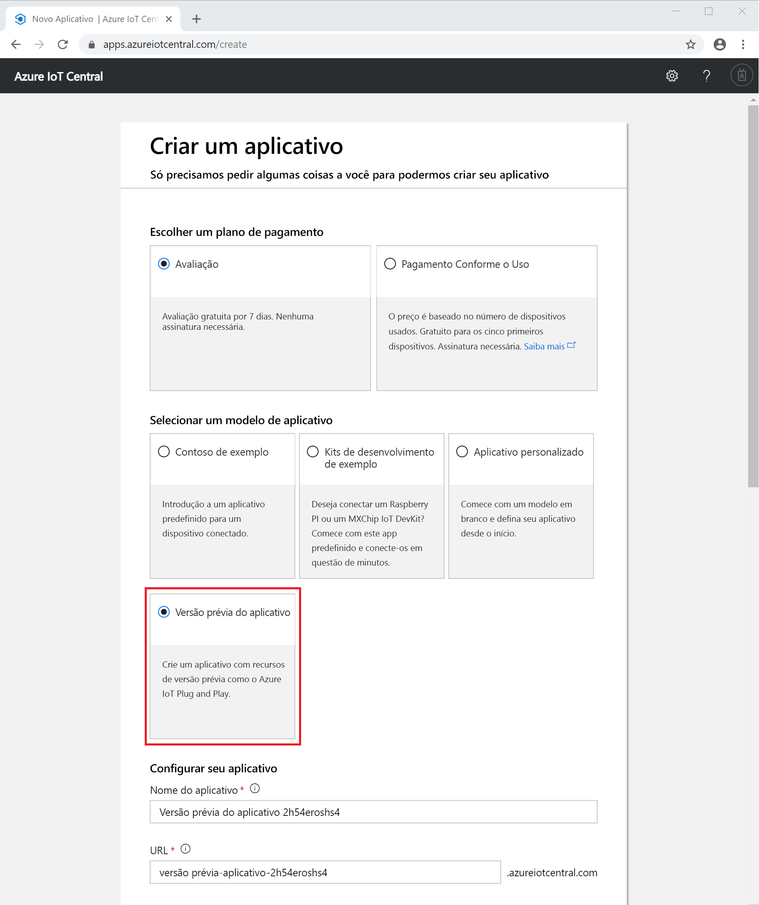

# Criar um aplicativo do Azure IoT Central (versão prévia dos recursos)

[!INCLUDE [iot-central-pnp-original](../../includes/iot-central-pnp-original-note.md)]

Este início rápido mostra como criar um aplicativo do Azure IoT Central que usa a versão prévia dos recursos, como o IoT Plug and Play.

> [!WARNING]
> As funcionalidades do IoT Plug and Play no Azure IoT Central estão atualmente em versão prévia pública. Não use um aplicativo do IoT Central habilitado para o IoT Plug and Play em cargas de trabalho de produção. Para ambientes de produção, use um aplicativo do IoT Central criado com base em um modelo de aplicativo atual, em disponibilidade geral.

## Criar um aplicativo

Navegue até o site do [Gerenciador de aplicativos do Azure IoT Central](https://aka.ms/iotcentral). Em seguida, entre com uma conta pessoal, corporativa ou de estudante da Microsoft.

Para começar a criar um novo aplicativo Azure IoT Central, selecione **Novo Aplicativo**. Esse link leva você para a página **Criar um aplicativo**.

Para criar um aplicativo do Azure IoT Central que inclui a versão prévia dos recursos, como o IoT Plug and Play:

1. Escolha um plano de pagamento:
   - Os aplicativos de **avaliação** são gratuitos por sete dias antes de expirarem. Eles podem ser convertidos em **Pagamento Conforme o Uso** em qualquer momento antes de expirarem. Se você criar um aplicativo de **Avaliação**, precisará inserir suas informações de contato e escolher se deseja receber informações e dicas da Microsoft.
   - Os aplicativos de **Pagamento Conforme o Uso** são cobrados por dispositivo, com os cinco primeiros dispositivos gratuitos. Se você criar um aplicativo de **Pagamento Conforme o Uso**, precisará escolher o *Directory*, a *Assinatura do Azure* e a *Região*:
        - *Directory* é o AD (Azure Active Directory) para criar o aplicativo. Ele contém identidades de usuário, credenciais e outras informações organizacionais. Se você não tiver um Azure AD, ele será gerado quando você criar uma assinatura do Azure.
        - Uma *Assinatura do Azure* permite que você crie instâncias de serviços do Azure. O IoT Central provisiona recursos em sua assinatura. Se você não tiver uma assinatura do Azure, poderá criar uma na [página de entrada do Azure](https://aka.ms/createazuresubscription). Depois de criar a assinatura do Azure, volte à página **Criar um aplicativo**. A nova assinatura aparece na lista suspensa **Assinatura do Azure**.
        - A *Região* é o local físico onde você deseja criar seu aplicativo. Normalmente, você deve escolher a região fisicamente mais próxima de seus dispositivos para obter um desempenho ideal. Durante a versão prévia pública, as únicas regiões disponíveis para um **Aplicativo em versão prévia** são **Europa Setentrional** e **EUA Central**. Depois de escolher uma região, você não poderá mover o aplicativo para outra região posteriormente.

        Saiba mais sobre preços na [Página de preços da microsoft IoT Central](https://azure.microsoft.com/pricing/details/iot-central/).

1. Selecione o modelo **Aplicativo de versão prévia**. Um modelo de aplicativo pode conter itens predefinidos, como modelos de dispositivo e dashboards, para ajudá-lo a começar.

1. O Azure IoT Central sugere automaticamente um nome de aplicativo com base no modelo de aplicativo selecionado. Aceite esse nome ou insira seu próprio nome de aplicativo amigável, como **Contoso IoT**. O Azure IoT Central também gera um prefixo de URL exclusivo para você, com base no nome do aplicativo. Você terá a liberdade para alterar esse prefixo de URL para algo mais fácil de memorizar se desejar.

1. Preencha as informações adicionais necessárias para o plano de pagamento selecionado anteriormente, na Etapa 1.

1. Selecione **Criar** na parte inferior da página.

## Próximas etapas

Neste início rápido, você criou um aplicativo do IoT Central que usa a versão prévia dos recursos. Aqui estão sugestões para as próximas etapas:

> [!div class="nextstepaction"]
> [Definir um novo tipo de dispositivo em seu aplicativo do Azure IoT Central](./tutorial-define-device-type-pnp.md?toc=/azure/iot-central-pnp/toc.json&bc=/azure/iot-central-pnp/breadcrumb/toc.json)
