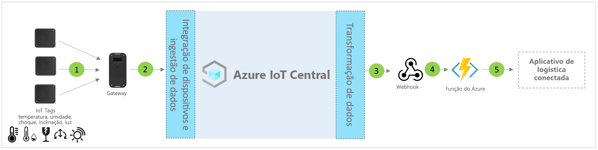

# Arquitetura do modelo de aplicativo de logística conectada para IoT Central

Os parceiros e os clientes podem usar o modelo de aplicativo e as diretrizes a seguir para desenvolver **soluções de logística conectada** de ponta a ponta.

> [!div class="mx-imgBorder"]
> 

1. Conjunto de marcas de IoT que enviam dados de telemetria para um dispositivo de gateway
2. Dispositivos de gateway que enviam telemetria e informações agregadas para o IoT Central
3. Os dados são roteados para o serviço do Azure desejado para fins de manipulação
4. Os serviços do Azure, como ASA ou Azure Functions, podem ser usados para reformatar os fluxos de dados e enviá-los para as contas de armazenamento desejadas
5. Os aplicativos de negócios do usuário final podem alimentar vários fluxos de trabalho de negócios.

## Detalhes
A seção a seguir descreve cada parte da ingestão de telemetria da arquitetura conceitual de marcas e gateways de IoT.

## Marcas de IoT
As marcas de IoT fornecem funcionalidades de sensor físico e ambiental, como temperatura, umidade, impacto, inclinação e luz. Normalmente, as marcas de IoT se conectam ao dispositivo de gateway por meio do Zigbee (802.15.4). As marcas são sensores menos caros e, portanto, podem ser descartadas no final de um percurso logístico típicp, a fim de evitar desafios com a logística reversa.

## Gateway
Os gateways também podem atuar como marcas de IoT com as respectivas funcionalidades de sensor de ambientes. O gateway habilita a conectividade de nuvem (MQTT) upstream do Azure IoT por meio de canais de Wi-Fi de celular.  Os modos Wireless Sensor Network (WSN) 802.15.4, Bluetooth e NFC servem para comunicação downstream com marcas IoT. Os gateways fornecem conectividade de nuvem segura de ponta a ponta, emparelhamento de marcas de IoT, agregação de dados de sensor, retenção de dados e capacidade de configurar limites de alarme.

## Gerenciamento de dispositivos com IoT Central 
O Azure IoT Central é uma plataforma de desenvolvimento de soluções que simplifica a conectividade, a configuração e o gerenciamento de dispositivos IoT. A plataforma reduz significativamente a carga e os custos de gerenciamento, operações e desenvolvimentos relacionados de dispositivos IoT. Os clientes e parceiros podem criar soluções empresariais de ponta a ponta para obter um loop de comentários digital sobre as operações logísticas.

## Ações e informações de negócios com a saída de dados 
A plataforma IoT Central fornece opções avançadas de extensibilidade por meio de CDE (Exportação de Dados Contínua) e APIs. Os insights de negócios baseados no processamento de dados de telemetria ou na telemetria bruta são exportadas normalmente para um aplicativo de linha de negócios preferencial. Isso pode ser obtido por meio de webhook, barramento de serviço, hub de eventos ou armazenamento de blobs para criar, treinar e implantar modelos de machine learning e enriquecer ainda mais os insights.

## Próximas etapas
* Aprenda a implantar um [modelo de solução de logística conectada](./tutorial-iot-central-connected-logistics.md).
* Saiba mais sobre [modelos comerciais do IoT Central](./overview-iot-central-retail.md)
* Para saber mais sobre o IoT Central, confira [Visão geral do IoT Central](../core/overview-iot-central.md)
