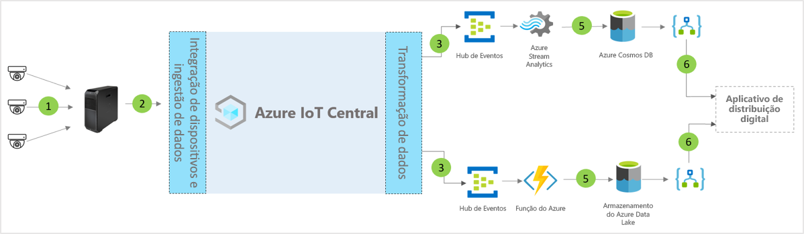

# Arquitetura do modelo de aplicativo do centro de distribuição digital para IoT Central

Os parceiros e os clientes podem usar o modelo de aplicativo e as diretrizes a seguir para desenvolver soluções de **centro de distribuição digital** de ponta a ponta.

> [!div class="mx-imgBorder"]
> 

1. Conjunto de sensores de IoT que enviam dados de telemetria para um dispositivo de gateway
2. Dispositivos de gateway que enviam telemetria e informações agregadas para o IoT Central
3. Os dados são roteados para o serviço do Azure desejado para fins de manipulação
4. Os serviços do Azure, como ASA ou Azure Functions, podem ser usados para reformatar os fluxos de dados e enviá-los para as contas de armazenamento desejadas
5. Os dados processados são guardados no armazenamento frequente para ações quase em tempo real ou no armazenamento frio para melhorias de insights adicionais com base na análise de ML ou em lotes. 
6. Os Aplicativos Lógicos podem ser usados para alimentar vários fluxos de trabalho de negócios em aplicativos de negócios do usuário final

## Detalhes
A seção a seguir descreve cada parte da arquitetura conceitual

## Câmeras de vídeo 
As câmeras de vídeo são os principais sensores nesse ecossistema de escala empresarial conectado digitalmente. Avanços no aprendizado de máquina e inteligência artificial que permitem que o vídeo seja transformado em dados estruturados e processe-os na borda antes de enviar para a nuvem. Podemos usar câmeras IP para capturar imagens, compactá-las na câmera e, em seguida, enviar os dados compactados na computação de borda para o pipeline de análise de vídeo ou usar câmeras de visão GigE para capturar imagens no sensor e enviá-las diretamente para o Azure IoT Edge, que são compactadas antes do processamento no pipeline de análise de vídeo. 

## Gateway do Azure IoT Edge
As "câmeras como sensores" e as cargas de trabalho de borda são gerenciadas localmente pelo Azure IoT Edge, já o fluxo da câmera é processado pelo pipeline de análise. O pipeline de processamento de análise de vídeo no Azure IoT Edge traz muitos benefícios, incluindo tempo de resposta reduzido, consumo de baixa largura de banda, o que resulta em baixa latência para o processamento rápido de dados. Somente os metadados, insights ou as ações mais essenciais são enviadas para a nuvem para ação ou investigação posterior. 

## Gerenciamento de dispositivos com IoT Central 
O Azure IoT Central é uma plataforma de desenvolvimento de solução que simplifica a conectividade, a configuração e o gerenciamento do dispositivo IoT e do gateway do Azure IoT Edge. A plataforma reduz significativamente a carga e os custos de gerenciamento, operações e desenvolvimentos relacionados de dispositivos IoT. Os clientes e parceiros podem criar soluções empresariais de ponta a ponta para obter um loop de comentário digital nos centros de distribuição.

## Ações e informações de negócios com a saída de dados 
A plataforma IoT Central fornece opções avançadas de extensibilidade por meio de CDE (Exportação de Dados Contínua) e APIs. Normalmente, as informações de negócios baseadas no processamento de dados telemétricos ou na telemetria bruta são exportadas para um aplicativo de linha de negócios preferencial. Isso pode ser obtido por meio de webhook, Barramento de Serviço, hub de eventos ou armazenamento de blobs para criar, treinar e implantar modelos de machine learning e enriquecer ainda mais os insights.

## Próximas etapas
* Aprenda a implantar um [modelo do centro de distribuição digital](./tutorial-iot-central-digital-distribution-center.md)
* Saiba mais sobre [modelos comerciais do IoT Central](./overview-iot-central-retail.md)
* Para saber mais sobre o IoT Central, confira [Visão geral do IoT Central](../core/overview-iot-central.md)
