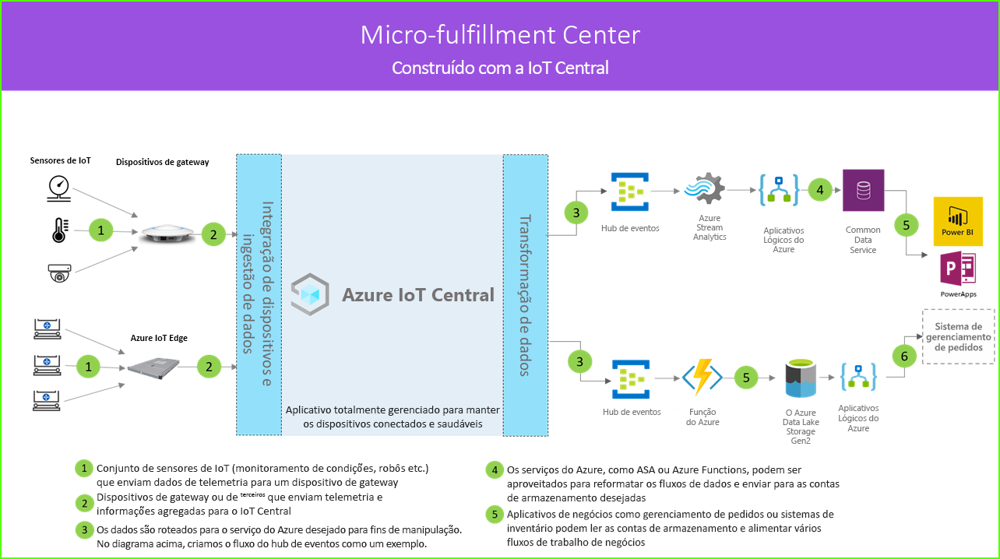

# Arquitetura da microcentral de atendimento

As soluções de microcentral de atendimento permitem que você conecte, monitore e gerencie digitalmente todos os aspectos de uma central de atendimento totalmente automatizada, a fim de reduzir custos ao eliminar o tempo de inatividade e aumentar simultaneamente a segurança e a eficiência geral. Essas soluções podem ser criadas com o uso de um dos modelos de aplicativos no IoT Central e a arquitetura abaixo como diretriz.

1. Conjunto de sensores de IoT que enviam dados de telemetria para um dispositivo de gateway
2. Dispositivos de gateway que enviam telemetria e informações agregadas para o IoT Central
3. Exportação contínua de dados para manipulação pelo serviço do Azure desejado
4. Os dados podem ser estruturados no formato desejado e enviados para um serviço de armazenamento
5. Os aplicativos de negócios podem consultar dados e gerar informações que potencializam as operações de varejo
 
Vamos dar uma olhada nos principais componentes que geralmente desempenham um papel em uma solução de microcentral de atendimento.

## Operadoras robóticas

Uma solução de microcentral de atendimento provavelmente terá um grande conjunto de operadoras robóticas, gerando diferentes tipos de sinais de telemetria. Esses sinais podem ser ingeridos por um dispositivo de gateway, agregados e enviados para o IoT Central conforme demonstrado no lado esquerdo do diagrama de arquitetura.  

## Sensores de monitoramento de condição

Uma solução de IoT começa com um conjunto de sensores que coletam sinais significativos de dentro da sua central de atendimento. Isso é refletido por diferentes tipos de sensores na extremidade esquerda do diagrama da arquitetura acima.

## Dispositivos de gateway

Muitos sensores de IoT podem alimentar sinais brutos diretamente na nuvem ou em um dispositivo de gateway localizado perto deles. O dispositivo de gateway executa a agregação de dados na borda antes de enviar informações de resumo para um aplicativo IoT Central. Os dispositivos de gateway também são responsáveis por retransmitir as operações de comando e controle para os dispositivos sensores, quando aplicável. 

## Aplicativo IoT Central

O aplicativo do Azure IoT Central ingere dados de diferentes tipos de sensores de IoT, robôs e dispositivos de gateway no ambiente da central de atendimento e gera um conjunto de insights significativos.

O Azure IoT Central também fornece uma experiência personalizada para os operadores da loja, permitindo que eles monitorem e gerenciem remotamente os dispositivos de infraestrutura.

## Transformação de dados
O aplicativo Azure IoT Central dentro de uma solução pode ser configurado para exportar insights brutos ou agregados para um conjunto de serviços PaaS do Azure (Plataforma como Serviço) que pode executar a manipulação de dados e enriquecer esses insights antes de destiná-los para um aplicativo de negócios. 

## Aplicativo de negócios
Os dados de IoT podem ser usados para ativar diferentes tipos de aplicativos de negócios implantados em um ambiente de varejo. Um gerente ou um funcionário de uma central de atendimento pode usar esses aplicativos para visualizar informações de negócios e executar ações significativas em tempo real. Para aprender a criar um dashboard do Power BI em tempo real para sua equipe de varejo, siga este [tutorial](./tutorial-in-store-analytics-create-app.md).

## Próximas etapas
* Introdução ao modelo de aplicativo da [microcentral de atendimento](https://aka.ms/checkouttemplate). 
* Dê uma olhada no [tutorial](https://aka.ms/mfc-tutorial) que explica como criar uma solução usando o modelo de aplicativo da microcentral de atendimento.
