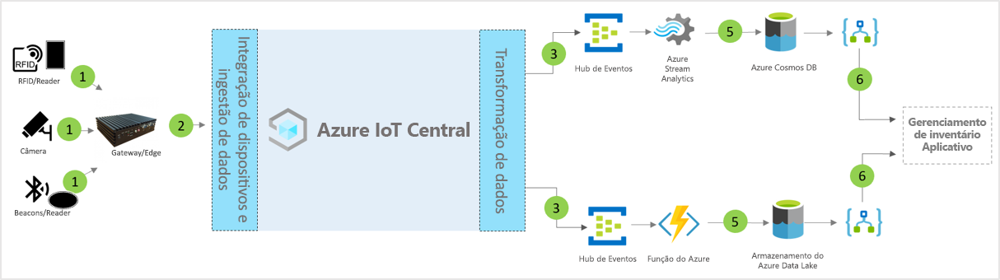

# Arquitetura do modelo de aplicativo de gerenciamento de estoque inteligente do IoT Central

Os parceiros e os clientes podem usar o modelo de aplicativo e as diretrizes a seguir para desenvolver soluções de **gerenciamento de estoque inteligente** de ponta a ponta.

> [!div class="mx-imgBorder"]
> 

1. Conjunto de sensores de IoT que enviam dados de telemetria para um dispositivo de gateway
2. Dispositivos de gateway que enviam telemetria e informações agregadas para o IoT Central
3. Os dados são roteados para o serviço do Azure desejado para fins de manipulação
4. Os serviços do Azure, como ASA ou Azure Functions, podem ser usados para reformatar os fluxos de dados e enviá-los para as contas de armazenamento desejadas 
5. Os dados processados são guardados no armazenamento frequente para ações quase em tempo real ou no armazenamento frio para melhorias de insights adicionais com base na análise de ML ou em lotes. 
6. Os Aplicativos Lógicos podem ser usados para alimentar vários fluxos de trabalho de negócios em aplicativos de negócios do usuário final

## Detalhes
A seção a seguir descreve cada parte da ingestão de telemetria da arquitetura conceitual das marcas de RFID (identificação por radiofrequência) e BLE (Bluetooth de Baixa Energia).

## Marcas de RFID
As marcas de RFID transmitem dados sobre um item por meio de ondas de rádio. Normalmente, as marcas de RFID não têm uma bateria, a menos que especificado. As marcas recebem energia das ondas de rádio geradas pelo leitor e transmitem um sinal de volta para o leitor de RFID.

## Marcas BLE
O beacon de energia transmite pacotes de dados em intervalos regulares. Os dados de beacon são detectados por leitores de BLE ou por serviços instalados em smartphones e, em seguida, são transmitidos para a nuvem.

## Leitores de RFID e BLE
O leitor de RFID converte as ondas de rádio em uma forma de dados mais utilizável. As informações coletadas nas marcas são, então, armazenadas no servidor de borda local ou enviadas para a nuvem com o JSON-RPC 2.0 por meio do MQTT.
Os leitores de BLE, também conhecidos como Pontos de Acesso, são semelhantes aos leitores de RFID. Ele é usado para detectar sinais Bluetooth próximos e retransmitir a respectiva mensagem para o Azure IoT Edge local ou para a nuvem com o JSON-RPC 2.0 por meio do MQTT.
Muitos leitores têm a capacidade de ler sinais de beacon e RFID, além de fornecer funcionalidades adicionais de sensor relacionadas a temperatura, umidade, acelerômetro e giroscópio.

## Gateway do Azure IoT Edge
O servidor do Azure IoT Edge fornece um local para pré-processar esses dados localmente, antes de enviá-los para a nuvem. Podemos também implantar inteligência artificial para cargas de trabalho na nuvem, serviços do Azure e de terceiros, bem como lógica de negócios usando contêineres padrão.

## Gerenciamento de dispositivos com IoT Central 
O Azure IoT Central é uma plataforma de desenvolvimento de soluções que simplifica a conectividade, a configuração e o gerenciamento de dispositivos IoT. A plataforma reduz significativamente a carga e os custos de gerenciamento, operações e desenvolvimentos relacionados de dispositivos IoT. Os clientes e parceiros podem criar soluções empresariais de ponta a ponta para obter um loop de comentários digital sobre o gerenciamento de estoque.

## Ações e informações de negócios com a saída de dados 
A plataforma IoT Central fornece opções avançadas de extensibilidade por meio de CDE (Exportação de Dados Contínua) e APIs. Os insights de negócios baseados no processamento de dados de telemetria ou na telemetria bruta são exportadas normalmente para um aplicativo de linha de negócios preferencial. Isso pode ser obtido por meio de webhook, barramento de serviço, hub de eventos ou armazenamento de blobs para criar, treinar e implantar modelos de machine learning e enriquecer ainda mais os insights.

## Próximas etapas
* Aprenda a implantar um [modelo de gerenciamento de estoque inteligente](./tutorial-iot-central-smart-inventory-management.md)
* Saiba mais sobre [modelos comerciais do IoT Central](./overview-iot-central-retail.md)
* Para saber mais sobre o IoT Central, confira [Visão geral do IoT Central](../core/overview-iot-central.md)
