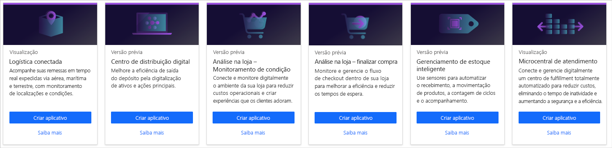
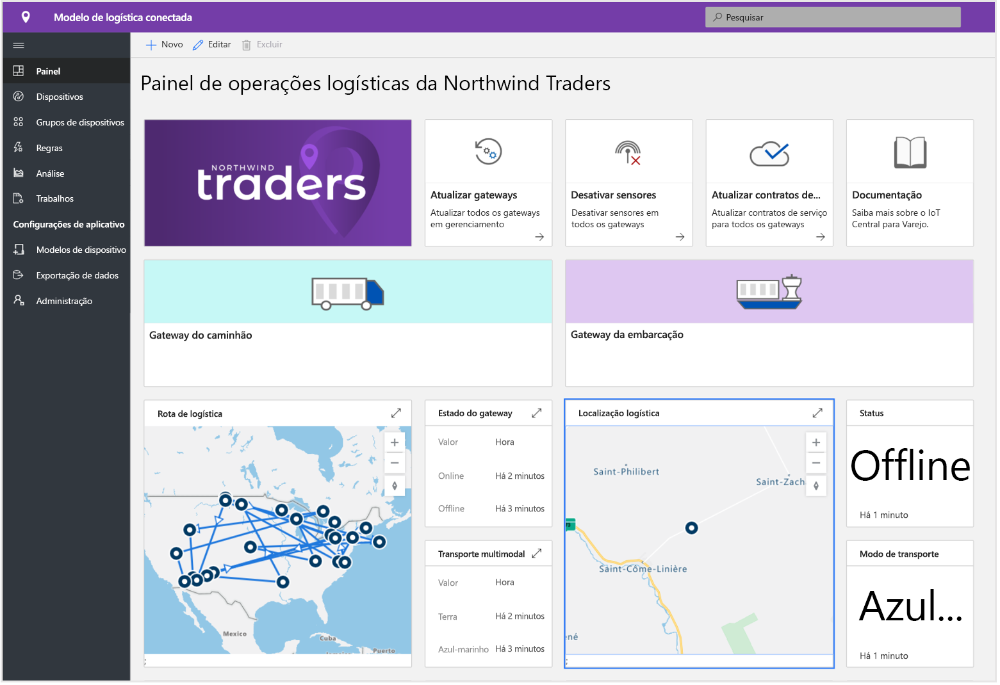
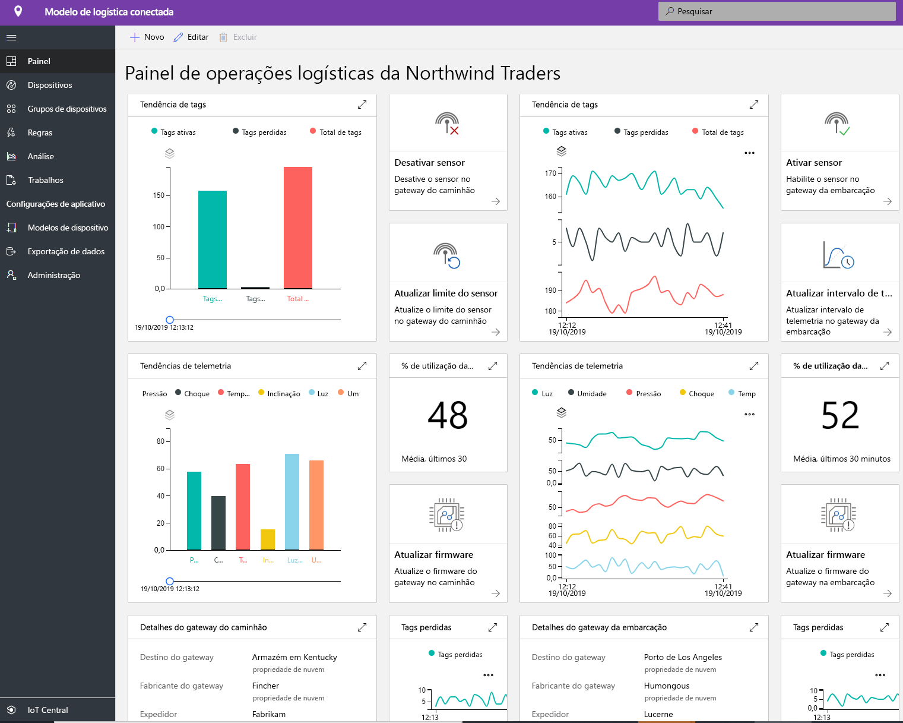
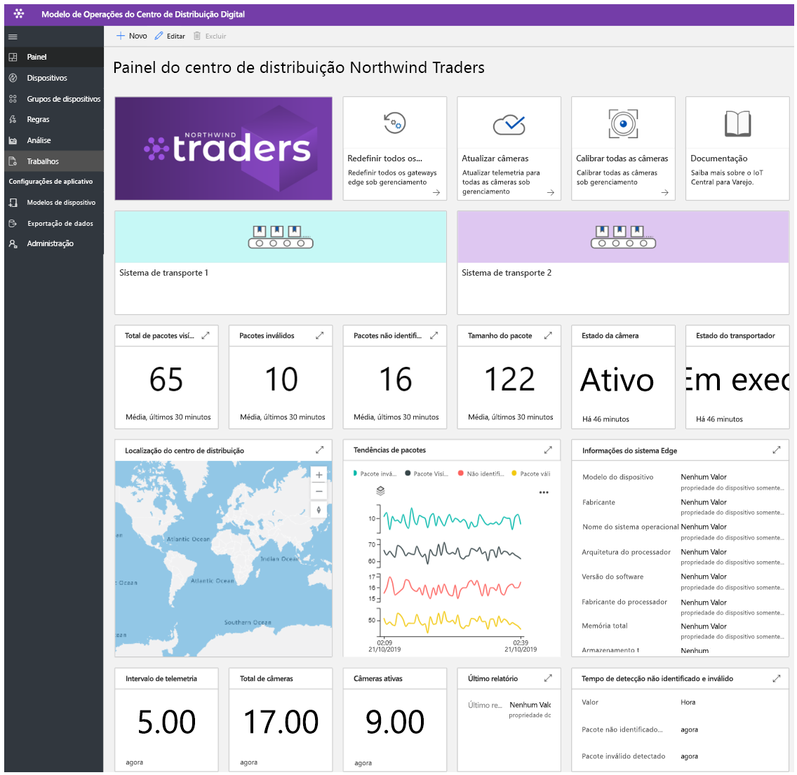
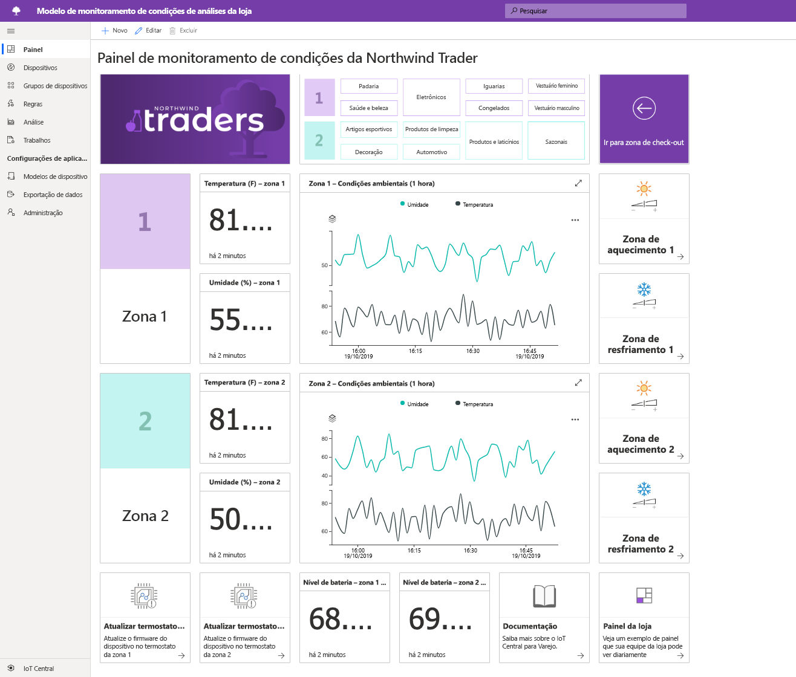
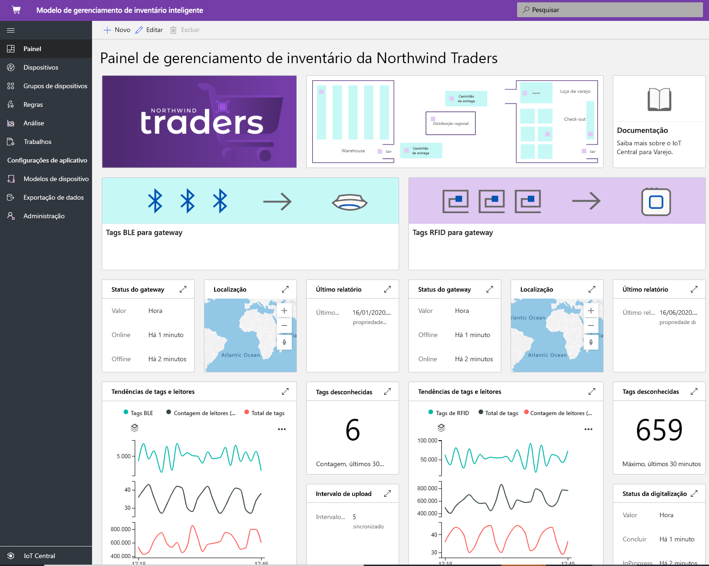

# Como criar soluções de varejo com o Azure IoT Central

[!INCLUDE [iot-central-pnp-original](../../../includes/iot-central-pnp-original-note.md)]

O Azure IoT Central é uma plataforma de aplicativo de IoT (Internet das Coisas) para criadores de solução que simplifica os desafios de criar e gerenciar aplicativos escalonáveis. Neste artigo, destacaremos vários modelos de aplicativos específicos de varejo dentro do IoT Central. Os criadores de solução podem aproveitar os modelos publicados para elaborar soluções de IoT para otimizar a cadeia de suprimentos, melhorar a experiência na loja para os clientes e acompanhar o inventário com mais eficiência.

> [!div class="mx-imgBorder"]
> 

## O que é uma solução de logística conectada?
Espera-se que gastos de logística globais atinjam US$ 10,6 trilhões em 2020, o maior PIB por setor. O transporte de mercadorias responde pela maioria (70%) do total de despesas de logística. Os provedores de envio estão sob intensas restrições e pressão competitiva. Os provedores de 3PL estão lidando com intervalos cada vez menores e custos de compensação crescentes. A logística sofre ainda mais tensão com os riscos impostos por situações geopolíticas, eventos climáticos extremos e crimes. 

Com a ajuda dos sensores IoT, podemos coletar e monitorar as condições do ambiente, ou seja, temperatura, umidade, inclinação, impacto, luz e local de remessa por GPS em uma transformação multimodal, ou seja, ar, água, terra. Os dados coletados de sensores, dispositivos, clima e eventos podem ser integrados a sistemas de Business Intelligence baseados em nuvem. Os benefícios da solução de logística conectada são:
* Transferência de remessa com rastreamento e acompanhamento em tempo real 
* Integridade da remessa com monitoramento em tempo real das condições do ambiente e cadeia fria
* Segurança contra roubo, perda ou danos da remessa
* Cerca geográfica, otimização de rota, gerenciamento de frota. Análise de veículo
* Previsão e previsibilidade com as chegas e partidas 

### Experiência pronta para uso
Os parceiros podem aproveitar o modelo para desenvolver soluções de Logística Conectada de ponta a ponta e os benefícios descritos. Esse modelo publicado está concentrado na configuração de conectividade do dispositivo e no gerenciamento de dispositivos no IoT Central. 

> [!div class="mx-imgBorder"]
> 

> [!div class="mx-imgBorder"]
> 

Observe que o dashboard acima é uma experiência de exemplo e você pode personalizar completamente esse aplicativo conforme seu caso de uso desejado.

Introdução ao [tutorial de ponta a ponta](./tutorial-iot-central-connected-logistics-pnp.md) que explica como criar uma solução usando um dos modelos de solução de logística conectado.

## O que é a solução do centro de distribuição digital?
À medida que mais fabricantes e varejistas estabelecem presença em todo o mundo, suas cadeias de suprimento ramificam-se para tornarem-se mais complexas do que nunca. Os centros de distribuição estão se tornando um grande desafio. O centro de distribuição/depósitos estão sentindo o impacto da pressão do comércio eletrônico. Os consumidores agora esperam que as várias seleções de produtos estejam disponíveis e que essas mercadorias cheguem dentro de um ou dois dias após a compra. Os centros de distribuição devem se adaptar a essas tendências enquanto superam as ineficiências existentes. 

Hoje, uma superdependência do trabalho manual significa que a separação e o empacotamento respondem por 55-65% dos custos do centro de distribuição. Embora seja ruim que o trabalho manual torne o centro de distribuição mais lento, a rápida flutuação das necessidades da equipe (com um aumento de 10 vezes na equipe no período das Festas) tornam ainda mais difícil atender aos volumes de remessa. Essa flutuação sazonal resulta em alta rotatividade e probabilidade de erros, e também no dispendioso aumento de retrabalho.
Soluções baseadas em câmeras habilitadas por IoT podem proporcionar benefícios transformadores ao habilitar um loop de comentários digitais. Esse fluxo de entrada de dados de todo o centro de distribuição leva a informações úteis que, por sua vez, resultam em dados melhores.

Os benefícios são: 
* As câmeras monitoram as mercadorias à medida que elas chegam e passam pelo sistema transportador
* Identificar mercadorias com falhas e enviá-las para reparo
* Manter o controle de pedidos com eficiência
* Reduzir custos, melhorar a produtividade e maximizar a utilização

### Experiência pronta para uso
Os parceiros podem aproveitar esse modelo de aplicativo para criar o centro de distribuição digital para obter informações úteis e os benefícios descritos acima. O modelo publicado está concentrado na configuração de conectividade do dispositivo e no gerenciamento de câmera e dispositivos de borda no IoT Central. 

> [!div class="mx-imgBorder"]
> 

Observe que o dashboard acima é uma experiência de exemplo e você pode personalizar completamente esse aplicativo conforme seu caso de uso desejado.

Introdução ao [tutorial de ponta a ponta](./tutorial-iot-central-digital-distribution-center-pnp.md) que explica como criar uma solução usando um dos modelos do centro de distribuição digital.

## O que é monitoramento de condição de análise na loja?
No panorama competitivo de hoje, os varejistas estão procurando novas maneiras de oferecer aos clientes algo exclusivo ou especial para impulsionar o tráfego pelas suas lojas físicas. Muitos varejistas reconhecem a importância das condições do ambiente da loja como uma ferramenta para diferenciar-se dos concorrentes. Os varejistas querem manter condições agradáveis na lojas em todos os momentos para proporcionar uma experiência confortável aos clientes.  

O modelo de aplicativo de Monitoramento da Condição de Análise na Loja no IoT Central fornece ao criador de soluções uma tela que pode ser utilizada para criar uma solução de ponta a ponta. O modelo de aplicativo permite conectar e monitorar digitalmente um ambiente de loja de varejo usando uma variedade de dispositivos de sensor. Esses dispositivos de sensor capturam sinais úteis que podem ser convertidos em insights de negócios, permitindo que os varejistas reduzam os custos operacionais e proporcionem experiências que encantem os clientes.

O modelo de aplicativo permite:

*  Conecte diretamente uma variedade de sensores de IoT a uma instância de aplicativo do IoT Central.
*  Monitore e gerencie a integridade da rede do sensor, bem como os dispositivos de gateway no ambiente.
*  Criar regras personalizadas em torno das condições ambientais em uma loja para disparar alertas apropriados.
*  Transformar as condições do ambiente em sua loja em insights que podem ser aproveitados pela equipe da loja de varejo.
* Exporte os insights agregados para aplicativos de negócios novos ou existentes, capacitando os membros da equipe de varejo.

### Experiência pronta para uso
O modelo de aplicativo vem com um conjunto de modelos de dispositivo e uma experiência de operador pronta para uso. Ele utiliza um conjunto de dispositivos simulados para preencher os elementos do dashboard. Depois de implantar um aplicativo de IoT Central usando o modelo de aplicativo de [Monitoramento de Condição de Análise na Loja](https://aka.ms/conditiontemplate), você vai para o dashboard do aplicativo padrão, conforme mostrado abaixo. 

> [!div class="mx-imgBorder"]
> 

Observe que o dashboard acima é uma experiência de exemplo e você pode personalizar completamente esse aplicativo conforme seu caso de uso desejado. 

Comece com o [tutorial de ponta a ponta](./tutorial-in-store-analytics-create-app-pnp.md) que explica como criar uma solução usando um dos modelos de monitoramento de condição de análise na loja.

## O que é finalização de compra de análise na loja?
No cenário cada vez mais competitivo, os varejistas modernos enfrentam constantemente a pressão crescente de proporcionar uma experiência na loja que supere as expectativas dos clientes e faça com que eles voltem. Embora diversos varejistas tenham começado a implantar a tecnologia para atender a essa necessidade, uma área que passa amplamente despercebida é a experiência de finalização de compra.

O modelo de aplicativo de finalização de compra da Análise na Loja do IoT Central permite aos integradores de solução criar experiências que deem à equipe de varejo insights úteis sobre a zona de finalização de compra da loja. Ele aproveita um conjunto de dispositivos simulados para determinar o status de ocupação de cada uma das pistas de finalização de compra em uma loja de varejo. Os sensores permitem capturar a contagem de pessoas, bem como o tempo médio de espera para cada uma das pistas de finalização de compra.

O modelo ajuda criador de solução a acelerar os planos de entrada no mercado fornecendo uma solução de IoT de linha de base que permite: 

* Conecte diretamente uma variedade de sensores de IoT a uma instância de aplicativo do IoT Central.
* Monitore e gerencie a integridade da rede do sensor, bem como os dispositivos de gateway no ambiente.
* Criar regras personalizadas em torno das condições de finalização de compra em uma loja para disparar alertas apropriados.
* Transformar as condições de finalização de compra em sua loja em insights que podem ser aproveitados pela equipe da loja de varejo.
* Exporte os insights agregados para aplicativos de negócios novos ou existentes, capacitando os membros da equipe de varejo.

### Experiência pronta para uso
O modelo de aplicativo vem com um conjunto de modelos de dispositivo e uma experiência de operador pronta para uso. Ele utiliza um conjunto de dispositivos simulados para preencher os elementos do dashboard. Depois de implantar um aplicativo de IoT Central usando o modelo de aplicativo de [Finalização de compra de Análise na Loja](https://aka.ms/checkouttemplate), você vai para o dashboard do aplicativo padrão, conforme mostrado abaixo. 

> [!div class="mx-imgBorder"]
> 

Observe que o dashboard acima é uma experiência de exemplo e você pode personalizar completamente esse aplicativo conforme seu caso de uso desejado. 

Comece com o [tutorial de ponta a ponta](./tutorial-in-store-analytics-create-app-pnp.md) que explica como criar uma solução usando um dos modelos de finalização de compra de análise na loja.

## O que é uma solução de gerenciamento de inventário inteligente?
"Inventário" é o estoque de mercadorias mantidas por um varejista. Cada varejista precisa de inventário para cuidar do prazo de entrega de fornecimento e logística. O inventário é, sem dúvida, o recurso mais valioso que todo varejista precisa negociar. No mundo ominicanal de hoje, o gerenciamento de inventário é um requisito crítico para garantir que o produto certo esteja no lugar certo no momento certo. Armazenar estoque demais ou de menos pode prejudicar os negócios do varejista. A cada ano, os varejistas perdem de 8 a 10% da receita devido à falta de funcionalidades de gerenciamento de estoque.

Dados de IoT habilitados por RFID (identificação de radiofrequência), beacons e câmera são a oportunidade de lidar com esse grande desafio em escala. A conectividade e a análise em tempo real inerentes aos sinais de IoT tornaram-se o elemento que muda o jogo para os problemas de inventário do varejista.  Os dados coletados de sensores, dispositivos, clima e eventos podem ser integrados a sistemas de Business Intelligence baseados em nuvem.  
Os benefícios do gerenciamento inteligente de inventário são: 
* Proteger a organização contra faltas de estoque e garantir o nível desejado de atendimento ao cliente. 
* Análise detalhada e insights sobre a precisão do inventário quase em tempo real
* Decidir a quantidade certa de inventário suficiente para os pedidos do cliente

### Experiência pronta para uso
Os parceiros podem aproveitar o modelo para desenvolver soluções de gerenciamento inteligente de inventário de ponta a ponta e os benefícios descritos. Esse modelo publicado concentra-se na conectividade do dispositivo, configuração e no gerenciamento de RFID e leitores de BLE (Bluetooth de baixa energia) no IoT Central. 

> [!div class="mx-imgBorder"]
> 

Observe que o dashboard acima é uma experiência de exemplo e você pode personalizar completamente esse aplicativo conforme seu caso de uso desejado. 

Introdução ao [tutorial de ponta a ponta](./tutorial-iot-central-smart-inventory-management-pnp.md) que explica como criar uma solução usando um dos modelos de gerenciamento de inventário inteligente.

## Próximas etapas
Para começar a criar uma solução de varejo:
* Introdução ao [tutorial de ponta a ponta](./tutorial-in-store-analytics-create-app-pnp.md) que explica como criar uma solução usando um dos modelos de aplicativo de Análise Na Loja.
* Aprenda a implantar um [modelo de solução de logística conectado](./tutorial-iot-central-connected-logistics-pnp.md)
* Aprenda a implantar um [modelo do centro de distribuição digital](./tutorial-iot-central-digital-distribution-center-pnp.md)
* Aprenda a implantar um [modelo de gerenciamento de inventário inteligente](./tutorial-iot-central-smart-inventory-management-pnp.md)
* Para aprender mais sobre o IoT Central, confira [Visão geral do IoT Central](../preview/overview-iot-central.md)
