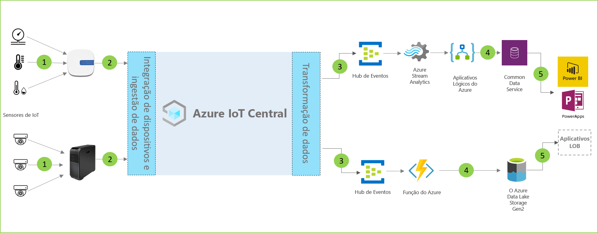

# Arquitetura de análise na loja

As soluções de análise na loja permitem monitorar várias condições no ambiente da loja de varejo. Essas soluções podem ser criadas com o uso de um dos modelos de aplicativos no IoT Central e a arquitetura abaixo como diretriz.

- Conjunto de sensores de IoT que enviam dados de telemetria para um dispositivo de gateway
- Dispositivos de gateway que enviam telemetria e informações agregadas para o IoT Central
- Exportação contínua de dados para manipulação pelo serviço do Azure desejado
- Os dados podem ser estruturados no formato desejado e enviados para um serviço de armazenamento
- Os aplicativos de negócios podem consultar dados e gerar informações que potencializam as operações de varejo
 
Vamos ver os principais componentes que geralmente desempenham um papel em uma solução de análise em repositório.

## Sensores de monitoramento de condição

Uma solução de IoT começa com um conjunto de sensores que coletam sinais significativos de dentro de um ambiente de loja de varejo. Isso é refletido por diferentes tipos de sensores na extremidade esquerda do diagrama da arquitetura acima.

## Dispositivos de gateway

Muitos sensores de IoT podem alimentar sinais brutos diretamente na nuvem ou em um dispositivo de gateway localizado perto deles. O dispositivo de gateway executa a agregação de dados na borda antes de enviar informações de resumo para um aplicativo IoT Central. Os dispositivos de gateway também são responsáveis por retransmitir as operações de comando e controle para os dispositivos sensores, quando aplicável. 

## Aplicativo IoT Central

O aplicativo do Azure IoT Central ingere dados de diferentes tipos de sensores de IoT e dispositivos de gateway no ambiente da loja de varejo e gera um conjunto de insights significativos.

O Azure IoT Central também fornece uma experiência personalizada para os operadores da loja, permitindo que eles monitorem e gerenciem remotamente os dispositivos de infraestrutura.

## Transformação de dados
O aplicativo Azure IoT Central dentro de uma solução pode ser configurado para exportar informações brutas ou agregadas para um conjunto de serviços PaaS do Azure (Plataforma como Serviço) que pode executar a manipulação de dados e enriquecer essas informações antes de destiná-las para um aplicativo comercial. 

## Aplicativo de negócios
Os dados de IoT podem ser usados para ativar diferentes tipos de aplicativos de negócios implantados em um ambiente de varejo. Um gerente da loja de varejo ou um membro da equipe pode usar esses aplicativos para visualizar informações de negócios e executar ações significativas em tempo real. Para aprender a criar um dashboard do Power BI em tempo real para sua equipe de varejo, siga este [tutorial](./tutorial-in-store-analytics-create-app.md).

## Próximas etapas
* Comece com os modelos de aplicativo [Análise de finalização de compras na loja](https://aka.ms/checkouttemplate) e [Monitoramento de condições de análises na loja](https://aka.ms/conditiontemplate). 
* Dê uma olhada no [tutorial de ponta a ponta](https://aka.ms/storeanalytics-tutorial) que explica como criar uma solução usando um dos modelos de aplicativo de Análise na Loja.
