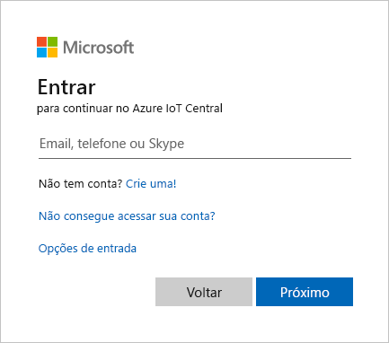

# Tutorial: Criar um aplicativo de análise na loja no Azure IoT Central

O tutorial mostra aos criadores de solução como criar um aplicativo de análise na loja do Azure IoT Central. O aplicativo de exemplo é para uma loja de varejo. Trata-se de uma solução para a necessidade comercial comum de monitorar e adaptar-se às condições de ocupação e ambientais.

O aplicativo de exemplo que você cria inclui três dispositivos reais: um gateway Rigado Cascade 500 e dois sensores RuuviTag. O tutorial também mostra como usar o sensor de ocupação simulado incluído no modelo de aplicativo para fins de teste. O gateway Rigado C500 serve como o hub de comunicação em seu aplicativo. Ele se comunica com sensores em sua loja e gerencia suas conexões com a nuvem. O RuuviTag é um sensor de ambiente que fornece telemetria, incluindo temperatura, umidade e pressão. O sensor de ocupação simulado oferece uma maneira de acompanhar o movimento e a presença nas áreas de finalização de compra de uma loja. 

Este tutorial inclui instruções para conectar os dispositivos Rigado e RuuviTag a seu aplicativo. Se você tiver outro gateway e sensores, ainda poderá seguir as etapas para criar seu aplicativo. O tutorial também mostra como criar sensores RuuviTag simulados. Os sensores simulados permitem que você crie o aplicativo se não tiver dispositivos reais. 

Você desenvolve a solução de monitoramento de finalização de compra e condição em três partes:

* Criar o aplicativo e conectar dispositivos para monitorar condições
* Personalizar o painel para permitir que os operadores monitorem e gerenciem dispositivos
* Configurar a exportação de dados para permitir que os gerentes de loja executem análises e visualizem insights

Neste tutorial, você aprenderá como:
> [!div class="checklist"]
> * Use o modelo de **Análise na loja – finalização de compra** do Azure IoT Central modelo para criar um aplicativo de loja de varejo
> * Personalizar as configurações de aplicativo
> * Criar e personalizar modelos de dispositivo de IoT
> * Conectar dispositivos a seu aplicativo
> * Adicionar regras e ações para monitorar condições

## Pré-requisitos

Para concluir este tutorial, você precisa:
* Uma assinatura do Azure é recomendada. Opcionalmente, você pode usar uma avaliação gratuita de sete dias. Se você não tiver uma assinatura do Azure, poderá criar uma na [página de entrada do Azure](https://aka.ms/createazuresubscription).
* Acesso a um dispositivo de gateway e dois sensores de ambiente (opcionalmente, você pode usar dispositivos simulados conforme descrito no tutorial)
* Modelos de dispositivo para os dispositivos que você usa (os modelos são fornecidos para todos os dispositivos usados no tutorial)

## Criar um aplicativo
Nesta seção, você cria um novo aplicativo do Azure IoT Central com base em um modelo. Você usará este aplicativo em toda a série de tutoriais para criar uma solução completa.

Para criar um novo aplicativo Azure IoT Central:

1. Navegue até o site do [Gerenciador de aplicativos do Azure IoT Central](https://aka.ms/iotcentral).

1. Se você tiver uma assinatura do Azure, entre com as credenciais usadas para acessá-lo, caso contrário, entre usando uma conta Microsoft:

    

1. Para começar a criar um novo aplicativo Azure IoT Central, selecione **Novo Aplicativo**.

1. Selecione **Varejo**.  A página de varejo exibe vários modelos de aplicativos de varejo.

Para criar um aplicativo de check-out de análise na loja:  

1. Selecione o modelo de aplicativo **Análise na loja – finalização de compra**. Esse modelo inclui modelos de dispositivo para todos os dispositivos usados no tutorial, exceto sensores RuuviTag. O modelo também fornece um dashboard do operador para monitorar as condições de finalização de compra e do ambiente e o status do dispositivo. 

1. Opcionalmente, escolha um **Nome de aplicativo** amigável. Esse aplicativo se baseia em um loja de varejo fictícia chamado Contoso. O tutorial usa o **Nome do aplicativo** *Check-out da Contoso*. O modelo de aplicativo é baseado na empresa fictícia Northwind. Neste tutorial, você usa a Contoso para aprender a personalizar o aplicativo.

    > [!NOTE]
    > Se você usar um **Nome de aplicativo** amigável, ainda deverá usar um valor exclusivo para a **URL** do aplicativo.

1. Se você tiver uma assinatura do Azure, insira seu *Diretório, assinatura do Azure e Região*. Se você não tiver uma assinatura, poderá habilitar a **avaliação gratuita de sete dias** e preencher as informações de contato necessárias.  

    Para obter mais informações sobre assinaturas e diretórios, consulte o [criar um início rápido de aplicativo](../core/quick-deploy-iot-central.md).

1. Selecione **Criar**.

    

    

## Personalizar configurações de aplicativo

Como um criador, você pode alterar várias configurações para personalizar a experiência do usuário em seu aplicativo. Nesta seção, você selecionará um tema de aplicativo predefinido. Opcionalmente, você aprenderá a criar um tema personalizado e a atualizar a imagem do aplicativo. Um tema personalizado permite definir as cores do navegador de aplicativos, o ícone do navegador e o logotipo do aplicativo que aparece no cabeçalho.

Para selecionar um tema de aplicativo predefinido:

1. Selecione **Configurações** no cabeçalho.

    

2. Selecione um novo **Tema**.

3. Clique em **Salvar**.

Em vez de usar um tema predefinido, você pode criar um tema personalizado. Se você quiser usar um conjunto de imagens de exemplo para personalizar o aplicativo e concluir o tutorial, baixe as [imagens de exemplo da Contoso](https://github.com/Azure-Samples/iot-central-docs-samples/tree/master/retail).

Para criar um tema personalizado:

1. Expanda o painel esquerdo, se ainda não estiver expandido.

    

1. Selecione **Administração > Personalizar o seu aplicativo**.

1. Use o botão **Alterar** para escolher uma imagem a ser carregada como o **Logotipo do aplicativo**. Opcionalmente, especifique um valor para o **Texto alternativo do logotipo**. 

1. Use o botão **Alterar** para escolher uma imagem de **Ícone do navegador** que será exibida nas guias do navegador.

1. Opcionalmente, substitua as **Cores do navegador** padrão adicionando códigos de cores hexadecimais HTML. Para o **Cabeçalho**, adicione *#008575*.  Para a **Ênfase**, adicione *#A1F3EA*. 

1. Clique em **Salvar**. 

    

    Depois de salvar, o aplicativo atualiza as cores do navegador, o logotipo no cabeçalho e o ícone do navegador. 

    

Para atualizar a imagem do aplicativo:

1. Selecione **Administração > Configurações do aplicativo**.

1. Use o botão **Selecionar imagem** para escolher uma imagem a ser carregada como a imagem do aplicativo. Essa imagem aparece no bloco do aplicativo na página **Meus Aplicativos** do gerenciador de aplicativos do IoT Central.

1. Clique em **Salvar**.

1. Opcionalmente, navegue até a exibição **Meus Aplicativos** no site do [Gerenciador de Aplicativo do Azure IoT Central](https://aka.ms/iotcentral). O bloco do aplicativo exibe a imagem de aplicativo atualizada.

    

## Criar modelos de dispositivo
Como um criador, você pode criar modelos de dispositivo que permitem que você e os operadores de aplicativo configurem e gerenciem dispositivos. Você cria um modelo criando um arquivo personalizado, importando um modelo existente ou importando um modelo do catálogo de dispositivos do Azure IoT. Depois de criar e personalizar um modelo de dispositivo, use-o para conectar dispositivos reais a seu aplicativo. Opcionalmente, use um modelo de dispositivo para gerar dispositivos simulados para teste.

O modelo de aplicativo **Análise na loja – finalização de compra** tem modelos de dispositivo para vários dispositivos.  Há modelos de dispositivo para dois dos três dispositivos que você usa no aplicativo. O modelo de dispositivo RuuviTag não está incluído no modelo de aplicativo **Análise na loja – finalização de compra**. Nesta seção, você adiciona um modelo de dispositivo para sensores RuuviTag a seu aplicativo.

Para adicionar um modelo de dispositivo RuuviTag a seu aplicativo:

1. Selecione **Modelos de Dispositivo** no painel esquerdo.

1. Selecione **+ Novo** para criar um novo modelo de dispositivo.

1. Localize e selecione o modelo de dispositivo de sensor **RuuviTag** no catálogo de dispositivos do Azure IoT. 

1. Selecione **Avançar: Personalizar**.

    

1. Selecione **Criar**. O aplicativo adiciona o modelo de dispositivo RuuviTag.

1. Selecione **Modelos de dispositivo** no painel esquerdo. A página exibe todos os modelos de dispositivo incluídos no modelo de aplicativo e o modelo de dispositivo RuuviTag que você acabou de adicionar.

    

## Personalizar modelos de dispositivo
Você pode personalizar os modelos de dispositivo em seu aplicativo de três maneiras. Primeiro, você personaliza as interfaces internas nativas em seus dispositivos alterando as funcionalidades do dispositivo. Por exemplo, com um sensor de temperatura, você pode alterar detalhes como o nome de exibição da interface de temperatura, o tipo de dados, as unidades de medida e os intervalos operacionais mínimo e máximo. 

Em segundo lugar, personalize os modelos de dispositivo adicionando as propriedades de nuvem. As propriedades de nuvem não fazem parte das funcionalidade internas do dispositivo. As propriedades de nuvem são dados personalizados que o aplicativo Azure IoT Central cria, armazena e associa a seus dispositivos. Um exemplo de uma propriedade de nuvem pode ser um valor calculado ou metadados como um local que você deseja associar a um conjunto de dispositivos. 

Em terceiro lugar, personalize os modelos de dispositivo criando exibições personalizadas. As exibições oferecem uma maneira de os operadores visualizarem a telemetria e os metadados para os dispositivos, como métricas de dispositivo e integridade.

Aqui, você usa os dois primeiros métodos para personalizar o modelo de dispositivo para os sensores RuuviTag. Para obter informações sobre como criar modos de exibição para seus sensores, confira o guia de início rápido [Adicionar um dispositivo simulado a seu aplicativo IoT Central](../core/quick-create-simulated-device.md).

Para personalizar as interfaces internas do modelo de dispositivo RuuviTag:

1. Selecione **Modelos de Dispositivo** no painel esquerdo. 

1. Selecione o modelo para sensores RuuviTag. 

1. Ocultar o painel esquerdo. A exibição de resumo do modelo exibe as funcionalidades do dispositivo.

    

1. Selecione **Personalizar** no menu modelo de dispositivo RuuviTag. 

1. Role na lista de funcionalidades e localize o tipo de telemetria `humidity`. É o item de linha com o valor **Nome de exibição** editável de *umidade*.

Nas etapas a seguir, você personaliza o tipo de telemetria `humidity` para os sensores RuuviTag. Opcionalmente, personalize alguns dos outros tipos de telemetria.

Para o tipo de telemetria `humidity`, faça as seguintes alterações:

1. Selecione o controle **Expandir** para expandir os detalhes do esquema para a linha.

1. Atualize o valor **Nome de exibição** de *umidade* para um valor personalizado, como *Umidade relativa*.

1. Altere a opção **Tipo Semântico** de *Nenhum* para *Umidade*.  Opcionalmente, defina valores de esquema para o tipo de telemetria de umidade na exibição de esquema expandida. As configurações de esquema permitem criar requisitos de validação detalhados para os dados que seus sensores acompanham. Por exemplo, você pode definir valores mínimos e máximos de intervalo operacional para uma determinada interface.

1. Selecione **Salvar** para salvar as alterações.

    

Para adicionar uma propriedade de nuvem a um modelo de dispositivo em seu aplicativo:

1. Selecione **Propriedades de Nuvem** no menu modelo de dispositivo RuuviTag.

1. Selecione **Adicionar Propriedade de Nuvem**. 

Especifique os seguintes valores para criar uma propriedade personalizada para armazenar o local de cada dispositivo:

1. Insira o valor *Local* para o **Nome de Exibição**. Esse valor é copiado automaticamente para o campo **Nome**, que é um nome amigável para a propriedade. Você pode usar o valor copiado ou alterá-lo.

1. Selecione *Cadeia de Caracteres* na lista suspensa **Esquema**. Um tipo de cadeia de caracteres permite que você associe uma cadeia de caracteres de nome de local a qualquer dispositivo com base no modelo. Por exemplo, você pode associar uma área em uma loja a cada dispositivo. Opcionalmente, você pode definir o **Tipo Semântico** de sua propriedade como *Local* e isso define automaticamente o **Esquema** como *Ponto Geográfico*. Ele permite que você associe as coordenadas de GPS a um dispositivo. 

1. Defina **Comprimento Mínimo** como *2*. 

1. Defina **Cortar Espaço em Branco** como **Ligado**.

1. Selecione **Salvar** para salvar sua propriedade de nuvem personalizada.

    

1. Selecione **Publicar**. 

    A publicação de um modelo de dispositivo o torna visível aos operadores de aplicativo. Depois de publicar um modelo, use-o para gerar dispositivos simulados para teste ou para conectar dispositivos reais a seu aplicativo. Se você já tiver dispositivos conectados a seu aplicativo, a publicação de um modelo personalizado enviará por push as alterações para os dispositivos.

## Adicionar dispositivos
Depois de criar e personalizar modelos de dispositivo, é hora de adicionar dispositivos. 

Para este tutorial, você usa o seguinte conjunto de dispositivos reais e simulados para criar o aplicativo:
- Uma gateway Rigado C500 real
- Dois sensores RuuviTag reais
- Um sensor de **Ocupação** simulado. O sensor simulado está incluído no modelo de aplicativo, portanto, você não precisa criá-lo. 

> [!NOTE]
> Se você não tiver dispositivos reais, ainda poderá concluir este tutorial criando sensores RuuviTag simulados. As instruções a seguir incluem etapas para criar um RuuviTag simulado. Você não precisa criar um gateway simulado.

Conclua as etapas nos dois artigos a seguir para conectar um gateway Rigado real e sensores RuuviTag. Depois de terminar, retorne a este tutorial. Como você já criou modelos de dispositivo neste tutorial, não precisará criá-los novamente no conjunto de instruções a seguir.

- Para conectar um gateway Rigado, confira [Conectar um Rigado Cascade 500 a seu aplicativo do Azure IoT Central](../core/howto-connect-rigado-cascade-500.md).
- Para conectar sensores RuuviTag, confira [Conectar um sensor RuuviTag a seu aplicativo do Azure IoT Central](../core/howto-connect-ruuvi.md). Você também pode usar estas instruções para criar dois sensores simulados, se necessário.

## Adicionar regras e ações
Como parte do uso de sensores em seu aplicativo do Azure IoT Central para monitorar condições, você pode criar regras para executar ações quando determinadas condições forem atendidas. Uma regra é associada a um modelo de dispositivo e um ou mais dispositivos e contém condições que devem ser atendidas com base em eventos ou telemetria do dispositivo. Uma regra também tem uma ou mais ações associadas. As ações podem incluir o envio de notificações por email ou o disparo de uma ação de webhook para enviar dados a outros serviços. O modelo de aplicativo de **Análise na loja – finalização de compra** inclui algumas regras predefinidas para os dispositivos no aplicativo.

Nesta seção, você cria uma nova regra que verifica o nível máximo de umidade relativa com base na telemetria do sensor RuuviTag. Você adiciona uma ação à regra para que, se a umidade exceder o máximo, o aplicativo envie um email. 

Para criar uma regra: 

1. Expanda o painel esquerdo.

1. Selecione **Regras**.

1. Selecione **+ Novo**.

1. Insira *Nível de umidade* como o nome da regra. 

1. Escolha o modelo de dispositivo RuuviTag em **Escopos**. A regra que você definir será aplicada a todos os sensores com base nesse modelo. Opcionalmente, você pode criar um filtro que aplicaria a regra somente a um subconjunto definido dos sensores. 

1. Escolha `Relative humidity` como a **Telemetria**. Essa é a funcionalidade do dispositivo que você personalizou em uma etapa anterior.

1. Escolha `Is greater than` como o **Operador**. 

1. Insira um nível de umidade em ambiente interno típico da faixa superior para seu ambiente como o **Valor**. Por exemplo, insira *65*. Você definiu uma condição para a regra que ocorre quando a umidade relativa em qualquer sensor RuuviTag real ou simulado excede esse valor. Talvez seja necessário ajustar o valor para mais ou para menos, dependendo do intervalo de umidade normal em seu ambiente.  

   

Para adicionar uma ação à regra:

1. Selecione **+ Email**. 

1. Insira *Notificação de umidade alta* como o **Nome de exibição** amigável para a ação. 

1. Insira o endereço de email associado à sua conta em **Para**. Se você usar um email diferente, o endereço usado deverá ser para um usuário que foi adicionado ao aplicativo. O usuário também precisa entrar e sair pelo menos uma vez.

1. Opcionalmente, insira uma observação a ser incluída no texto do email.

1. Selecione **Concluído** para concluir a ação.

   

1. Selecione **Salvar** para salvar e ativar a nova regra. 

    Em alguns minutos, a conta de email especificada deve começar a receber emails. O aplicativo envia email sempre que um sensor indica que o nível de umidade excedeu o valor em sua condição.

## Limpar os recursos

[!INCLUDE [iot-central-clean-up-resources](../../../includes/iot-central-clean-up-resources.md)]

## Próximas etapas

Neste tutorial, você aprendeu a:

* Use o modelo de **Análise na loja – finalização de compra** do Azure IoT Central modelo para criar um aplicativo de loja de varejo
* Personalizar as configurações de aplicativo
* Criar e personalizar modelos de dispositivo de IoT
* Conectar dispositivos a seu aplicativo
* Adicionar regras e ações para monitorar condições

Agora que você criou um aplicativo de monitoramento da condição do Azure IoT Central, esta é a próxima etapa sugerida:

> [!div class="nextstepaction"]
> [Personalizar o dashboard do operador](./tutorial-in-store-analytics-customize-dashboard.md)
