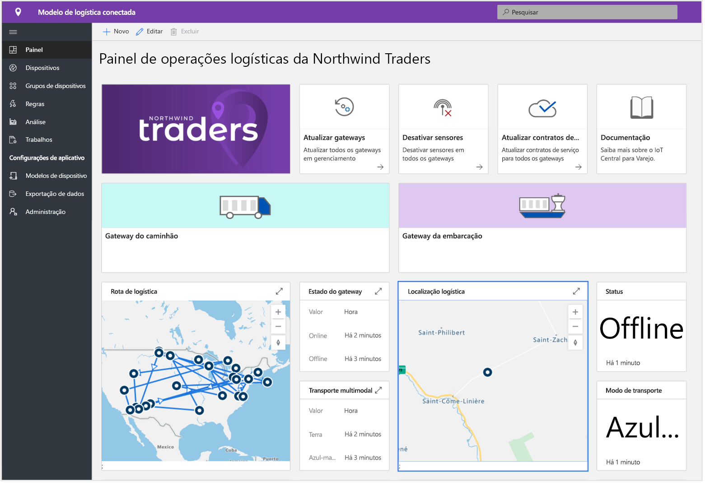
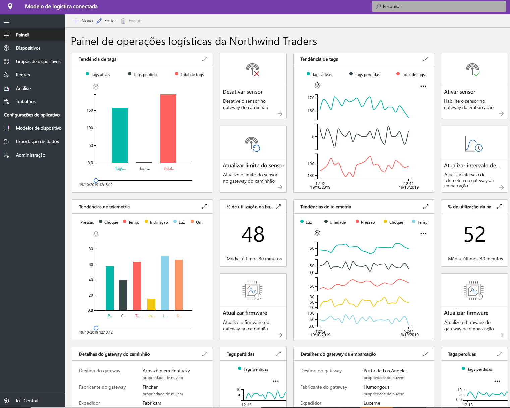
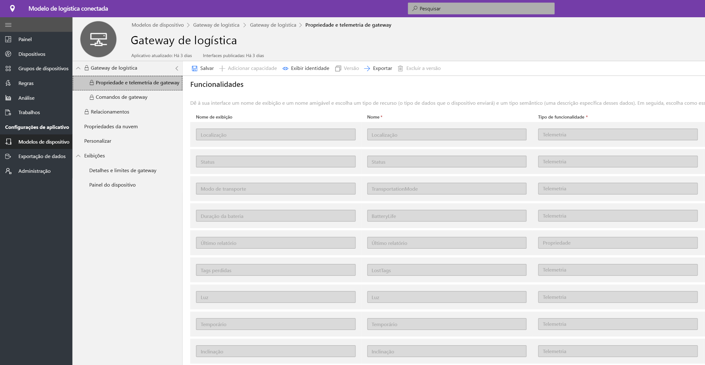
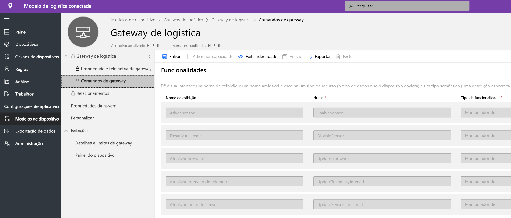
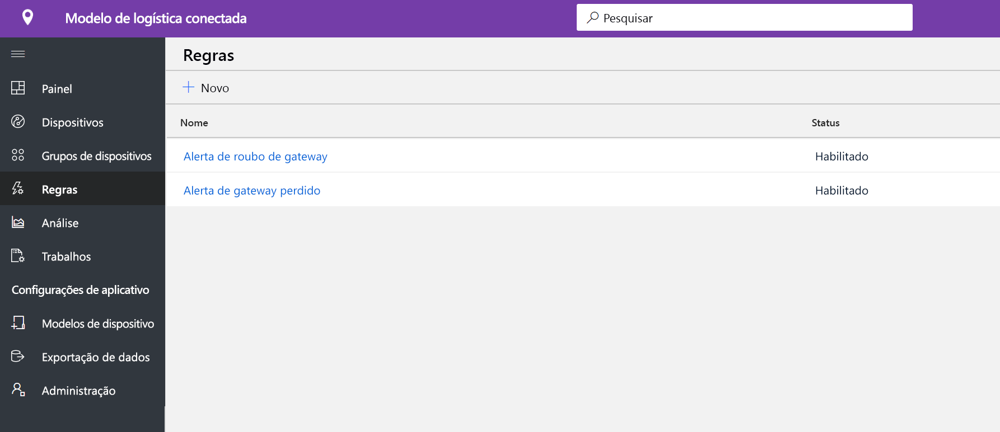
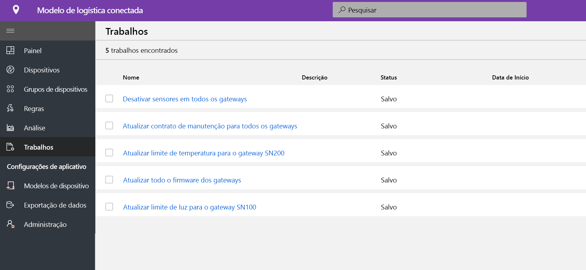
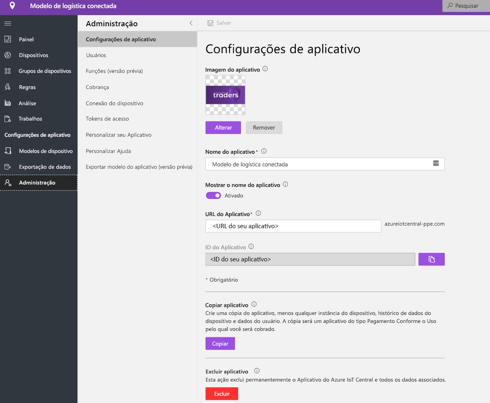

# Tutorial: Implantar e usar um modelo de aplicativo de logística conectada

[!INCLUDE [iot-central-pnp-original](../../../includes/iot-central-pnp-original-note.md)]

Este tutorial mostra como iniciar a implantação de um modelo de aplicativo de **logística conectada** para IoT Central. Veja como implantar o modelo, o conteúdo incluído pronto para uso e o que você poderá fazer em seguida.

Neste tutorial, você aprenderá a: 
* Criar um aplicativo de logística conectada 
* Explorar o aplicativo 

## Pré-requisitos
* Não há pré-requisitos específicos para implantar este aplicativo
* É recomendável ter uma assinatura do Microsoft Azure, mas é possível também experimentá-lo sem ela

## Criar um modelo de aplicativo de logística conectado
Para criar um aplicativo, faça o seguinte:
1. Navegue até o site do Gerenciador de Aplicativos do Azure IoT Central. Selecione o **Build**, na barra de navegação à esquerda, e clique na guia **Varejo**.

> [!div class="mx-imgBorder"]
> 

2. Selecione **Criar aplicativo**, em **Aplicativo de logística conectada**.

3. A opção **Criar aplicativo** abrirá o formulário Novo aplicativo e preencherá os detalhes solicitados, conforme mostrado abaixo.
   * **Nome do aplicativo**: use o nome sugerido padrão ou crie um nome de aplicativo amigável.
   * **URL**: use a URL sugerida padrão ou crie uma URL amigável exclusiva de fácil memorização. Em seguida, recomendamos usar a configuração padrão, caso você já tenha uma assinatura do Microsoft Azure. No entanto, você pode começar com uma avaliação gratuita de sete dias e optar por converter a assinatura para Pagamento Conforme o Uso, antes do término da avaliação gratuita.
   * **Informações de cobrança**: para provisionar os recursos, é necessário informar os detalhes em Diretório, Assinatura do Azure e Região.
   * **Criar**: selecione Criar, no final da página, para implantar o aplicativo.

> [!div class="mx-imgBorder"]
> 

## Explorar o aplicativo 

## painel

Depois de implantar com êxito o modelo de aplicativo, o painel padrão será um portal com foco no operador de logística conectada. A Northwind Trader é um provedor de logística fictício que gerencia navios de carga no mar e em terra. Nesse painel, você verá dois gateways diferentes que fornecem telemetria sobre as remessas, juntamente com as ações, os comandos e trabalhos associados que você pode realizar. Esse painel é pré-configurado para demonstrar a atividade crítica das operações do dispositivo de logística.
O painel é dividido logicamente entre duas operações diferentes de gerenciamento de dispositivo de gateway: 
   * O roteiro de logística para remessas de caminhão e os detalhes de localização das remessas marítimas são elementos essenciais para todos os transportes multimodais.
   * Exibir as informações relevantes e o status do gateway. 

> [!div class="mx-imgBorder"]
> 

   * Você pode acompanhar facilmente a quantidade de gateways, bem como as marcas ativas ou desconhecidas.
   * Você pode executar operações de gerenciamento de dispositivos, como atualizar firmware, desabilitar e habilitar sensor, atualizar limite de sensor, atualizar intervalos de telemetria e atualizar contratos de serviço de dispositivo.
   * Exibir o consumo de bateria do dispositivo

> [!div class="mx-imgBorder"]
> 

## Modelo de dispositivo

Clique na guia Modelos de dispositivo para ver o modelo de funcionalidade do gateway. O modelo de funcionalidade é estruturado em duas interfaces diferentes: **Propriedade e telemetria de gateway** e **Comandos de gateway**.

**Telemetria e propriedade de gateway** – Essa interface representa toda a telemetria relacionada a sensores, localização e informações do dispositivo, além da capacidade de propriedade do dispositivo gêmeo, como intervalos de atualização e limites de sensor.

> [!div class="mx-imgBorder"]
> 

**Comandos de gateway** – essa interface organiza todas as funcionalidades de comando do gateway.

> [!div class="mx-imgBorder"]
> 

## Regras
Selecione a guia Regras para ver duas regras diferentes neste modelo de aplicativo. Essas regras são configuradas para enviar notificações por email aos operadores para fins de investigações posteriores.
 
**Alerta de roubo de gateway**: essa regra é disparada quando há uma detecção de luz inesperada pelos sensores durante a jornada. Os operadores devem ser notificados o quanto antes para que possam investigar o possível roubo.
 
**Gateway sem resposta**: essa regra será disparada, se o gateway não enviar relatórios à nuvem por um período prolongado. O gateway pode ficar sem resposta devido ao modo de bateria fraca, à perda de conectividade e à integridade do dispositivo.

> [!div class="mx-imgBorder"]
> 

## Trabalhos
Selecione a guia Trabalhos para exibir cinco trabalhos existentes como parte deste modelo de aplicativo:

> [!div class="mx-imgBorder"]
> 

você pode aproveitar o recurso Trabalhos para executar operações em toda a solução. Nesse caso, os trabalhos de gerenciamento de estoque estão usando a funcionalidade de gêmeos e os comandos do dispositivo para executar tarefas, como desabilitar sensores específicos em todo o gateway ou modificar o limite do sensor, dependendo da rota e do modo de remessa. 
   * Desabilitar sensores de impacto é uma operação padrão nas remessas marítimas para preservar a bateria ou reduzir o limite de temperatura durante o transporte em cadeias de frio. 
 
   * Com o recurso Trabalhos, você pode executar operações em todo o sistema, como atualizar firmware nos gateways ou atualizar o contrato de serviço para ficar em dia com as atividades de manutenção.

## Limpar recursos
Caso não pretenda usar esse aplicativo, acesse **Administração** > **Configurações do Aplicativo** e clique em **Excluir** para excluir o modelo de aplicativo.

> [!div class="mx-imgBorder"]
> 

## Próximas etapas
* Saiba mais sobre o [conceito de logística conectada](./architecture-connected-logistics-pnp.md).
* Saiba mais sobre outros [modelos comerciais do IoT Central](./overview-iot-central-retail-pnp.md)
* Saiba mais sobre a [Visão geral do IoT Central](../core/overview-iot-central-pnp.md).
