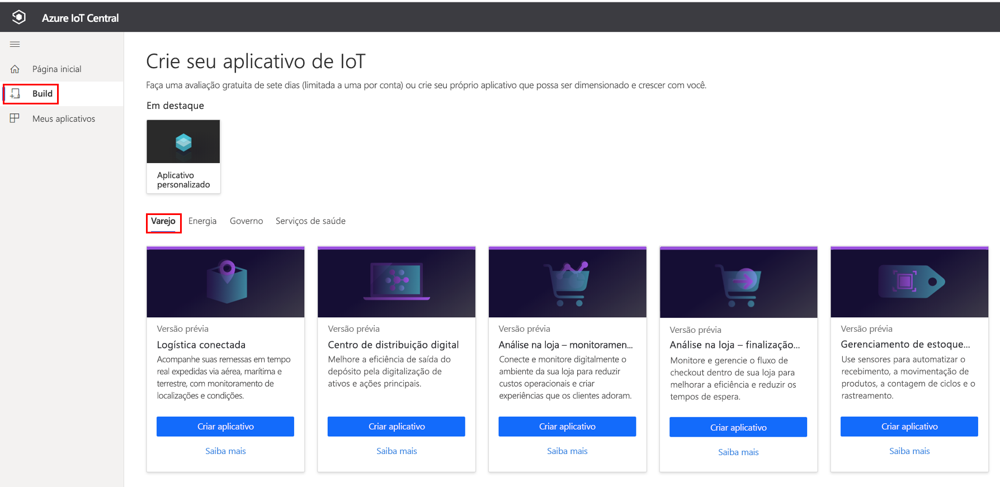
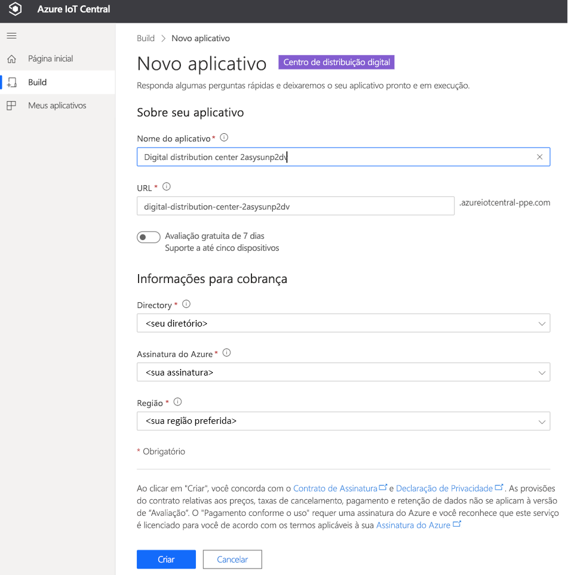

# Tutorial: Implantar e usar um modelo de aplicativo do centro de distribuição digital

[!INCLUDE [iot-central-pnp-original](../../../includes/iot-central-pnp-original-note.md)]

Este tutorial mostra como iniciar a implantação de um modelo de aplicativo do **centro de distribuição digital** para IoT Central. Veja como implantar o modelo, o conteúdo incluído pronto para uso e o que você poderá fazer em seguida.

Neste tutorial, você aprenderá a: 
* Criar um aplicativo do centro de distribuição digital 
* Explorar o aplicativo 

## Pré-requisitos
* Não há pré-requisitos específicos para implantar este aplicativo
* É recomendável ter uma assinatura do Microsoft Azure, mas é possível também experimentá-lo sem ela

## Criar um modelo de aplicativo do centro de distribuição digital

Para criar um aplicativo, faça o seguinte:

1. Navegue até o site do Gerenciador de Aplicativos do Azure IoT Central. Selecione o **Build**, na barra de navegação à esquerda, e clique na guia **Varejo**.

> [!div class="mx-imgBorder"]
> 

2. Selecione a guia **Varejo** e, em seguida, **Criar aplicativo**, em **Aplicativo do centro de distribuição digital **

3. A opção **Criar aplicativo** abrirá o formulário Novo aplicativo e preencherá os detalhes solicitados, conforme mostrado abaixo.
   **Nome do aplicativo**: use o nome sugerido padrão ou crie um nome de aplicativo amigável.
   **URL**: use a URL sugerida padrão ou crie uma URL amigável exclusiva de fácil memorização. Em seguida, recomendamos usar a configuração padrão, caso você já tenha uma assinatura do Azure. No entanto, você pode começar com uma avaliação gratuita de sete dias e optar por converter a assinatura para Pagamento Conforme o Uso, antes do término da avaliação gratuita.
   **Informações de Cobrança**: para provisionar os recursos, é necessário informar os detalhes em Diretório, Assinatura do Azure e Região.
   **Criar**: selecione Criar, no final da página, para implantar o aplicativo.

> [!div class="mx-imgBorder"]
> 

## Explorar o painel de aplicativo 

Depois de implantar com êxito o modelo de aplicativo, o painel padrão será um portal com foco no operador do Centro de Distribuição. A Northwind Trader é um provedor de soluções fictício do Centro de Distribuição que gerencia sistemas de transportadoras. 

Nesse painel, você verá um gateway e uma câmera atuando como dispositivo IoT. O gateway está fornecendo telemetria sobre os pacotes, como as propriedades de válido, inválido, não identificado e tamanho, juntamente com as propriedades do dispositivo gêmeo associado. Todos os comandos downstream são executados em dispositivos IoT, como uma câmera. Esse painel é pré-configurado para demonstrar a atividade crítica das operações do dispositivo do Centro de Distribuição.

O painel é organizado logicamente para mostrar as funcionalidades de gerenciamento de gateway do Azure IoT e do dispositivo IoT.  
   * Você pode executar tarefas de controle e comando do gateway.
   * Gerencie todas as câmeras que fazem parte da solução. 

> [!div class="mx-imgBorder"]
> 

## Modelo de dispositivo

Clique na guia Modelos de dispositivo para ver o modelo de funcionalidade do gateway. O modelo de funcionalidade é estruturado em duas interfaces diferentes: **Câmera** e **Gateway de Distribuição Digital**.

> [!div class="mx-imgBorder"]
> 

**Câmera** – essa interface organiza todas as funcionalidades de comando específicas de câmera. 

> [!div class="mx-imgBorder"]
> 

**centro de distribuição digital** – essa interface representa toda a telemetria proveniente de uma câmera, as propriedades do dispositivo gêmeo definidas na nuvem e as informações do gateway.

> [!div class="mx-imgBorder"]
> 

## Comandos de gateway
Esta interface organiza todas as funcionalidades de comando do gateway.

> [!div class="mx-imgBorder"]
> 

## Regras
Selecione a guia Regras para ver duas regras diferentes neste modelo de aplicativo. Essas regras são configuradas para enviar notificações por email aos operadores para fins de investigações posteriores.

 **Excesso de alertas de pacotes inválidos** – essa regra é disparada quando a câmera detecta um grande número de pacotes inválidos que fluem pelo sistema da transportadora.
 
**Pacote grande** – essa regra é disparada quando a câmera detecta um grande pacote cuja qualidade não pode ser inspecionada. 

> [!div class="mx-imgBorder"]
> 

## Trabalhos
Selecione a guia Trabalhos para exibir cinco trabalhos existentes como parte deste modelo de aplicativo: Você pode aproveitar o recurso Trabalhos para executar operações em toda a solução. Nesse caso, os trabalhos do centro de distribuição digital estão usando a funcionalidade de gêmeos e os comandos do dispositivo para executar tarefas, como:
   * Calibrar a câmera antes de iniciar a detecção do pacote. 
   * Atualizar periodicamente o firmware da câmera.
   * Modificar o intervalo de telemetria para gerenciar o carregamento de dados.

> [!div class="mx-imgBorder"]
> 

## Limpar recursos
Caso não pretenda usar esse aplicativo, acesse **Administração** > **Configurações do Aplicativo** e clique em **Excluir** para excluir o modelo de aplicativo.

> [!div class="mx-imgBorder"]
> 

## Próximas etapas
* Saiba mais sobre o [conceito do centro de distribuição digital](./architecture-digital-distribution-center-pnp.md) na arquitetura da solução.
* Saiba mais sobre outros [modelos comerciais do IoT Central](./overview-iot-central-retail-pnp.md)
* Para saber mais sobre o IoT Central, confira [Visão geral do IoT Central](../core/overview-iot-central-pnp.md)
