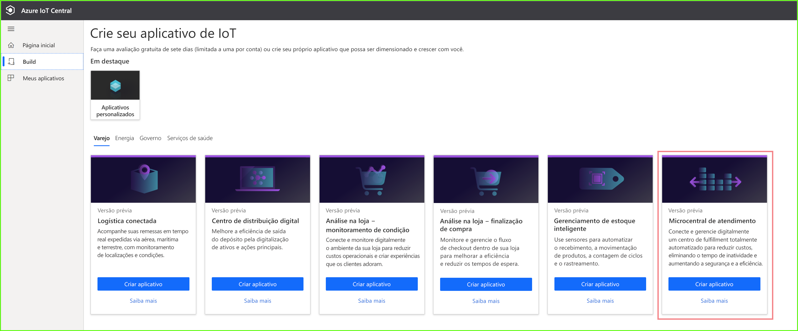
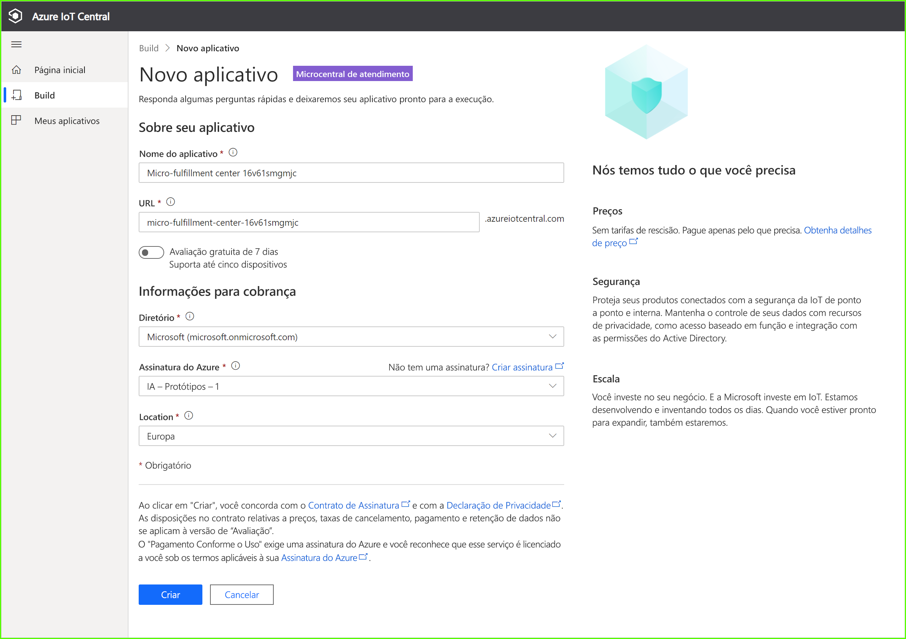
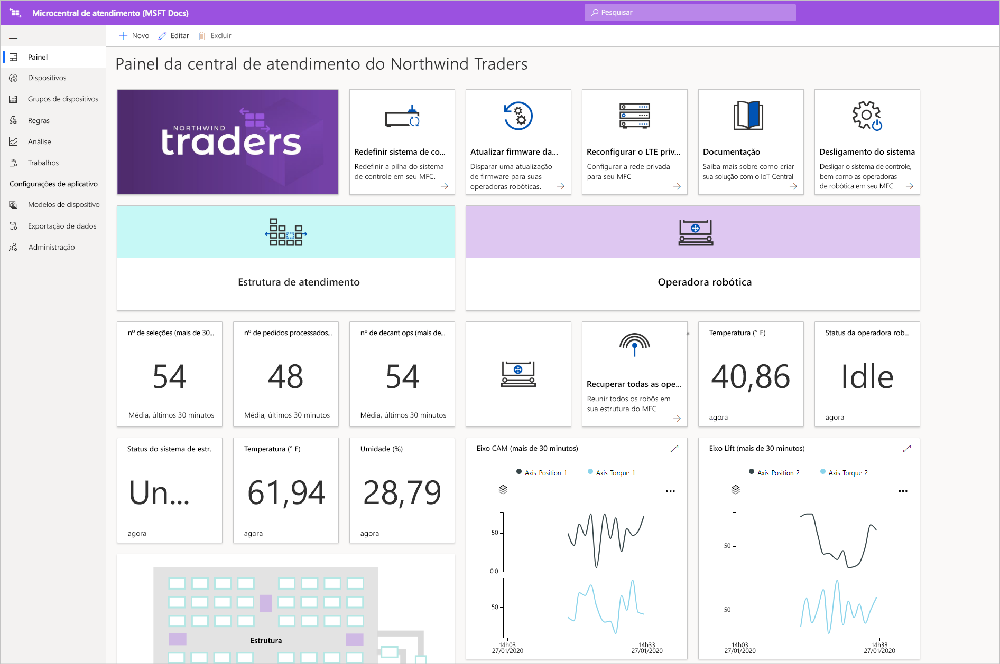
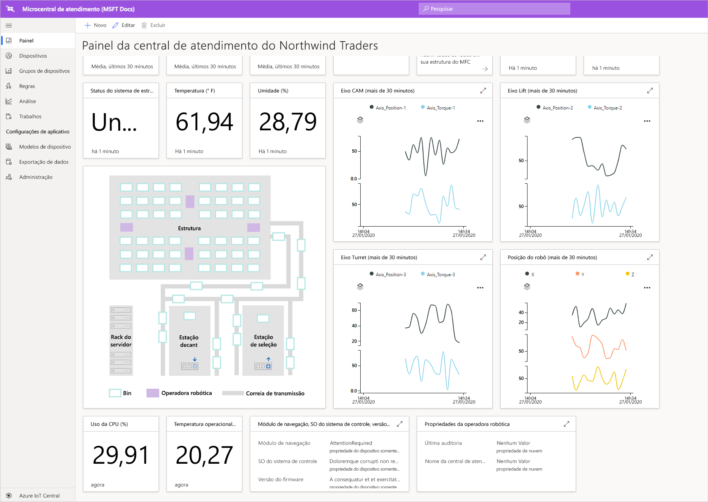
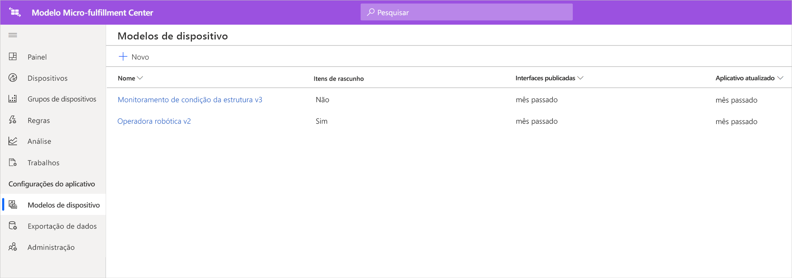
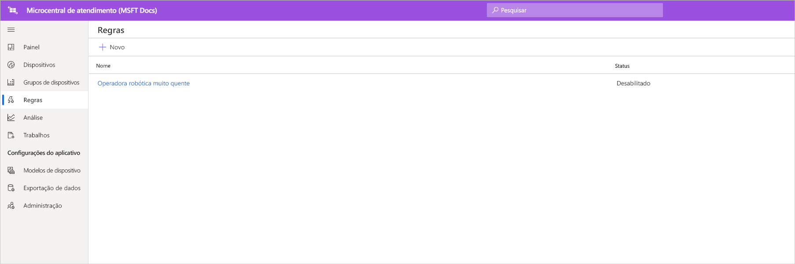
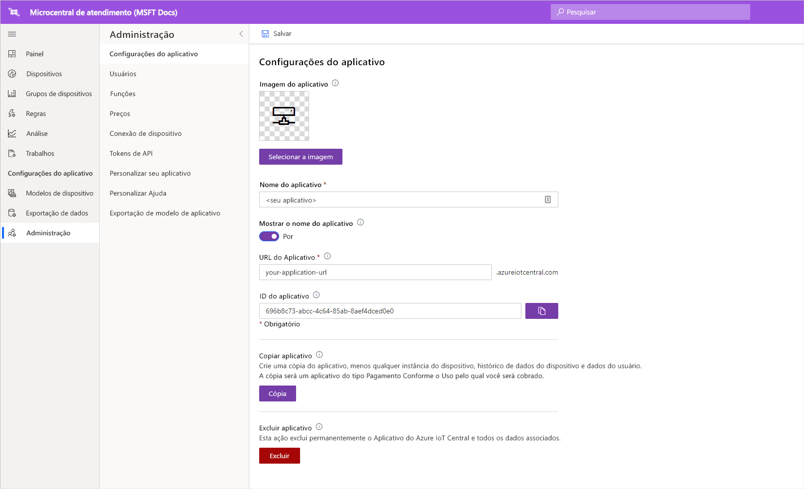

# Tutorial: Implantar e seguir passo a passo o modelo de aplicativo de microcentral de atendimento

Neste tutorial, utilizaremos o modelo de aplicativo de ***microcentral de atendimento*** do Azure IoT Central para mostrar como criar uma solução de varejo. Você aprenderá sobre como implantar o modelo de MFC, o conteúdo incluído pronto para uso e o que poderá fazer em seguida.

Neste tutorial, você aprenderá como: 
> [!div class="checklist"]
> * Usar o modelo de **microcentral de atendimento** do Azure IoT Central para criar um aplicativo de varejo
> * Explorar o aplicativo 

## Prerequisites
Para concluir este tutorial, você precisa:
* Uma assinatura do Azure. Opcionalmente, você pode usar uma avaliação gratuita de sete dias. Se você não tiver uma assinatura do Azure, poderá criar uma na [página de entrada do Azure](https://aka.ms/createazuresubscription).

## Criar um aplicativo 
Nesta seção, você cria um novo aplicativo do Azure IoT Central com base em um modelo. Você usará este aplicativo em toda a série de tutoriais para criar uma solução completa.

Para criar um novo aplicativo Azure IoT Central:

1. Navegue até o site do [Gerenciador de aplicativos do Azure IoT Central](https://aka.ms/iotcentral).
1. Se você tiver uma assinatura do Azure, entre com as credenciais usadas para acessá-lo, caso contrário, entre usando uma conta Microsoft:

   

1. Para começar a criar um novo aplicativo Azure IoT Central, selecione **Novo Aplicativo**.

1. Selecione **Varejo**.  A página de varejo exibe vários modelos de aplicativos de varejo.

Para criar um aplicativo de microcentral de atendimento que usa versão prévia dos recursos:  
1. Selecione o modelo de aplicativo de **microcentral de atendimento**. Esse modelo inclui modelos de dispositivo para todos os dispositivos usados no tutorial. O modelo também fornece um painel do operador para as condições de monitoramento em sua central de atendimento, bem como as condições para operadoras robóticas. 

    > [!div class="mx-imgBorder"]
    > 
    
1. Opcionalmente, escolha um **Nome de aplicativo** amigável.  O modelo de aplicativo é baseado na empresa fictícia Northwind Traders. 

    > [!NOTE]
    > Se você usar um **Nome de aplicativo** amigável, ainda deverá usar um valor exclusivo para a **URL** do aplicativo.

1. Se você tiver uma assinatura do Azure, insira seu *Diretório, assinatura do Azure e Região*. Se você não tiver uma assinatura, poderá habilitar a **avaliação gratuita de sete dias** e preencher as informações de contato necessárias.  

    Para obter mais informações sobre assinaturas e diretórios, consulte o [criar um início rápido de aplicativo](../preview/quick-deploy-iot-central.md).

1. Selecione **Criar**.

> [!div class="mx-imgBorder"]
> 

## Explorar o aplicativo 

### Painel 

Depois de implantar com êxito o modelo de aplicativo, você chegará primeiro ao **painel da microcentral de atendimento da Northwind Traders**. A Northwind Traders é um varejista fictícia que tem uma microcentral de atendimento gerenciada no aplicativo IoT Central. Nesse painel do operador, você verá informações e telemetria sobre os dispositivos nesse modelo, bem como um conjunto de comandos, trabalhos e ações que pode executar. O painel é dividido logicamente em duas seções (à esquerda e à direita). À esquerda, você tem a capacidade de monitorar as condições ambientais dentro da estrutura de atendimento e, à direita, pode monitorar a integridade de uma operadora robótica dentro da instalação.  

No painel, você pode:
   * Consultar a telemetria do dispositivo, como o nº de seleções, o nº de pedidos processados e as propriedades, como o status do sistema de estrutura etc.  
   * Exibir a **planta** e a localização das operadoras robóticas dentro da estrutura de atendimento.
   * Disparar comandos como redefinir o sistema de controle, atualizar o firmware da operadora, reconfigurar a rede etc.

> [!div class="mx-imgBorder"]
> 
   * Veja um exemplo do painel que um operador pode utilizar para monitorar as condições na central de atendimento. 
   * Monitore a integridade do conteúdo em execução no dispositivo de gateway na central de atendimento.    

> [!div class="mx-imgBorder"]
> 

## Modelo de dispositivo
Se clicar na guia Modelos de dispositivo, você verá que há dois tipos diferentes de dispositivos que fazem parte do modelo: 
   * **Operadora robótica**: Esse modelo de dispositivo representa a definição de uma operadora robótica funcional que foi implantada na estrutura de atendimento e está executando operações apropriadas de armazenamento e recuperação. Se você clicar no modelo, verá que o robô está enviando dados do dispositivo, como temperatura, posição do eixo e propriedades como o status da operadora robótica etc. 
   * **Monitoramento de condição da estrutura**: Esse modelo de dispositivo representa uma coleção de dispositivos que permite monitorar a condição do ambiente, bem como o dispositivo de gateway que hospeda várias cargas de trabalho de borda para capacitar sua central de atendimento. O dispositivo envia dados de telemetria, como a temperatura, o nº de seleções, o nº de pedidos etc., além do estado e da integridade das cargas de trabalho de computação em execução no seu ambiente. 

> [!div class="mx-imgBorder"]
> 

Se clicar na guia Grupos de dispositivos, você verá também que esses modelos de dispositivo têm grupos de dispositivos criados automaticamente para eles.

## Regras
Ao saltar para a guia Regras, você verá uma regra de exemplo que existe no modelo de aplicativo para monitorar as condições de temperatura para a operadora robótica. Você poderá usar essa regra para alertar o operador se um robô específico na instalação estiver superaquecendo e precisar ser colocado offline para manutenção. 

Utilize a regra de exemplo como inspiração para definir regras que sejam mais apropriadas para suas funções empresariais.

   - **Operadora robótica muito quente**: Essa regra será disparada se a operadora robótica atingir um limite de temperatura ao longo de um período de tempo. 

> [!div class="mx-imgBorder"]
> 

## Limpar os recursos

Caso não pretenda usar esse aplicativo, acesse **Administração** > **Configurações do Aplicativo** e clique em **Excluir** para excluir o modelo de aplicativo.

> [!div class="mx-imgBorder"]
> 

## Próximas etapas
* Saiba mais sobre a [arquitetura da solução de microcentral de atendimento](./architecture-micro-fulfillment-center-pnp.md)
* Saiba mais sobre outros [modelos comerciais do IoT Central](./overview-iot-central-retail-pnp.md)
* Para saber mais sobre o IoT Central, confira [Visão geral do IoT Central](../preview/overview-iot-central.md)