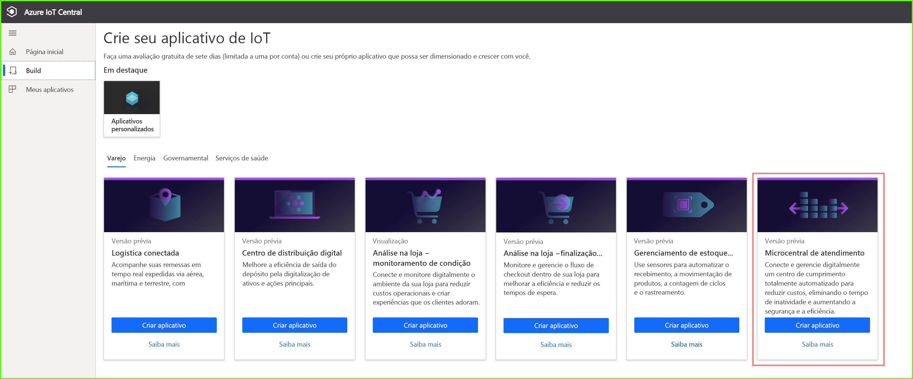
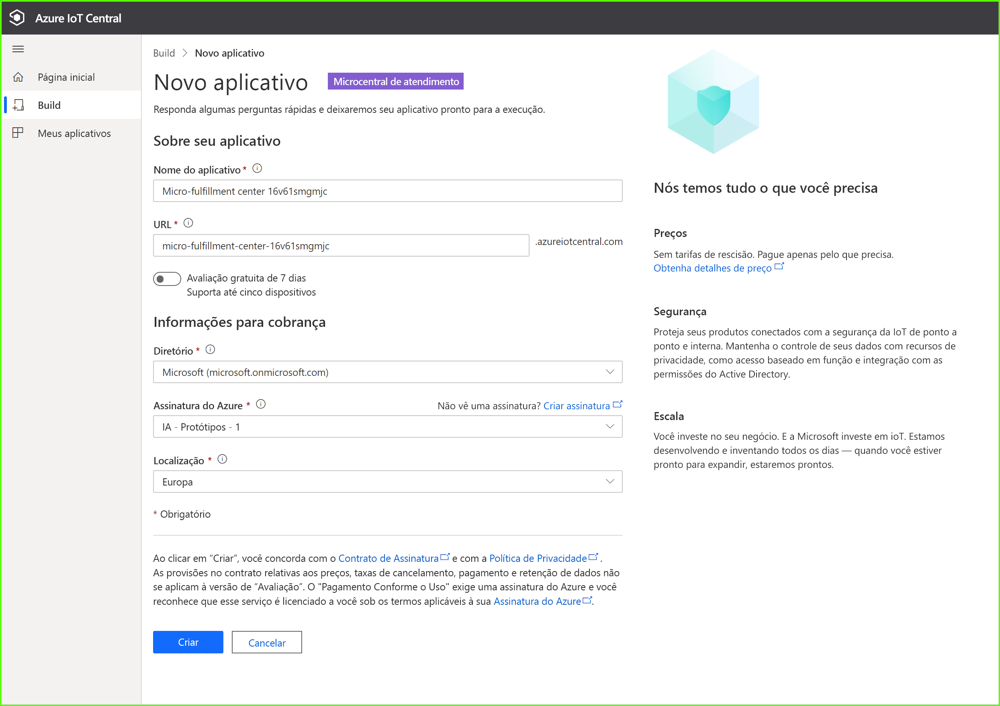
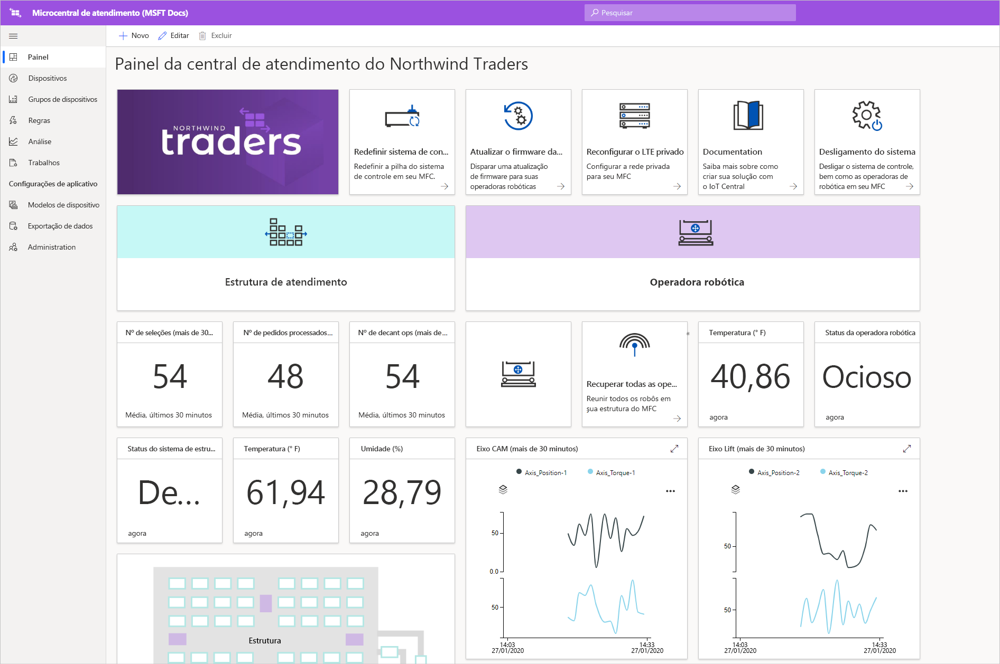
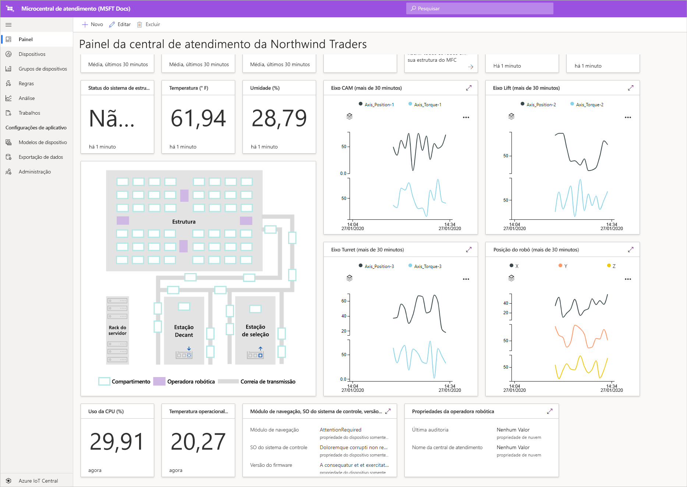
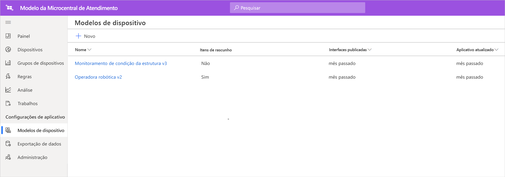
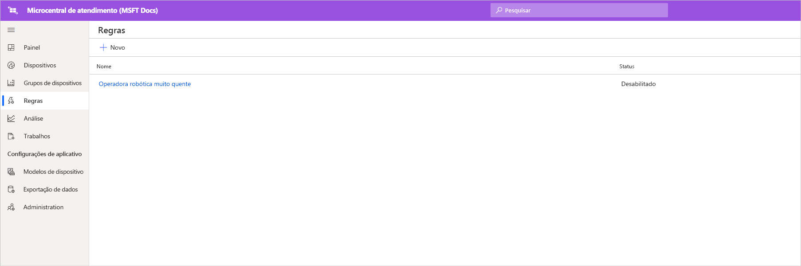
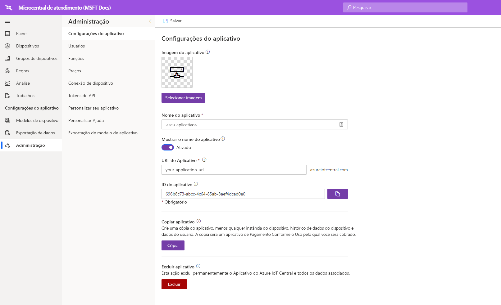

# Tutorial: Implantar e seguir passo a passo o modelo de aplicativo de microcentral de atendimento

Neste tutorial, você usará o modelo de aplicativo de microcentral de atendimento do Azure IoT Central para criar uma solução de varejo.

Neste tutorial, você aprenderá:

> [!div class="checklist"]
> * A implantar o modelo de aplicativo
> * A usar o modelo de aplicativo

## Pré-requisitos
Para concluir esta série de tutoriais, você precisará ter uma assinatura do Azure. Opcionalmente, você pode usar uma avaliação gratuita de sete dias. Se você não tiver uma assinatura do Azure, poderá criar uma na [página de entrada do Azure](https://aka.ms/createazuresubscription).

## Criar um aplicativo 
Nesta seção, você cria um novo aplicativo do Azure IoT Central com base em um modelo. Você usará este aplicativo em toda a série de tutoriais para criar uma solução completa.

Para criar um novo aplicativo Azure IoT Central:

1. Acesse o site do [gerenciador de aplicativos do Azure IoT Central](https://aka.ms/iotcentral).
1. Se você tiver uma assinatura do Azure, entre com as credenciais usadas para acessá-la. Caso contrário, entre usando uma conta Microsoft:

   

1. Para começar a criar um novo aplicativo Azure IoT Central, selecione **Novo Aplicativo**.

1. Selecione **Varejo**.  A página de varejo exibe vários modelos de aplicativos de varejo.

Para criar um aplicativo de microcentral de atendimento que usa versão prévia dos recursos:  
1. Selecione o modelo de aplicativo de **microcentral de atendimento**. Esse modelo inclui modelos de dispositivo para todos os dispositivos usados no tutorial. O modelo também fornece um painel do operador para monitorar as condições na microcentral de atendimento, bem como as condições das operadoras robóticas. 

    
    
1. Opcionalmente, escolha um **Nome de aplicativo** amigável. O modelo de aplicativo é baseado na empresa fictícia Northwind Traders. 

    >[!NOTE]
    >Se você usar um nome de aplicativo amigável, ainda precisará usar um valor exclusivo para a URL do aplicativo.

1. Caso você tenha uma assinatura do Azure, insira o diretório, a assinatura do Azure e a região. Caso não tenha uma assinatura, habilite a avaliação gratuita de 7 dias e preencha as informações de contato solicitadas.  

    Para obter mais informações sobre assinaturas e diretórios, consulte o início rápido [Criar um aplicativo](../core/quick-deploy-iot-central.md).

1. Selecione **Criar**.

    

## Explorar o aplicativo 

Depois de implantar com êxito o modelo de aplicativo, você verá o **painel da microcentral de atendimento da Northwind Traders**. A Northwind Traders é um varejista fictício que tem uma microcentral de atendimento gerenciada neste aplicativo do Azure IoT Central. Nesse painel do operador, você verá informações e telemetria sobre os dispositivos nesse modelo, bem como um conjunto de comandos, trabalhos e ações que podem ser executadas. O painel é dividido logicamente em duas seções. À esquerda, você pode monitorar as condições ambientais na estrutura de atendimento e, à direita, monitorar a integridade de uma operadora robótica dentro da instalação.  

No painel, você pode:
   * Ver a telemetria do dispositivo, como o número de seleções, o número de pedidos processados e as propriedades, como o status do sistema da estrutura.  
   * Ver a planta baixa e a localização das operadoras robóticas na estrutura de atendimento.
   * Disparar comandos, como redefinir o sistema de controle, atualizar o firmware da operadora e reconfigurar a rede.

     
   * Veja um exemplo do painel que um operador pode usar para monitorar as condições na central de atendimento. 
   * Monitore a integridade do conteúdo em execução no dispositivo de gateway na central de atendimento.    

     

## Modelo de dispositivo
Se você selecionar a guia Modelos de dispositivo, verá que há dois tipos de dispositivos diferentes que fazem parte do modelo: 
   * **Operadora robótica**: Esse modelo de dispositivo representa a definição de uma operadora robótica funcional que foi implantada na estrutura de atendimento e que está executando operações apropriadas de armazenamento e recuperação. Se você selecionar o modelo, verá que o robô está enviando dados do dispositivo, como temperatura e posição do eixo, bem como propriedades, como o status da operadora robótica. 
   * **Monitoramento de condição da estrutura**: Esse modelo de dispositivo representa uma coleção de dispositivos que permite monitorar a condição do ambiente, bem como o dispositivo de gateway que hospeda várias cargas de trabalho de borda para capacitar a sua central de atendimento. O dispositivo envia dados telemétricos, como a temperatura, o número de seleções e o número de pedidos. Ele também envia informações sobre o estado e a integridade das cargas de trabalho de computação em execução no ambiente. 

     

Se você selecionar a guia Grupos de dispositivos, verá também que esses modelos de dispositivos têm grupos de dispositivos criados automaticamente para eles.

## Regras
Na guia **Regras**, você verá uma regra de exemplo que existe no modelo de aplicativo para monitorar as condições de temperatura da operadora robótica. Você poderá usar essa regra para alertar o operador se um robô específico na instalação estiver superaquecendo e precisar ser colocado offline para manutenção. 

Use a regra de exemplo como inspiração para definir regras que sejam mais apropriadas para as suas funções empresariais.

## Limpar os recursos

Se não quiser continuar usando este aplicativo, exclua o modelo de aplicativo. Acesse **Administração** > **Configurações de aplicativo** e selecione **Excluir**.

## Próximas etapas

Saiba mais sobre:

> [!div class="nextstepaction"]
> [arquitetura da solução da microcentral de atendimento](./architecture-micro-fulfillment-center.md)
