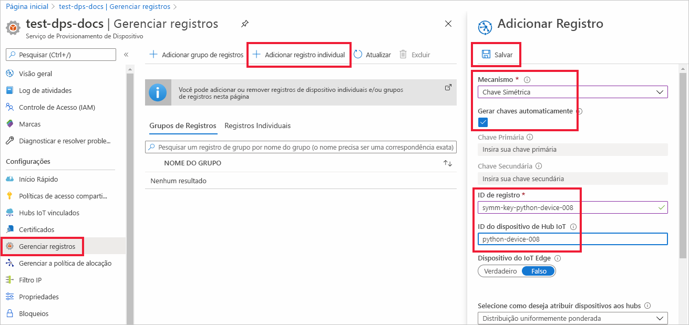
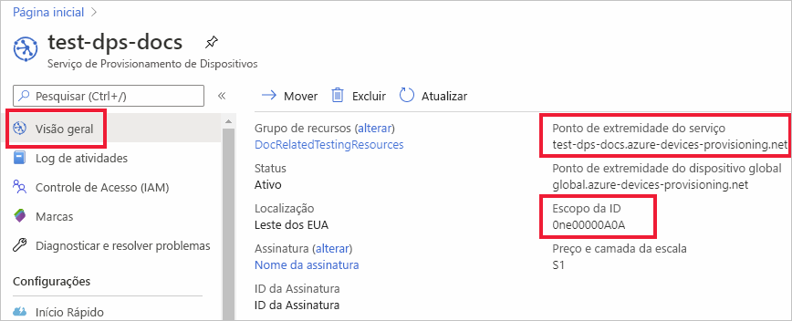
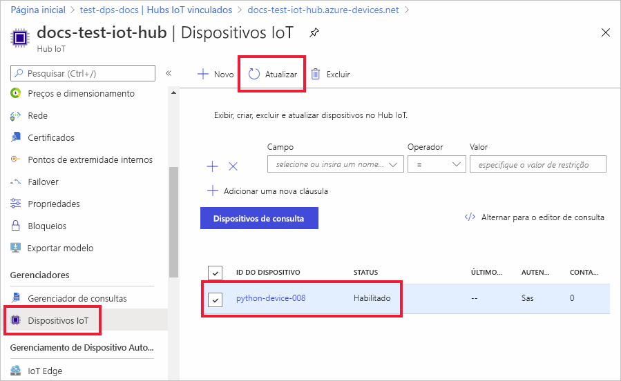

# <a name="quickstart-provision-a-python-device-with-symmetric-keys"></a>Provisionar um dispositivo Python com chaves simétricas

Neste guia de início rápido, você aprenderá a provisionar um computador de desenvolvimento do Windows como um dispositivo em um hub IoT usando o Python. Esse dispositivo usará uma chave simétrica e uma inscrição individual para se autenticar em uma instância do DPS (Serviço de Provisionamento de Dispositivos) a fim de ser atribuído a um hub IoT. O código de exemplo do [SDK do Python para o IoT do Azure](https://github.com/Azure/azure-iot-sdk-python) será usado para provisionar o dispositivo. 

Embora este artigo demonstre o provisionamento com um registro individual, também é possível usar grupos de registros. Há algumas diferenças ao usar grupos de registro. Por exemplo, você precisa usar uma chave de dispositivo derivada com uma ID de registro exclusiva para o dispositivo. Embora os grupos de registros de chave simétrica não sejam limitados apenas a dispositivos herdados, [Como provisionar dispositivos herdados usando atestado de chave simétrica](how-to-legacy-device-symm-key.md) fornece um exemplo de grupo de registros. Para obter mais informações, consulte [Registros de grupo para atestado de chave simétrica](concepts-symmetric-key-attestation.md#group-enrollments).

Se você não estiver familiarizado com o processo de provisionamento automático, examine a visão geral de [provisionamento](about-iot-dps.md#provisioning-process). 

Não se esqueça de concluir as etapas em [Configurar o Serviço de Provisionamento de Dispositivos no Hub IoT com o Portal do Azure](./quick-setup-auto-provision.md) antes de continuar com este início rápido. Este início rápido requer que você já tenha criado a instância de Serviço de Provisionamento de Dispositivos.

Este artigo é orientado para uma estação de trabalho baseada no Windows. No entanto, é possível executar os procedimentos no Linux. Para um exemplo do Linux, confira [Como provisionar para multilocação](how-to-provision-multitenant.md).


[!INCLUDE [quickstarts-free-trial-note](../../includes/quickstarts-free-trial-note.md)]


## <a name="prerequisites"></a>Pré-requisitos

* Verifique se você tem o [Python 3.7](https://www.python.org/downloads/) ou posterior instalado no computador baseado no Windows. Verifique sua versão do Python executando `python --version`.

* Versão mais recente do [Git](https://git-scm.com/download/) instalada.

<a id="setupdevbox"></a>

## <a name="prepare-the-python-sdk-environment"></a>Preparar o ambiente do SDK do Python 

1. Verifique se o Git está instalado em seu computador e se foi adicionado às variáveis de ambiente que podem ser acessadas pela janela de comando. Confira [ferramentas de cliente Git do Software Freedom Conservancy](https://git-scm.com/download/) para obter a versão mais recente das ferramentas `git` a serem instaladas, que inclui o **Git Bash**, o aplicativo de linha de comando que você pode usar para interagir com seu repositório Git local. 

2. Abra um prompt de comando. Clone o repositório GitHub para o SDK do Python para o IoT do Azure:
    
    ```console
    git clone https://github.com/Azure/azure-iot-sdk-python.git --recursive
    ```
3. Procure o diretório `azure-iot-sdk-python\azure-iot-device\samples\async-hub-scenarios` em que o arquivo de exemplo, _provision_symmetric_key.py_, está localizado.
   
   ```console
   cd azure-iot-sdk-python\azure-iot-device\samples\async-hub-scenarios
   ```
4. Instale a biblioteca _azure-iot-device_ executando o comando a seguir.

    ```console
    pip install azure-iot-device
    ```


## <a name="create-a-device-enrollment"></a>Criar um registro do dispositivo

1. Entre no [portal do Azure](https://portal.azure.com), selecione o botão **Todos os recursos** no menu esquerdo e abra a instância do DPS (serviço de Provisionamento de Dispositivos).

2. Selecione a guia **Gerenciar registros** e selecione o botão **Adicionar registro individual** na parte superior. 

3. No painel **Adicionar Registro**, insira as informações a seguir e pressione o botão **Salvar**.

   - **Mecanismo:** selecione **Chave Simétrica** como o *Mecanismo* do atestado de identidade.

   - **Autogerar Chaves**: marque essa caixa.

   - **ID de registro**: insira uma ID de registro para identificar o registro. Use apenas caracteres alfanuméricos minúsculos e traço ('-'). Por exemplo, **symm-key-python-device-008**.

   - **ID do dispositivo do IoT Hub:** insira um identificador de dispositivo. Por exemplo, **python-device-008**.

     

4. Após salvar o registro, a **Chave Primária** e a **Chave Secundária** serão geradas e adicionadas à entrada de registro. O registro do dispositivo de chave simétrica é exibido como **symm-key-python-device-008** na coluna *ID de Registro* da guia *Registros Individuais*. 

5. Abra o registro e copie o valor da **Chave Primária** gerada. Você usará esse valor de chave e a **ID de Registro** mais tarde quando adicionar variáveis de ambiente para uso com o código de exemplo de provisionamento de dispositivos.


<a id="firstbootsequence"></a>

## <a name="prepare-the-device-provisioning-code"></a>Preparar o código de provisionamento de dispositivos

Nesta seção, você adicionará as quatro variáveis de ambiente a seguir que serão usadas como parâmetros para o código de exemplo de provisionamento de dispositivos do dispositivo de chave simétrica. 

* `PROVISIONING_HOST`
* `PROVISIONING_IDSCOPE`
* `PROVISIONING_REGISTRATION_ID`
* `PROVISIONING_SYMMETRIC_KEY`

O código de provisionamento entrará em contato com a instância do DPS com base nessas variáveis para autenticar o dispositivo. O dispositivo será então atribuído a um hub IoT já vinculado à instância do DPS com base na configuração de registro individual. Depois de provisionado, o código de exemplo enviará uma telemetria de teste para o hub IoT.

1. No [portal do Azure](https://portal.azure.com), no menu do Serviço de Provisionamento de Dispositivos, selecione **Visão geral** e copie o _Ponto de Extremidade de Serviço_ e o _Escopo da ID_. Você usará esses valores para as variáveis de ambiente `PROVISIONING_HOST` e `PROVISIONING_IDSCOPE`.

    

2. No prompt de comando do Python, adicione as variáveis de ambiente usando os valores copiados. 

    Os comandos a seguir são exemplos que mostram a sintaxe do comando. Lembre-se de usar os valores corretos.

    ```console
    set PROVISIONING_HOST=test-dps-docs.azure-devices-provisioning.net
    ```

    ```console
    set PROVISIONING_IDSCOPE=0ne00000A0A
    ```

3. No prompt de comando do Python, adicione as variáveis de ambiente à ID de registro e à chave simétrica copiadas do registro individual na seção anterior. 

    Os comandos a seguir são exemplos que mostram a sintaxe do comando. Lembre-se de usar os valores corretos.

    ```console
    set PROVISIONING_REGISTRATION_ID=symm-key-python-device-008
    ```

    ```console
    set PROVISIONING_SYMMETRIC_KEY=sbDDeEzRuEuGKag+kQKV+T1QGakRtHpsERLP0yPjwR93TrpEgEh/Y07CXstfha6dhIPWvdD1nRxK5T0KGKA+nQ==
    ```

4. Execute o código de exemplo do Python em _provision_symmetric_key.py_.

    ```console
    D:\azure-iot-sdk-python\azure-iot-device\samples\async-hub-scenarios>python provision_symmetric_key.py
    ```

5. A saída esperada deverá ser semelhante à mostrada a seguir, que indica o hub IoT vinculado ao qual o dispositivo foi atribuído com base nas configurações de registro individuais. Algumas mensagens de exemplo de telemetria da velocidade do vento também são enviadas para o hub como um teste:

    ```output
    D:\azure-iot-sdk-python\azure-iot-device\samples\async-hub-scenarios>python provision_symmetric_key.py
    RegistrationStage(RequestAndResponseOperation): Op will transition into polling after interval 2.  Setting timer.
    The complete registration result is
    python-device-008
    docs-test-iot-hub.azure-devices.net
    initialAssignment
    null
    Will send telemetry from the provisioned device
    sending message #8
    sending message #9
    sending message #3
    sending message #10
    sending message #4
    sending message #2
    sending message #6
    sending message #7
    sending message #1
    sending message #5
    done sending message #8
    done sending message #9
    done sending message #3
    done sending message #10
    done sending message #4
    done sending message #2
    done sending message #6
    done sending message #7
    done sending message #1
    done sending message #5
    ```
    
6. No portal do Azure, procure o hub IoT vinculado ao serviço de provisionamento e abra a folha **Dispositivos IoT**. Após o provisionamento bem-sucedido do dispositivo de chave simétrica no hub, a identificação do dispositivo é mostrada com o *STATUS* como **habilitado**. Talvez você precise selecionar o botão **Atualizar** na parte superior se já abriu a folha antes de executar o código de exemplo do dispositivo. 

     

> [!NOTE]
> Se você tiver alterado o *estado de dispositivo gêmeo inicial* do valor padrão na entrada de registro para o seu dispositivo, pode receber o estado desejado duas do hub e agir de acordo. Para saber mais, veja [Noções básicas e uso de dispositivos gêmeos no Hub IoT](../iot-hub/iot-hub-devguide-device-twins.md).
>


## <a name="clean-up-resources"></a>Limpar os recursos

Se planejar continuar a trabalhar e explorar o dispositivo cliente de exemplo, não limpe os recursos criados neste início rápido. Caso contrário, use as seguintes etapas para excluir todos os recursos criados por este início rápido.

1. No menu à esquerda no portal do Azure, selecione **Todos os recursos** e selecione o serviço de Provisionamento de Dispositivos. Abra **Gerenciar Registros** de seu serviço e selecione a guia **Registros Individuais**. Marque a caixa de seleção ao lado da *ID DE REGISTRO* do dispositivo registrado neste início rápido e pressione o botão **Excluir**, na parte superior do painel. 
1. No menu à esquerda no portal do Azure, selecione **Todos os recursos** e seu Hub IoT. Abra **Dispositivos IoT** do hub, marque a caixa de seleção ao lado da *ID DO DISPOSITIVO* registrado neste início rápido e pressione o botão **Excluir** na parte superior do painel.

## <a name="next-steps"></a>Próximas etapas

Neste guia de início rápido, você provisionou um dispositivo de chave simétrica baseado no Windows no hub IoT usando o Serviço de Provisionamento de Dispositivos no Hub IoT. Para saber como provisionar dispositivos de certificado X.509 usando o Python, prossiga para o guia de início rápido abaixo para os dispositivos X.509. 

> [!div class="nextstepaction"]
> [Guia de início rápido do Azure – Provisionar dispositivos X.509 usando o DPS e o Python](quick-create-simulated-device-x509-python.md)
