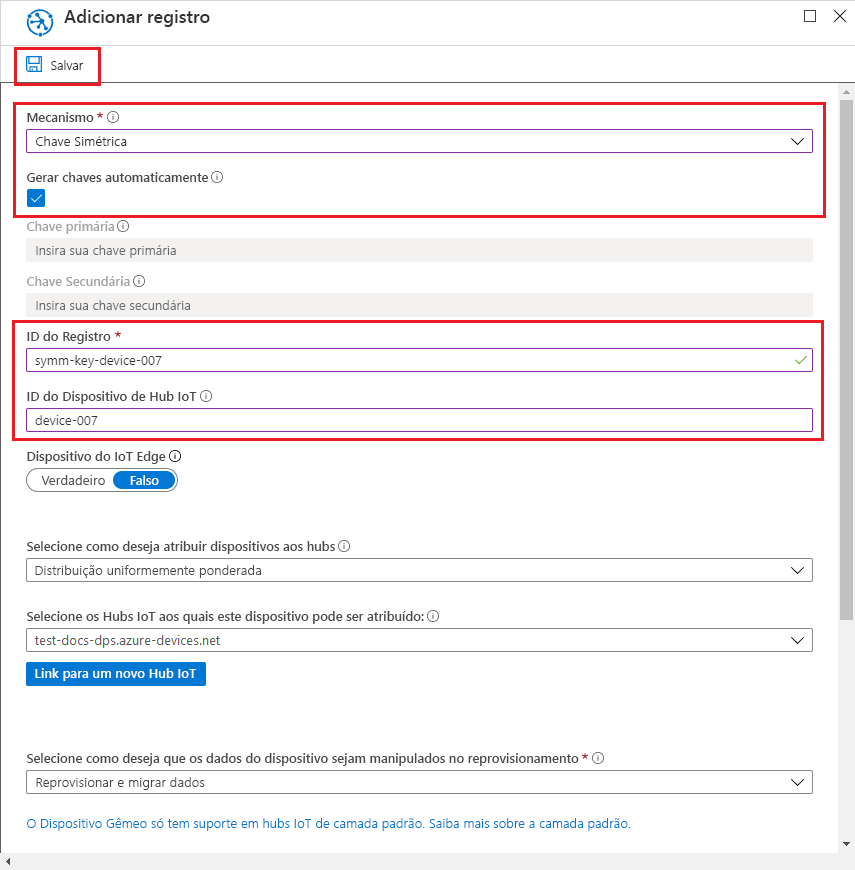
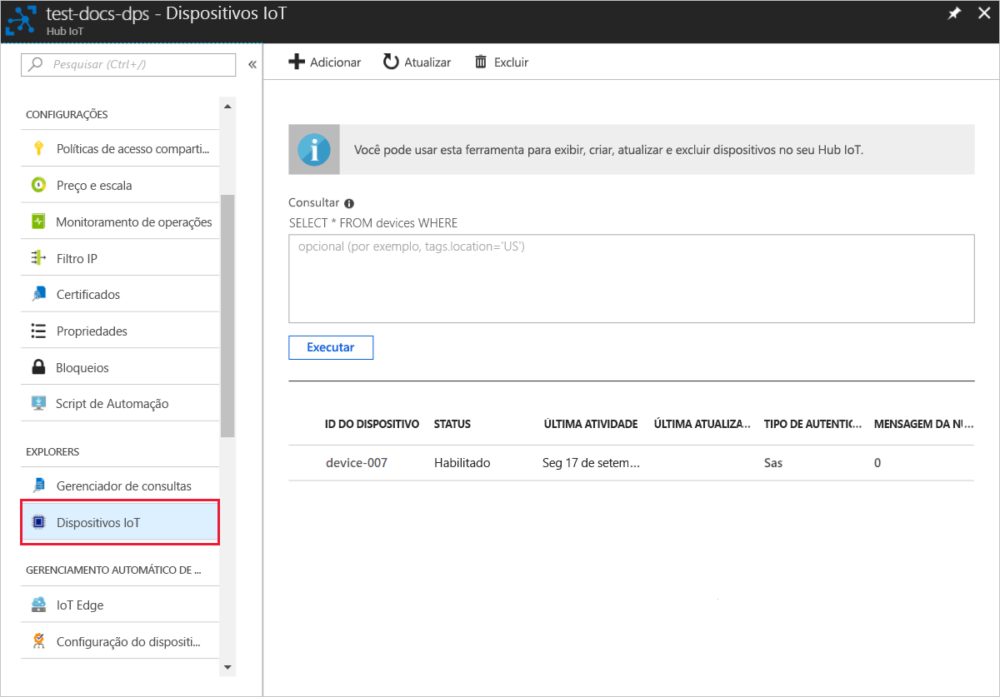

# <a name="quickstart-provision-a-simulated-device-with-symmetric-keys"></a>Início Rápido: Provisionar um dispositivo simulado com chaves simétricas

Neste início rápido, você aprenderá como criar e executar um simulador de dispositivo em um computador de desenvolvimento do Windows. Você configurará esse dispositivo simulado para usar uma chave simétrica para autenticar com uma instância de Serviço de Provisionamento de Dispositivos e ser atribuído a um Hub IoT. O código de exemplo do [SDK de C do IoT do Azure](https://github.com/Azure/azure-iot-sdk-c) será usado para simular uma sequência de inicialização para o dispositivo que inicia o provisionamento. O dispositivo será reconhecido com base em um registro individual com uma instância de serviço de provisionamento e atribuído a um Hub IoT.

Embora este artigo demonstre o provisionamento com um registro individual, é possível usar grupos de registros. Há algumas diferenças ao usar grupos de registro. Por exemplo, você precisa usar uma chave de dispositivo derivada com uma ID de registro exclusiva para o dispositivo. Embora os grupos de registros de chave simétrica não sejam limitados apenas a dispositivos herdados, [Como provisionar dispositivos herdados usando atestado de chave simétrica](how-to-legacy-device-symm-key.md) fornece um exemplo de grupo de registros. Para obter mais informações, consulte [Registros de grupo para atestado de chave simétrica](concepts-symmetric-key-attestation.md#group-enrollments).

Se você não estiver familiarizado com o processo de provisionamento automático, analise os [Conceitos de provisionamento automático](concepts-auto-provisioning.md). 

Não se esqueça de concluir as etapas em [Configurar o Serviço de Provisionamento de Dispositivos no Hub IoT com o Portal do Azure](./quick-setup-auto-provision.md) antes de continuar com este início rápido. Este início rápido requer que você já tenha criado a instância de Serviço de Provisionamento de Dispositivos.

Este artigo é orientado para uma estação de trabalho baseada no Windows. No entanto, é possível executar os procedimentos no Linux. Para um exemplo do Linux, confira [Como provisionar para multilocação](how-to-provision-multitenant.md).


[!INCLUDE [quickstarts-free-trial-note](../../includes/quickstarts-free-trial-note.md)]


## <a name="prerequisites"></a>Prerequisites

Os pré-requisitos a seguir são para um ambiente de desenvolvimento do Windows. Para Linux ou macOS, confira a seção apropriada em [Preparar seu ambiente de desenvolvimento](https://github.com/Azure/azure-iot-sdk-c/blob/master/doc/devbox_setup.md) na documentação do SDK.

* [Visual Studio 2019](https://visualstudio.microsoft.com/vs/) com a carga de trabalho ["Desenvolvimento para desktop com C++"](https://docs.microsoft.com/cpp/?view=vs-2019#pivot=workloads) habilitada. Também há suporte para o Visual Studio 2015 e o Visual Studio 2017.

* Versão mais recente do [Git](https://git-scm.com/download/) instalada.

<a id="setupdevbox"></a>

## <a name="prepare-an-azure-iot-c-sdk-development-environment"></a>Preparar um ambiente de desenvolvimento do SDK de C do IoT do Azure

Nesta seção, você preparará um ambiente de desenvolvimento usado para compilar o [SDK de C do IoT do Azure](https://github.com/Azure/azure-iot-sdk-c). 

O SDK inclui o código de exemplo para um dispositivo simulado. Este dispositivo simulado tentará realizar provisionamento durante a sequência de inicialização do dispositivo.

1. Baixe o [sistema de build CMake](https://cmake.org/download/).

    É importante que os pré-requisitos do Visual Studio (Visual Studio e a carga de trabalho de "Desenvolvimento para Desktop com C++") estejam instalados em seu computador, **antes** da instalação de `CMake`. Após a instalação dos pré-requisitos e verificação do download, instale o sistema de compilação CMake.

    As versões mais antigas do sistema de build CMake não geram o arquivo de solução usado neste artigo. Use uma versão mais recente do CMake.

2. Clique em **Marcas** e localize o nome da marca referente à versão mais recente na [Página de versão do SDK de C do Azure IoT](https://github.com/Azure/azure-iot-sdk-c/releases/latest).

3. Abra um prompt de comando ou o shell Bash do Git. Execute os comandos a seguir para clonar a versão mais recente do repositório do GitHub do [SDK do Azure IoT C](https://github.com/Azure/azure-iot-sdk-c). Use a tag que você encontrou na etapa anterior como o valor para o parâmetro `-b`:

    ```cmd/sh
    git clone -b <release-tag> https://github.com/Azure/azure-iot-sdk-c.git
    cd azure-iot-sdk-c
    git submodule update --init
    ```

    Essa operação deve demorar alguns minutos.

4. Crie um subdiretório `cmake` no diretório raiz do repositório git e navegue até essa pasta. Execute os seguintes comandos do diretório `azure-iot-sdk-c`:

    ```cmd/sh
    mkdir cmake
    cd cmake
    ```

5. Execute o comando a seguir, que cria uma versão do SDK específica para a plataforma cliente de desenvolvimento. Uma solução do Visual Studio para o dispositivo simulado será gerada no diretório `cmake`. 

    ```cmd
    cmake -Dhsm_type_symm_key:BOOL=ON -Duse_prov_client:BOOL=ON  ..
    ```
    
    Se `cmake` não encontrar o compilador do C++, você poderá obter erros de build ao executar o comando acima. Se isso acontecer, tente executar esse comando no [prompt de comando do Visual Studio](https://docs.microsoft.com/dotnet/framework/tools/developer-command-prompt-for-vs). 

    Após o sucesso da compilação, as últimas linhas de saída serão semelhantes à seguinte saída:

    ```cmd/sh
    $ cmake -Dhsm_type_symm_key:BOOL=ON -Duse_prov_client:BOOL=ON  ..
    -- Building for: Visual Studio 15 2017
    -- Selecting Windows SDK version 10.0.16299.0 to target Windows 10.0.17134.
    -- The C compiler identification is MSVC 19.12.25835.0
    -- The CXX compiler identification is MSVC 19.12.25835.0

    ...

    -- Configuring done
    -- Generating done
    -- Build files have been written to: E:/IoT Testing/azure-iot-sdk-c/cmake
    ```

## <a name="create-a-device-enrollment-entry-in-the-portal"></a>Criar uma entrada de registro de dispositivo no portal

1. Entre no [portal do Azure](https://portal.azure.com), selecione o botão **Todos os recursos** no menu esquerdo e abra o serviço de Provisionamento de Dispositivos.

2. Selecione a guia **Gerenciar registros** e selecione o botão **Adicionar registro individual** na parte superior. 

3. No painel **Adicionar Registro**, insira as informações a seguir e pressione o botão **Salvar**.

   - **Mecanismo**: Selecione **Chave Simétrica** como o *Mecanismo* do atestado de identidade.

   - **Gerar chaves automaticamente**: Marque essa caixa.

   - **ID de registro**: Insira uma ID de registro para identificar o registro. Use apenas caracteres alfanuméricos minúsculos e traço ('-'). Por exemplo, **symm-key-device-007**.

   - **ID do Dispositivo de Hub IoT:** Insira um identificador de dispositivo. Por exemplo, **dispositivo-007**.

     

4. Após salvar o registro, a **Chave Primária** e a **Chave Secundária** serão geradas e adicionadas à entrada de registro. O registro de dispositivo da chave simétrica aparece como **symm-key-device-007** na coluna *ID de Registro* na guia *Registros Individuais*. 

    Abra o registro e copie o valor da **Chave Primária** gerada.


<a id="firstbootsequence"></a>

## <a name="simulate-first-boot-sequence-for-the-device"></a>Simular a primeira sequência de inicialização para o dispositivo

Nesta seção, atualize o código de exemplo para enviar a sequência de inicialização do dispositivo para a instância do Serviço de Provisionamento de Dispositivos. Essa sequência de inicialização fará com que o dispositivo seja reconhecido e atribuído a um hub IoT vinculado à instância do Serviço de Provisionamento de Dispositivo.


1. No portal do Azure, selecione a guia **Visão Geral** de seu serviço de Provisionamento de Dispositivos e anote o valor de **_Escopo da ID_** .

     

2. No Visual Studio, abra o arquivo da solução **azure_iot_sdks.sln** que foi gerado pela execução do CMake. O arquivo da solução deve estar no seguinte local:

    ```
    \azure-iot-sdk-c\cmake\azure_iot_sdks.sln
    ```

    Se o arquivo não foi gerado em seu diretório do CMake, verifique se você usou uma versão recente do sistema de build do CMake.

3. Na janela *Gerenciador de Soluções* do Visual Studio, navegue até a pasta **Provisionar\_Exemplos**. Expanda o projeto de exemplo chamado **prov\_dev\_client\_sample**. Expanda **Arquivos de Origem** e abra **prov\_dev\_client\_sample.c**.

4. Localize a constante `id_scope` e substitua o valor pelo seu valor de **Escopo de ID** copiado anteriormente. 

    ```c
    static const char* id_scope = "0ne00002193";
    ```

5. Encontre a definição da função `main()` no mesmo arquivo. Certifique-se de que a variável `hsm_type` está configurada para `SECURE_DEVICE_TYPE_SYMMETRIC_KEY`, conforme mostrado abaixo:

    ```c
    SECURE_DEVICE_TYPE hsm_type;
    //hsm_type = SECURE_DEVICE_TYPE_TPM;
    //hsm_type = SECURE_DEVICE_TYPE_X509;
    hsm_type = SECURE_DEVICE_TYPE_SYMMETRIC_KEY;
    ```

6. Localize a chamada para `prov_dev_set_symmetric_key_info()` em **prov\_dev\_client\_sample.c** que é comentado.

    ```c
    // Set the symmetric key if using they auth type
    //prov_dev_set_symmetric_key_info("<symm_registration_id>", "<symmetric_Key>");
    ```

    Remova a marca de comentário da chamada de função e substitua os valores de espaço reservado (incluindo os colchetes angulares) com sua ID de registro e valores de chave primária.

    ```c
    // Set the symmetric key if using they auth type
    prov_dev_set_symmetric_key_info("symm-key-device-007", "your primary key here");
    ```
   
    Salve o arquivo.

7. Clique com botão direito do mouse no projeto **prov\_dev\_client\_sample** e selecione **Definir como Projeto de Inicialização**. 

8. No menu do Visual Studio, selecione **Depurar** > **Iniciar sem depuração** para executar a solução. No prompt para recompilar o projeto, selecione **Sim** para recompilar o projeto antes da execução.

    A saída a seguir é um exemplo do dispositivo simulado inicializando com êxito e conectando a instância de Serviço de provisionamento a ser atribuída a um Hub IoT:

    ```cmd
    Provisioning API Version: 1.2.8

    Registering Device

    Provisioning Status: PROV_DEVICE_REG_STATUS_CONNECTED
    Provisioning Status: PROV_DEVICE_REG_STATUS_ASSIGNING
    Provisioning Status: PROV_DEVICE_REG_STATUS_ASSIGNING

    Registration Information received from service: 
    test-docs-hub.azure-devices.net, deviceId: device-007    
    Press enter key to exit:
    ```

9. No portal, navegue até o Hub IoT ao qual o dispositivo simulado foi atribuído e selecione a guia **Dispositivos IoT**. No provisionamento com êxito do simulado para o Hub, a ID de dispositivo aparece na folha **Dispositivos IoT**, com o *STATUS* como **habilitado**. Talvez seja necessário pressionar o botão **Atualizar** na parte superior. 

     


## <a name="clean-up-resources"></a>Limpar os recursos

Se planejar continuar a trabalhar e explorar o dispositivo cliente de exemplo, não limpe os recursos criados neste início rápido. Caso contrário, use as seguintes etapas para excluir todos os recursos criados por este início rápido.

1. Feche a janela de saída de exemplo de dispositivo cliente em seu computador.
1. No menu à esquerda no portal do Azure, selecione **Todos os recursos** e selecione o serviço de Provisionamento de Dispositivos. Abra **Gerenciar Registros** de seu serviço e selecione a guia **Registros Individuais**. Marque a caixa de seleção ao lado da *ID DE REGISTRO* do dispositivo registrado neste início rápido e pressione o botão **Excluir**, na parte superior do painel. 
1. No menu à esquerda no portal do Azure, selecione **Todos os recursos** e seu Hub IoT. Abra **Dispositivos IoT** do hub, marque a caixa de seleção ao lado da *ID DO DISPOSITIVO* registrado neste início rápido e pressione o botão **Excluir** na parte superior do painel.

## <a name="next-steps"></a>Próximas etapas

Neste início rápido, você criou um dispositivo simulado no computador Windows e o provisionou para o Hub IoT usando a chave Simétrica com o Serviço de Provisionamento de Dispositivos no Hub IoT do Azure no portal. Para saber como registrar o dispositivo programaticamente, continue no início rápido para registro programático de dispositivos X.509. 

> [!div class="nextstepaction"]
> [Início rápido do Azure – Registrar dispositivos X.509 no Serviço de Provisionamento de Dispositivos no Hub IoT do Azure](quick-enroll-device-x509-java.md)
