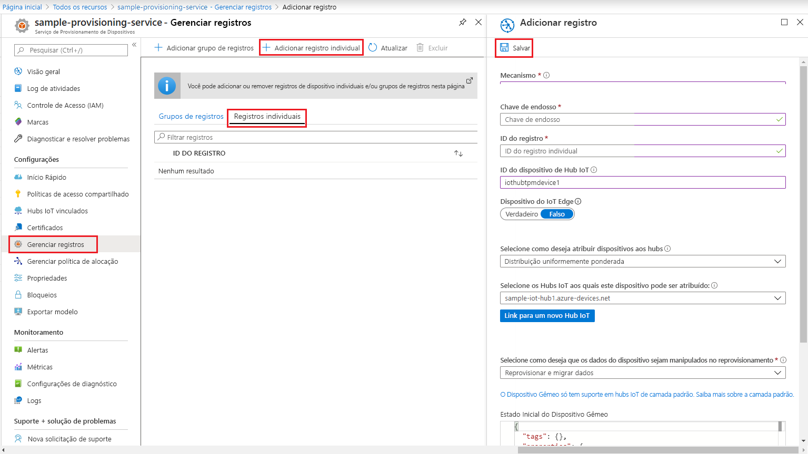

# <a name="quickstart-create-and-provision-a-simulated-tpm-device-using-c-device-sdk-for-iot-hub-device-provisioning-service"></a>Início rápido – Criar e provisionar um dispositivo TPM simulado usando o SDK do dispositivo Java para o Serviço de Provisionamento de Dispositivos no Hub IoT.

[!INCLUDE [iot-dps-selector-quick-create-simulated-device-tpm](../../includes/iot-dps-selector-quick-create-simulated-device-tpm.md)]

Estas etapas mostram como usar [Exemplos de IoT do Azure para C# ](https://github.com/Azure-Samples/azure-iot-samples-csharp) para simular um dispositivo TPM em um computador de desenvolvimento executando o sistema operacional Windows. O exemplo também conecta o dispositivo simulado a um Hub IoT usando o Serviço de Provisionamento de Dispositivos. 

O código de exemplo usa o simulador de TPM do Windows como o [HSM (módulo de segurança de hardware)](https://azure.microsoft.com/blog/azure-iot-supports-new-security-hardware-to-strengthen-iot-security/) do dispositivo. 

Se você não estiver familiarizado com o processo de provisionamento automático, examine a visão geral de [provisionamento](about-iot-dps.md#provisioning-process). Não se esqueça de concluir as etapas em [Configurar o Serviço de Provisionamento de Dispositivos no Hub IoT com o Portal do Azure](./quick-setup-auto-provision.md) antes de continuar. 

O Serviço de Provisionamento de Dispositivos de IoT do Azure dá suporte a dois tipos de registros:

- [Grupos de registros](concepts-service.md#enrollment-group): usados para inscrever vários dispositivos relacionados.
- [Registros individuais](concepts-service.md#individual-enrollment): usados para inscrever um único dispositivo.

Este artigo irá demonstrar registros individuais.

[!INCLUDE [IoT Device Provisioning Service basic](../../includes/iot-dps-basic.md)]

<a id="setupdevbox"></a>
## <a name="prepare-the-development-environment"></a>Preparar o ambiente de desenvolvimento 

1. Verifique se você tem o [SDK do .Net Core 2.1 ou posterior](https://www.microsoft.com/net/download/windows) instalado no computador. 

1. Verifique se o `git` está instalado em seu computador e é adicionado às variáveis de ambiente que podem ser acessadas pela janela de comando. Confira [ferramentas de cliente Git do Software Freedom Conservancy](https://git-scm.com/download/) para obter a versão mais recente das ferramentas `git` a serem instaladas, que inclui o **Git Bash**, o aplicativo de linha de comando que você pode usar para interagir com seu repositório Git local. 

1. Abra um prompt de comando ou o Bash do Git. Clonar Amostras GitHub do Azure IoT para repositório GitHub em C#:

    ```cmd
    git clone https://github.com/Azure-Samples/azure-iot-samples-csharp.git
    ```

## <a name="provision-the-simulated-device"></a>Provisionar o dispositivo simulado

1. Entre no portal do Azure. Selecione o botão **Todos os recursos** no menu esquerdo e abra o Serviço de Provisionamento de Dispositivos. Na folha **Visão geral**, anote o valor de **_Escopo da ID_**.

     

1. Em um prompt de comando, altere os diretórios para o diretório do projeto de exemplo de provisionamento do dispositivo TPM.

    ```cmd
    cd .\azure-iot-samples-csharp\provisioning\Samples\device\TpmSample
    ```

1. Digite o seguinte comando para compilar e executar o exemplo de provisionamento de dispositivo TPM. Substitua o valor `<IDScope>` pelo Escopo da ID do serviço de provisionamento. 

    ```cmd
    dotnet run <IDScope>
    ```

    Esse comando inicializará o simulador do chip do TPM em um prompt de comando separado. No Windows, você pode encontrar um alerta de segurança do Windows que pergunta se você deseja permitir que o Simulator.exe se comunique em redes públicas. Para os fins desta amostra, você pode cancelar a solicitação.

1. A janela Comando original exibe a **_Chave de Endosso_**, a **_ID de Registro_** e uma **_ID do Dispositivo_** sugerida necessárias para registrar o dispositivo. Anote esses valores. Você usará esses valor para criar um registro individual na sua instância do Serviço de Provisionamento de Dispositivos. 
   > [!NOTE]
   > Não confunda a janela que contém a saída do comando com a janela que contém a saída do simulador de TPM. Você precisará clicar na janela Comando original para trazê-la para o primeiro plano.

     

1. No portal do Azure, no menu do Serviço de Provisionamento de Dispositivos, selecione **Gerenciar registros**. Selecione a guia **Registros Individuais** e selecione o botão **Adicionar registro individual** na parte superior. 

1. No painel **Adicionar Registro**, insira as seguintes informações:
   - Selecione **TPM** como o atestado de identidade *Mecanismo*.
   - Insira a *ID de Registro* e *Chave de Endosso* para seu dispositivo do TPM com os valores anotados anteriormente, conforme anotados anteriormente.
   - Selecione um hub IoT vinculado com o serviço de provisionamento.
   - Opcionalmente, você pode fornecer as seguintes informações:
       - Insira uma *ID de Dispositivo* exclusiva (você pode usar a sugerida ou fornecer a sua). Evite dados confidenciais ao nomear seu dispositivo. Se você optar por não fornecer uma, a ID de registro será usada para identificar o dispositivo.
       - Atualize o **Estado inicial do dispositivo gêmeo** com a configuração inicial desejada para o dispositivo.
   - Uma vez concluído, pressione o botão **Salvar**. 

       

   Em caso de registro bem-sucedido, a *ID de Registro* do seu dispositivo será exibida na lista na guia *Registros Individuais*. 

1. Pressione *Enter* na janela Comando (que exibe a **_Chave de Endosso_**, a **_ID de Registro_** e uma **_ID do Dispositivo_** sugerida) para registrar o dispositivo simulado. Observe as mensagens que simulam a inicialização e a conexão do dispositivo com o Serviço de Provisionamento de Dispositivos para obter as informações do Hub IoT. 

1. Verifique se o dispositivo foi provisionado. No provisionamento bem-sucedido do dispositivo simulado para o Hub IoT vinculado ao serviço de provisionamento, a ID do dispositivo aparece na folha **Dispositivos IoT** do hub. 

     

    Se você tiver alterado o *estado de dispositivo gêmeo inicial* do valor padrão na entrada de registro para o seu dispositivo, pode receber o estado desejado duas do hub e agir de acordo. Para saber mais, veja [Noções básicas e uso de dispositivos gêmeos no Hub IoT](../iot-hub/iot-hub-devguide-device-twins.md).

## <a name="clean-up-resources"></a>Limpar os recursos

Se planejar continuar a trabalhar e explorar o dispositivo cliente de exemplo, não limpe os recursos criados neste início rápido. Caso contrário, use as seguintes etapas para excluir todos os recursos criados por este início rápido.

1. Feche a janela de saída de exemplo de dispositivo cliente em seu computador.
1. Feche a janela do simulador do TPM no seu computador.
1. No menu à esquerda no portal do Azure, selecione **Todos os recursos** e selecione o serviço de Provisionamento de Dispositivos. Na parte superior da folha **Visão geral**, pressione **Excluir** na parte superior do painel.  
1. No menu à esquerda no portal do Azure, selecione **Todos os recursos** e seu Hub IoT. Na parte superior da folha **Visão geral**, pressione **Excluir** na parte superior do painel.  

## <a name="next-steps"></a>Próximas etapas

Neste Guia de Início Rápido, você criou um dispositivo simulado TPM no seu computador e o provisionou no Hub IoT usando o Serviço de Provisionamento de Dispositivos no Hub IoT. Para saber como registrar seu dispositivo TPM programaticamente, continue com o Guia de Início Rápido para registro programático de um dispositivo TPM. 

> [!div class="nextstepaction"]
> [Início rápido do Azure – Registrar dispositivo TPM no Serviço de Provisionamento de Dispositivos no Hub IoT do Azure](quick-enroll-device-tpm-csharp.md)
