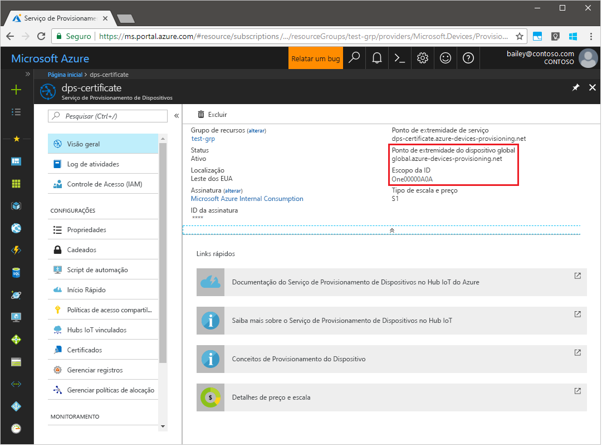
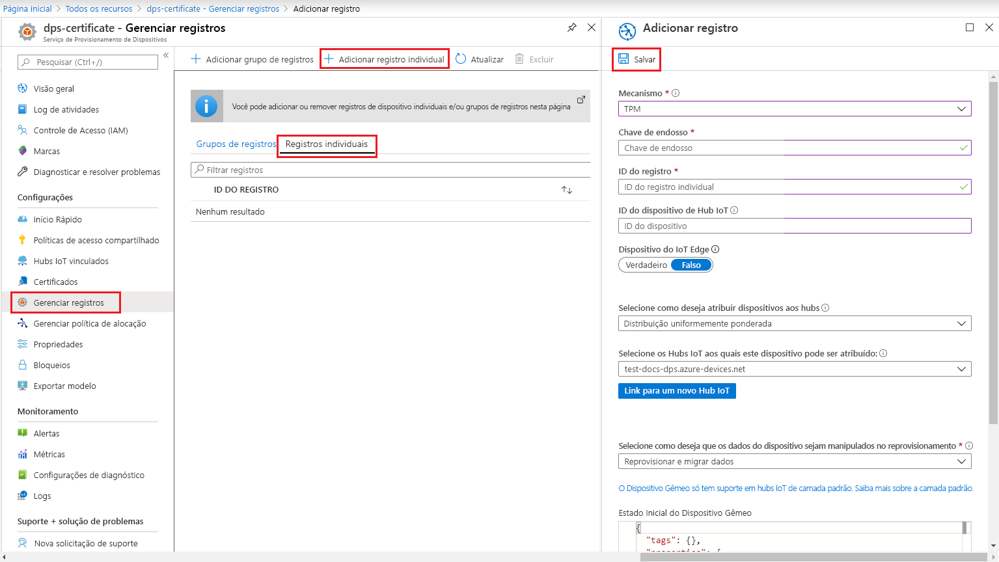

# <a name="quickstart-create-and-provision-a-simulated-tpm-device-using-java-device-sdk-for-azure-iot-hub-device-provisioning-service"></a>Início rápido – Criar e provisionar um dispositivo TPM simulado usando o SDK do dispositivo Java para o Serviço de Provisionamento de Dispositivos no Hub IoT do Azure.

[!INCLUDE [iot-dps-selector-quick-create-simulated-device-tpm](../../includes/iot-dps-selector-quick-create-simulated-device-tpm.md)]

Neste início rápido, você criará um dispositivo IoT simulado em um computador Windows. O dispositivo simulado inclui um simulador de TPM como um HSM (módulo de segurança de hardware). Você usará um código Java de exemplo do dispositivo para conectar esse dispositivo simulado ao hub IoT usando um registro individual com o DPS (Serviço de Provisionamento de Dispositivos).

## <a name="prerequisites"></a>Pré-requisitos

- Familiaridade com os conceitos de [provisionamento](about-iot-dps.md#provisioning-process).
- Conclusão de [Configurar o Serviço de Provisionamento de Dispositivos no Hub IoT com o portal do Azure](./quick-setup-auto-provision.md).
- Uma conta do Azure com uma assinatura ativa. [Crie um gratuitamente](https://azure.microsoft.com/free/?ref=microsoft.com&utm_source=microsoft.com&utm_medium=docs&utm_campaign=visualstudio).
- [Java SE Development Kit 8](/azure/developer/java/fundamentals/java-jdk-long-term-support).
- [Maven](https://maven.apache.org/install.html).
- [Git](https://git-scm.com/download/).

[!INCLUDE [IoT Device Provisioning Service basic](../../includes/iot-dps-basic.md)]

## <a name="prepare-the-environment"></a>Preparar o ambiente 

1. Certifique-se de ter o [Java SE Development Kit 8](/azure/developer/java/fundamentals/java-jdk-long-term-support) instalado no computador.

1. Baixe e instale o [Maven](https://maven.apache.org/install.html).

1. Verifique se o `git` está instalado em seu computador e é adicionado às variáveis de ambiente que podem ser acessadas pela janela de comando. Confira [ferramentas de cliente Git do Software Freedom Conservancy](https://git-scm.com/download/) para obter a versão mais recente das ferramentas `git` a serem instaladas, que inclui o **Git Bash**, o aplicativo de linha de comando que você pode usar para interagir com seu repositório Git local. 

1. Abra um prompt de comando. Clone o repositório do GitHub para obter um exemplo de código de simulação do dispositivo.
    
    ```cmd/sh
    git clone https://github.com/Azure/azure-iot-sdk-java.git --recursive
    ```

1. Execute o simulador de [TPM](/windows/device-security/tpm/trusted-platform-module-overview) para que ele seja o [HSM](https://azure.microsoft.com/blog/azure-iot-supports-new-security-hardware-to-strengthen-iot-security/) para o dispositivo simulado. Clique em **Permitir acesso** para permitir alterações às configurações do _Firewall do Windows_. Ele escuta em um soquete nas portas 2321 e 2322. Não feche essa janela; você precisa manter esse simulador em execução até o término deste guia de início rápido. 

    ```cmd/sh
    .\azure-iot-sdk-java\provisioning\provisioning-tools\tpm-simulator\Simulator.exe
    ```

    

1. Em um prompt de comando separado, navegue até a pasta raiz compile as dependências de exemplo.

    ```cmd/sh
    cd azure-iot-sdk-java
    mvn install -DskipTests=true
    ```

1. Navegue até a pasta de exemplo.

    ```cmd/sh
    cd provisioning/provisioning-samples/provisioning-tpm-sample
    ```

1. Entre no portal do Azure, selecione o botão **Todos os recursos** no menu esquerdo e abra o serviço de Provisionamento de Dispositivos. Tome nota de seu _Escopo da ID_ e _Ponto de Extremidade Global do Serviço de Provisionamento_.

    

1. Edite `src/main/java/samples/com/microsoft/azure/sdk/iot/ProvisioningTpmSample.java` para incluir o _Escopo da ID_ e o _Ponto de Extremidade Global do Serviço de Provisionamento_ conforme anotado antes.  

    ```java
    private static final String idScope = "[Your ID scope here]";
    private static final String globalEndpoint = "[Your Provisioning Service Global Endpoint here]";
    private static final ProvisioningDeviceClientTransportProtocol PROVISIONING_DEVICE_CLIENT_TRANSPORT_PROTOCOL = ProvisioningDeviceClientTransportProtocol.HTTPS;
    ```
    Salve o arquivo.

1. Use os comandos a seguir para compilar o projeto, navegue até a pasta de destino e execute o arquivo .jar criado. Substitua o espaço reservado `version` pela sua versão do Java.

    ```cmd/sh
    mvn clean install
    cd target
    java -jar ./provisioning-tpm-sample-{version}-with-deps.jar
    ```

1. A execução do programa é iniciada. Tome nota da _Chave de endosso_ e a _ID de registro_ para a próxima seção e deixe o programa em execução.

    
    

## <a name="create-a-device-enrollment-entry"></a>Criar uma entrada de registro de dispositivo

O Serviço de Provisionamento de Dispositivos de IoT do Azure dá suporte a dois tipos de registros:

- [Grupos de registros](concepts-service.md#enrollment-group): usados para inscrever vários dispositivos relacionados.
- [Registros individuais](concepts-service.md#individual-enrollment): usados para inscrever um único dispositivo.

Este artigo vai demonstrar o uso de registros individuais.

1. Entre no portal do Azure, selecione o botão **Todos os recursos** no menu esquerdo e abra o serviço de Provisionamento de Dispositivos.

1. No menu do Serviço de Provisionamento de Dispositivos, selecione **Gerenciar registros**. Selecione a guia **Registros Individuais** e, em seguida, selecione o botão **Adicionar registro individual**, na parte superior. 

1. No painel **Adicionar Registro**, insira as seguintes informações:
   - Selecione **TPM** como o atestado de identidade *Mecanismo*.
   - Insira a *ID de Registro* e *Chave de Endosso* para seu dispositivo do TPM com os valores anotados anteriormente, conforme anotados anteriormente.
   - Selecione um hub IoT vinculado com o serviço de provisionamento.
   - Opcionalmente, você pode fornecer as seguintes informações:
       - Insira uma *ID de Dispositivo* exclusiva. Evite dados confidenciais ao nomear seu dispositivo. Se você optar por não fornecer uma, a ID de registro será usada para identificar o dispositivo.
       - Atualize o **Estado inicial do dispositivo gêmeo** com a configuração inicial desejada para o dispositivo.
   - Uma vez concluído, pressione o botão **Salvar**. 

       

   Em caso de registro bem-sucedido, a *ID de Registro* do seu dispositivo é exibida na lista na guia *Registros Individuais*. 


## <a name="simulate-the-device"></a>Simular o dispositivo

1. Na janela Comando que executa o código de exemplo do Java em seu computador, pressione *Enter* para continuar a execução do aplicativo. Observe as mensagens que simulam a inicialização e a conexão do dispositivo com o Serviço de Provisionamento de Dispositivos para obter as informações do Hub IoT.  

    

1. No provisionamento bem-sucedido do dispositivo simulado para o Hub IoT vinculado ao serviço de provisionamento, a ID do dispositivo aparece na folha **Dispositivos IOT** do hub.

     

    Se você tiver alterado o *estado de dispositivo gêmeo inicial* do valor padrão na entrada de registro para o seu dispositivo, pode receber o estado desejado duas do hub e agir de acordo. Para saber mais, veja [Noções básicas e uso de dispositivos gêmeos no Hub IoT](../iot-hub/iot-hub-devguide-device-twins.md).


## <a name="clean-up-resources"></a>Limpar os recursos

Se planejar continuar a trabalhar e explorar o dispositivo cliente de exemplo, não limpe os recursos criados neste início rápido. Caso contrário, use as seguintes etapas para excluir todos os recursos criados por este início rápido.

1. Feche a janela de saída de exemplo de dispositivo cliente em seu computador.
1. Feche a janela do simulador do TPM no seu computador.
1. No menu à esquerda no portal do Azure, selecione **Todos os recursos** e selecione o serviço de Provisionamento de Dispositivos. Abra a folha **Gerenciar Registros** do seu serviço e selecione a guia **Registros Individuais**. Marque a caixa de seleção ao lado da *ID DE REGISTRO* do dispositivo registrado neste início rápido e pressione o botão **Excluir**, na parte superior do painel. 
1. No menu à esquerda no portal do Azure, selecione **Todos os recursos** e seu Hub IoT. Abra a folha **Dispositivos IoT** do hub, marque a caixa de seleção ao lado da *ID DO DISPOSITIVO* registrado neste início rápido e pressione o botão **Excluir**, na parte superior do painel.

## <a name="next-steps"></a>Próximas etapas

Neste Guia de Início Rápido, você criou um dispositivo simulado TPM no seu computador e o provisionou no Hub IoT usando o Serviço de Provisionamento de Dispositivos no Hub IoT. Para saber como registrar seu dispositivo TPM programaticamente, continue com o Guia de Início Rápido para registro programático de um dispositivo TPM. 

> [!div class="nextstepaction"]
> [Início rápido do Azure – Registrar dispositivo TPM no Serviço de Provisionamento de Dispositivos no Hub IoT do Azure](quick-enroll-device-tpm-java.md)