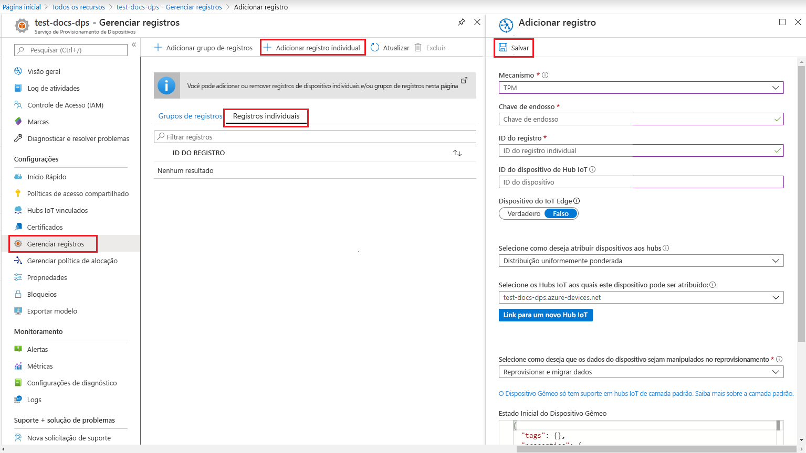
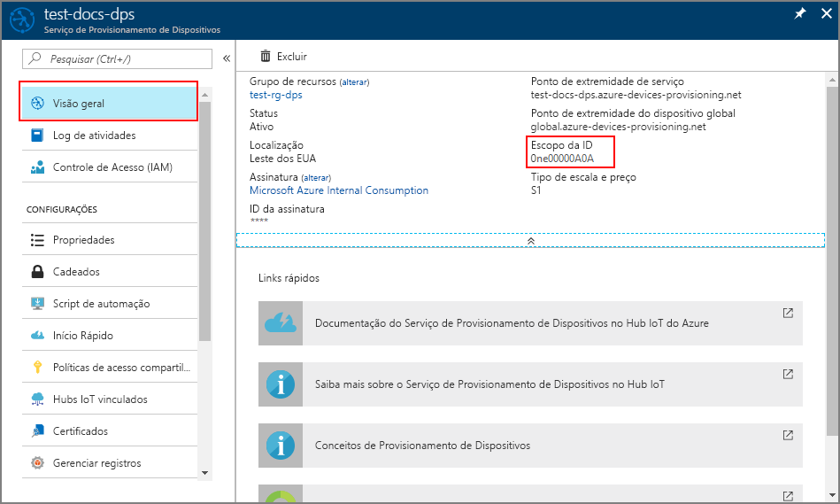

# <a name="quickstart-create-and-provision-a-simulated-tpm-device-using-nodejs-device-sdk-for-iot-hub-device-provisioning-service"></a>Início Rápido: Criar e provisionar um dispositivo TPM simulado usando o Node.js do SDK do dispositivo Python para o Serviço de Provisionamento de Dispositivos no Hub IoT

[!INCLUDE [iot-dps-selector-quick-create-simulated-device-tpm](../../includes/iot-dps-selector-quick-create-simulated-device-tpm.md)]

Neste início rápido, você criará um dispositivo IoT simulado em um computador Windows. O dispositivo simulado inclui um simulador de TPM como um HSM (módulo de segurança de hardware). Você usará um código Node.js de exemplo do dispositivo para conectar esse dispositivo simulado ao hub IoT usando um registro individual com o DPS (Serviço de Provisionamento de Dispositivos).

## <a name="prerequisites"></a>Pré-requisitos

- Familiaridade com os conceitos de [provisionamento](about-iot-dps.md#provisioning-process).
- Conclusão de [Configurar o Serviço de Provisionamento de Dispositivos no Hub IoT com o portal do Azure](./quick-setup-auto-provision.md).
- Uma conta do Azure com uma assinatura ativa. [Crie um gratuitamente](https://azure.microsoft.com/free/?ref=microsoft.com&utm_source=microsoft.com&utm_medium=docs&utm_campaign=visualstudio).
- [Node.js v4.0 e posterior](https://nodejs.org).
- [Git](https://git-scm.com/download/).

[!INCLUDE [IoT Device Provisioning Service basic](../../includes/iot-dps-basic.md)]

## <a name="prepare-the-environment"></a>Preparar o ambiente 

1. Verifique se o [Node.js v4.0 ou superior](https://nodejs.org) está instalado no computador.

1. Verifique se o `git` está instalado em seu computador e é adicionado às variáveis de ambiente que podem ser acessadas pela janela de comando. Confira [ferramentas de cliente Git do Software Freedom Conservancy](https://git-scm.com/download/) para obter a versão mais recente das ferramentas `git` a serem instaladas, que inclui o **Git Bash**, o aplicativo de linha de comando que você pode usar para interagir com seu repositório Git local. 


## <a name="simulate-a-tpm-device"></a>Simular um dispositivo TPM

1. Abra um prompt de comando ou o Bash do Git. Clone o repositório GitHub `azure-utpm-c`:
    
    ```cmd/sh
    git clone https://github.com/Azure/azure-utpm-c.git --recursive
    ```

1. Navegue até a pasta raiz do GitHub e execute o simulador de [TPM](/windows/device-security/tpm/trusted-platform-module-overview) para que ele seja o [HSM](https://azure.microsoft.com/blog/azure-iot-supports-new-security-hardware-to-strengthen-iot-security/) para o dispositivo simulado. Ele escuta em um soquete nas portas 2321 e 2322. Não feche essa janela Comando; você precisa manter esse simulador em execução até o término deste início rápido: 

    ```cmd/sh
    .\azure-utpm-c\tools\tpm_simulator\Simulator.exe
    ```

1. Crie uma nova pasta vazia denominada **registerdevice**. Na pasta **registerdevice**, crie um arquivo package.json usando o comando a seguir no seu prompt de comando. Verifique se você respondeu a todas as perguntas feitas por `npm` ou aceite os padrões se eles forem adequados a você:
   
    ```cmd/sh
    npm init
    ```

1. Instale os seguintes pacotes precursores:

    ```cmd/sh
    npm install node-gyp -g
    npm install ffi -g
    ```

    > [!NOTE]
    > Há alguns problemas conhecidos ao instalar os pacotes acima. Para resolver esses problemas, execute `npm install --global --production windows-build-tools` usando um prompt de comando no modo **Executar como administrador**, execute `SET VCTargetsPath=C:\Program Files (x86)\MSBuild\Microsoft.Cpp\v4.0\V140` depois de substituir o caminho com sua versão instalada e execute novamente os comandos de instalação acima.
    >

1. Instale os pacotes a seguir que contêm os componentes usados durante o registro:

   - um cliente de segurança que funciona com TPM: `azure-iot-security-tpm`
   - um transporte para o dispositivo para se conectar ao Serviço de provisionamento do dispositivo: `azure-iot-provisioning-device-http` ou `azure-iot-provisioning-device-amqp`
   - um cliente para usar o cliente de transporte e segurança: `azure-iot-provisioning-device`

     Assim que o dispositivo estiver registrado, é possível usar os pacotes usuais de cliente do dispositivo Hub IoT para conectar o dispositivo usando as credenciais fornecidas durante o registro. Serão necessários:

   - o cliente do dispositivo: `azure-iot-device`
   - um transporte: qualquer um entre `azure-iot-device-amqp`, `azure-iot-device-mqtt` ou `azure-iot-device-http`
   - o cliente de segurança já instalado por você: `azure-iot-security-tpm`

     > [!NOTE]
     > Os exemplos a seguir usam os transportes `azure-iot-provisioning-device-http` e `azure-iot-device-mqtt`.
     > 

     Você pode instalar todos esses pacotes simultaneamente executando o seguinte comando no prompt de comando na pasta **registerdevice**:

       ```cmd/sh
       npm install --save azure-iot-device azure-iot-device-mqtt azure-iot-security-tpm azure-iot-provisioning-device-http azure-iot-provisioning-device
       ```

1. Usando um editor de texto, crie um novo arquivo **ExtractDevice.js** na pasta **registerdevice**.

1. Adicione as seguintes instruções `require` no início do arquivo **ExtractDevice.js**:
   
    ```
    'use strict';

    var tpmSecurity = require('azure-iot-security-tpm');
    var tssJs = require("tss.js");

    var myTpm = new tpmSecurity.TpmSecurityClient(undefined, new tssJs.Tpm(true));
    ```

1. Adicione a seguinte função para implementar o método:
   
    ```
    myTpm.getEndorsementKey(function(err, endorsementKey) {
      if (err) {
        console.log('The error returned from get key is: ' + err);
      } else {
        console.log('the endorsement key is: ' + endorsementKey.toString('base64'));
        myTpm.getRegistrationId((getRegistrationIdError, registrationId) => {
          if (getRegistrationIdError) {
            console.log('The error returned from get registration id is: ' + getRegistrationIdError);
          } else {
            console.log('The Registration Id is: ' + registrationId);
            process.exit();
          }
        });
      }
    });
    ```

1. Salve e feche o arquivo **ExtractDevice.js**. Execute o exemplo:

    ```cmd/sh
    node ExtractDevice.js
    ```

1. A janela de Saída exibe a **_Chave do endosso_** e a **_ID de registro_** necessárias para registrar o dispositivo. Anote esses valores. 


## <a name="create-a-device-entry"></a>Criar uma entrada de dispositivo

O Serviço de Provisionamento de Dispositivos de IoT do Azure dá suporte a dois tipos de registros:

- [Grupos de registros](concepts-service.md#enrollment-group): usados para inscrever vários dispositivos relacionados.
- [Registros individuais](concepts-service.md#individual-enrollment): usados para inscrever um único dispositivo.

Este artigo vai demonstrar o uso de registros individuais.

1. Entre no portal do Azure, selecione o botão **Todos os recursos** no menu esquerdo e abra o serviço de Provisionamento de Dispositivos.

1. No menu do Serviço de Provisionamento de Dispositivos, selecione **Gerenciar registros**. Selecione a guia **Registros Individuais** e, em seguida, selecione o botão **Adicionar registro individual**, na parte superior. 

1. No painel **Adicionar Registro**, insira as seguintes informações:
   - Selecione **TPM** como o atestado de identidade *Mecanismo*.
   - Insira a *ID de Registro* e *Chave de Endosso* para seu dispositivo do TPM com os valores anotados anteriormente, conforme anotados anteriormente.
   - Selecione um hub IoT vinculado com o serviço de provisionamento.
   - Opcionalmente, você pode fornecer as seguintes informações:
       - Insira uma *ID de Dispositivo* exclusiva. Evite dados confidenciais ao nomear seu dispositivo. Se você optar por não fornecer uma, a ID de registro será usada para identificar o dispositivo.
       - Atualize o **Estado inicial do dispositivo gêmeo** com a configuração inicial desejada para o dispositivo.
   - Uma vez concluído, pressione o botão **Salvar**. 

       

   Em caso de registro bem-sucedido, a *ID de Registro* do seu dispositivo é exibida na lista na guia *Registros Individuais*. 


## <a name="register-the-device"></a>Registrar o dispositivo

1. No portal do Azure, selecione a folha **Visão Geral** do seu Serviço de Provisionamento de Dispositivos e anote os valores de **_Ponto de Extremidade do Dispositivo Global_** e **_Escopo de ID_** .

     

1. Usando um editor de texto, crie um novo arquivo **RegisterDevice.js** na pasta **registerdevice**.

1. Adicione as seguintes instruções `require` no início do arquivo **RegisterDevice.js**:
   
    ```
    'use strict';

    var ProvisioningTransport = require('azure-iot-provisioning-device-http').Http;
    var iotHubTransport = require('azure-iot-device-mqtt').Mqtt;
    var Client = require('azure-iot-device').Client;
    var Message = require('azure-iot-device').Message;
    var tpmSecurity = require('azure-iot-security-tpm');
    var ProvisioningDeviceClient = require('azure-iot-provisioning-device').ProvisioningDeviceClient;
    ```

    > [!NOTE]
    > O **SDK do IoT do Azure para Node.js** oferece suporte a protocolos adicionais como _AMQP_, _AMQP WS_ e _MQTT WS_.  Para obter mais exemplos, consulte [SDK do serviço de provisionamento de dispositivos para obter exemplos de Node.js](https://github.com/Azure/azure-iot-sdk-node/tree/master/provisioning/device/samples).
    > 

1. Adicione as variáveis **globalDeviceEndpoint** e **idScope** e use-as para criar uma instância **ProvisioningDeviceClient**. Substitua **{globalDeviceEndpoint}** e **{idScope}** pelos valores **_Ponto de Extremidade do Dispositivo Global_** e **_Escopo da ID_** da **Etapa 1**:
   
    ```
    var provisioningHost = '{globalDeviceEndpoint}';
    var idScope = '{idScope}';

    var tssJs = require("tss.js");
    var securityClient = new tpmSecurity.TpmSecurityClient('', new tssJs.Tpm(true));
    // if using non-simulated device, replace the above line with following:
    //var securityClient = new tpmSecurity.TpmSecurityClient();

    var provisioningClient = ProvisioningDeviceClient.create(provisioningHost, idScope, new ProvisioningTransport(), securityClient);
    ```

1. Adicione a seguinte função para implementar o método no dispositivo:
   
    ```
    provisioningClient.register(function(err, result) {
      if (err) {
        console.log("error registering device: " + err);
      } else {
        console.log('registration succeeded');
        console.log('assigned hub=' + result.registrationState.assignedHub);
        console.log('deviceId=' + result.registrationState.deviceId);
        var tpmAuthenticationProvider = tpmSecurity.TpmAuthenticationProvider.fromTpmSecurityClient(result.registrationState.deviceId, result.registrationState.assignedHub, securityClient);
        var hubClient = Client.fromAuthenticationProvider(tpmAuthenticationProvider, iotHubTransport);

        var connectCallback = function (err) {
          if (err) {
            console.error('Could not connect: ' + err.message);
          } else {
            console.log('Client connected');
            var message = new Message('Hello world');
            hubClient.sendEvent(message, printResultFor('send'));
          }
        };

        hubClient.open(connectCallback);

        function printResultFor(op) {
          return function printResult(err, res) {
            if (err) console.log(op + ' error: ' + err.toString());
            if (res) console.log(op + ' status: ' + res.constructor.name);
            process.exit(1);
          };
        }
      }
    });
    ```

1. Salve e feche o arquivo **RegisterDevice.js**. Execute o exemplo:

    ```cmd/sh
    node RegisterDevice.js
    ```

1. Observe as mensagens que simulam a inicialização e a conexão do dispositivo com o Serviço de Provisionamento de Dispositivos para obter as informações do Hub IoT. No provisionamento bem-sucedido do dispositivo simulado para o Hub IoT vinculado ao serviço de provisionamento, a ID do dispositivo aparece na folha **Dispositivos IOT** do hub. 

     

    Se você tiver alterado o *estado de dispositivo gêmeo inicial* do valor padrão na entrada de registro para o seu dispositivo, pode receber o estado desejado duas do hub e agir de acordo. Para saber mais, veja [Noções básicas e uso de dispositivos gêmeos no Hub IoT](../iot-hub/iot-hub-devguide-device-twins.md)


## <a name="clean-up-resources"></a>Limpar os recursos

Se planejar continuar a trabalhar e explorar o dispositivo cliente de exemplo, não limpe os recursos criados neste início rápido. Caso contrário, use as seguintes etapas para excluir todos os recursos criados por este início rápido.

1. Feche a janela de saída de exemplo de dispositivo cliente em seu computador.
1. Feche a janela do simulador do TPM no seu computador.
1. No menu à esquerda no portal do Azure, selecione **Todos os recursos** e selecione o serviço de Provisionamento de Dispositivos. Abra a folha **Gerenciar Registros** do seu serviço e selecione a guia **Registros Individuais**. Marque a caixa de seleção ao lado da *ID DE REGISTRO* do dispositivo registrado neste início rápido e pressione o botão **Excluir**, na parte superior do painel. 
1. No menu à esquerda no portal do Azure, selecione **Todos os recursos** e seu Hub IoT. Abra a folha **Dispositivos IoT** do hub, marque a caixa de seleção ao lado da *ID DO DISPOSITIVO* registrado neste início rápido e pressione o botão **Excluir**, na parte superior do painel.


## <a name="next-steps"></a>Próximas etapas

Neste Guia de Início Rápido, você criou um dispositivo simulado TPM no seu computador e o provisionou no Hub IoT usando o Serviço de Provisionamento de Dispositivos no Hub IoT. Para saber como registrar seu dispositivo TPM programaticamente, continue com o Guia de Início Rápido para registro programático de um dispositivo TPM. 

> [!div class="nextstepaction"]
> [Início rápido do Azure – Registrar dispositivo TPM no Serviço de Provisionamento de Dispositivos no Hub IoT do Azure](quick-enroll-device-tpm-node.md)