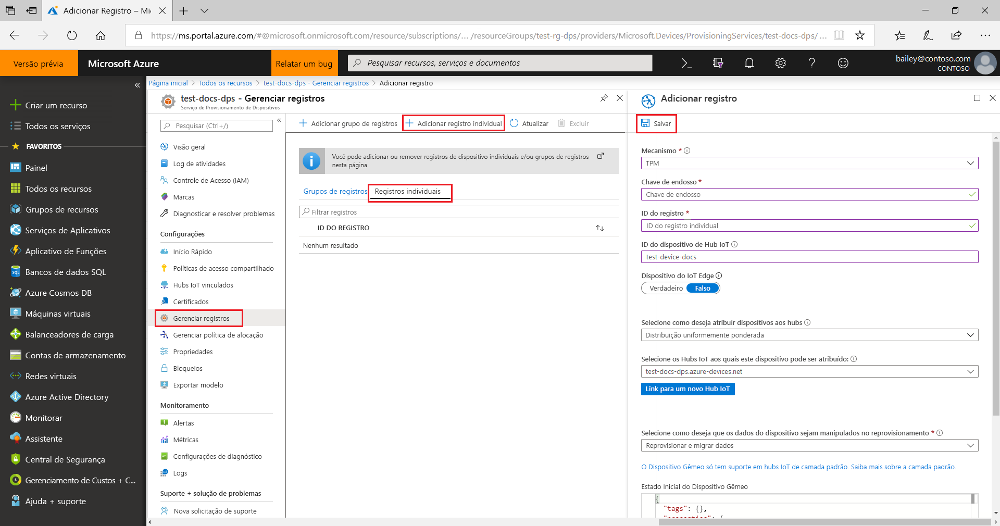
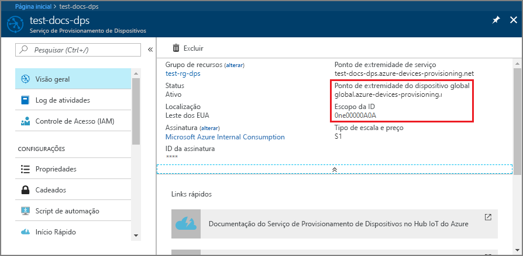

# <a name="quickstart-create-and-provision-a-simulated-tpm-device-using-python-device-sdk-for-iot-hub-device-provisioning-service"></a>Início Rápido – Criar e provisionar um dispositivo X.509 simulado usando o SDK de dispositivo Python para o Serviço de Provisionamento de Dispositivos no Hub IoT.

[!INCLUDE [iot-dps-selector-quick-create-simulated-device-tpm](../../includes/iot-dps-selector-quick-create-simulated-device-tpm.md)]

Neste início rápido, você criará um dispositivo IoT simulado em um computador Windows. O dispositivo simulado inclui um simulador de TPM como um HSM (módulo de segurança de hardware). Você usará um código Python de exemplo do dispositivo para conectar esse dispositivo simulado ao hub IoT usando um registro individual com o DPS (Serviço de Provisionamento de Dispositivos).

## <a name="prerequisites"></a>Pré-requisitos

- Familiaridade com os conceitos de [provisionamento](about-iot-dps.md#provisioning-process).
- Conclusão de [Configurar o Serviço de Provisionamento de Dispositivos no Hub IoT com o portal do Azure](./quick-setup-auto-provision.md).
- Uma conta do Azure com uma assinatura ativa. [Crie um gratuitamente](https://azure.microsoft.com/free/?ref=microsoft.com&utm_source=microsoft.com&utm_medium=docs&utm_campaign=visualstudio).
- [Visual Studio 2015 e posterior](https://visualstudio.microsoft.com/vs/) com o Desenvolvimento para desktop com C++.
- [Sistema de build CMake](https://cmake.org/download/).
- [Git](https://git-scm.com/download/).

> [!IMPORTANT]
> Este artigo aplica-se apenas ao SDK do Python V1 preterido. Os clientes de dispositivo e serviço para o Serviço de Provisionamento de Dispositivos no Hub IoT ainda não estão disponíveis na V2. Atualmente, a equipe está empenhada no trabalho de levar a V2 à paridade de recursos.

[!INCLUDE [IoT Device Provisioning Service basic](../../includes/iot-dps-basic.md)]

## <a name="prepare-the-environment"></a>Preparar o ambiente 

1. Verifique se instalou o [Visual Studio](https://visualstudio.microsoft.com/vs/) 2015 ou posterior com a carga de trabalho "Desenvolvimento de área de trabalho com C++" habilitada para sua instalação do Visual Studio.

1. Baixe e instale o [sistema de compilação CMake](https://cmake.org/download/).

1. Verifique se o `git` está instalado em seu computador e é adicionado às variáveis de ambiente que podem ser acessadas pela janela de comando. Confira [ferramentas de cliente Git do Software Freedom Conservancy](https://git-scm.com/download/) para obter a versão mais recente das ferramentas `git` a serem instaladas, que inclui o **Git Bash**, o aplicativo de linha de comando que você pode usar para interagir com seu repositório Git local. 

1. Abra um prompt de comando ou o Bash do Git. Clone o repositório do GitHub para obter exemplo de código de simulação do dispositivo:
    
    ```cmd/sh
    git clone --single-branch --branch v1-deprecated https://github.com/Azure/azure-iot-sdk-python.git --recursive
    ```

1. Crie uma pasta em sua cópia local do repositório GitHub para o processo de compilação do CMake. 

    ```cmd/sh
    cd azure-iot-sdk-python/c
    mkdir cmake
    cd cmake
    ```

1. O exemplo de código usa um simulador do TPM do Windows. Execute o comando a seguir para habilitar a autenticação de token SAS. Ele também gera uma solução do Visual Studio para o dispositivo simulado.

    ```cmd/sh
    cmake -Duse_prov_client:BOOL=ON -Duse_tpm_simulator:BOOL=ON ..
    ```

1. Em um prompt de comando separado, navegue até a pasta do simulador de [TPM](/windows/device-security/tpm/trusted-platform-module-overview) e execute-o para que ele seja o [HSM](https://azure.microsoft.com/blog/azure-iot-supports-new-security-hardware-to-strengthen-iot-security/) para o dispositivo simulado. Clique em **Permitir Acesso**. Ele escuta em um soquete nas portas 2321 e 2322. Não feche essa janela Comando; você precisará manter esse simulador em execução até o término deste guia de início rápido. 

    ```cmd/sh
    .\azure-iot-sdk-python\c\provisioning_client\deps\utpm\tools\tpm_simulator\Simulator.exe
    ```

    


## <a name="create-a-device-enrollment-entry"></a>Criar uma entrada de registro de dispositivo

O Serviço de Provisionamento de Dispositivos de IoT do Azure dá suporte a dois tipos de registros:

- [Grupos de registros](concepts-service.md#enrollment-group): usados para inscrever vários dispositivos relacionados.
- [Registros individuais](concepts-service.md#individual-enrollment): usados para inscrever um único dispositivo.

Este artigo vai demonstrar o uso de registros individuais.

1. Abra a solução gerada na pasta *cmake* denominada `azure_iot_sdks.sln`e compile-a no Visual Studio.

1. Clique com botão direito do mouse no projeto **tpm_device_provision** e selecione **Definir como Projeto de Inicialização**. Execute a solução. A janela de Saída exibe a **_Chave do endosso_** e a **_ID de registro_** necessárias para registrar o dispositivo. Anote esses valores. 

    

1. Entre no portal do Azure, selecione o botão **Todos os recursos** no menu esquerdo e abra o serviço de Provisionamento de Dispositivos.

1. No menu do Serviço de Provisionamento de Dispositivos, selecione **Gerenciar registros**. Selecione a guia **Registros Individuais** e, em seguida, selecione o botão **Adicionar registro individual**, na parte superior. 

1. No painel **Adicionar Registro**, insira as seguintes informações:
   - Selecione **TPM** como o atestado de identidade *Mecanismo*.
   - Insira a *ID de Registro* e *Chave de Endosso* para seu dispositivo do TPM com os valores anotados anteriormente, conforme anotados anteriormente.
   - Selecione um hub IoT vinculado com o serviço de provisionamento.
   - Opcionalmente, você pode fornecer as seguintes informações:
       - Insira uma *ID de Dispositivo* exclusiva. Evite dados confidenciais ao nomear seu dispositivo. Se você optar por não fornecer uma, a ID de registro será usada para identificar o dispositivo.
       - Atualize o **Estado inicial do dispositivo gêmeo** com a configuração inicial desejada para o dispositivo.
   - Uma vez concluído, pressione o botão **Salvar**. 

       

   Em caso de registro bem-sucedido, a *ID de Registro* do seu dispositivo será exibida na lista na guia *Registros Individuais*. 


## <a name="simulate-the-device"></a>Simular o dispositivo

1. Baixe e instale o [Python 2.x ou 3.x](https://www.python.org/downloads/). Certifique-se de usar a instalação de 32 bits ou 64 bits conforme exigido pelo seu programa de instalação. Quando solicitado durante a instalação, certifique-se de adicionar Python às variáveis de ambiente específica da plataforma.
    - Se você está usando o sistema operacional Windows, o [Pacote redistribuível do Visual C++](https://support.microsoft.com/help/2977003/the-latest-supported-visual-c-downloads) permite o uso de DLLs nativas do Python.

1. Execute [estas instruções](https://github.com/Azure/azure-iot-sdk-python/blob/v1-deprecated/doc/python-devbox-setup.md) para compilar os pacotes do Python.

   > [!NOTE]
   > Se estiver executando o `build_client.cmd`, use o sinalizador `--use-tpm-simulator`.
   > 
   > [!NOTE]
   > Se usar `pip`, certifique-se de também instalar o pacote `azure-iot-provisioning-device-client`. Observe que os pacotes de PIP estão usando o TPM real, não o simulador. Para usar o simulador, você precisa compilar do código-fonte usando o sinalizador `--use-tpm-simulator`.

1. Navegue até a pasta de amostras.

    ```cmd/sh
    cd azure-iot-sdk-python/provisioning_device_client/samples
    ```

1. Usando o IDE do Python, edite o script python chamado **provisionamento\_dispositivo\_cliente\_sample.py**. Modifique as variáveis *GLOBAL\_PROV\_URI* e *ID\_SCOPE* para os valores observados anteriormente. Verifique também se *SECURITY\_DEVICE\_TYPE* está definido como `ProvisioningSecurityDeviceType.TPM`

    ```python
    GLOBAL_PROV_URI = "{globalServiceEndpoint}"
    ID_SCOPE = "{idScope}"
    SECURITY_DEVICE_TYPE = ProvisioningSecurityDeviceType.TPM
    PROTOCOL = ProvisioningTransportProvider.HTTP
    ```

    

1. Execute o exemplo. 

    ```cmd/sh
    python provisioning_device_client_sample.py
    ```

1. Observe as mensagens que simulam a inicialização e a conexão do dispositivo com o Serviço de Provisionamento de Dispositivos para obter as informações do Hub IoT. 

    

1. No provisionamento bem-sucedido do dispositivo simulado para o Hub IoT vinculado ao serviço de provisionamento, a ID do dispositivo aparece na folha **Dispositivos IOT** do hub.

     

    Se você tiver alterado o *estado de dispositivo gêmeo inicial* do valor padrão na entrada de registro para o seu dispositivo, pode receber o estado desejado duas do hub e agir de acordo. Para saber mais, veja [Noções básicas e uso de dispositivos gêmeos no Hub IoT](../iot-hub/iot-hub-devguide-device-twins.md)


## <a name="clean-up-resources"></a>Limpar os recursos

Se planejar continuar a trabalhar e explorar o dispositivo cliente de exemplo, não limpe os recursos criados neste início rápido. Caso contrário, use as seguintes etapas para excluir todos os recursos criados por este início rápido.

1. Feche a janela de saída de exemplo de dispositivo cliente em seu computador.
1. Feche a janela do simulador do TPM no seu computador.
1. No menu à esquerda no portal do Azure, selecione **Todos os recursos** e selecione o serviço de Provisionamento de Dispositivos. Abra a folha **Gerenciar Registros** do seu serviço e selecione a guia **Registros Individuais**. Marque a caixa de seleção ao lado da *ID DE REGISTRO* do dispositivo registrado neste início rápido e pressione o botão **Excluir**, na parte superior do painel. 
1. No menu à esquerda no portal do Azure, selecione **Todos os recursos** e seu Hub IoT. Abra a folha **Dispositivos IoT** do hub, marque a caixa de seleção ao lado da *ID DO DISPOSITIVO* registrado neste início rápido e pressione o botão **Excluir**, na parte superior do painel.

## <a name="next-steps"></a>Próximas etapas

Neste Guia de Início Rápido, você criou um dispositivo simulado TPM no seu computador e o provisionou no Hub IoT usando o Serviço de Provisionamento de Dispositivos no Hub IoT. Para saber como registrar seu dispositivo TPM programaticamente, continue com o Guia de Início Rápido para registro programático de um dispositivo TPM. 

> [!div class="nextstepaction"]
> [Início rápido do Azure – Registrar dispositivo TPM no Serviço de Provisionamento de Dispositivos no Hub IoT do Azure](quick-enroll-device-tpm-python.md)