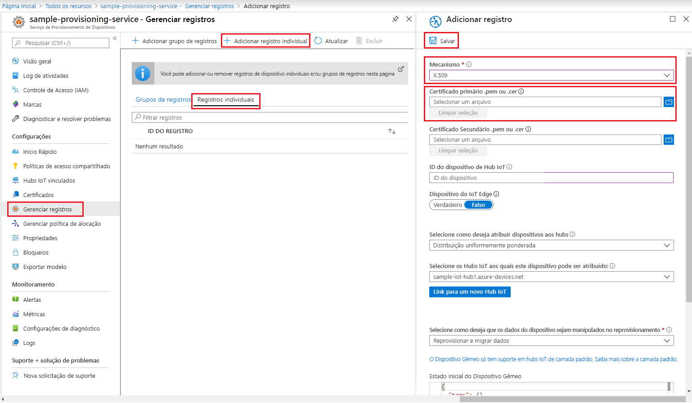
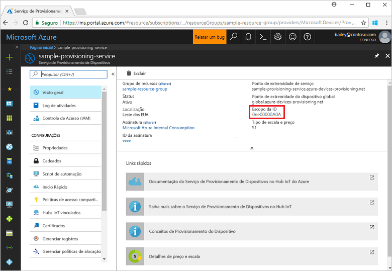

# <a name="quickstart-create-and-provision-an-x509-device-using-c-device-sdk-for-iot-hub-device-provisioning-service"></a>Início rápido: Criar e provisionar um dispositivo X.509 usando o SDK do dispositivo C# para o Serviço de Provisionamento de Dispositivos no Hub IoT

[!INCLUDE [iot-dps-selector-quick-create-simulated-device-x509](../../includes/iot-dps-selector-quick-create-simulated-device-x509.md)]

Estas etapas mostram como usar o código do dispositivo dos [Exemplos de IoT do Azure para C#](https://github.com/Azure-Samples/azure-iot-samples-csharp) para provisionar um dispositivo X.509. Neste artigo, você executará o código de exemplo do dispositivo no computador de desenvolvimento para se conectar a um Hub IoT usando o Serviço de Provisionamento de Dispositivos.

## <a name="prerequisites"></a>Pré-requisitos

Se você não estiver familiarizado com o processo de provisionamento automático, examine a visão geral de [provisionamento](about-iot-dps.md#provisioning-process). Não se esqueça de concluir as etapas em [Configurar o Serviço de Provisionamento de Dispositivos no Hub IoT com o Portal do Azure](./quick-setup-auto-provision.md) antes de continuar.

O Serviço de Provisionamento de Dispositivos de IoT do Azure dá suporte a dois tipos de registros:
- [Grupos de registros](concepts-service.md#enrollment-group): usados para inscrever vários dispositivos relacionados.
- [Registros individuais](concepts-service.md#individual-enrollment): usados para inscrever um único dispositivo.

Este artigo irá demonstrar registros individuais.

[!INCLUDE [IoT Device Provisioning Service basic](../../includes/iot-dps-basic.md)]

<a id="setupdevbox"></a>
## <a name="prepare-the-development-environment"></a>Preparar o ambiente de desenvolvimento 

1. Verifique se o `git` está instalado em seu computador e é adicionado às variáveis de ambiente que podem ser acessadas pela janela de comando. Confira [ferramentas de cliente Git do Software Freedom Conservancy](https://git-scm.com/download/) para obter a versão mais recente das ferramentas `git` a serem instaladas, que inclui o **Git Bash**, o aplicativo de linha de comando que você pode usar para interagir com seu repositório Git local. 

1. Abra um prompt de comando ou o Bash do Git. Clonar Amostras GitHub do Azure IoT para repositório GitHub em C#:
    
    ```bash
    git clone https://github.com/Azure-Samples/azure-iot-samples-csharp.git
    ```

1. Verifique se você tem o [SDK do .NET Core 3.0.0 ou posterior](https://www.microsoft.com/net/download/windows) instalado no computador. Use o comando a seguir para verificar a versão.

    ```bash
    dotnet --info
    ```

## <a name="create-a-self-signed-x509-device-certificate"></a>Criar um certificado de dispositivo X.509 autoassinado

Nesta seção, você criará um certificado de teste X.509 autoassinado usando `iothubx509device1` como o nome comum da entidade. É importante ter em mente os seguintes pontos:

* Os certificados autoassinados são somente para teste e não devem ser usados em produção.
* A data de validade padrão para um certificado autoassinado é de um ano.
* A identificação do dispositivo IoT será o nome comum da entidade encontrado no certificado. Use um nome de entidade que esteja em conformidade com os [requisitos de cadeia de caracteres de identificação do dispositivo](../iot-hub/iot-hub-devguide-identity-registry.md#device-identity-properties).

Você usará o código de exemplo do [X509Sample](https://github.com/Azure-Samples/azure-iot-samples-csharp/tree/master/provisioning/Samples/device/X509Sample) para criar o certificado a ser usado na entrada de registro individual do dispositivo.


1. Em um prompt do PowerShell, altere os diretórios para o diretório do projeto referente ao exemplo de provisionamento de dispositivos X.509.

    ```powershell
    cd .\azure-iot-samples-csharp\provisioning\Samples\device\X509Sample
    ```

2. O código de exemplo está configurado para usar os certificados X.509 armazenados em um arquivo formatado PKCS12 protegido por senha (certificate.pfx). Além disso, você precisa de um arquivo de certificado de chave pública (certificate.cer) para criar um registro individual mais tarde neste guia de início rápido. Para gerar o certificado autoassinado e os arquivos .cer e .pfx associados, execute o seguinte comando:

    ```powershell
    PS D:\azure-iot-samples-csharp\provisioning\Samples\device\X509Sample> .\GenerateTestCertificate.ps1 iothubx509device1
    ```

3. O script solicita uma senha PFX. Lembre-se desta senha. Você precisará usá-la mais tarde novamente quando executar o exemplo. Execute `certutil` para despejar o certificado e verificar o nome da entidade.

    ```powershell
    PS D:\azure-iot-samples-csharp\provisioning\Samples\device\X509Sample> certutil .\certificate.pfx
    Enter PFX password:
    ================ Certificate 0 ================
    ================ Begin Nesting Level 1 ================
    Element 0:
    Serial Number: 7b4a0e2af6f40eae4d91b3b7ff05a4ce
    Issuer: CN=iothubx509device1, O=TEST, C=US
     NotBefore: 2/1/2021 6:18 PM
     NotAfter: 2/1/2022 6:28 PM
    Subject: CN=iothubx509device1, O=TEST, C=US
    Signature matches Public Key
    Root Certificate: Subject matches Issuer
    Cert Hash(sha1): e3eb7b7cc1e2b601486bf8a733887a54cdab8ed6
    ----------------  End Nesting Level 1  ----------------
      Provider = Microsoft Strong Cryptographic Provider
    Signature test passed
    CertUtil: -dump command completed successfully.    
    ```

 ## <a name="create-an-individual-enrollment-entry-for-the-device"></a>Criar uma entrada de registro individual para o dispositivo


1. Entre no portal do Azure, selecione o botão **Todos os recursos** no menu esquerdo e abra o serviço de provisionamento.

2. No menu do Serviço de Provisionamento de Dispositivos, selecione **Gerenciar registros**. Selecione a guia **Registros Individuais** e, em seguida, selecione o botão **Adicionar registro individual**, na parte superior. 

3. No painel **Adicionar Registro**, insira as seguintes informações:
   - Selecione **X.509** como o *Mecanismo* de atestado de identidade.
   - No *Arquivo .pem ou .cer do certificado primário*, escolha *Selecionar um arquivo* para selecionar o arquivo de certificado **certificate.cer** criado na etapa anterior.
   - Deixe **ID do Dispositivo** em branco. Seu dispositivo será provisionado com a ID do dispositivo configurado para o CN (Nome Comum) no certificado X.509, **iothubx509device1**. Esse nome comum também será o nome usado para a ID de registro da entrada de registro individual. 
   - Opcionalmente, você pode fornecer as seguintes informações:
       - Selecione um hub IoT vinculado com o serviço de provisionamento.
       - Atualize o **Estado inicial do dispositivo gêmeo** com a configuração inicial desejada para o dispositivo.
   - Uma vez concluído, pressione o botão **Salvar**. 

     [](./media/quick-create-simulated-device-x509-csharp/device-enrollment.png#lightbox)
    
   No registro bem-sucedido, a entrada do registro X.509 aparece como **iothubx509device1** na coluna *ID do Registro*, na guia *Registros Individuais*. 


## <a name="provision-the-device"></a>Provisionar o dispositivo

1. Na folha **Visão Geral** do serviço de provisionamento, anote o valor de **_Escopo da ID_** .

     


2. Digite o seguinte comando para compilar e executar o exemplo de provisionamento de dispositivo X.509. Substitua o valor `<IDScope>` pelo Escopo da ID do serviço de provisionamento. 

    O arquivo de certificado usará como padrão *./certificate.pfx* e solicitará a senha .pfx.  

    ```powershell
    dotnet run -- -s <IDScope>
    ```

    Se desejar transmitir tudo como um parâmetro, use o formato de exemplo a seguir.

    ```powershell
    dotnet run -- -s 0ne00000A0A -c certificate.pfx -p 1234
    ```


3. O dispositivo se conectará ao DPS e receberá um Hub IoT. Além disso, o dispositivo enviará uma mensagem de telemetria ao hub.

    ```output
    Loading the certificate...
    Found certificate: 10952E59D13A3E388F88E534444484F52CD3D9E4 CN=iothubx509device1, O=TEST, C=US; PrivateKey: True
    Using certificate 10952E59D13A3E388F88E534444484F52CD3D9E4 CN=iothubx509device1, O=TEST, C=US
    Initializing the device provisioning client...
    Initialized for registration Id iothubx509device1.
    Registering with the device provisioning service...
    Registration status: Assigned.
    Device iothubx509device2 registered to sample-iot-hub1.azure-devices.net.
    Creating X509 authentication for IoT Hub...
    Testing the provisioned device with IoT Hub...
    Sending a telemetry message...
    Finished.
    ```

4. Verifique se o dispositivo foi provisionado. Após o provisionamento bem-sucedido do dispositivo no hub IoT vinculado ao serviço de provisionamento, a identificação do dispositivo é exibida na folha **Dispositivos IoT** do hub. 

     

    Se você tiver alterado o *estado de dispositivo gêmeo inicial* do valor padrão na entrada de registro para o seu dispositivo, pode receber o estado desejado duas do hub e agir de acordo. Para saber mais, veja [Noções básicas e uso de dispositivos gêmeos no Hub IoT](../iot-hub/iot-hub-devguide-device-twins.md)


## <a name="clean-up-resources"></a>Limpar os recursos

Se planejar continuar a trabalhar e explorar o dispositivo cliente de exemplo, não limpe os recursos criados neste início rápido. Caso contrário, use as seguintes etapas para excluir todos os recursos criados por este início rápido.

1. Feche a janela de saída de exemplo de dispositivo cliente em seu computador.
1. Feche a janela do simulador do TPM no seu computador.
1. No menu à esquerda no portal do Azure, selecione **Todos os recursos** e selecione o serviço de Provisionamento de Dispositivos. Na parte superior da folha **Visão geral**, pressione **Excluir** na parte superior do painel.  
1. No menu à esquerda no portal do Azure, selecione **Todos os recursos** e seu Hub IoT. Na parte superior da folha **Visão geral**, pressione **Excluir** na parte superior do painel.  

## <a name="next-steps"></a>Próximas etapas

Neste guia de início rápido, você provisionou um dispositivo X.509 no hub IoT usando o Serviço de Provisionamento de Dispositivos no Hub IoT do Azure. Para saber como registrar seu dispositivo X.509 programaticamente, continue com o início rápido do registro programático de dispositivos X.509. 

> [!div class="nextstepaction"]
> [Início rápido do Azure – Registrar dispositivos X.509 no Serviço de Provisionamento de Dispositivos no Hub IoT do Azure](quick-enroll-device-x509-csharp.md)
