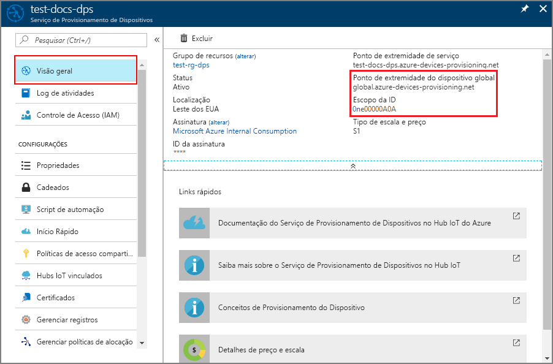

# <a name="quickstart-create-and-provision-an-x509-simulated-device-using-nodejs-device-sdk-for-iot-hub-device-provisioning-service"></a>Início Rápido: Criar e provisionar um dispositivo X.509 simulado usando o SDK do dispositivo Node.js para o Serviço de Provisionamento de Dispositivos no Hub IoT

[!INCLUDE [iot-dps-selector-quick-create-simulated-device-x509](../../includes/iot-dps-selector-quick-create-simulated-device-x509.md)]

Neste início rápido, você criará um dispositivo X.509 simulado em um computador Windows. Você usará um código Node.js de exemplo do dispositivo para conectar esse dispositivo simulado ao hub IoT usando um registro individual com o DPS (Serviço de Provisionamento de Dispositivos).

## <a name="prerequisites"></a>Pré-requisitos

- Familiaridade com os conceitos de [provisionamento](about-iot-dps.md#provisioning-process).
- Conclusão de [Configurar o Serviço de Provisionamento de Dispositivos no Hub IoT com o portal do Azure](./quick-setup-auto-provision.md).
- Uma conta do Azure com uma assinatura ativa. [Crie um gratuitamente](https://azure.microsoft.com/free/?ref=microsoft.com&utm_source=microsoft.com&utm_medium=docs&utm_campaign=visualstudio).
- [Node.js v4.0 e posterior](https://nodejs.org).
- [Git](https://git-scm.com/download/).
- [OpenSSL](https://www.openssl.org/).

[!INCLUDE [IoT Device Provisioning Service basic](../../includes/iot-dps-basic.md)]

## <a name="prepare-the-environment"></a>Preparar o ambiente 

1. Conclua as etapas em [Configurar o Serviço de Provisionamento de Dispositivos no Hub IoT com o Portal do Azure](./quick-setup-auto-provision.md) antes de continuar.

2. Verifique se o [Node.js v4.0 ou superior](https://nodejs.org) está instalado no computador.

3. Verifique se o [Git](https://git-scm.com/download/) está instalado em seu computador e se foi adicionado às variáveis de ambiente que podem ser acessadas pela janela de comando. 

4. Verifique se o [OpenSSL](https://www.openssl.org/) está instalado em seu computador e se foi adicionado às variáveis de ambiente que podem ser acessadas pela janela de comando. Essa biblioteca pode ser criada e instalada a partir da fonte ou baixada e instalada a partir de [terceiros](https://wiki.openssl.org/index.php/Binaries) como [este](https://sourceforge.net/projects/openssl/). 

    > [!NOTE]
    > Caso já tenha criado seus certificados X.509 _raiz_, _intermediário_ e/ou _folha_, você pode ignorar esta etapa e todas as seguintes em relação à geração de certificado.
    >

## <a name="create-a-self-signed-x509-device-certificate-and-individual-enrollment-entry"></a>Criar um certificado de dispositivo X.509 autoassinado e entrada de registro individual

Nesta seção, você usará um certificado X.509 autoassinado, é importante ter em mente o seguinte:

* Os certificados autoassinados são somente para teste e não devem ser usados em produção.
* A data de validade padrão para um certificado autoassinado é de um ano.

Você usará o código de exemplo do [SDK do Azure IoT para Node.js](https://github.com/Azure/azure-iot-sdk-node.git) para criar o certificado a ser usado na entrada de registro individual do dispositivo simulado.

O Serviço de Provisionamento de Dispositivos de IoT do Azure dá suporte a dois tipos de registros:

- [Grupos de registros](concepts-service.md#enrollment-group): usados para inscrever vários dispositivos relacionados.
- [Registros individuais](concepts-service.md#individual-enrollment): usados para inscrever um único dispositivo.

Este artigo vai demonstrar o uso de registros individuais.

1. Abra um prompt de comando. Clone o repositório do GitHub para os exemplos de código:
    
    ```cmd/sh
    git clone https://github.com/Azure/azure-iot-sdk-node.git --recursive
    ```

2. Navegue até o script do gerador de certificados e compile o projeto. 

    ```cmd/sh
    cd azure-iot-sdk-node/provisioning/tools
    npm install
    ```

3. Crie o certificado X.509 de _folha_ por meio da execução do script usando seu próprio _nome-certificado_. O nome comum do certificado de folha se torna a [ID de registro](./concepts-service.md#registration-id). Portanto, verifique se usou apenas valores alfanuméricos minúsculos e hifens.

    ```cmd/sh
    node create_test_cert.js device {certificate-name}
    ```

4. Entre no [portal do Azure](https://portal.azure.com), selecione o botão **Todos os recursos** no menu esquerdo e abra a instância de Serviço de Provisionamento de Dispositivos.

5. No menu do Serviço de Provisionamento de Dispositivos, selecione **Gerenciar registros**. Selecione a guia **Registros Individuais** e, em seguida, selecione o botão **Adicionar registro individual**, na parte superior. 

6. No painel **Adicionar Registro**, insira as seguintes informações:
   - Selecione **X.509** como o *Mecanismo* de atestado de identidade.
   - Em *Arquivo de certificado .pem ou .cer primário*, escolha *Selecionar um arquivo* para selecionar o arquivo de certificado **{certificate-name}_cert.pem** criado na etapa anterior.  
   - Opcionalmente, você pode fornecer as seguintes informações:
     - Selecione um hub IoT vinculado com o serviço de provisionamento.
     - Insira uma ID de dispositivo exclusiva. Evite dados confidenciais ao nomear seu dispositivo. 
     - Atualize o **Estado inicial do dispositivo gêmeo** com a configuração inicial desejada para o dispositivo.
     - Uma vez concluído, pressione o botão **Salvar**. 

     [](./media/quick-create-simulated-device-x509-node/device-enrollment.png#lightbox)

     No registro bem-sucedido, o dispositivo X.509 é exibido como **{certificatename}** na coluna *ID do Registro* na guia o *Registros Individuais*. Anote esse valor para usar mais tarde.

## <a name="simulate-the-device"></a>Simular o dispositivo

O [SDK do dispositivo Node.js do Hub IoT do Azure](https://github.com/Azure/azure-iot-sdk-node) oferece uma maneira fácil de simular um dispositivo. Para ler mais sobre o assunto, confira [Conceitos de dispositivo](./concepts-service.md).

1. No portal do Azure, selecione a folha **Visão Geral** do seu Serviço de Provisionamento de Dispositivos e anote os valores de **_Ponto de Extremidade do Dispositivo Global_** e **_Escopo de ID_** .

     

2. Copie o _certificado_ e a _chave_ para a pasta de exemplo.

    ```cmd/sh
    copy .\{certificate-name}_cert.pem ..\device\samples\{certificate-name}_cert.pem
    copy .\{certificate-name}_key.pem ..\device\samples\{certificate-name}_key.pem
    ```

3. Navegue até o script de teste do dispositivo e crie o projeto. 

    ```cmd/sh
    cd ..\device\samples
    npm install
    ```

4. Edite o arquivo **register\_x509.js**. Salve o arquivo depois de fazer as alterações a seguir.
    - Substitua `provisioning host` pelo **_Ponto de Extremidade do Dispositivo Global_** anotado na **Etapa 1** acima.
    - Substitua `id scope` pelo **_Escopo de ID_** anotado na **Etapa 1** acima. 
    - Substitua `registration id` pela **_ID de Registro_** anotada na seção anterior.
    - Substitua `cert filename` e `key filename` pelos arquivos que você copiou na **Etapa 2** acima. 

5. Execute o script e verifique se o dispositivo foi provisionado com êxito.

    ```cmd/sh
    node register_x509.js
    ```   

6. No portal, navegue até o Hub IoT vinculado ao seu serviço de provisionamento e abra a folha **Dispositivos IoT**. No provisionamento bem-sucedido do dispositivo X.509 simulado para o hub, sua ID de dispositivo aparecerá na folha **Dispositivos IoT** com o *STATUS* como **habilitado**. Talvez seja necessário pressionar o botão **Atualizar**, na parte superior, se você já tiver aberto a folha antes de executar o aplicativo do dispositivo de exemplo. 

     

    Se você tiver alterado o *estado de dispositivo gêmeo inicial* do valor padrão na entrada de registro para o seu dispositivo, pode receber o estado desejado duas do hub e agir de acordo. Para saber mais, veja [Noções básicas e uso de dispositivos gêmeos no Hub IoT](../iot-hub/iot-hub-devguide-device-twins.md).


## <a name="clean-up-resources"></a>Limpar os recursos

Se planejar continuar a trabalhar e explorar o dispositivo cliente de exemplo, não limpe os recursos criados neste início rápido. Caso contrário, use as seguintes etapas para excluir todos os recursos criados por este início rápido.

1. Feche a janela de saída de exemplo de dispositivo cliente em seu computador.
2. No menu à esquerda no portal do Azure, selecione **Todos os recursos** e selecione o serviço de Provisionamento de Dispositivos. Abra a folha **Gerenciar Registros** do seu serviço e selecione a guia **Registros Individuais**. Marque a caixa de seleção ao lado da *ID DE REGISTRO* do dispositivo registrado neste início rápido e pressione o botão **Excluir**, na parte superior do painel. 
3. No menu à esquerda no portal do Azure, selecione **Todos os recursos** e seu Hub IoT. Abra a folha **Dispositivos IoT** do hub, marque a caixa de seleção ao lado da *ID DO DISPOSITIVO* registrado neste início rápido e pressione o botão **Excluir**, na parte superior do painel.


## <a name="next-steps"></a>Próximas etapas

Neste início rápido, você criou um dispositivo X.509 simulado e o provisionou no Hub IoT usando o Serviço de Provisionamento de Dispositivos no Hub IoT do Azure no portal. Para saber como registrar seu dispositivo X.509 programaticamente, continue com o início rápido do registro programático de dispositivos X.509. 

> [!div class="nextstepaction"]
> [Início rápido do Azure – Registrar dispositivos X.509 no Serviço de Provisionamento de Dispositivos no Hub IoT do Azure](quick-enroll-device-x509-node.md)