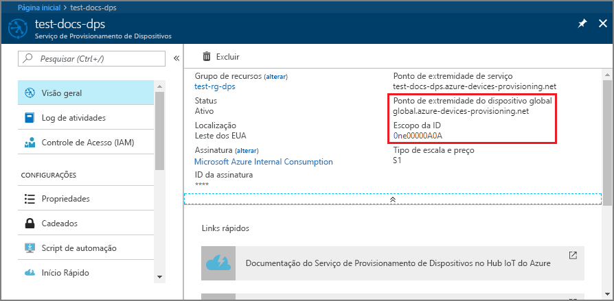
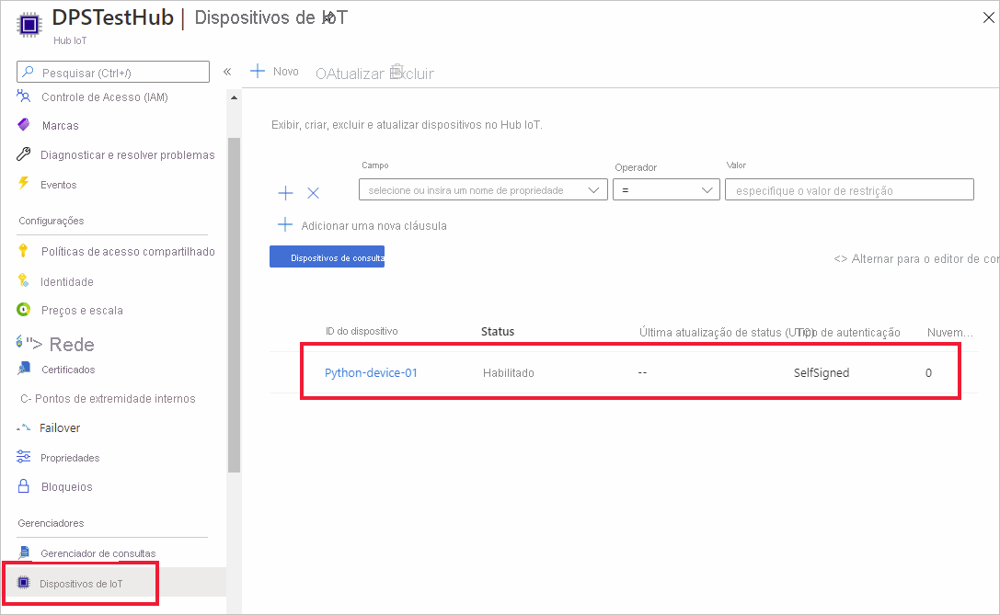

# <a name="quickstart-create-and-provision-a-simulated-x509-device-using-python-device-sdk-for-iot-hub-device-provisioning-service"></a>Início Rápido: Criar e provisionar um dispositivo X.509 simulado usando o SDK do dispositivo Python para o Serviço de Provisionamento do Dispositivo Hub IoT

[!INCLUDE [iot-dps-selector-quick-create-simulated-device-x509](../../includes/iot-dps-selector-quick-create-simulated-device-x509.md)]

Neste guia de início rápido, você provisiona um computador de desenvolvimento como um dispositivo Python X.509. Você usa o código do dispositivo de exemplo do [SDK do Python do IoT do Azure](https://github.com/Azure/azure-iot-sdk-python) para conectar o dispositivo ao Hub IoT. Um registro individual é usado com o DPS (Serviço de Provisionamento de Dispositivos) neste exemplo.

## <a name="prerequisites"></a>Pré-requisitos

- Familiaridade com os conceitos de [provisionamento](about-iot-dps.md#provisioning-process).
- Conclusão de [Configurar o Serviço de Provisionamento de Dispositivos no Hub IoT com o portal do Azure](./quick-setup-auto-provision.md).
- Uma conta do Azure com uma assinatura ativa. [Crie um gratuitamente](https://azure.microsoft.com/free/?ref=microsoft.com&utm_source=microsoft.com&utm_medium=docs&utm_campaign=visualstudio).
- [Python 3.6 ou posterior](https://www.python.org/downloads/)
- [Git](https://git-scm.com/download/).


[!INCLUDE [IoT Device Provisioning Service basic](../../includes/iot-dps-basic.md)]

## <a name="prepare-the-environment"></a>Preparar o ambiente 

1. Verifique se o `git` está instalado em seu computador e é adicionado às variáveis de ambiente que podem ser acessadas pela janela de comando. Confira [ferramentas de cliente Git do Software Freedom Conservancy](https://git-scm.com/download/) para obter a versão mais recente das ferramentas `git` a serem instaladas, que inclui o **Git Bash**, o aplicativo de linha de comando que você pode usar para interagir com seu repositório Git local. 

2. Abra um prompt do Git Bash. Clone o repositório GitHub para o [SDK do Python do IoT do Azure](https://github.com/Azure/azure-iot-sdk-python).
    
    ```cmd/sh
    git clone https://github.com/Azure/azure-iot-sdk-python.git --recursive
    ```


## <a name="create-a-self-signed-x509-device-certificate"></a>Criar um certificado de dispositivo X.509 autoassinado 

Nesta seção, você criará um certificado X.509 autoassinado. É importante ter em mente os seguintes pontos:

* Os certificados autoassinados são somente para teste e não devem ser usados em produção.
* A data de validade padrão para um certificado autoassinado é de um ano.

Se você ainda não tiver seus certificados de dispositivo para autenticar um dispositivo, poderá criar um certificado autoassinado com OpenSSL para teste com este artigo.  O OpenSSL está incluído com a instalação do Git. 

1. Execute o comando a seguir no prompt do Git Bash.

    # <a name="windows"></a>[Windows](#tab/windows)
    
    ```bash
    winpty openssl req -outform PEM -x509 -sha256 -newkey rsa:4096 -keyout ./python-device.key.pem -out ./python-device.pem -days 365 -extensions usr_cert -subj "//CN=Python-device-01"
    ```

    > [!IMPORTANT]
    > A barra "/" extra fornecida para o nome da entidade (`//CN=Python-device-01`) só é necessária para escapar a cadeia de caracteres com o Git em plataformas Windows. 

    # <a name="linux"></a>[Linux](#tab/linux)
    
    ```bash
    openssl req -outform PEM -x509 -sha256 -newkey rsa:4096 -keyout ./python-device.key.pem -out ./python-device.pem -days 365 -extensions usr_cert -subj "/CN=Python-device-01"
    ```
    
    ---
    
2. Quando receber a solicitação **Insira a frase secreta de PEM:** , use a frase secreta `1234` para teste com este artigo.    

3. Quando receber novamente a solicitação **Verificando – Insira a frase secreta de PEM:** , use a frase secreta `1234` novamente.    

Um arquivo de certificado de teste (*python-device.pem*) e um arquivo de chave privada (*python-device.key.pem*) são gerados no diretório em que você executou o comando `openssl`.


## <a name="create-an-individual-enrollment-entry-in-dps"></a>Criar uma entrada de registro individual no DPS


O Serviço de Provisionamento de Dispositivos de IoT do Azure dá suporte a dois tipos de registros:

- [Grupos de registros](concepts-service.md#enrollment-group): usados para inscrever vários dispositivos relacionados.
- [Registros individuais](concepts-service.md#individual-enrollment): usados para inscrever um único dispositivo.

Este artigo demonstra um registro individual de um único dispositivo a ser provisionado com um Hub IoT.

1. Entre no portal do Azure, selecione o botão **Todos os recursos** no menu esquerdo e abra o serviço de provisionamento.

2. No menu do Serviço de Provisionamento de Dispositivos, selecione **Gerenciar registros**. Selecione a guia **Registros Individuais** e, em seguida, selecione o botão **Adicionar registro individual**, na parte superior. 

3. No painel **Adicionar Registro**, insira as seguintes informações:
   - Selecione **X.509** como o *Mecanismo* de atestado de identidade.
   - No *Arquivo .pem ou .cer do certificado primário*, escolha *Selecionar um arquivo* para selecionar o arquivo de certificado **python-device.pem** se você estiver usando o certificado de teste criado anteriormente.
   - Opcionalmente, você pode fornecer as seguintes informações:
     - Selecione um hub IoT vinculado com o serviço de provisionamento.
     - Atualize o **Estado inicial do dispositivo gêmeo** com a configuração inicial desejada para o dispositivo.
   - Uma vez concluído, pressione o botão **Salvar**. 

     [](./media/python-quick-create-simulated-device-x509/device-enrollment.png#lightbox)

   Após o registro bem-sucedido, o dispositivo X.509 será exibido como **Python-device-01** na coluna *ID do Registro* na guia *Registros Individuais*. Esse valor de registro é proveniente do nome da entidade no certificado de dispositivo. 

## <a name="simulate-the-device"></a>Simular o dispositivo

O exemplo de provisionamento do Python, [provision_x509.py](https://github.com/Azure/azure-iot-sdk-python/blob/master/azure-iot-device/samples/async-hub-scenarios/provision_x509.py), está localizado no diretório `azure-iot-sdk-python/azure-iot-device/samples/async-hub-scenarios`. Esse exemplo usa seis variáveis de ambiente para autenticar e provisionar um dispositivo IoT usando o DPS. Essas variáveis de ambiente são:

| Nome da variável              | Descrição                                     |
| :------------------------- | :---------------------------------------------- |
| `PROVISIONING_HOST`        |  Esse valor é o ponto de extremidade global usado para conexão com o recurso de DPS |    
| `PROVISIONING_IDSCOPE`     |  Este valor é o Escopo da ID para o recurso de DPS |    
| `DPS_X509_REGISTRATION_ID` |  Esse valor é a ID do dispositivo. Ele também precisa corresponder ao nome da entidade no certificado de dispositivo |    
| `X509_CERT_FILE`           |  Nome do arquivo do certificado de dispositivo |    
| `X509_KEY_FILE`            |  O nome de arquivo da chave privada para o certificado de dispositivo |
| `PASS_PHRASE`              |  A frase secreta usada para criptografar o certificado e o arquivo de chave privada (`1234`). |    

1. No menu do Serviço de Provisionamento de Dispositivos, selecione **Visão geral**. Anote o _Escopo da ID_ e o _Ponto de extremidade de dispositivo global_.

    

2. No prompt do Git Bash, use os comandos a seguir para adicionar as variáveis de ambiente para o ponto de extremidade do dispositivo global e o Escopo da ID.

    ```bash
    $export PROVISIONING_HOST=global.azure-devices-provisioning.net
    $export PROVISIONING_IDSCOPE=<ID scope for your DPS resource>
    ```

3. A ID de registro do dispositivo IoT precisa corresponder ao nome da entidade no respectivo certificado de dispositivo. Se você gerou um certificado de teste autoassinado, `Python-device-01` será o nome da entidade e a ID de registro do dispositivo. 

    Se você já tiver um certificado de dispositivo, poderá usar `certutil` para verificar o nome comum da entidade usado para o dispositivo, conforme mostrado abaixo para um certificado de teste autoassinado:

    ```bash
    $ certutil python-device.pem
    X509 Certificate:
    Version: 3
    Serial Number: fa33152fe1140dc8
    Signature Algorithm:
        Algorithm ObjectId: 1.2.840.113549.1.1.11 sha256RSA
        Algorithm Parameters:
        05 00
    Issuer:
        CN=Python-device-01
      Name Hash(sha1): 1dd88de40e9501fb64892b698afe12d027011000
      Name Hash(md5): a62c784820daa931b9d3977739b30d12
    
     NotBefore: 1/29/2021 7:05 PM
     NotAfter: 1/29/2022 7:05 PM
    
    Subject:
        ===> CN=Python-device-01 <===
      Name Hash(sha1): 1dd88de40e9501fb64892b698afe12d027011000
      Name Hash(md5): a62c784820daa931b9d3977739b30d12
    ```

    No prompt do Git Bash, defina a variável de ambiente para a ID de registro da seguinte maneira:

    ```bash
    $export DPS_X509_REGISTRATION_ID=Python-device-01
    ```

4. No prompt do Git Bash, defina as variáveis de ambiente para o arquivo de certificado, o arquivo de chave privada e a frase secreta.

    ```bash
    $export X509_CERT_FILE=./python-device.pem
    $export X509_KEY_FILE=./python-device.key.pem
    $export PASS_PHRASE=1234
    ```

5. Examine o código para [provision_x509.py](https://github.com/Azure/azure-iot-sdk-python/blob/master/azure-iot-device/samples/async-hub-scenarios/provision_x509.py). Se você não estiver usando o **Python versão 3.7** ou posterior, faça com que a [alteração de código mencionada aqui](https://github.com/Azure/azure-iot-sdk-python/tree/master/azure-iot-device/samples/async-hub-scenarios#advanced-iot-hub-scenario-samples-for-the-azure-iot-hub-device-sdk) substitua `asyncio.run(main())` e, por fim, salve sua alteração. 

6. Execute o exemplo. O exemplo se conectará, provisionará o dispositivo para um hub e enviará algumas mensagens de teste para o hub.

    ```bash
    $ winpty python azure-iot-sdk-python/azure-iot-device/samples/async-hub-scenarios/provision_x509.py
    RegistrationStage(RequestAndResponseOperation): Op will transition into polling after interval 2.  Setting timer.
    The complete registration result is
    Python-device-01
    TestHub12345.azure-devices.net
    initialAssignment
    null
    Will send telemetry from the provisioned device
    sending message #4
    sending message #7
    sending message #2
    sending message #8
    sending message #5
    sending message #9
    sending message #1
    sending message #6
    sending message #10
    sending message #3
    done sending message #4
    done sending message #7
    done sending message #2
    done sending message #8
    done sending message #5
    done sending message #9
    done sending message #1
    done sending message #6
    done sending message #10
    done sending message #3
    ```

7. No portal, navegue até o Hub IoT vinculado ao seu serviço de provisionamento e abra a folha **Dispositivos IoT** localizada sob a seção **Explorers** no menu à esquerda. No provisionamento bem-sucedido do dispositivo X.509 simulado para o hub, sua ID de dispositivo aparecerá na folha **Device Explorer** com o *STATUS* **habilitado**. Talvez seja necessário pressionar o botão **Atualizar**, na parte superior, se você já tiver aberto a folha antes de executar o aplicativo do dispositivo de exemplo. 

     

> [!NOTE]
> Se você tiver alterado o *estado de dispositivo gêmeo inicial* do valor padrão na entrada de registro para o seu dispositivo, pode receber o estado desejado duas do hub e agir de acordo. Para saber mais, veja [Noções básicas e uso de dispositivos gêmeos no Hub IoT](../iot-hub/iot-hub-devguide-device-twins.md).
>

## <a name="clean-up-resources"></a>Limpar os recursos

Se planejar continuar a trabalhar e explorar o dispositivo cliente de exemplo, não limpe os recursos criados neste início rápido. Caso contrário, use as seguintes etapas para excluir todos os recursos criados por este início rápido.

1. Feche a janela de saída de exemplo de dispositivo cliente em seu computador.
2. No menu à esquerda no portal do Azure, selecione **Todos os recursos** e selecione o serviço de Provisionamento de Dispositivos. Abra a folha **Gerenciar Registros** do seu serviço e selecione a guia **Registros Individuais**. Marque a caixa de seleção ao lado da *ID DE REGISTRO* do dispositivo registrado neste início rápido e pressione o botão **Excluir**, na parte superior do painel. 
3. No menu à esquerda no portal do Azure, selecione **Todos os recursos** e seu Hub IoT. Abra a folha **Dispositivos IoT** do hub, marque a caixa de seleção ao lado da *ID DO DISPOSITIVO* registrado neste início rápido e pressione o botão **Excluir**, na parte superior do painel.

## <a name="next-steps"></a>Próximas etapas

Neste guia de início rápido, você criou um dispositivo simulado X.509 no seu computador de desenvolvimento e o provisionou no Hub IoT usando o Serviço de Provisionamento de Dispositivos no Hub IoT do Azure no portal. Para saber como registrar seu dispositivo X.509 programaticamente, continue com o início rápido do registro programático de dispositivos X.509. 

> [!div class="nextstepaction"]
> [Início rápido do Azure – Registrar dispositivos X.509 no Serviço de Provisionamento de Dispositivos no Hub IoT do Azure](quick-enroll-device-x509-python.md)
