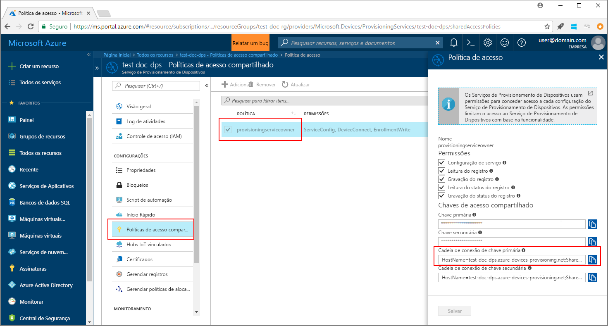
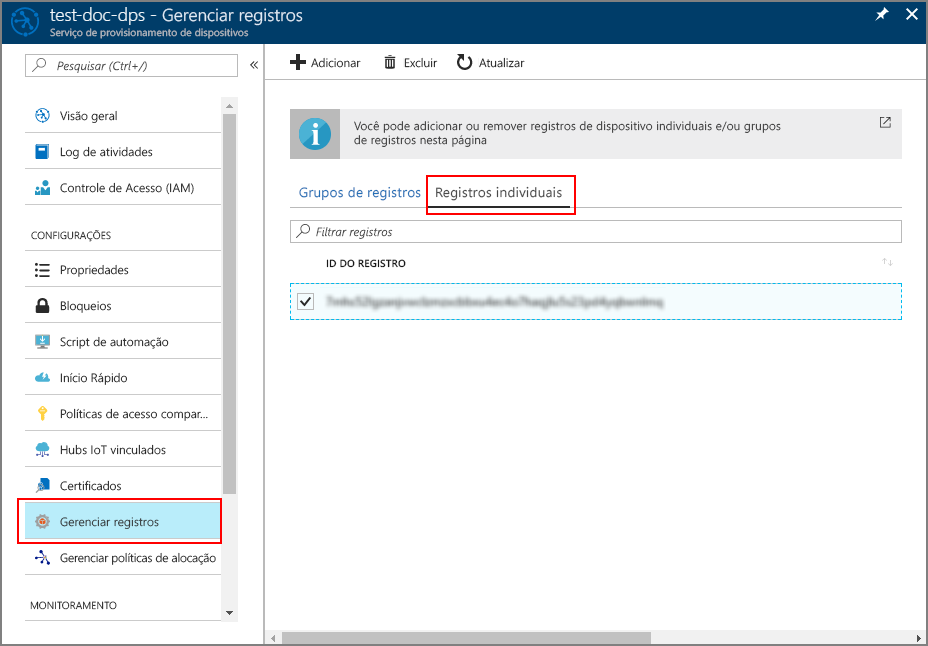

# <a name="quickstart-enroll-tpm-device-to-iot-hub-device-provisioning-service-using-java-service-sdk"></a>Início Rápido: Registrar o dispositivo TPM no Serviço de Provisionamento de Dispositivos no Hub IoT usando o SDK do Serviço Java

[!INCLUDE [iot-dps-selector-quick-enroll-device-tpm](../../includes/iot-dps-selector-quick-enroll-device-tpm.md)]

Neste início rápido, você criará de maneira programática um registro individual para um dispositivo TPM simulado no Serviço de Provisionamento de Dispositivos no Hub IoT do Azure usando o SDK do Serviço Java com a ajuda de um aplicativo Java de exemplo.

## <a name="prerequisites"></a>Pré-requisitos

- Conclusão de [Configurar o Serviço de Provisionamento de Dispositivos no Hub IoT com o portal do Azure](./quick-setup-auto-provision.md).
- Conclusão de [Ler as chaves de criptografia por meio do dispositivo TPM](quick-create-simulated-device.md#simulatetpm).
- Uma conta do Azure com uma assinatura ativa. [Crie um gratuitamente](https://azure.microsoft.com/free/?ref=microsoft.com&utm_source=microsoft.com&utm_medium=docs&utm_campaign=visualstudio).
- [Java SE Development Kit 8](/azure/developer/java/fundamentals/java-jdk-long-term-support). Este início rápido instalará o [SDK do Serviço Java](https://azure.github.io/azure-iot-sdk-java/master/service/) abaixo. Ele funciona no Windows e no Linux. Este início rápido usará o Windows.
- [Maven 3](https://maven.apache.org/download.cgi).
- [Git](https://git-scm.com/download/).

<a id="setupdevbox"></a>

## <a name="prepare-the-development-environment"></a>Preparar o ambiente de desenvolvimento 

1. Certifique-se de ter o [Java SE Development Kit 8](/azure/developer/java/fundamentals/java-jdk-long-term-support) instalado no computador. 

2. Configure variáveis de ambiente para a instalação do Java. A variável `PATH` deve incluir o caminho completo para o diretório *jdk1.8.x\bin*. Se esta for a primeira instalação do Java do seu computador, crie uma variável de ambiente chamada `JAVA_HOME` e aponte-a para o caminho completo até o diretório *jdk1.8.x*. No computador Windows, esse diretório está localizado na pasta *C:\\Arquivos de Programas\\Java\\* , e você pode criar ou editar variáveis de ambiente procurando **Editar as variáveis de ambiente do sistema** no **Painel de Controle** do seu computador Windows. 

   Verifique se o Java foi instalado com sucesso em seu computador executando o seguinte comando na janela de comando:

    ```cmd\sh
    java -version
    ```

3. Baixe e extraia [Maven 3](https://maven.apache.org/download.cgi) em seu computador. 

4. Edite a variável de ambiente `PATH` para apontar para a pasta *apache-maven-3.x.x\\bin* dentro da pasta na qual o Maven foi extraído. Você pode confirmar que o Maven foi instalado com sucesso executando este comando em sua janela de comando:

    ```cmd\sh
    mvn --version
    ```

5. Verifique se o [git](https://git-scm.com/download/) está instalado em seu computador e foi adicionado à variável de ambiente `PATH`. 


<a id="javasample"></a>

## <a name="download-and-modify-the-java-sample-code"></a>Baixar e modificar o código de exemplo do Java

Esta seção mostra como adicionar os detalhes de provisionamento do dispositivo TPM ao código de exemplo. 

1. Abra um prompt de comando. Clone o repositório GitHub para o exemplo de código de registro do dispositivo usando o [SDK do Serviço Java](https://azure.github.io/azure-iot-sdk-java/master/service/):
    
    ```cmd\sh
    git clone https://github.com/Azure/azure-iot-sdk-java.git --recursive
    ```

2. No código-fonte baixado, navegue até a pasta de exemplo **_azure-iot-sdk-java/provisioning/provisioning-samples/service-enrollment-sample_** . Abra o arquivo **_/src/main/java/samples/com/microsoft/azure/sdk/iot/ServiceEnrollmentSample.java_** em um editor de sua escolha e adicione os seguintes detalhes:

   1. Adicione a `[Provisioning Connection String]` do serviço de provisionamento pelo portal desta forma:
       1. Navegue até seu serviço de provisionamento no [Portal do Azure](https://portal.azure.com). 
       2. Abra as **Políticas de acesso compartilhadas** e selecione uma política que tenha a permissão *EnrollmentWrite*.
       3. Copie a **Cadeia de conexão da chave primária**. 

             

       4. No arquivo de código de exemplo **_ServiceEnrollmentSample.java_** , substitua o `[Provisioning Connection String]` por uma **cadeia de conexão de chave primária**.
    
           ```Java
           private static final String PROVISIONING_CONNECTION_STRING = "[Provisioning Connection String]";
           ```

   2. Adicione os detalhes do dispositivo TPM:
       1. Obtenha a *ID de registro* e a *chave de endosso do TPM* para uma simulação de dispositivo TPM, seguindo as etapas que levam à seção [Simular dispositivo TPM](quick-create-simulated-device.md#simulatetpm).
       2. Use a **_ID de Registro_** e a **_Chave de Endosso_** da saída da etapa anterior para substituir o `[RegistrationId]` e `[TPM Endorsement Key]` no arquivo de código de exemplo **_ServiceEnrollmentSample.java_** :
        
           ```Java
           private static final String REGISTRATION_ID = "[RegistrationId]";
           private static final String TPM_ENDORSEMENT_KEY = "[TPM Endorsement Key]";
           ```

   3. Opcionalmente, você pode configurar seu serviço de provisionamento por meio do código de exemplo:
      - Para adicionar essa configuração ao exemplo, siga estas etapas:
        1. Navegue até o hub IoT vinculado ao serviço de provisionamento no [Portal do Azure](https://portal.azure.com). Abra a guia **Visão geral** do hub e copie o **Nome do host**. Atribua este **Nome do host** ao parâmetro *IOTHUB_HOST_NAME*.
            ```Java
            private static final String IOTHUB_HOST_NAME = "[Host name].azure-devices.net";
            ```
        2. Atribua um nome amigável ao parâmetro *DEVICE_ID* e mantenha o *PROVISIONING_STATUS* como o valor padrão *ENABLED*. 
    
      - OU, se você optar por não configurar o serviço de provisionamento, certifique-se de comentar ou excluir as seguintes instruções no arquivo _ServiceEnrollmentSample.java_:
          ```Java
          // The following parameters are optional. Remove it if you don't need.
          individualEnrollment.setDeviceId(DEVICE_ID);
          individualEnrollment.setIotHubHostName(IOTHUB_HOST_NAME);
          individualEnrollment.setProvisioningStatus(PROVISIONING_STATUS);
          ```

   4. Estude o exemplo de código. Ele cria, atualiza, consulta e exclui um registro de dispositivo TPM individual. Para verificar o registro bem-sucedido no portal, comente temporariamente as seguintes linhas de código no fim do arquivo _ServiceEnrollmentSample.java_:
    
       ```Java
       // *********************************** Delete info of individualEnrollment ************************************
       System.out.println("\nDelete the individualEnrollment...");
       provisioningServiceClient.deleteIndividualEnrollment(REGISTRATION_ID);
       ```

   5. Salve o arquivo _ServiceEnrollmentSample.java_.

<a id="runjavasample"></a>

## <a name="build-and-run-the-java-sample-code"></a>Compilar e executar o código de exemplo do Java

1. Abra uma janela de comando e navegue até a pasta **_azure-iot-sdk-java/provisioning/provisioning-samples/service-enrollment-sample_** .

2. Compile o código de exemplo usando este comando:

    ```cmd\sh
    mvn install -DskipTests
    ```

   Esse comando baixa o pacote do Maven [`com.microsoft.azure.sdk.iot.provisioning.service`](https://www.mvnrepository.com/artifact/com.microsoft.azure.sdk.iot.provisioning/provisioning-service-client) para o seu computador. Esse pacote inclui os binários do [SDK do Serviço Java](https://azure.github.io/azure-iot-sdk-java/master/service/), de que o código de exemplo precisa para o build. 

3. Execute o exemplo usando estes comandos na janela de comando:

    ```cmd\sh
    cd target
    java -jar ./service-enrollment-sample-{version}-with-deps.jar
    ```

4. Observe se o registro foi bem-sucedido na janela de saída. 

5. Navegue até seu serviço de provisionamento no Portal do Azure. Selecione **Gerenciar registros** e selecione a guia **Registros individuais**. Observe que a *ID de registro* do dispositivo TPM simulado agora está listada. 

      

## <a name="clean-up-resources"></a>Limpar os recursos
Se planejar explorar o exemplo do serviço Java, não limpe os recursos criados neste início rápido. Caso contrário, use as seguintes etapas para excluir todos os recursos criados por este início rápido.

1. Feche a janela de saída de exemplo do Java no computador.
1. Feche a janela do simulador TPM que você talvez tenha criado para simular seu dispositivo TPM.
1. Navegue até o Serviço de Provisionamento de Dispositivos no portal do Azure, selecione **Gerenciar registros** e, em seguida, selecione a guia **Registros Individuais**. Marque a caixa de seleção ao lado da *ID de Registro* para a entrada de registro criada usando este início rápido e pressione o botão **Excluir** na parte superior do painel.

## <a name="next-steps"></a>Próximas etapas
Neste início rápido, você registrou um dispositivo TPM simulado para seu serviço de provisionamento de dispositivos. Para saber mais sobre os detalhes de configuração do dispositivo, prossiga para o tutorial de configuração do Serviço de Provisionamento de Dispositivos no portal do Azure. 

> [!div class="nextstepaction"]
> [Tutoriais do Serviço de Provisionamento de Dispositivos no Hub IoT do Azure](./tutorial-set-up-cloud.md)