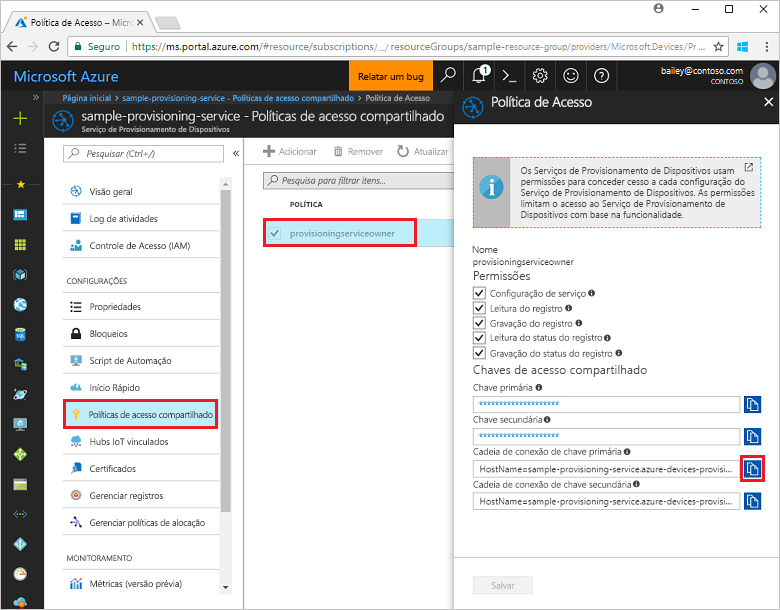
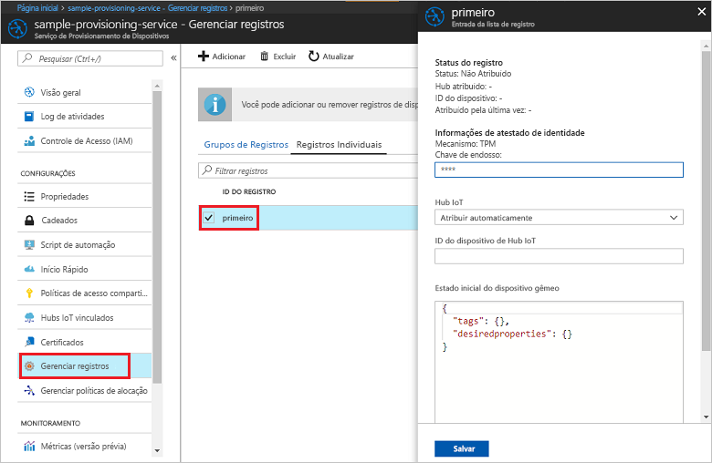

# <a name="quickstart-enroll-tpm-device-to-iot-hub-device-provisioning-service-using-nodejs-service-sdk"></a>Início Rápido: Registrar dispositivo TPM no Serviço de Provisionamento de Dispositivos do Hub IoT usando o SDK do serviço Node.js

[!INCLUDE [iot-dps-selector-quick-enroll-device-tpm](../../includes/iot-dps-selector-quick-enroll-device-tpm.md)]


Estas etapas mostram como criar programaticamente um registro individual de um dispositivo TPM no Serviço de Provisionamento de Dispositivos do Hub IoT do Azure usando o [SDK do serviço Node.js](https://github.com/Azure/azure-iot-sdk-node) e um aplicativo de exemplo do Node.js. Opcionalmente, é possível registrar um dispositivo TPM simulado no serviço de provisionamento usando esta entrada de registro individual. Embora essas etapas funcionem em computadores Windows e Linux, usaremos um computador de desenvolvimento do Windows para os fins deste artigo.

## <a name="prerequisites"></a>Pré-requisitos

- Conclua as etapas em [Configurar o Serviço de Provisionamento de Dispositivos do Hub IoT com o portal do Azure](./quick-setup-auto-provision.md) antes de continuar. 
-  Verifique se o [Node.js v4.0 ou superior](https://nodejs.org) está instalado no computador.
- Se desejar registrar um dispositivo simulado no fim deste início rápido, siga as etapas em [Criar e provisionar um dispositivo simulado](quick-create-simulated-device.md) até a etapa em que você obtém uma chave de endosso para o dispositivo. Anote a chave de endosso. Você a usará mais tarde neste início rápido. **Não siga as etapas para criar um registro individual usando o portal do Azure.**
 
## <a name="create-the-individual-enrollment-sample"></a>Criar o exemplo de registro individual 

 
1. Em uma janela de comando na sua pasta de trabalho, execute:
  
    ```cmd\sh
    npm install azure-iot-provisioning-service
    ```  

2. Usando um editor de texto, crie um arquivo **create_individual_enrollment.js** em sua pasta de trabalho. Adicione o seguinte código ao arquivo e salve:

    ```
    'use strict';

    var provisioningServiceClient = require('azure-iot-provisioning-service').ProvisioningServiceClient;

    var serviceClient = provisioningServiceClient.fromConnectionString(process.argv[2]);
    var endorsementKey = process.argv[3];

    var enrollment = {
      registrationId: 'first',
      attestation: {
        type: 'tpm',
        tpm: {
          endorsementKey: endorsementKey
        }
      }
    };

    serviceClient.createOrUpdateIndividualEnrollment(enrollment, function(err, enrollmentResponse) {
      if (err) {
        console.log('error creating the individual enrollment: ' + err);
      } else {
        console.log("enrollment record returned: " + JSON.stringify(enrollmentResponse, null, 2));
      }
    });
    ```

## <a name="run-the-individual-enrollment-sample"></a>Executar o exemplo de registro individual
  
1. Para executar o exemplo, é necessário a cadeia de conexão com o serviço de provisionamento. 
    1. Entre no portal do Azure, selecione o botão **Todos os recursos** no menu esquerdo e abra o serviço de Provisionamento de Dispositivos. 
    2. Selecione **Políticas de acesso compartilhado** e, em seguida, selecione a política de acesso que deseja usar para abrir as propriedades. Na janela **Política de Acesso**, copie e anote a cadeia de conexão da chave primária. 

        


2. Também é necessária a chave de endosso para seu dispositivo. Se você seguiu o guia de início rápido [Criar e provisionar um dispositivo simulado](quick-create-simulated-device.md) para criar um dispositivo TPM simulado, use a chave criada para esse dispositivo. Caso contrário, para criar um registro individual de exemplo, é possível usar a seguinte chave de endosso fornecida com o SDK:

    ```
    AToAAQALAAMAsgAgg3GXZ0SEs/gakMyNRqXXJP1S124GUgtk8qHaGzMUaaoABgCAAEMAEAgAAAAAAAEAxsj2gUScTk1UjuioeTlfGYZrrimExB+bScH75adUMRIi2UOMxG1kw4y+9RW/IVoMl4e620VxZad0ARX2gUqVjYO7KPVt3dyKhZS3dkcvfBisBhP1XH9B33VqHG9SHnbnQXdBUaCgKAfxome8UmBKfe+naTsE5fkvjb/do3/dD6l4sGBwFCnKRdln4XpM03zLpoHFao8zOwt8l/uP3qUIxmCYv9A7m69Ms+5/pCkTu/rK4mRDsfhZ0QLfbzVI6zQFOKF/rwsfBtFeWlWtcuJMKlXdD8TXWElTzgh7JS4qhFzreL0c1mI0GCj+Aws0usZh7dLIVPnlgZcBhgy1SSDQMQ==
    ```

3. Para criar um registro individual para seu dispositivo TPM, execute o seguinte comando (inclua aspas nos argumentos do comando):
 
     ```cmd\sh
     node create_individual_enrollment.js "<the connection string for your provisioning service>" "<endorsement key>"
     ```
 
3. Na criação bem-sucedida, a janela de comando exibe as propriedades do novo registro individual.

     

4. Verifique se um registro individual foi criado. No Portal do Azure, na folha de resumo do Serviço de Provisionamento de Dispositivos, selecione **Gerenciar registros**. Selecione a guia **Registros individuais** e selecione a nova entrada de registro (*primeiro*) para verificar a chave de endosso e outras propriedades da entrada.

     
 
Agora que você criou um registro individual para um dispositivo TPM, se desejar registrar um dispositivo simulado, poderá passar para as etapas restantes em [Criar e provisionar um dispositivo simulado](quick-create-simulated-device.md). Ignore as etapas para criar um registro individual usando o portal do Azure nesse início rápido.

## <a name="clean-up-resources"></a>Limpar recursos
Se planejar explorar exemplos do serviço Node.js, não limpe os recursos criados neste início rápido. Caso contrário, use as seguintes etapas para excluir todos os recursos criados por este início rápido.

1. Feche a janela de saída de exemplo do Node.js no computador.
1. Se você criou um dispositivo TPM simulado, feche a janela do simulador TPM.
2. Navegue até o Serviço de Provisionamento de Dispositivos no portal do Azure, selecione **Gerenciar registros** e, em seguida, selecione a guia **Registros Individuais**. Marque a caixa de seleção ao lado da *ID de Registro* para a entrada de registro criada usando este início rápido e pressione o botão **Excluir** na parte superior do painel. 
 
## <a name="next-steps"></a>Próximas etapas
Neste início rápido, você criou programaticamente uma entrada de registro individual para um dispositivo TPM e, opcionalmente, criou um dispositivo simulado TPM no seu computador e o provisionou no hub IoT usando o Serviço de Provisionamento de Dispositivos no Hub IoT do Azure. Para saber mais sobre os detalhes de configuração do dispositivo, prossiga para o tutorial de configuração do Serviço de Provisionamento de Dispositivos no portal do Azure. 
 
> [!div class="nextstepaction"]
> [Tutoriais do Serviço de Provisionamento de Dispositivos no Hub IoT do Azure](./tutorial-set-up-cloud.md)