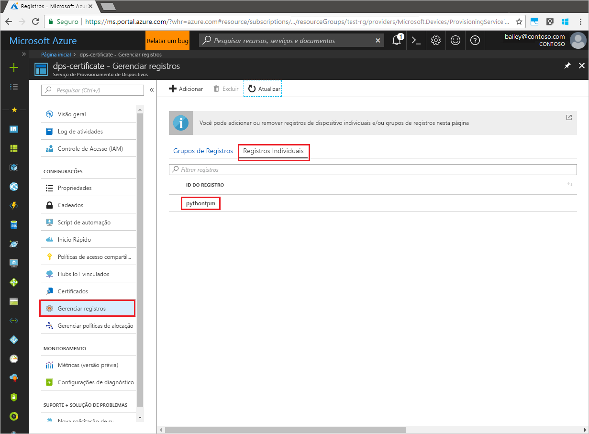

# <a name="quickstart-enroll-tpm-device-to-iot-hub-device-provisioning-service-using-python-provisioning-service-sdk"></a>Início Rápido: Registrar dispositivo TPM no Serviço de Provisionamento de Dispositivos no Hub IoT usando o SDK do serviço de provisionamento Python

[!INCLUDE [iot-dps-selector-quick-enroll-device-tpm](../../includes/iot-dps-selector-quick-enroll-device-tpm.md)]

Neste início rápido, você criará de maneira programática um registro individual para um dispositivo TPM no Serviço de Provisionamento de Dispositivos no Hub IoT do Azure usando o SDK do Serviço de Provisionamento do Python com a ajuda de um aplicativo Python de exemplo.

## <a name="prerequisites"></a>Pré-requisitos

- Conclusão de [Configurar o Serviço de Provisionamento de Dispositivos no Hub IoT com o portal do Azure](./quick-setup-auto-provision.md).
- Uma conta do Azure com uma assinatura ativa. [Crie um gratuitamente](https://azure.microsoft.com/free/?ref=microsoft.com&utm_source=microsoft.com&utm_medium=docs&utm_campaign=visualstudio).
- [Python 2.x ou 3.x](https://www.python.org/downloads/). Este início rápido instalará o [SDK do Serviço de Provisionamento do Python](https://github.com/Azure/azure-iot-sdk-python/tree/v1-deprecated/provisioning_service_client) abaixo.
- [Pip](https://pip.pypa.io/en/stable/installing/), se ele não estiver incluído na distribuição do Python.
- Chave de endosso. Use as etapas em [Criar e provisionar um dispositivo simulado](quick-create-simulated-device.md) ou use a chave de endosso fornecida com o SDK, descrito abaixo.

> [!IMPORTANT]
> Este artigo aplica-se apenas ao SDK do Python V1 preterido. Os clientes de dispositivo e serviço do Serviço de Provisionamento de Dispositivos no Hub IoT ainda não estão disponíveis na V2. Atualmente, a equipe está empenhada no trabalho de levar a V2 à paridade de recursos.

<a id="prepareenvironment"></a>

## <a name="prepare-the-environment"></a>Preparar o ambiente 

1. Baixe e instale o [Python 2.x ou 3.x](https://www.python.org/downloads/). Certifique-se de usar a instalação de 32 bits ou 64 bits conforme exigido pelo seu programa de instalação. Quando solicitado durante a instalação, certifique-se de adicionar Python às variáveis de ambiente específica da plataforma. 

1. Para o [SDK do Serviço de Provisionamento do Python](https://github.com/Azure/azure-iot-sdk-python/tree/v1-deprecated/provisioning_service_client), escolha uma das seguintes opções:

    - Criar e compilar o **SDK do Python do IoT Azure**. Execute [estas instruções](https://github.com/Azure/azure-iot-sdk-python/blob/v1-deprecated/doc/python-devbox-setup.md) para compilar os pacotes do Python. Se você está usando o sistema operacional Windows, instale também o [Pacote redistribuível do Visual C++](https://support.microsoft.com/help/2977003/the-latest-supported-visual-c-downloads) para permitir o uso de DLLs nativas do Python.

    - [Instale ou atualize o *pip*, o sistema de gerenciamento de pacotes do Python](https://pip.pypa.io/en/stable/installing/) e instale o pacote por meio do comando a seguir:

        ```cmd/sh
        pip install azure-iothub-provisioningserviceclient
        ```

1. É necessária a chave de endosso para seu dispositivo. Se você seguiu o guia de início rápido [Criar e provisionar um dispositivo simulado](quick-create-simulated-device.md) para criar um dispositivo TPM simulado, use a chave criada para esse dispositivo. Caso contrário, é possível usar a seguinte chave de endosso fornecida com o SDK:

    ```
    AToAAQALAAMAsgAgg3GXZ0SEs/gakMyNRqXXJP1S124GUgtk8qHaGzMUaaoABgCAAEMAEAgAAAAAAAEAtW6MOyCu/Nih47atIIoZtlYkhLeCTiSrtRN3q6hqgOllA979No4BOcDWF90OyzJvjQknMfXS/Dx/IJIBnORgCg1YX/j4EEtO7Ase29Xd63HjvG8M94+u2XINu79rkTxeueqW7gPeRZQPnl1xYmqawYcyzJS6GKWKdoIdS+UWu6bJr58V3xwvOQI4NibXKD7htvz07jLItWTFhsWnTdZbJ7PnmfCa2vbRH/9pZIow+CcAL9mNTNNN4FdzYwapNVO+6SY/W4XU0Q+dLMCKYarqVNH5GzAWDfKT8nKzg69yQejJM8oeUWag/8odWOfbszA+iFjw3wVNrA5n8grUieRkPQ==
    ```


## <a name="modify-the-python-sample-code"></a>Modificar o código de exemplo do Python

Esta seção mostra como adicionar os detalhes de provisionamento do dispositivo TPM ao código de exemplo. 

1. Usando um editor de texto, crie um novo arquivo **TpmEnrollment.py**.

1. Adicione as seguintes instruções `import` e variáveis ao início do arquivo **TpmEnrollment.py**. Em seguida, substitua `dpsConnectionString` pela cadeia de conexão localizada em **Políticas de acesso compartilhado** no **Serviço de Provisionamento de Dispositivos** no **portal do Azure**. Substitua `endorsementKey` pelo valor observado anteriormente em [Preparar o ambiente](quick-enroll-device-tpm-python.md#prepareenvironment). Por fim, crie uma única `registrationid` e verifique se ela só consiste em alfanuméricos minúsculos e hifens.  
   
    ```python
    from provisioningserviceclient import ProvisioningServiceClient
    from provisioningserviceclient.models import IndividualEnrollment, AttestationMechanism

    CONNECTION_STRING = "{dpsConnectionString}"

    ENDORSEMENT_KEY = "{endorsementKey}"

    REGISTRATION_ID = "{registrationid}"
    ```

1. Adicione a seguinte função e chamada de função para implementar a criação de grupo de registro:
   
    ```python
    def main():
        print ( "Starting individual enrollment..." )

        psc = ProvisioningServiceClient.create_from_connection_string(CONNECTION_STRING)

        att = AttestationMechanism.create_with_tpm(ENDORSEMENT_KEY)
        ie = IndividualEnrollment.create(REGISTRATION_ID, att)

        ie = psc.create_or_update(ie)
    
        print ( "Individual enrollment successful." )
    
    if __name__ == '__main__':
        main()
    ```

1. Salve e feche o arquivo **TpmEnrollment.py**.
 

## <a name="run-the-sample-tpm-enrollment"></a>Executar o registro de TPM de exemplo

1. Abra o prompt de comando e execute o script.

    ```cmd/sh
    python TpmEnrollment.py
    ```

1. Observe a saída do registro bem-sucedido.

1. Navegue até seu serviço de provisionamento no Portal do Azure. Selecione **Gerenciar registros**. Observe que o dispositivo TPM aparece na guia **Registros Individuais**, junto com o nome `registrationid` criado anteriormente. 

      


## <a name="clean-up-resources"></a>Limpar os recursos
Se planejar explorar o exemplo do serviço Java, não limpe os recursos criados neste início rápido. Caso contrário, use as seguintes etapas para excluir todos os recursos criados por este início rápido.

1. Feche a janela de saída de exemplo do Python em seu computador.
1. Se você criou um dispositivo TPM simulado, feche a janela do simulador TPM.
1. Navegue até o Serviço de Provisionamento de Dispositivos no portal do Azure, selecione **Gerenciar registros** e, em seguida, selecione a guia **Registros Individuais**. Marque a caixa de seleção ao lado da *ID de Registro* para a entrada de registro criada usando este início rápido e pressione o botão **Excluir** na parte superior do painel.


## <a name="next-steps"></a>Próximas etapas
Neste início rápido, você criou programaticamente uma entrada de registro individual para um dispositivo TPM e, opcionalmente, criou um dispositivo simulado TPM no seu computador e o provisionou no hub IoT usando o Serviço de Provisionamento de Dispositivos no Hub IoT do Azure. Para saber mais sobre os detalhes de configuração do dispositivo, prossiga para o tutorial de configuração do Serviço de Provisionamento de Dispositivos no portal do Azure.

> [!div class="nextstepaction"]
> [Tutoriais do Serviço de Provisionamento de Dispositivos no Hub IoT do Azure](./tutorial-set-up-cloud.md)
