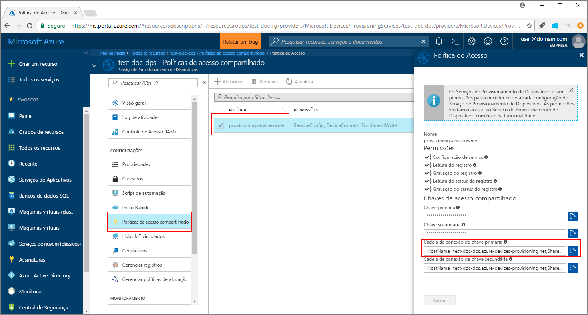
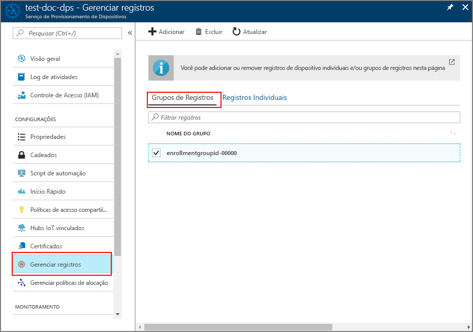

# <a name="quickstart-enroll-x509-devices-to-the-device-provisioning-service-using-java"></a>Início Rápido: Inscrever dispositivos X.509 no Serviço de Provisionamento de Dispositivos usando Java

[!INCLUDE [iot-dps-selector-quick-enroll-device-x509](../../includes/iot-dps-selector-quick-enroll-device-x509.md)]

Neste início rápido, você usará o Java para registrar de maneira programática um grupo de dispositivos simulados X.509 no Serviço de Provisionamento de Dispositivos no Hub IoT do Azure. Os dispositivos são registrados em uma instância do serviço de provisionamento com a criação de um grupo de registro ou um registro individual. Este início rápido mostra como criar os dois tipos de registros usando o SDK do Serviço Java e um aplicativo Java de exemplo.

## <a name="prerequisites"></a>Pré-requisitos

- Conclusão de [Configurar o Serviço de Provisionamento de Dispositivos no Hub IoT com o portal do Azure](./quick-setup-auto-provision.md).
- Uma conta do Azure com uma assinatura ativa. [Crie um gratuitamente](https://azure.microsoft.com/free/?ref=microsoft.com&utm_source=microsoft.com&utm_medium=docs&utm_campaign=visualstudio).
- [Java SE Development Kit 8](/azure/developer/java/fundamentals/java-jdk-long-term-support). Este início rápido instalará o [SDK do Serviço Java](https://azure.github.io/azure-iot-sdk-java/master/service/) abaixo. Ele funciona no Windows e no Linux. Este início rápido usará o Windows.
- [Maven 3](https://maven.apache.org/download.cgi).
- [Git](https://git-scm.com/download/).

<a id="javasample"></a>

## <a name="download-and-modify-the-java-sample-code"></a>Baixar e modificar o código de exemplo do Java

Esta seção usa um certificado X.509 autoassinado. É importante ter em mente os seguintes pontos:

* Os certificados autoassinados são somente para teste e não devem ser usados em produção.
* A data de validade padrão para um certificado autoassinado é de um ano.

As etapas a seguir mostram como adicionar os detalhes de provisionamento do dispositivo X.509 ao código de exemplo. 

1. Abra um prompt de comando. Clone o repositório GitHub para o exemplo de código de registro do dispositivo usando o [SDK do Serviço Java](https://azure.github.io/azure-iot-sdk-java/master/service/):
    
    ```cmd\sh
    git clone https://github.com/Azure/azure-iot-sdk-java.git --recursive
    ```

2. No código-fonte baixado, navegue até a pasta de exemplo **_azure-iot-sdk-java/provisioning/provisioning-samples/service-enrollment-group-sample_** . Abra o arquivo **_/src/main/java/samples/com/microsoft/azure/sdk/iot/ServiceEnrollmentGroupSample.java_** em um editor de sua escolha e adicione os seguintes detalhes:

    1. Adicione a `[Provisioning Connection String]` do serviço de provisionamento pelo portal desta forma:
        1. Navegue até seu serviço de provisionamento no [Portal do Azure](https://portal.azure.com). 
        2. Abra as **Políticas de acesso compartilhadas** e selecione uma política que tenha a permissão *EnrollmentWrite*.
        3. Copie a **Cadeia de conexão da chave primária**. 

              

        4. No arquivo de código de exemplo **_ServiceEnrollmentGroupSample.java_** , substitua a `[Provisioning Connection String]` por uma **cadeia de conexão de chave primária**.

            ```Java
            private static final String PROVISIONING_CONNECTION_STRING = "[Provisioning Connection String]";
            ```

    2. Adicione o certificado raiz do grupo de dispositivos. Se precisar de um certificado raiz de exemplo, use a ferramenta _gerador de certificados X.509_ da seguinte maneira:
        1. Em uma janela de comando, navegue até a pasta **_azure-iot-sdk-java/provisioning/provisioning-tools/provisioning-x509-cert-generator_** .
        2. Crie a ferramenta executando o seguinte comando:

            ```cmd\sh
            mvn clean install
            ```

        4. Execute a ferramenta usando os seguintes comandos:

            ```cmd\sh
            cd target
            java -jar ./provisioning-x509-cert-generator-{version}-with-deps.jar
            ```

        5. Quando solicitado, você pode inserir um _Nome Comum_ para seus certificados.
        6. A ferramenta gera localmente um **Certificado de Cliente**, a **Chave privada do certificado de cliente** e o **Certificado raiz**.
        7. Copie o **Certificado raiz**, incluindo as linhas **_-----BEGIN CERTIFICATE-----_** e **_-----END CERTIFICATE-----_** . 
        8. Atribua o valor do **Certificado raiz** ao parâmetro **PUBLIC_KEY_CERTIFICATE_STRING** conforme mostrado abaixo:

            ```Java
            private static final String PUBLIC_KEY_CERTIFICATE_STRING =
            "-----BEGIN CERTIFICATE-----\n" +
            "XXXXXXXXXXXXXXXXXXXXXXXXXXXXXXXXXXXXXXXXXXXXXXXXXXXXXXXXXXXXXXXX\n" +
            "XXXXXXXXXXXXXXXXXXXXXXXXXXXXXXXXXXXXXXXXXXXXXXXXXXXXXXXXXXXXXXXX\n" +
            "XXXXXXXXXXXXXXXXXXXXXXXXXXXXXXXXXXXXXXXXXXXXXXXXXXXXXXXXXXXXXXXX\n" +
            "XXXXXXXXXXXXXXXXXXXXXXXXXXXXXXXXXXXXXXXXXXXXXXXXXXXXXXXXXXXXXXXX\n" +
            "XXXXXXXXXXXXXXXXXXXXXXXXXXXXXXXXXXXXXXXXXXXXXXXXXXXXXXXXXXXXXXXX\n" +
            "XXXXXXXXXXXXXXXXXXXXXXXXXXXXXXXXXXXXXXXXXXXXXXXXXXXXXXXXXXXXXXXX\n" +
            "XXXXXXXXXXXXXXXXXXXXXXXXXXXXXXXXXXXXXXXXXXXXXXXXXXXXXXXXXXXXXXXX\n" +
            "XXXXXXXXXXXXXXXXXXXXXXXXXXXXXXXXXXXXXXXXXXXXXXXXXXXXXXXXXXXXXXXX\n" +
            "XXXXXXXXXXXXXXXXXXXXXXXXXXXXXXXXXXXXXXXXXXXXXXXXXXXXXXXXXXXXXXXX\n" +
            "XXXXXXXXXXXXXXXXXXXXXXXXXXXXXXXXXXXXXXXXXXXXXXXXXXXXXXXXXXXXXXXX\n" +
            "-----END CERTIFICATE-----\n";
            ```

        9. Feche a janela de comando ou insira **n** quando solicitado para o *Código de verificação*. 
 
    3. Opcionalmente, você pode configurar seu serviço de provisionamento por meio do código de exemplo:
        - Para adicionar essa configuração ao exemplo, siga estas etapas:
            1. Navegue até o hub IoT vinculado ao serviço de provisionamento no [Portal do Azure](https://portal.azure.com). Abra a guia **Visão geral** do hub e copie o **Nome do host**. Atribua este **Nome do host** ao parâmetro *IOTHUB_HOST_NAME*.

                ```Java
                private static final String IOTHUB_HOST_NAME = "[Host name].azure-devices.net";
                ```
            2. Atribua um nome amigável ao parâmetro *DEVICE_ID* e mantenha o *PROVISIONING_STATUS* como o valor padrão *ENABLED*. 

        - OU, se você optar por não configurar o serviço de provisionamento, comente ou exclua as seguintes instruções do arquivo _ServiceEnrollmentGroupSample.java_:

            ```Java
            enrollmentGroup.setIotHubHostName(IOTHUB_HOST_NAME);                // Optional parameter.
            enrollmentGroup.setProvisioningStatus(ProvisioningStatus.ENABLED);  // Optional parameter.
            ```

    4. Estude o exemplo de código. Ele cria, atualiza, consulta e exclui um registro de grupo de dispositivos X.509. Para verificar o registro bem-sucedido no portal, comente temporariamente as seguintes linhas de código no fim do arquivo _ServiceEnrollmentGroupSample.java_:

        ```Java
        // ************************************** Delete info of enrollmentGroup ***************************************
        System.out.println("\nDelete the enrollmentGroup...");
        provisioningServiceClient.deleteEnrollmentGroup(enrollmentGroupId);
        ```

    5. Salve o arquivo _ServiceEnrollmentGroupSample.java_. 
 

<a id="runjavasample"></a>

## <a name="build-and-run-sample-group-enrollment"></a>Compilar e executar o registro do grupo de exemplo

O Serviço de Provisionamento de Dispositivos de IoT do Azure dá suporte a dois tipos de registros:

- [Grupos de registros](concepts-service.md#enrollment-group): usados para inscrever vários dispositivos relacionados.
- [Registros individuais](concepts-service.md#individual-enrollment): usados para inscrever um único dispositivo.

Este procedimento usa um grupo de registro. A próxima seção usa um registro individual.

1. Abra uma janela de comando e navegue até a pasta **_azure-iot-sdk-java/provisioning/provisioning-samples/service-enrollment-group-sample_** .

2. Compile o código de exemplo usando este comando:

    ```cmd\sh
    mvn install -DskipTests
    ```

   Esse comando baixa o pacote do Maven [`com.microsoft.azure.sdk.iot.provisioning.service`](https://mvnrepository.com/artifact/com.microsoft.azure.sdk.iot.provisioning/provisioning-service-client) para o seu computador. Esse pacote inclui os binários do SDK do serviço Java, de que o código de exemplo precisa para compilar. Se você tiver executado a ferramenta _gerador de certificados X.509_ na seção anterior, o pacote já estará em seu computador. 

3. Execute o exemplo usando estes comandos na janela de comando:

    ```cmd\sh
    cd target
    java -jar ./service-enrollment-group-sample-{version}-with-deps.jar
    ```

4. Observe se o registro foi bem-sucedido na janela de saída.

5. Navegue até seu serviço de provisionamento no Portal do Azure. Clique em **Gerenciar registros**. Observe que o grupo de dispositivos X.509 é exibido na guia **Grupos de Registro**, com um *NOME DE GRUPO* gerado automaticamente. 

      

## <a name="modifications-to-enroll-a-single-x509-device"></a>Modificações para registrar um único dispositivo X.509

Para registrar um único dispositivo X.509, modifique o código de exemplo do *registro individual* usado no [Registrar dispositivo TPM no Serviço de Provisionamento de Dispositivos do Hub IoT usando o SDK do serviço Java](quick-enroll-device-tpm-java.md#javasample) da seguinte maneira:

1. Copie o *Nome comum* do seu certificado de cliente X.509 para a área de transferência. Se desejar usar a ferramenta _gerador de certificado X.509_ conforme mostrado na [seção de código de exemplo anterior](#javasample), insira um _Nome comum_ para seu certificado ou use o **microsoftriotcore** padrão. Use este **Nome comum** como o valor da variável *REGISTRATION_ID*. 

    ```Java
    // Use common name of your X.509 client certificate
    private static final String REGISTRATION_ID = "[RegistrationId]";
    ```

2. Renomeie a variável *TPM_ENDORSEMENT_KEY* como *PUBLIC_KEY_CERTIFICATE_STRING*. Copie seu certificado do cliente ou o **Certificado do cliente** da saída da ferramenta do _gerador de certificado X.509_, como o valor da variável *PUBLIC_KEY_CERTIFICATE_STRING*. 

    ```Java
    // Rename the variable *TPM_ENDORSEMENT_KEY* as *PUBLIC_KEY_CERTIFICATE_STRING*
    private static final String PUBLIC_KEY_CERTIFICATE_STRING =
            "-----BEGIN CERTIFICATE-----\n" +
            "XXXXXXXXXXXXXXXXXXXXXXXXXXXXXXXXXXXXXXXXXXXXXXXXXXXXXXXXXXXXXXXX\n" +
            "XXXXXXXXXXXXXXXXXXXXXXXXXXXXXXXXXXXXXXXXXXXXXXXXXXXXXXXXXXXXXXXX\n" +
            "XXXXXXXXXXXXXXXXXXXXXXXXXXXXXXXXXXXXXXXXXXXXXXXXXXXXXXXXXXXXXXXX\n" +
            "XXXXXXXXXXXXXXXXXXXXXXXXXXXXXXXXXXXXXXXXXXXXXXXXXXXXXXXXXXXXXXXX\n" +
            "XXXXXXXXXXXXXXXXXXXXXXXXXXXXXXXXXXXXXXXXXXXXXXXXXXXXXXXXXXXXXXXX\n" +
            "XXXXXXXXXXXXXXXXXXXXXXXXXXXXXXXXXXXXXXXXXXXXXXXXXXXXXXXXXXXXXXXX\n" +
            "XXXXXXXXXXXXXXXXXXXXXXXXXXXXXXXXXXXXXXXXXXXXXXXXXXXXXXXXXXXXXXXX\n" +
            "XXXXXXXXXXXXXXXXXXXXXXXXXXXXXXXXXXXXXXXXXXXXXXXXXXXXXXXXXXXXXXXX\n" +
            "XXXXXXXXXXXXXXXXXXXXXXXXXXXXXXXXXXXXXXXXXXXXXXXXXXXXXXXXXXXXXXXX\n" +
            "XXXXXXXXXXXXXXXXXXXXXXXXXXXXXXXXXXXXXXXXXXXXXXXXXXXXXXXXXXXXXXXX\n" +
            "-----END CERTIFICATE-----\n";
    ```
3. Na função **principal**, substitua a linha `Attestation attestation = new TpmAttestation(TPM_ENDORSEMENT_KEY);` pelo seguinte para usar o certificado de cliente X.509:
    ```Java
    Attestation attestation = X509Attestation.createFromClientCertificates(PUBLIC_KEY_CERTIFICATE_STRING);
    ```

4. Salve, compile e execute o arquivo de exemplo de *registro individual* usando as etapas na seção [Compilar e executar o código de exemplo para registro individual](quick-enroll-device-tpm-java.md#runjavasample).


## <a name="clean-up-resources"></a>Limpar os recursos
Se planejar explorar o exemplo do serviço Java, não limpe os recursos criados neste início rápido. Caso contrário, use as seguintes etapas para excluir todos os recursos criados por este início rápido.

1. Feche a janela de saída de exemplo do Java no computador.
1. Feche a janela _Gerador de Certificado X509_ em seu computador.
1. Navegue até o Serviço de Provisionamento de Dispositivos no portal do Azure, selecione **Gerenciar registros** e, em seguida, selecione a guia **Grupos de Registro**. Marque a caixa de seleção ao lado do *NOME DO GRUPO* para os dispositivos X.509 registrados usando este início rápido e pressione o botão **Excluir**, na parte superior do painel.  

## <a name="next-steps"></a>Próximas etapas
Neste guia de início rápido, você registrou um grupo simulado de dispositivos X.509 para o seu serviço de Provisionamento de Dispositivos. Para saber mais sobre os detalhes de configuração do dispositivo, prossiga para o tutorial de configuração do Serviço de Provisionamento de Dispositivos no portal do Azure. 

> [!div class="nextstepaction"]
> [Tutoriais do Serviço de Provisionamento de Dispositivos no Hub IoT do Azure](./tutorial-set-up-cloud.md)