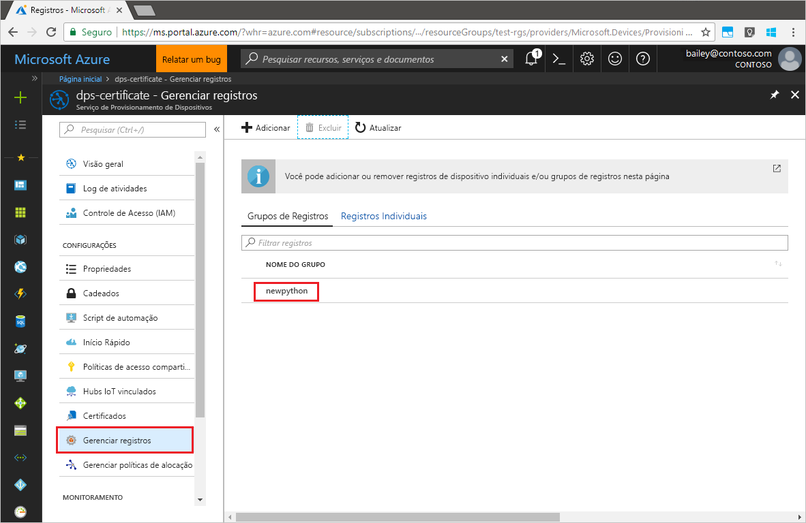

# <a name="quickstart-enroll-x509-devices-to-the-device-provisioning-service-using-python"></a>Início Rápido: Inscrever dispositivos X.509 no Serviço de Provisionamento de Dispositivos usando Python

[!INCLUDE [iot-dps-selector-quick-enroll-device-x509](../../includes/iot-dps-selector-quick-enroll-device-x509.md)]

Neste início rápido, você usará o Python para criar de maneira programática um grupo de registro que usa certificados X.509 intermediários ou de AC raiz. Um grupo de registros controla o acesso ao serviço de provisionamento para dispositivos que compartilham um certificado de autenticação comum em sua cadeia de certificados. O grupo de registro é criado com o SDK do Serviço de Provisionamento do Python e um aplicativo Python de exemplo.

## <a name="prerequisites"></a>Pré-requisitos

- Conclusão de [Configurar o Serviço de Provisionamento de Dispositivos no Hub IoT com o portal do Azure](./quick-setup-auto-provision.md).
- Uma conta do Azure com uma assinatura ativa. [Crie um gratuitamente](https://azure.microsoft.com/free/?ref=microsoft.com&utm_source=microsoft.com&utm_medium=docs&utm_campaign=visualstudio).
- [Python 2.x ou 3.x](https://www.python.org/downloads/). Adicione o Python às variáveis de ambiente específicas da plataforma. Este início rápido instalará o [SDK do Serviço de Provisionamento do Python](https://github.com/Azure/azure-iot-sdk-python/tree/v1-deprecated/provisioning_service_client) abaixo.
- [Pip](https://pip.pypa.io/en/stable/installing/), se ele não estiver incluído na distribuição do Python.
- [Git](https://git-scm.com/download/).

> [!IMPORTANT]
> Este artigo aplica-se apenas ao SDK do Python V1 preterido. Os clientes de dispositivo e serviço do Serviço de Provisionamento de Dispositivos no Hub IoT ainda não estão disponíveis na V2. Atualmente, a equipe está empenhada no trabalho de levar a V2 à paridade de recursos.

## <a name="prepare-test-certificates"></a>Preparar certificados de teste

Para este início rápido, você deve ter um arquivo .pem ou .cer que contém a parte pública de um certificado raiz ou intermediário de autoridade de certificação X.509. Este certificado deve ser carregado para o serviço de provisionamento e verificado pelo serviço.

Para obter mais informações sobre como usar a Infraestrutura de Chave Pública (PKI) do X.509 baseada em certificado com o Hub IoT do Azure e o Serviço de Provisionamento do Dispositivo, confira [Visão geral de segurança do certificado de Autoridade de Certificação do X.509](../iot-hub/iot-hub-x509ca-overview.md).

O [SDK de C do IoT do Azure](https://github.com/Azure/azure-iot-sdk-c) contém ferramentas de teste que podem ajudá-lo a criar uma cadeia de certificados X.509, carregar um certificado raiz ou intermediário a partir dessa cadeia e executar a prova de posse com o serviço para verificar o certificado. Os certificados criados com as ferramentas do SDK são projetados para uso **apenas para testes de desenvolvimento**. Esses certificados **não devem ser usados em produção**. Eles contêm senhas codificadas (“1234”) que expiram após 30 dias. Para obter informações sobre como obter certificados adequados para o uso de produção, confira [Como obter um certificado de Autoridade de Certificação X.509](../iot-hub/iot-hub-x509ca-overview.md#how-to-get-an-x509-ca-certificate) na documentação do Hub IoT do Azure.

Para usar essas ferramentas de teste para gerar certificados, execute as seguintes etapas:

1. Localize o nome da tag para a [versão mais recente](https://github.com/Azure/azure-iot-sdk-c/releases/latest) do SDK de C do Azure IoT.

2. Abra um prompt de comando ou shell do Git Bash e altere para uma pasta de trabalho em seu computador. Execute os comandos a seguir para clonar a versão mais recente do repositório do GitHub do [SDK do Azure IoT C](https://github.com/Azure/azure-iot-sdk-c). Use a tag que você encontrou na etapa anterior como o valor para o parâmetro `-b`:

    ```cmd/sh
    git clone -b <release-tag> https://github.com/Azure/azure-iot-sdk-c.git
    cd azure-iot-sdk-c
    git submodule update --init
    ```

    Essa operação deve demorar alguns minutos.

   As ferramentas de teste estão localizadas em *azure-iot-sdk-c/tools/CACertificates* do repositório clonado.

3. Siga as etapas em [Gerenciar certificados de Autoridade de Certificação de teste para exemplos e tutoriais](https://github.com/Azure/azure-iot-sdk-c/blob/master/tools/CACertificates/CACertificateOverview.md). 

## <a name="modify-the-python-sample-code"></a>Modificar o código de exemplo do Python

Esta seção mostra como adicionar os detalhes de provisionamento do dispositivo X.509 ao código de exemplo. 

1. Usando um editor de texto, crie um novo arquivo **EnrollmentGroup.py**.

1. Adicione as seguintes instruções `import` e variáveis ao início do arquivo **EnrollmentGroup.py**. Em seguida, substitua `dpsConnectionString` pela cadeia de conexão localizada em **Políticas de acesso compartilhado** no **Serviço de Provisionamento de Dispositivos** no **portal do Azure**. Substitua o espaço reservado do certificado pelo certificado criado anteriormente em [Preparar certificados de teste](quick-enroll-device-x509-python.md#prepare-test-certificates). Por fim, crie uma única `registrationid` e verifique se ela só consiste em alfanuméricos minúsculos e hifens.  
   
    ```python
    from provisioningserviceclient import ProvisioningServiceClient
    from provisioningserviceclient.models import EnrollmentGroup, AttestationMechanism

    CONNECTION_STRING = "{dpsConnectionString}"

    SIGNING_CERT = """-----BEGIN CERTIFICATE-----
    XXXXXXXXXXXXXXXXXXXXXXXXXXXXXXXXXXXXXXXXXXXXXXXXXXXXXXXXXXXXXXXX
    XXXXXXXXXXXXXXXXXXXXXXXXXXXXXXXXXXXXXXXXXXXXXXXXXXXXXXXXXXXXXXXX
    XXXXXXXXXXXXXXXXXXXXXXXXXXXXXXXXXXXXXXXXXXXXXXXXXXXXXXXXXXXXXXXX
    XXXXXXXXXXXXXXXXXXXXXXXXXXXXXXXXXXXXXXXXXXXXXXXXXXXXXXXXXXXXXXXX
    XXXXXXXXXXXXXXXXXXXXXXXXXXXXXXXXXXXXXXXXXXXXXXXXXXXXXXXXXXXXXXXX
    XXXXXXXXXXXXXXXXXXXXXXXXXXXXXXXXXXXXXXXXXXXXXXXXXXXXXXXXXXXXXXXX
    XXXXXXXXXXXXXXXXXXXXXXXXXXXXXXXXXXXXXXXXXXXXXXXXXXXXXXXXXXXXXXXX
    XXXXXXXXXXXXXXXXXXXXXXXXXXXXXXXXXXXXXXXXXXXXXXXXXXXXXXXXXXXXXXXX
    XXXXXXXXXXXXXXXXXXXXXXXXXXXXXXXXXXXXXXXXXXXXXXXXXXXXXXXXXXXXXXXX
    XXXXXXXXXXXXXXXXXXXXXXXXXXXXXXXXXXXXXXXXXXXXXXXXXXXXXXXXXXXXXXXX
    XXXXXXXXXXXXXXXXXXXXXXXXXXXXXXXXXXXXXXXXXXXXXXXXXXXXXXXXXXXXXXXX
    XXXXXXXXXXXXXXXXXXXXXXXXXXXXXXXXXXXXXXXXXXXXXXXXXXXXXXXXXXXXXXXX
    XXXXXXXXXXXXXXXXXXXXXXXXXXXXXXXXXXXXXXXXXXXXXXXXXXXXXXXXXXXXXXXX
    XXXXXXXXXXXXXXXXXXXXXXXXXXXXXXXXXXXXXXXXXXXXXXXXXXXXXXXXXXXXXXXX
    XXXXXXXXXXXXXXXXXXXXXXXXXXXXXXXXXXXXXXXXXXXXXXXXXXXXXXXX
    -----END CERTIFICATE-----"""

    GROUP_ID = "{registrationid}"
    ```

1. Adicione a seguinte função e chamada de função para implementar a criação de grupo de registro:
   
    ```python
    def main():
        print ( "Initiating enrollment group creation..." )

        psc = ProvisioningServiceClient.create_from_connection_string(CONNECTION_STRING)
        att = AttestationMechanism.create_with_x509_signing_certs(SIGNING_CERT)
        eg = EnrollmentGroup.create(GROUP_ID, att)

        eg = psc.create_or_update(eg)
    
        print ( "Enrollment group created." )

    if __name__ == '__main__':
        main()
    ```

1. Salve e feche o arquivo **EnrollmentGroup.py**.
 

## <a name="run-the-sample-group-enrollment"></a>Executar o registro do grupo de exemplo

O Serviço de Provisionamento de Dispositivos de IoT do Azure dá suporte a dois tipos de registros:

- [Grupos de registros](concepts-service.md#enrollment-group): usados para inscrever vários dispositivos relacionados.
- [Registros individuais](concepts-service.md#individual-enrollment): usados para inscrever um único dispositivo.

A criação de registros individuais usando o [SDK do Serviço de Provisionamento do Python](https://github.com/Azure/azure-iot-sdk-python/tree/v1-deprecated/provisioning_service_client) é um trabalho em andamento. Para saber mais, confira [Como controlar o acesso ao dispositivo para o serviço de provisionamento com certificados X.509](./concepts-x509-attestation.md#controlling-device-access-to-the-provisioning-service-with-x509-certificates).

1. Abra um prompt de comando e execute o seguinte comando para instalar o [azure-iot-provisioning-device-client](https://pypi.org/project/azure-iot-provisioning-device-client).

    ```cmd/sh
    pip install azure-iothub-provisioningserviceclient    
    ```

2. no prompt de comando e execute o script.

    ```cmd/sh
    python EnrollmentGroup.py
    ```

3. Observe a saída do registro bem-sucedido.

4. Navegue até seu serviço de provisionamento no Portal do Azure. Clique em **Gerenciar registros**. Observe que seu grupo de dispositivos X.509 aparece na guia **Grupos de Registro**, com o nome `registrationid` gerado anteriormente. 

      


## <a name="clean-up-resources"></a>Limpar os recursos
Se planejar explorar o exemplo do serviço Java, não limpe os recursos criados neste início rápido. Caso contrário, use as seguintes etapas para excluir todos os recursos criados por este início rápido.

1. Feche a janela de saída de exemplo do Java no computador.
1. Feche a janela _Gerador de Certificado X509_ em seu computador.
1. Navegue até o Serviço de Provisionamento de Dispositivos no portal do Azure, selecione **Gerenciar registros** e, em seguida, selecione a guia **Grupos de Registro**. Marque a caixa de seleção ao lado do *NOME DO GRUPO* para os dispositivos X.509 registrados usando este início rápido e pressione o botão **Excluir**, na parte superior do painel.    


## <a name="next-steps"></a>Próximas etapas
Neste guia de início rápido, você registrou um grupo simulado de dispositivos X.509 para o seu serviço de Provisionamento de Dispositivos. Para saber mais sobre os detalhes de configuração do dispositivo, prossiga para o tutorial de configuração do Serviço de Provisionamento de Dispositivos no portal do Azure. 

> [!div class="nextstepaction"]
> [Tutoriais do Serviço de Provisionamento de Dispositivos no Hub IoT do Azure](./tutorial-set-up-cloud.md)