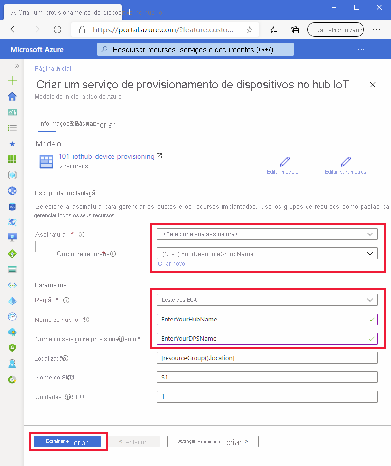

# <a name="quickstart-set-up-the-iot-hub-device-provisioning-service-dps-with-an-arm-template"></a>Início Rápido: Configurar o DPS (Serviço de Provisionamento de Dispositivos) no Hub IoT com o modelo do ARM

É possível usar o modelo do ARM ([Azure Resource Manager](../azure-resource-manager/management/overview.md)) para configurar programaticamente os recursos de nuvem do Azure necessários para o provisionamento dos dispositivos. Essas etapas mostram como criar um hub IoT e um Serviço de Provisionamento de Dispositivos no Hub IoT com um modelo do ARM. O hub IoT também é vinculado ao recurso de DPS usando o modelo. Essa vinculação permite que o recurso de DPS atribua dispositivos ao hub com base nas políticas de alocação que você configura.

[!INCLUDE [About Azure Resource Manager](../../includes/resource-manager-quickstart-introduction.md)]

Este início rápido usa o [portal do Azure](../azure-resource-manager/templates/deploy-portal.md) e a [CLI do Azure](../azure-resource-manager/templates/deploy-cli.md) para executar o programático as etapas necessárias para criar um grupo de recursos e implantar o modelo, mas você pode facilmente usar o [PowerShell](../azure-resource-manager/templates/deploy-powershell.md), .NET, Ruby ou outras linguagens de programação para executar essas etapas e implantar seu modelo. 

Se o seu ambiente atender aos pré-requisitos e você já estiver familiarizado com o uso de modelos do ARM, a seleção do botão **Implantar no Azure** abaixo abrirá o modelo para implantação no portal do Azure.

[](https://portal.azure.com/#create/Microsoft.Template/uri/https%3a%2f%2fraw.githubusercontent.com%2fAzure%2fazure-quickstart-templates%2fmaster%2f101-iothub-device-provisioning%2fazuredeploy.json)

[!INCLUDE [quickstarts-free-trial-note](../../includes/quickstarts-free-trial-note.md)]

[!INCLUDE [azure-cli-prepare-your-environment.md](../../includes/azure-cli-prepare-your-environment.md)]


## <a name="review-the-template"></a>Examinar o modelo

O modelo usado neste início rápido é proveniente dos [Modelos de Início Rápido do Azure](https://azure.microsoft.com/resources/templates/101-iothub-device-provisioning/).

> [!NOTE]
> Atualmente, não há nenhum suporte de modelo do ARM para criar registros com novos recursos do DPS. Essa é uma solicitação comum e compreendida que está sendo considerada para implementação.

:::code language="json" source="~/quickstart-templates/101-iothub-device-provisioning/azuredeploy.json":::

Há dois recursos do Azure definidos no modelo acima:

* [**Microsoft.Devices/iothubs**](/azure/templates/microsoft.devices/iothubs): cria um Hub IoT do Azure.
* [**Microsoft.Devices/provisioningservices**](/azure/templates/microsoft.devices/provisioningservices): cria um Serviço de Provisionamento de Dispositivos no Hub IoT do Azure com o novo hub IoT já vinculado a ele.


## <a name="deploy-the-template"></a>Implantar o modelo

#### <a name="deploy-with-the-portal"></a>Implantar com o Portal

1. Selecione a imagem a seguir para entrar no Azure e abrir o modelo para implantação. O modelo cria um hub IoT e o recurso de DPS. O hub será vinculado no recurso de DPS.

    [](https://portal.azure.com/#create/Microsoft.Template/uri/https%3a%2f%2fraw.githubusercontent.com%2fAzure%2fazure-quickstart-templates%2fmaster%2f101-iothub-device-provisioning%2fazuredeploy.json)

2. Selecione ou insira os valores a seguir e clique em **Examinar + Criar**.

        

    A menos que esteja especificado abaixo, use o valor padrão para criar o recurso do hub IoT e de DPS.

    | Campo | Descrição |
    | :---- | :---------- |
    | **Assinatura** | Selecione sua assinatura do Azure. |
    | **Grupo de recursos** | Clique em **Criar** e insira um nome exclusivo para o grupo de recursos. Em seguida, clique em **OK**. |
    | **Região** | Selecione uma região para seus recursos. Por exemplo, **Leste dos EUA**. |
    | **Nome do Hub IoT** | Insira um nome para o hub IoT que precisa ser globalmente exclusivo dentro do namespace *.azure-devices.net*. Você precisará do nome do hub na próxima seção ao validar a implantação. |
    | **Nome do Serviço de Provisionamento** | Insira um nome para o novo recurso DPS (Serviço de Provisionamento de Dispositivos). O nome precisa ser globalmente exclusivo no namespace *.azure-devices-provisioning.net*. Você precisará do nome DPS na próxima seção quando validar a implantação. |
    
3. Na próxima tela, leia os termos. Se você concordar com todos os termos, clique em **Criar**. 

    A implantação levará alguns momentos para ser concluída. 

    Além do portal do Azure, você também pode usar o Azure PowerShell, a CLI do Azure e a API REST. Para saber mais sobre outros métodos de implantação, confira [Implantar modelos](../azure-resource-manager/templates/deploy-powershell.md).


#### <a name="deploy-with-the-azure-cli"></a>Implantar com a CLI do Azure

O uso da CLI do Azure requer a versão 2.6 ou posterior. Se você estiver executando a CLI do Azure localmente, verifique sua versão executando: `az --version`

Entre na sua conta do Azure e selecione sua assinatura.

1. Se você estiver executando a CLI do Azure localmente em vez de executá-la no portal, será necessário fazer logon. Para fazer logon no prompt de comando, execute o [comando login](/cli/azure/get-started-with-az-cli2):
    
    ```azurecli
    az login
    ```

    Siga as instruções de autenticação usando o código e entre em sua conta do Azure por meio de um navegador da Web.

2. Se você tiver várias assinaturas do Azure, entrar o Azure lhe dará acesso a todas as contas do Azure associadas às suas credenciais. Use o seguinte comando [para listar as contas do Azure](/cli/azure/account) disponíveis para você usar:
    
    ```azurecli
    az account list -o table
    ```

    Use o comando a seguir para selecionar a assinatura que você deseja usar para executar os comandos e criar seu hub IoT e recursos de DPS. Você pode usar a ID ou nome da assinatura da saída do comando anterior:

    ```azurecli
    az account set --subscription {your subscription name or id}
    ```

3. Copie e cole os comandos a seguir no prompt da CLI. Em seguida, execute os comandos pressionando **ENTER**.
   
    > [!TIP]
    > Os comandos solicitarão uma localização do grupo de recursos. Você pode ver uma lista dos locais disponíveis executando primeiro o comando:
    >
    > `az account list-locations -o table`
    >
    >
    
    ```azurecli-interactive
    read -p "Enter a project name that is used for generating resource names:" projectName &&
    read -p "Enter the location (i.e. centralus):" location &&
    templateUri="https://raw.githubusercontent.com/Azure/azure-quickstart-templates/master/101-iothub-device-provisioning/azuredeploy.json" &&
    resourceGroupName="${projectName}rg" &&
    az group create --name $resourceGroupName --location "$location" &&
    az deployment group create --resource-group $resourceGroupName --template-uri  $templateUri &&
    echo "Press [ENTER] to continue ..." &&
    read
    ```

4. Os comandos solicitarão que você insira as informações a seguir. Forneça cada valor e pressione **ENTER**.

    | Parâmetro | Descrição |
    | :-------- | :---------- |
    | **Nome do projeto** | O valor desse parâmetro será usado para criar um grupo de recursos para armazenar todos os recursos. A cadeia de caracteres `rg` será adicionada ao final do valor para o nome do grupo de recursos. |
    | **local** | Esse valor é a região em que todos os recursos residirão. |
    | **iotHubName** | Insira um nome para o hub IoT que precisa ser globalmente exclusivo dentro do namespace *.azure-devices.net*. Você precisará do nome do hub na próxima seção ao validar a implantação. |
    | **provisioningServiceName** | Insira um nome para o novo recurso DPS (Serviço de Provisionamento de Dispositivos). O nome precisa ser globalmente exclusivo no namespace *.azure-devices-provisioning.net*. Você precisará do nome DPS na próxima seção quando validar a implantação. |

    A CLI do Azure é usada para implantar o modelo. Além da CLI do Azure, você também pode usar o Azure PowerShell, o portal do Azure e a API REST. Para saber mais sobre outros métodos de implantação, confira [Implantar modelos](../azure-resource-manager/templates/deploy-powershell.md).


## <a name="review-deployed-resources"></a>Examinar os recursos implantados

1. Para verificar a implantação, execute o seguinte [comando para listar recursos](/cli/azure/resource#az_resource_list) e procure pelo novo serviço de provisionamento e pelo hub IoT na saída:

    ```azurecli
     az resource list -g "${projectName}rg"
    ```

2. Para verificar se o hub já está vinculado ao recurso de DPS, execute o [comando DPS extension show](/cli/azure/iot/dps#az_iot_dps_show) a seguir.

    ```azurecli
     az iot dps show --name <Your provisioningServiceName>
    ```

    Observe os hubs que estão vinculados ao membro `iotHubs`.


## <a name="clean-up-resources"></a>Limpar os recursos

Outros inícios rápidos nessa coleção aproveitam esse início rápido. Se você planeja continuar trabalhando com inícios rápidos subsequentes ou com os tutoriais, não limpe os recursos criados nesse início rápido. Se você não planeja continuar, pode usar o portal do Azure ou a CLI do Azure para excluir o grupo de recursos e todos os recursos dele.

Para excluir um grupo de recursos e todos os recursos dele do portal do Azure, basta abrir o grupo de recursos e clicar em **Excluir grupo de recursos** na parte superior.

Para excluir o grupo de recursos implantado usando a CLI do Azure:

```azurecli
az group delete --name "${projectName}rg"
```

Você também pode excluir grupos de recursos e recursos individuais usando o Portal do Azure, o PowerShell e APIs REST, além de SDKs de plataforma com suporte publicados para o Azure Resource Manager ou o Serviço de Provisionamento de Dispositivos no Hub IoT.

## <a name="next-steps"></a>Próximas etapas

Neste Início Rápido, você implantou um Hub IoT e uma instância do Serviço de Provisionamento de Dispositivos, bem como vinculou os dois recursos. Para aprender a usar essa configuração a fim de provisionar um dispositivo, prossiga para o Início Rápido de criação de dispositivo.

> [!div class="nextstepaction"]
> [Início rápido para provisionar um dispositivo](./quick-create-simulated-device-symm-key.md)
