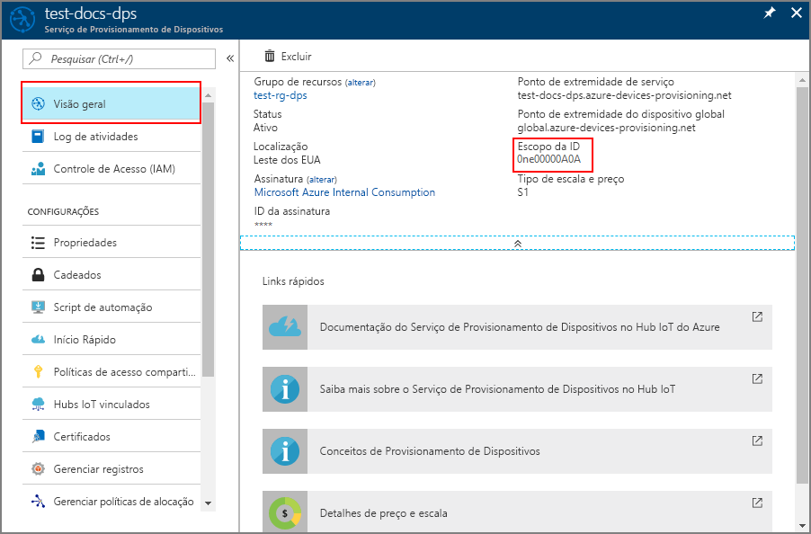

# <a name="tutorial-use-custom-allocation-policies-with-device-provisioning-service-dps"></a>Tutorial: Usar as políticas de alocação personalizadas com o DPS (Serviço de Provisionamento de Dispositivos)

Uma política de alocação personalizada proporciona a você mais controle sobre como os dispositivos são atribuídos a um Hub IoT. Isso é feito usando código personalizado em uma [função do Azure](../azure-functions/functions-overview.md) executada durante o provisionamento para atribuir dispositivos a um Hub IoT. O serviço de provisionamento de dispositivos chama o código de função do Azure, fornecendo todas as informações relevantes sobre o dispositivo e o registro. O código de função é executado e retorna as informações do Hub IoT para provisionar o dispositivo.

Por meio de políticas de alocação personalizadas, você define suas políticas de alocação quando as políticas fornecidas pelo Serviço de Provisionamento de Dispositivos não atendem aos requisitos do seu cenário.

Por exemplo, talvez você queira examinar o certificado que um dispositivo está usando durante o provisionamento e atribuir o dispositivo a um Hub IoT com base em uma propriedade de certificado. Ou talvez você tenha informações armazenadas em um banco de dados para seus dispositivos e precise consultar o banco de dados para determinar a qual Hub IoT um dispositivo deve ser atribuído.

Este artigo demonstra um grupo de registro com uma política de alocação personalizada que usa uma função do Azure escrita C# para provisionar dispositivos de resistência usando chaves simétricas. Qualquer dispositivo não reconhecido como um dispositivo de resistência não será provisionado para um hub IoT.

Os dispositivos solicitarão o provisionamento usando um código de exemplo de provisionamento incluído no [SDK de C do IoT do Azure](https://github.com/Azure/azure-iot-sdk-c).


Neste tutorial, você fará o seguinte:

> [!div class="checklist"]
> * Criar um Aplicativo de Funções do Azure para dar suporte a uma função de alocação personalizada
> * Criar um registro de grupo usando uma função do Azure para a política de alocação personalizada
> * Criar chaves de dispositivo para dois dispositivos
> * Configurar o ambiente de desenvolvimento para o código do dispositivo de exemplo do [SDK de C do IoT do Azure](https://github.com/Azure/azure-iot-sdk-c)
> * Executar os dispositivos e verificar se eles são provisionados de acordo com a política de alocação personalizada


[!INCLUDE [quickstarts-free-trial-note](../../includes/quickstarts-free-trial-note.md)]

## <a name="prerequisites"></a>Pré-requisitos

* Este artigo pressupõe que você concluiu as etapas em [Configurar o Serviço de Provisionamento de Dispositivos no Hub IoT com o portal do Azure](./quick-setup-auto-provision.md) para criar sua instância do Hub IoT e do DPS.

* Versão mais recente do [Git](https://git-scm.com/download/) instalada.

* Para um ambiente de desenvolvimento Windows, o [Visual Studio](https://visualstudio.microsoft.com/vs/) 2019 com a carga de trabalho ['Desenvolvimento de área de trabalho com C++'](/cpp/ide/using-the-visual-studio-ide-for-cpp-desktop-development) habilitada é necessário. Também há suporte para o Visual Studio 2015 e o Visual Studio 2017.

* Para Linux ou macOS, confira a seção apropriada em [Preparar seu ambiente de desenvolvimento](https://github.com/Azure/azure-iot-sdk-c/blob/master/doc/devbox_setup.md) na documentação do [SDK de C do Azure IoT](https://github.com/Azure/azure-iot-sdk-c).


[!INCLUDE [cloud-shell-try-it.md](../../includes/cloud-shell-try-it.md)]

## <a name="create-the-custom-allocation-function"></a>Criar a função de alocação personalizada

Nesta seção, você criará uma função do Azure que implementa sua política de alocação personalizada. Essa função decide se um dispositivo deve ser registrado em seu Hub IoT com base na condição de uma ID de registro conter ou não o prefixo de cadeia de caracteres **contoso-toaster**.

1. Entre no [portal do Azure](https://portal.azure.com). Na home page, selecione **+ Criar um recurso**.

2. Na caixa de pesquisa *Pesquisar o Marketplace*, digite "Aplicativo de Funções". Na lista suspensa, selecione **Aplicativo de Funções** e selecione **Criar**.

3. Na página de criação do **Aplicativo de Funções**, na guia **Noções Básicas**, insira as seguintes configurações para seu novo aplicativo de funções e selecione **Examinar + criar**:

    **Assinatura**: se você tiver várias assinaturas e a assinatura desejada não estiver selecionada, selecione a assinatura que deseja usar.

    **Grupo de Recursos**: este campo permite que você crie um grupo de recursos ou escolha um existente para conter o aplicativo de funções. Escolha o mesmo grupo de recursos que contenha o hub IoT criado para teste anteriormente, por exemplo, **TestResources**. Ao colocar todos os recursos relacionados em um grupo, você pode gerenciá-los juntos.

    **Nome do aplicativo de funções**: Insira um nome de aplicativo de funções exclusivo. Este exemplo usa **contoso-function-app**.

    **Publicar**: verifique se **Código** está selecionado.

    **Pilha de Runtime**: selecione um **.NET Core** no menu suspenso.

    **Região**: selecione a mesma região que seu grupo de recursos. Este exemplo usa **Oeste dos EUA**.

    > [!NOTE]
    > Por padrão, o Application Insights está habilitado. O Application Insights não é necessário para este artigo, mas pode ajudar você a entender e investigar os problemas encontrados com a alocação personalizada. Se preferir, você poderá desabilitar o Application Insights selecionando a guia **Monitoramento** e escolhendo **Não** para **Habilitar o Application Insights**.

    

4. Na página **Resumo**, selecione **Criar** para criar o aplicativo de funções. A implantação pode levar vários minutos. Quando ela for concluída, selecione **Ir para o recurso**.

5. No painel esquerdo, em **Funções**, clique em **Funções** e em **+ Adicionar** para adicionar uma função.

6. Na página modelos, selecione o bloco **Gatilho HTTP** e **Criar Função**. Uma função chamada **HttpTrigger1** é criada, e o portal exibe a página de visão geral da sua função.

7. Clique em **Codificar + Testar** para sua nova função. O portal exibe o conteúdo do arquivo **run.csx**. 

8. Substitua o código da função **HttpTrigger1** pelo código a seguir e selecione **Salvar**. Seu código de alocação personalizado está pronto para ser usado.

    ```csharp
    #r "Newtonsoft.Json"

    using System.Net;
    using Microsoft.AspNetCore.Mvc;
    using Microsoft.Extensions.Primitives;
    using Newtonsoft.Json;

    public static async Task<IActionResult> Run(HttpRequest req, ILogger log)
    {
        log.LogInformation("C# HTTP trigger function processed a request.");

        // Get request body
        string requestBody = await new StreamReader(req.Body).ReadToEndAsync();
        dynamic data = JsonConvert.DeserializeObject(requestBody);

        log.LogInformation("Request.Body:...");
        log.LogInformation(requestBody);

        // Get registration ID of the device
        string regId = data?.deviceRuntimeContext?.registrationId;

        string message = "Uncaught error";
        bool fail = false;
        ResponseObj obj = new ResponseObj();

        if (regId == null)
        {
            message = "Registration ID not provided for the device.";
            log.LogInformation("Registration ID : NULL");
            fail = true;
        }
        else
        {
            string[] hubs = data?.linkedHubs.ToObject<string[]>();

            // Must have hubs selected on the enrollment
            if (hubs == null)
            {
                message = "No hub group defined for the enrollment.";
                log.LogInformation("linkedHubs : NULL");
                fail = true;
            }
            else
            {
                // This is a Contoso Toaster 
                if (regId.Contains("contoso-toaster"))
                {
                    //Log IoT hubs configured for the enrollment
                    foreach(string hubString in hubs)
                    {
                        log.LogInformation("linkedHub : " + hubString);
                    }

                    obj.iotHubHostName = hubs[0];
                    log.LogInformation("Selected hub : " + obj.iotHubHostName);
                }
                else
                {
                    fail = true;
                    message = "Unrecognized device registration.";
                    log.LogInformation("Unknown device registration");
                }
            }
        }

        log.LogInformation("\nResponse");
        log.LogInformation((obj.iotHubHostName != null) ? JsonConvert.SerializeObject(obj) : message);

        return (fail)
            ? new BadRequestObjectResult(message) 
            : (ActionResult)new OkObjectResult(obj);
    }

    public class ResponseObj
    {
        public string iotHubHostName {get; set;}
    }
    ```

9. Logo embaixo da parte inferior do arquivo de código **run.csx**, clique em **Logs** para monitorar o registro em log da função de alocação personalizada. 


## <a name="create-the-enrollment"></a>Criar o registro

Nesta seção, você criará um grupo de registro que usará a política de alocação personalizada. Para simplificar, este artigo usa o [Atestado de chave simétrica](concepts-symmetric-key-attestation.md) com o registro. Para uma solução mais segura, considere usar o [Atestado de certificado X.509](concepts-x509-attestation.md) com uma cadeia de confiança.

1. Ainda no [portal do Azure](https://portal.azure.com), abra seu serviço de provisionamento.

2. Selecione **Gerenciar registros** no painel esquerdo e o botão **Adicionar grupo de registros** na parte superior da página.

3. Em **Adicionar Grupo de Registros**, insira as informações na tabela abaixo e clique no botão **Salvar**.

    | Campo | Descrição e/ou valor sugerido |
    | :---- | :----------------------------- |
    | **Nome do grupo** | Insira **contoso-custom-allocated-devices** |
    | **Tipo de Atestado** | selecione **Chave Simétrica** |
    | **Gerar Chaves Automaticamente** | esta caixa de seleção já deve estar marcada. |
    | **Selecione como deseja atribuir dispositivos aos hubs** | Selecione **Personalizado (Usar o Azure Functions)** |
    | **Selecione os hubs IoT ao quais este grupo pode ser atribuído** | Selecione o hub IoT criado anteriormente quando você concluiu o início rápido. |
    | **Selecionar o Azure Functions** | Selecione a assinatura que contém o aplicativo de funções criado. Em seguida, selecione o **contoso-function-app** e **HttpTrigger1** para a função. |

    

4. Após salvar o registro, abra-o novamente e anote a **Chave primária**. Para que as chaves sejam geradas, é preciso primeiro salvar o registro. Essa chave simétrica primária será usada para gerar chaves de dispositivo exclusivas para dispositivos que tentam provisionar posteriormente. 

## <a name="derive-unique-device-keys"></a>Derivar chaves de dispositivo exclusivas

Os dispositivos não usam a chave simétrica primária diretamente. Em vez disso, use a chave primária para derivar uma chave de dispositivo para cada dispositivo. Nesta seção, você criará duas chaves de dispositivo exclusivas. Uma chave será usada para um dispositivo de resistência simulado. A outra chave será usada para um dispositivo de bomba térmica simulado. As chaves geradas permitirão que ambos os dispositivos tentem um registro. Somente uma ID de registro de dispositivo terá um sufixo válido a ser aceito pelo código de exemplo da política de alocação personalizada. Como resultado, uma delas será aceita e a outra, rejeitada

Para gerar a chave de dispositivo, use a chave simétrica que você anotou anteriormente para calcular o [HMAC-SHA256](https://wikipedia.org/wiki/HMAC) da ID de registro do dispositivo para cada dispositivo e converta o resultado no formato Base64. Para obter mais informações sobre como criar chaves de dispositivo derivadas com grupos de registro, veja a seção de registros de grupo de [Atestado de chave simétrica](concepts-symmetric-key-attestation.md).

Para o exemplo deste artigo, use as seguintes duas IDs de registro de dispositivo com o código abaixo para computar uma chave de dispositivo para ambos os dispositivo:

* **contoso-toaster-007**
* **contoso-heatpump-088**

Substitua o valor da variável **KEY** pela **Chave Primária** que você anotou anteriormente após a criação do grupo de registro. O valor e a saída da chave mostrados com o código abaixo são apenas um exemplo.

#### <a name="powershell"></a>[PowerShell](#tab/powershell)

Se estiver usando uma estação de trabalho baseada no Windows, você poderá usar o PowerShell para gerar sua chave de dispositivo derivada, conforme mostrado no exemplo a seguir.

```powershell
$KEY='oiK77Oy7rBw8YB6IS6ukRChAw+Yq6GC61RMrPLSTiOOtdI+XDu0LmLuNm11p+qv2I+adqGUdZHm46zXAQdZoOA=='

$REG_ID1='contoso-toaster-007'
$REG_ID2='contoso-heatpump-088'

$hmacsha256 = New-Object System.Security.Cryptography.HMACSHA256
$hmacsha256.key = [Convert]::FromBase64String($key)
$sig1 = $hmacsha256.ComputeHash([Text.Encoding]::ASCII.GetBytes($REG_ID1))
$sig2 = $hmacsha256.ComputeHash([Text.Encoding]::ASCII.GetBytes($REG_ID2))
$derivedkey1 = [Convert]::ToBase64String($sig1)
$derivedkey2 = [Convert]::ToBase64String($sig2)

echo "`n`n$REG_ID1 : $derivedkey1`n$REG_ID2 : $derivedkey2`n`n"
```

```powershell
contoso-toaster-007 : JC8F96eayuQwwz+PkE7IzjH2lIAjCUnAa61tDigBnSs=
contoso-heatpump-088 : 6uejA9PfkQgmYylj8Zerp3kcbeVrGZ172YLa7VSnJzg=
```

#### <a name="bash"></a>[Bash](#tab/bash)

Se estiver usando uma estação de trabalho do Linux, você poderá usar openssl para gerar suas chaves de dispositivo derivadas, conforme mostrado no exemplo Bash a seguir.

```bash
KEY=oiK77Oy7rBw8YB6IS6ukRChAw+Yq6GC61RMrPLSTiOOtdI+XDu0LmLuNm11p+qv2I+adqGUdZHm46zXAQdZoOA==

REG_ID1=contoso-toaster-007
REG_ID2=contoso-heatpump-088

keybytes=$(echo $KEY | base64 --decode | xxd -p -u -c 1000)
devkey1=$(echo -n $REG_ID1 | openssl sha256 -mac HMAC -macopt hexkey:$keybytes -binary | base64)
devkey2=$(echo -n $REG_ID2 | openssl sha256 -mac HMAC -macopt hexkey:$keybytes -binary | base64)

echo -e $"\n\n$REG_ID1 : $devkey1\n$REG_ID2 : $devkey2\n\n"
```

```bash
contoso-toaster-007 : JC8F96eayuQwwz+PkE7IzjH2lIAjCUnAa61tDigBnSs=
contoso-heatpump-088 : 6uejA9PfkQgmYylj8Zerp3kcbeVrGZ172YLa7VSnJzg=
```

---


## <a name="prepare-an-azure-iot-c-sdk-development-environment"></a>Preparar um ambiente de desenvolvimento do SDK de C do IoT do Azure

Os dispositivos solicitarão o provisionamento usando um código de exemplo de provisionamento incluído no [SDK de C do IoT do Azure](https://github.com/Azure/azure-iot-sdk-c).

Nesta seção, você preparará o ambiente de desenvolvimento usado para criar o [SDK de C do IoT do Azure](https://github.com/Azure/azure-iot-sdk-c). O SDK inclui o código de exemplo para o dispositivo simulado. Este dispositivo simulado tentará realizar provisionamento durante a sequência de inicialização do dispositivo.

Esta seção é voltada para uma estação de trabalho baseada em Windows. Para obter um exemplo de Linux, consulte a configuração das VMs em [Como provisionar para multilocação](how-to-provision-multitenant.md).

1. Baixe o [sistema de build CMake](https://cmake.org/download/).

    É importante que os pré-requisitos do Visual Studio (Visual Studio e a carga de trabalho de "Desenvolvimento para Desktop com C++") estejam instalados em seu computador, **antes** da instalação de `CMake`. Após a instalação dos pré-requisitos e verificação do download, instale o sistema de compilação CMake.

2. Localize o nome da tag para a [versão mais recente](https://github.com/Azure/azure-iot-sdk-c/releases/latest) do SDK.

3. Abra um prompt de comando ou o shell Bash do Git. Execute os comandos a seguir para clonar a versão mais recente do repositório do GitHub do [SDK do Azure IoT C](https://github.com/Azure/azure-iot-sdk-c). Use a tag que você encontrou na etapa anterior como o valor para o parâmetro `-b`:

    ```cmd/sh
    git clone -b <release-tag> https://github.com/Azure/azure-iot-sdk-c.git
    cd azure-iot-sdk-c
    git submodule update --init
    ```

    Essa operação deve demorar alguns minutos.

4. Crie um subdiretório `cmake` no diretório raiz do repositório git e navegue até essa pasta. Execute os seguintes comandos do diretório `azure-iot-sdk-c`:

    ```cmd/sh
    mkdir cmake
    cd cmake
    ```

5. Execute o comando a seguir, que cria uma versão do SDK específica para a plataforma cliente de desenvolvimento. Uma solução do Visual Studio para o dispositivo simulado será gerada no diretório `cmake`. 

    ```cmd
    cmake -Dhsm_type_symm_key:BOOL=ON -Duse_prov_client:BOOL=ON  ..
    ```

    Se `cmake` não conseguir encontrar o compilador do C++, você poderá obter erros de build ao executar o comando. Se isso acontecer, tente executar o comando no [prompt de comando do Visual Studio](/dotnet/framework/tools/developer-command-prompt-for-vs).

    Após o sucesso da compilação, as últimas linhas de saída serão semelhantes à seguinte saída:

    ```cmd/sh
    $ cmake -Dhsm_type_symm_key:BOOL=ON -Duse_prov_client:BOOL=ON  ..
    -- Building for: Visual Studio 15 2017
    -- Selecting Windows SDK version 10.0.16299.0 to target Windows 10.0.17134.
    -- The C compiler identification is MSVC 19.12.25835.0
    -- The CXX compiler identification is MSVC 19.12.25835.0

    ...

    -- Configuring done
    -- Generating done
    -- Build files have been written to: E:/IoT Testing/azure-iot-sdk-c/cmake
    ```

## <a name="simulate-the-devices"></a>Simular os dispositivos

Nesta seção, você atualizará um exemplo de provisionamento denominado **prov\_dev\_client\_sample** localizado no SDK de C do IoT do Azure configurado anteriormente.

Esse código de exemplo simula uma sequência de inicialização do dispositivo que envia a solicitação de provisionamento à sua instância do Serviço de Provisionamento de Dispositivos. A sequência de inicialização fará com que o dispositivo de resistência seja reconhecido e atribuído ao Hub IoT usando a política de alocação personalizada.

1. No portal do Azure, selecione a guia **Visão Geral** de seu serviço de Provisionamento de Dispositivos e anote o valor de **_Escopo da ID_**.

     

2. No Visual Studio, abra o arquivo de solução **azure_iot_sdks.sln**, que foi gerado pela execução de CMake anteriormente. O arquivo da solução deve estar no seguinte local:

    ```
    azure-iot-sdk-c\cmake\azure_iot_sdks.sln
    ```

3. Na janela *Gerenciador de Soluções* do Visual Studio, navegue até a pasta **Provisionar\_Exemplos**. Expanda o projeto de exemplo chamado **prov\_dev\_client\_sample**. Expanda **Arquivos de Origem** e abra **prov\_dev\_client\_sample.c**.

4. Localize a constante `id_scope` e substitua o valor pelo seu valor de **Escopo de ID** copiado anteriormente. 

    ```c
    static const char* id_scope = "0ne00002193";
    ```

5. Encontre a definição da função `main()` no mesmo arquivo. Certifique-se de que a variável `hsm_type` está configurada para `SECURE_DEVICE_TYPE_SYMMETRIC_KEY`, conforme mostrado abaixo:

    ```c
    SECURE_DEVICE_TYPE hsm_type;
    //hsm_type = SECURE_DEVICE_TYPE_TPM;
    //hsm_type = SECURE_DEVICE_TYPE_X509;
    hsm_type = SECURE_DEVICE_TYPE_SYMMETRIC_KEY;
    ```

6. Na função `main()`, localize a chamada para `Prov_Device_Register_Device()`. Logo antes dessa chamada, adicione as linhas de código a seguir que usam [`Prov_Device_Set_Provisioning_Payload()`](/azure/iot-hub/iot-c-sdk-ref/prov-device-client-h/prov-device-set-provisioning-payload) para passar um conteúdo JSON personalizado durante o provisionamento. Isso pode ser usado para fornecer mais informações às suas funções de alocação personalizadas. Isso também pode ser usado para passar o tipo de dispositivo em vez de examinar a ID de registro. Para obter mais informações sobre como enviar e receber cargas de dados personalizadas com o DPS, confira [Como transferir cargas entre dispositivos e DPS](how-to-send-additional-data.md).

    ```c
    // An example custom payload
    const char* custom_json_payload = "{\"MyDeviceFirmwareVersion\":\"12.0.2.5\",\"MyDeviceProvisioningVersion\":\"1.0.0.0\"}";

    prov_device_result = Prov_Device_Set_Provisioning_Payload(prov_device_handle, custom_json_payload);
    if (prov_device_result != PROV_DEVICE_RESULT_OK)
    {
        (void)printf("\r\nFailure setting provisioning payload: %s\r\n", MU_ENUM_TO_STRING(PROV_DEVICE_RESULT, prov_device_result));
    }
    ```

7. Clique com botão direito do mouse no projeto **prov\_dev\_client\_sample** e selecione **Definir como Projeto de Inicialização**.

### <a name="simulate-the-contoso-toaster-device"></a>Simular o dispositivo de resistência da Contoso

1. Para simular o dispositivo de resistência, localize a chamada para `prov_dev_set_symmetric_key_info()` em **prov\_dev\_client\_sample.c** que é comentado.

    ```c
    // Set the symmetric key if using they auth type
    //prov_dev_set_symmetric_key_info("<symm_registration_id>", "<symmetric_Key>");
    ```

    Remova a marca de comentário da chamada de função e substitua os valores de espaço reservado (incluindo os colchetes angulares) pela ID de registro da resistência e a chave de dispositivo derivada gerada anteriormente. O valor da chave **JC8F96eayuQwwz+PkE7IzjH2lIAjCUnAa61tDigBnSs=** mostrado abaixo é fornecido apenas como um exemplo.

    ```c
    // Set the symmetric key if using they auth type
    prov_dev_set_symmetric_key_info("contoso-toaster-007", "JC8F96eayuQwwz+PkE7IzjH2lIAjCUnAa61tDigBnSs=");
    ```

    Salve o arquivo.

2. No menu do Visual Studio, selecione **Depurar** > **Iniciar sem depuração** para executar a solução. No prompt para recompilar o projeto, selecione **Sim** para recompilar o projeto antes da execução.

    O texto a seguir é um exemplo de registro em log da saída do código da função de alocação personalizada em execução para o dispositivo torradeira. Observe que um hub foi selecionado com êxito para um dispositivo de resistência. Observe também o membro `payload` que contém o conteúdo JSON personalizado que você adicionou ao código. Ele está disponível para o seu código usar dentro do `deviceRuntimeContext`.

    Esse log está disponível clicando em **Logs** no código de função no portal:

    ```cmd
    2020-09-23T11:44:37.505 [Information] Executing 'Functions.HttpTrigger1' (Reason='This function was programmatically called via the host APIs.', Id=4596d45e-086f-4e86-929b-4a02814eee40)
    2020-09-23T11:44:41.380 [Information] C# HTTP trigger function processed a request.
    2020-09-23T11:44:41.381 [Information] Request.Body:...
    2020-09-23T11:44:41.381 [Information] {"enrollmentGroup":{"enrollmentGroupId":"contoso-custom-allocated-devices","attestation":{"type":"symmetricKey"},"capabilities":{"iotEdge":false},"etag":"\"e8002126-0000-0100-0000-5f6b2a570000\"","provisioningStatus":"enabled","reprovisionPolicy":{"updateHubAssignment":true,"migrateDeviceData":true},"createdDateTimeUtc":"2020-09-23T10:58:31.62286Z","lastUpdatedDateTimeUtc":"2020-09-23T10:58:31.62286Z","allocationPolicy":"custom","iotHubs":["contoso-toasters-hub-1098.azure-devices.net"],"customAllocationDefinition":{"webhookUrl":"https://contoso-function-app.azurewebsites.net/api/HttpTrigger1?****","apiVersion":"2019-03-31"}},"deviceRuntimeContext":{"registrationId":"contoso-toaster-007","symmetricKey":{},"payload":{"MyDeviceFirmwareVersion":"12.0.2.5","MyDeviceProvisioningVersion":"1.0.0.0"}},"linkedHubs":["contoso-toasters-hub-1098.azure-devices.net"]}
    2020-09-23T11:44:41.687 [Information] linkedHub : contoso-toasters-hub-1098.azure-devices.net
    2020-09-23T11:44:41.688 [Information] Selected hub : contoso-toasters-hub-1098.azure-devices.net
    2020-09-23T11:44:41.688 [Information] Response
    2020-09-23T11:44:41.688 [Information] {"iotHubHostName":"contoso-toasters-hub-1098.azure-devices.net"}
    2020-09-23T11:44:41.689 [Information] Executed 'Functions.HttpTrigger1' (Succeeded, Id=4596d45e-086f-4e86-929b-4a02814eee40, Duration=4347ms)    
    ```

    A seguinte saída do dispositivo de exemplo mostra o dispositivo de resistência simulado inicializando com êxito e conectando-se à instância do serviço de provisionamento a ser atribuído ao Hub IoT de resistências pela política de alocação personalizada:

    ```cmd
    Provisioning API Version: 1.3.6

    Registering Device

    Provisioning Status: PROV_DEVICE_REG_STATUS_CONNECTED
    Provisioning Status: PROV_DEVICE_REG_STATUS_ASSIGNING
    Provisioning Status: PROV_DEVICE_REG_STATUS_ASSIGNING

    Registration Information received from service: contoso-toasters-hub-1098.azure-devices.net, deviceId: contoso-toaster-007

    Press enter key to exit:
    ```

### <a name="simulate-the-contoso-heat-pump-device"></a>Simular o dispositivo de bomba térmica da Contoso

1. Para simular o dispositivo de bomba térmica, atualize a chamada para `prov_dev_set_symmetric_key_info()` em **prov\_dev\_client\_sample.c** novamente com a ID de registro de bomba térmica e a chave do dispositivo derivada gerada anteriormente. O valor de chave **6uejA9PfkQgmYylj8Zerp3kcbeVrGZ172YLa7VSnJzg=** mostrado abaixo também é fornecido apenas como um exemplo.

    ```c
    // Set the symmetric key if using they auth type
    prov_dev_set_symmetric_key_info("contoso-heatpump-088", "6uejA9PfkQgmYylj8Zerp3kcbeVrGZ172YLa7VSnJzg=");
    ```

    Salve o arquivo.

2. No menu do Visual Studio, selecione **Depurar** > **Iniciar sem depuração** para executar a solução. No prompt para recompilar o projeto, selecione **Sim** para recompilar o projeto antes da execução.

    O texto a seguir é um exemplo de registro em log da saída do código da função de alocação personalizada em execução para o dispositivo de bomba de calor. A política de alocação personalizada rejeita esse registro com um erro HTTP 400 Solicitação Incorreta. Observe o membro `payload` que contém o conteúdo JSON personalizado que você adicionou ao código. Ele está disponível para o seu código usar dentro do `deviceRuntimeContext`.

    Esse log está disponível clicando em **Logs** no código de função no portal:

    ```cmd
    2020-09-23T11:50:23.652 [Information] Executing 'Functions.HttpTrigger1' (Reason='This function was programmatically called via the host APIs.', Id=2fa77f10-42f8-43fe-88d9-a8c01d4d3f68)
    2020-09-23T11:50:23.653 [Information] C# HTTP trigger function processed a request.
    2020-09-23T11:50:23.654 [Information] Request.Body:...
    2020-09-23T11:50:23.654 [Information] {"enrollmentGroup":{"enrollmentGroupId":"contoso-custom-allocated-devices","attestation":{"type":"symmetricKey"},"capabilities":{"iotEdge":false},"etag":"\"e8002126-0000-0100-0000-5f6b2a570000\"","provisioningStatus":"enabled","reprovisionPolicy":{"updateHubAssignment":true,"migrateDeviceData":true},"createdDateTimeUtc":"2020-09-23T10:58:31.62286Z","lastUpdatedDateTimeUtc":"2020-09-23T10:58:31.62286Z","allocationPolicy":"custom","iotHubs":["contoso-toasters-hub-1098.azure-devices.net"],"customAllocationDefinition":{"webhookUrl":"https://contoso-function-app.azurewebsites.net/api/HttpTrigger1?****","apiVersion":"2019-03-31"}},"deviceRuntimeContext":{"registrationId":"contoso-heatpump-088","symmetricKey":{},"payload":{"MyDeviceFirmwareVersion":"12.0.2.5","MyDeviceProvisioningVersion":"1.0.0.0"}},"linkedHubs":["contoso-toasters-hub-1098.azure-devices.net"]}
    2020-09-23T11:50:23.654 [Information] Unknown device registration
    2020-09-23T11:50:23.654 [Information] Response
    2020-09-23T11:50:23.654 [Information] Unrecognized device registration.
    2020-09-23T11:50:23.655 [Information] Executed 'Functions.HttpTrigger1' (Succeeded, Id=2fa77f10-42f8-43fe-88d9-a8c01d4d3f68, Duration=11ms)
    ```

    A saída do dispositivo de exemplo a seguir mostra o dispositivo de bomba de calor simulado inicializando e conectando-se à instância de serviço de provisionamento para tentar o registro em um hub IoT que usa a política de alocação personalizada. Isso falha com o erro (`Custom allocation failed with status code: 400`), já que a política de alocação personalizada foi criada para permitir apenas dispositivos de resistência:


    ```cmd
    Provisioning API Version: 1.3.7
    
    Registering Device
    
    Provisioning Status: PROV_DEVICE_REG_STATUS_CONNECTED
    Provisioning Status: PROV_DEVICE_REG_STATUS_ASSIGNING
    Provisioning Status: PROV_DEVICE_REG_STATUS_ASSIGNING
    Error: Time:Wed Sep 23 13:06:01 2020 File:d:\testing\azure-iot-sdk-c\provisioning_client\src\prov_device_ll_client.c Func:_prov_transport_process_json_reply Line:658 Provisioning Failure: OperationId: 4.eb89f3e8407a3711.2525bd34-02e9-4e91-a9c0-4dbc4ad5de66 - Date: 2020-09-23T17:05:58.2363145Z - Msg: Custom allocation failed with status code: 400
    Error: Time:Wed Sep 23 13:06:01 2020 File:d:\testing\azure-iot-sdk-c\provisioning_client\src\prov_transport_mqtt_common.c Func:_prov_transport_common_mqtt_dowork Line:1014 Unable to process registration reply.
    Error: Time:Wed Sep 23 13:06:01 2020 File:d:\testing\azure-iot-sdk-c\provisioning_client\src\prov_device_ll_client.c Func:_on_transport_registration_data Line:770 Failure retrieving data from the provisioning service
    
    Failure registering device: PROV_DEVICE_RESULT_DEV_AUTH_ERROR
    Press enter key to exit:    
    ```
    
## <a name="clean-up-resources"></a>Limpar os recursos

Caso planeje continuar trabalhando com os recursos criados neste artigo, você pode mantê-los. Caso contrário, continue usando as etapas a seguir para excluir todos os recursos criados por este artigo, a fim de evitar alterações desnecessárias.

As etapas aqui supõem que você criou todos os recursos neste artigo, conforme instruído no mesmo grupo de recursos chamado **contoso-us-resource-group**.

> [!IMPORTANT]
> A exclusão de um grupo de recursos é irreversível. O grupo de recursos e todos os recursos contidos nele são excluídos permanentemente. Não exclua acidentalmente grupo de recursos ou recursos incorretos. Caso tenha criado o Hub IoT dentro de um grupo de recursos existente que contém recursos que você deseja manter, exclua apenas o próprio recurso do Hub IoT em vez de excluir o grupo de recursos.
>

Para excluir o grupo de recursos por nome:

1. Entre no [portal do Azure](https://portal.azure.com) e selecione **Grupos de recursos**.

2. Na caixa de texto **Filtrar por nome...**, digite o nome do grupo de recursos que contém seus recursos, **contoso-us-resource-group**. 

3. À direita do seu grupo de recursos, na lista de resultados, selecione **...** e **Excluir grupo de recursos**.

4. Você receberá uma solicitação para confirmar a exclusão do grupo de recursos. Digite o nome do grupo de recursos novamente para confirmar e selecione **Excluir**. Após alguns instantes, o grupo de recursos, e todos os recursos contidos nele, serão excluídos.

## <a name="next-steps"></a>Próximas etapas

* Para obter um exemplo mais aprofundado da política de alocação personalizada, confira [Como usar políticas de alocação personalizadas](how-to-use-custom-allocation-policies.md).
* Para saber mais sobre reprovisionamento, confira [Conceitos de reprovisionamento de dispositivos no Hub IoT](concepts-device-reprovision.md).
* Para saber mais sobre desprovisionamento, confira [Como desprovisionar dispositivos provisionados anteriormente de maneira automática](how-to-unprovision-devices.md).