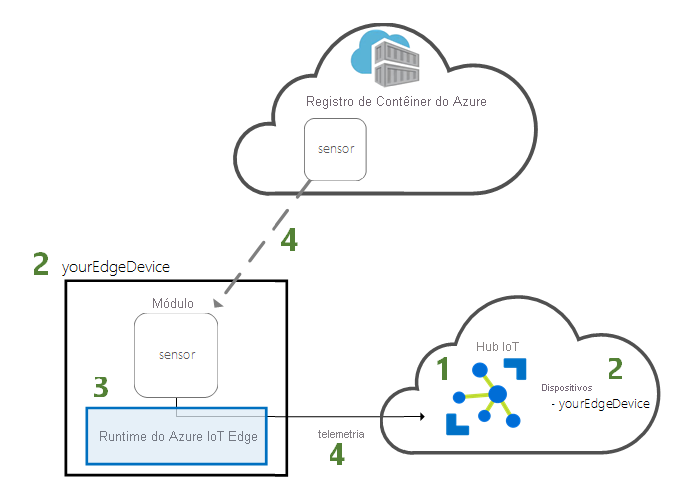
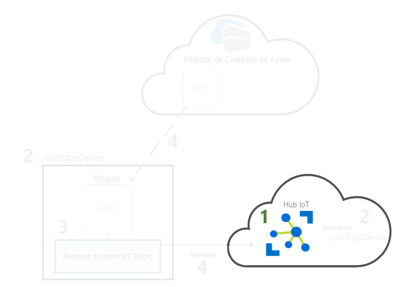
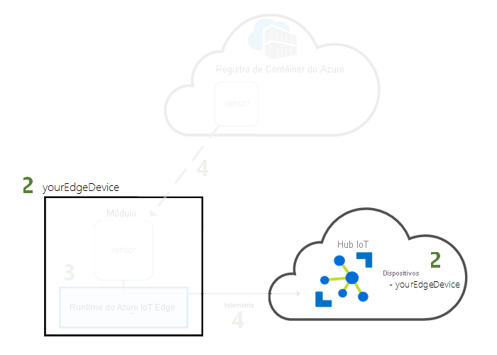
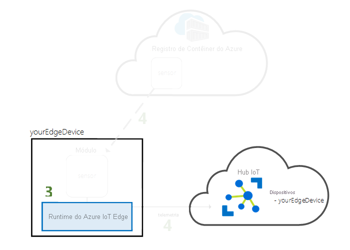
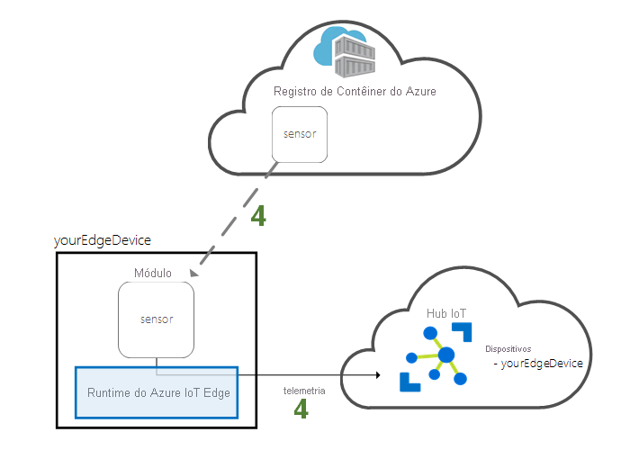

# <a name="quickstart-deploy-your-first-iot-edge-module-to-a-windows-device-preview"></a>Início rápido: Implantar seu primeiro módulo do IoT Edge em um dispositivo Windows (versão prévia)

[!INCLUDE [iot-edge-version-201806](../../includes/iot-edge-version-201806.md)]

Experimente o Azure IoT Edge neste guia de início rápido implantando um código em contêineres em um dispositivo IoT Edge do Linux no Windows. O IoT Edge permite que você gerencie remotamente o código em seus dispositivos para que você possa enviar mais cargas de trabalho para a borda. Para este guia de início rápido, recomendamos usar seu dispositivo para ver como é fácil usar o Azure IoT Edge para Linux no Windows.

Neste início rápido, você aprenderá a:

* Crie um Hub IoT.
* Registrar um dispositivo IoT Edge em seu Hub IoT.
* Instalar e iniciar o runtime do IoT Edge para Linux no Windows no seu dispositivo.
* Implantar remotamente um módulo em um dispositivo IoT Edge e enviar a telemetria.



Este guia de início rápido explica como configurar seu dispositivo Azure IoT Edge para Linux no Windows. Em seguida, você implantará um módulo do portal do Azure em seu dispositivo. O módulo que você usará é um sensor simulado que gera dados de temperatura, umidade e pressão. Os outros tutoriais do Azure IoT Edge se baseiam no trabalho feito aqui com a implantação de módulos que analisam os dados simulados para obter informações de negócios.

Se você não tiver uma assinatura do Azure ativa, crie uma [conta gratuita](https://azure.microsoft.com/free) antes de começar.

>[!NOTE]
>O IoT Edge para Linux no Windows está em [versão prévia pública](https://azure.microsoft.com/support/legal/preview-supplemental-terms/).

## <a name="prerequisites"></a>Pré-requisitos

Prepare seu ambiente para a CLI do Azure.

[!INCLUDE [azure-cli-prepare-your-environment-no-header.md](../../includes/azure-cli-prepare-your-environment-no-header.md)]

Crie um grupo de recursos de nuvem para gerenciar todos os recursos que você usará neste início rápido.

   ```azurecli-interactive
   az group create --name IoTEdgeResources --location westus2
   ```

Verifique se o dispositivo IoT Edge atende aos seguintes requisitos:

* Edições
  * Windows 10 versão 1809 ou posterior; build 17763 ou posterior
    * Professional, Enterprise, IoT Enterprise
  * Windows Server 2019 build 17763 ou posterior

  
* Requisitos de hardware
  * Memória livre mínima: 2 GB
  * Espaço em disco livre mínimo: 10 GB


>[!NOTE]
>Este guia de início rápido usa o Windows Admin Center para criar uma implantação de IoT Edge para Linux no Windows. Você também pode usar o PowerShell. Se você quiser usar o PowerShell para criar sua implantação, siga as etapas no guia de instruções de [como instalar e provisionar o Azure IoT Edge para Linux em um dispositivo Windows](how-to-install-iot-edge-on-windows.md).

## <a name="create-an-iot-hub"></a>Crie um hub IoT

Comece criando um hub IoT com a CLI do Azure.



O nível gratuito do Hub IoT do Azure funciona para este guia de início rápido. Se você tiver usado o Hub IoT antes e já tiver um hub criado, poderá usar esse Hub IoT.

O código a seguir cria um hub **F1** disponível no grupo de recursos `IoTEdgeResources`. Substitua `{hub_name}` por um nome exclusivo para o hub IoT. Pode levar alguns minutos para criar um Hub IoT.

```azurecli-interactive
az iot hub create --resource-group IoTEdgeResources --name {hub_name} --sku F1 --partition-count 2
```

Se você receber um erro porque já existe um hub gratuito na sua assinatura, altere o SKU para `S1`. Caso você receba um erro porque o nome do Hub IoT não está disponível, isso significa que alguém já tem um hub com esse nome. Tente usar um novo nome.

## <a name="register-an-iot-edge-device"></a>Registrar um dispositivo IoT Edge

Registre um dispositivo IoT Edge no Hub IoT recém-criado.



Crie uma identidade de dispositivo para seu dispositivo simulado para que ele possa se comunicar com o hub IoT. A identidade do dispositivo reside na nuvem e você usa uma cadeia de conexão de dispositivo exclusiva para associar um dispositivo físico a uma identidade do dispositivo.

Os dispositivos do IoT Edge se comportam e podem ser gerenciados diferentemente dos dispositivos IoT comuns. Use o sinalizador `--edge-enabled` para declarar que essa identidade é para um dispositivo IoT Edge.

1. No Azure Cloud Shell, digite o comando a seguir para criar um dispositivo denominado **myEdgeDevice** no seu hub.

     ```azurecli-interactive
     az iot hub device-identity create --device-id myEdgeDevice --edge-enabled --hub-name {hub_name}
     ```

     Se você receber um erro sobre as chaves de política do `iothubowner`, verifique se o Cloud Shell está executando a última versão da extensão de IoT do Azure.

1. Veja a cadeia de conexão para o seu dispositivo, o que vincula o dispositivo físico à sua identidade no Hub IoT. Ele contém o nome do seu hub IoT, o nome do seu dispositivo e uma chave compartilhada que autentica as conexões entre os dois.

     ```azurecli-interactive
     az iot hub device-identity connection-string show --device-id myEdgeDevice --hub-name {hub_name}
     ```

1. Copie o valor da chave `connectionString` da saída JSON e salve-o. Esse valor é a cadeia de conexão do dispositivo. Você o usará para configurar o runtime do IoT Edge na próxima seção.

     

## <a name="install-and-start-the-iot-edge-runtime"></a>Instalar e iniciar o runtime do IoT Edge

Instale o IoT Edge para Linux no Windows no seu dispositivo e configure-o com a cadeia de conexão do dispositivo.



1. [Baixe o Windows Admin Center](https://aka.ms/wacdownload).

1. Siga os prompts no assistente de instalação para configurar o Windows Admin Center no seu dispositivo.

1. Abra o Windows Admin Center.

1. No canto superior direito, selecione o ícone de **engrenagem de Configurações** e escolha **Extensões**.

1. Na guia **Feeds**, selecione **Adicionar**.

1. Insira `https://aka.ms/wac-insiders-feed` na caixa de texto e selecione **Adicionar**.

1. Depois que o feed tiver sido adicionado, vá para a guia **Extensões disponíveis** e aguarde até que a lista de extensões seja atualizada.

1. Na lista de **Extensões disponíveis**, selecione **Azure IoT Edge**.

1. Instalar a extensão.

1. Quando a extensão for instalada, selecione **Windows Admin Center** no canto superior esquerdo para ir para a página do painel principal.

     A conexão de **localhost** representa o computador em que você está executando o Windows Admin Center.

     :::image type="content" source="media/quickstart/windows-admin-center-start-page.png" alt-text="Captura de tela da Página Inicial do Windows Admin Center.":::

1. Selecione **Adicionar**.

     :::image type="content" source="media/quickstart/windows-admin-center-start-page-add.png" alt-text="Captura de tela que mostra a seleção do botão Adicionar no Windows Admin Center.":::

1. No bloco Azure IoT Edge, selecione **Criar** para iniciar o assistente de instalação.

     :::image type="content" source="media/quickstart/select-tile-screen.png" alt-text="Captura de tela que mostra a criação de uma implantação no bloco do Azure IoT Edge.":::

1. Prossiga no assistente de instalação para aceitar os Termos de Licença para Software Microsoft e selecione **Avançar**.

     :::image type="content" source="media/quickstart/wizard-welcome-screen.png" alt-text="Captura de tela que mostra a seleção de Avançar para prosseguir no assistente de instalação.":::

1. Selecione **Dados de diagnóstico opcionais** e escolha **Avançar: Implantar**. Essa seleção fornece dados de diagnóstico estendidos que ajudam a Microsoft a monitorar e manter a qualidade do serviço.

     :::image type="content" source="media/quickstart/diagnostic-data-screen.png" alt-text="Captura de tela que mostra as opções de Dados de diagnóstico.":::

1. Na tela **Selecionar dispositivo de destino**, escolha o dispositivo de destino desejado para confirmar se ele atende aos requisitos mínimos. Para este guia de início rápido, estamos instalando o IoT Edge no dispositivo local. Portanto, escolha a conexão **localhost**. Se o dispositivo de destino atender aos requisitos, selecione **Avançar** para continuar.

     :::image type="content" source="media/quickstart/wizard-select-target-device-screen.png" alt-text="Captura de tela que mostra a lista Dispositivos de destino":::.

1. Selecione **Avançar** para aceitar as configurações padrão. A tela de implantação mostra o processo de download e instalação do pacote, configuração do host e configuração final da VM (máquina virtual) do Linux. Uma implantação bem-sucedida tem a seguinte aparência:

     :::image type="content" source="media/quickstart/wizard-deploy-success-screen.png" alt-text="Captura de tela de uma implantação bem-sucedida.":::

1. Selecione **Avançar: Conectar** para prosseguir para a etapa final a fim de provisionar seu dispositivo Azure IoT Edge com a identificação do dispositivo da instância do hub IoT.

1. Cole a cadeia de conexão que você copiou [anteriormente neste guia de início rápido](#register-an-iot-edge-device) no campo **Cadeia de conexão do dispositivo**. Em seguida, selecione **Provisionamento com o método selecionado**.

     :::image type="content" source="media/quickstart/wizard-provision.png" alt-text="Captura de tela que mostra a cadeia de conexão no campo Cadeia de conexão do dispositivo":::.

1. Depois que o provisionamento for concluído, selecione **Concluir** para terminar e voltar à tela inicial do Windows Admin Center. Agora você deverá ver seu dispositivo listado como um dispositivo IoT Edge.

     :::image type="content" source="media/quickstart/windows-admin-center-device-screen.png" alt-text="Captura de tela que mostra todas as conexões no Windows Admin Center.":::

1. Selecione o dispositivo Azure IoT Edge para ver o painel dele. Você verá que as cargas de trabalho do seu dispositivo gêmeo no Hub IoT do Azure foram implantadas. A **Lista de Módulos do IoT Edge** mostrará um módulo em execução, **edgeAgent**, e o **Status do IoT Edge** mostrará **ativo (em execução)** .

Seu dispositivo IoT Edge agora está configurado. Ele está pronto para executar os módulos implantados na nuvem.

## <a name="deploy-a-module"></a>Implantar um módulo

Gerencie o dispositivo Azure IoT Edge na nuvem para implantar um módulo que envia dados telemétricos ao Hub IoT.



[!INCLUDE [iot-edge-deploy-module](../../includes/iot-edge-deploy-module.md)]

## <a name="view-the-generated-data"></a>Exibir os dados gerados

Neste guia de início rápido, você criou um novo dispositivo IoT Edge e instalou o runtime do IoT Edge nele. Em seguida, você usou o portal do Azure para implantar um módulo do IoT Edge para ser executado no dispositivo sem precisar fazer alterações no dispositivo propriamente dito.

O módulo enviado por push gera dados de ambiente de exemplo que você pode usar para testar mais tarde. O sensor simulado está monitorando um computador e o ambiente em torno do computador. Por exemplo, esse sensor pode estar em uma sala de servidor, em um chão de fábrica ou em uma turbina eólica. As mensagens que ele envia incluem temperatura ambiente e umidade, temperatura do computador e pressão e um carimbo de data/hora. Os tutoriais do IoT Edge usam os dados criados por esse módulo de dados de teste para análise.

No shell de comando, no Windows Admin Center, verifique se o módulo implantado por meio da nuvem está em execução no dispositivo IoT Edge.

1. Conecte-se ao dispositivo IoT Edge recém-criado.

     :::image type="content" source="media/quickstart/connect-edge-screen.png" alt-text="Captura de tela que mostra a seleção do botão Conectar-se ao Windows Admin Center.":::

     Na página **Visão geral**, você verá a **Lista de Módulos do IoT Edge** e o **Status do IoT Edge**. Você pode ver os módulos que foram implantados e o status do dispositivo.  

1. Em **Ferramentas**, selecione **Shell de Comando**. O shell de comando é um terminal do PowerShell que usa automaticamente o SSH (Secure Shell) para se conectar à VM do Linux do dispositivo Azure IoT Edge no seu computador Windows.

     :::image type="content" source="media/quickstart/command-shell-screen.png" alt-text="Captura de tela que mostra a abertura do shell de comando.":::

1. Para verificar os três módulos no seu dispositivo, execute o seguinte comando do Bash:

     ```bash
     sudo iotedge list
     ```

    :::image type="content" source="media/quickstart/iotedge-list-screen.png" alt-text="Captura de tela que mostra a saída da lista do IoT Edge no shell de comando.":::

1. Exiba as mensagens que estão sendo enviadas do módulo sensor de temperatura para a nuvem.

     ```bash
     iotedge logs SimulatedTemperatureSensor -f
     ```

    >[!Important]
    >Ao fazer referência a nomes de módulo, os comandos do IoT Edge diferenciam maiúsculas de minúsculas.

    :::image type="content" source="media/quickstart/temperature-sensor-screen.png" alt-text="Captura de tela que mostra a lista de mensagens enviadas do módulo para a nuvem.":::

Você também pode usar a [Extensão do Hub IoT do Azure para o Visual Studio Code](https://marketplace.visualstudio.com/items?itemName=vsciot-vscode.azure-iot-toolkit) para ver as mensagens que são recebidas pelo seu hub IoT.

## <a name="clean-up-resources"></a>Limpar os recursos

Se desejar continuar com os tutoriais do IoT Edge, ignore esta etapa. Você pode usar o dispositivo que você registrou e configurou neste guia de início rápido. Caso contrário, você pode excluir os recursos do Azure que criou para evitar encargos.

Se você tiver criado a sua máquina virtual e o Hub IoT em um novo grupo de recursos, é possível excluir esse grupo e todos os recursos associados. Caso não queira excluir o grupo inteiro, é possível excluir recursos individuais em vez disso.

> [!IMPORTANT]
> Verifique o conteúdo do grupo de recursos para ter certeza de que não haja nada que você queira manter. A exclusão de um grupo de recursos é irreversível.

Use o comando a seguir para remover o grupo **IoTEdgeResources**. A exclusão pode levar alguns minutos.

```azurecli-interactive
az group delete --name IoTEdgeResources
```

É possível confirmar se esse grupo de recursos foi removido usando este comando para exibir a lista dos grupos de recursos.

```azurecli-interactive
az group list
```

### <a name="remove-azure-iot-edge-for-linux-on-windows"></a>Remover o Azure IoT Edge para Linux no Windows

Use a extensão de painel no Windows Admin Center para desinstalar o Azure IoT Edge para Linux no Windows.

1. Conecte-se ao dispositivo IoT Edge no Windows Admin Center. A extensão da ferramenta do painel do Azure é carregada.

1. Selecione **Desinstalar**. Após a remoção do Azure IoT Edge, o Windows Admin Center removerá a entrada de conexão do dispositivo Azure IoT Edge da página **Iniciar**.

>[!Note]
>Outra maneira de remover o Azure IoT Edge do sistema Windows é selecionar **Iniciar** > **Configurações** > **Aplicativos** > **Azure IoT Edge** > **Desinstalar** no dispositivo IoT Edge. Esse método removerá o Azure IoT Edge do seu dispositivo IoT Edge, mas deixará a conexão para trás no Windows Admin Center. O Windows Admin Center também pode ser desinstalado por meio do menu **Configurações**.

## <a name="next-steps"></a>Próximas etapas

Neste início rápido, você criou um dispositivo IoT Edge e usou a interface de nuvem do Azure IoT Edge para implantar código no dispositivo. Agora, você tem um dispositivo de teste que gera dados brutos sobre o respectivo ambiente.

Em seguida, configure seu ambiente de desenvolvimento local para que você possa começar a criar módulos de IoT Edge que executem a sua lógica de negócios.

> [!div class="nextstepaction"]
> [Iniciar o desenvolvimento de módulos do IoT Edge](tutorial-develop-for-linux.md)
