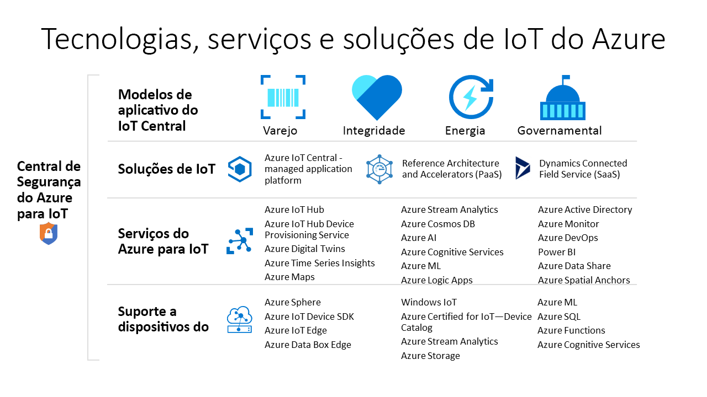

# Quais tecnologias e serviços do Azure você pode usar para criar soluções de IoT?

As tecnologias e os serviços de IoT do Azure fornecem opções para criar uma ampla variedade de soluções de IoT que permitem a transformação digital para sua organização. Por exemplo, você pode:

* Usar o [Azure IoT Central](https://apps.azureiotcentral.com), uma plataforma de aplicativo de IoT gerenciada, para criar e implantar uma solução de IoT segura e de nível empresarial. O IoT Central apresenta uma coleção de modelos de aplicativos específicos do setor, como varejo e saúde, para acelerar o processo de desenvolvimento da solução.
* Use os serviços da plataforma de IoT do Azure, como o [Hub IoT do Azure](../iot-hub/about-iot-hub.md) e os [SDKs do dispositivo IoT do Azure](../iot-hub/iot-hub-devguide-sdks.md) para criar uma solução de IoT personalizada do zero.

## Azure IoT Central

A [plataforma de aplicativo do IoT Central](https://apps.azureiotcentral.com) reduz a carga e o custo de desenvolvimento, gerenciamento e manutenção de soluções de IoT de nível empresarial. A interface do usuário da Web personalizável do IoT Central permite que você monitore as condições do dispositivo, crie regras e gerencie milhões de dispositivos e seus dados ao longo de seu ciclo de vida. A superfície de API dentro do IoT Central fornece acesso programático para configurar e interagir com sua solução de IoT.

O Azure IoT Central é uma plataforma de aplicativo totalmente gerenciada que você pode usar para criar soluções de IoT personalizadas. O IoT Central usa modelos de aplicativo para criar soluções. Há modelos para soluções genéricas e para setores específicos como energia, saúde, governo e varejo. Os modelos de aplicativo do IoT Central permitem que você implante um aplicativo IoT Central em minutos que você pode personalizar com temas, painéis e exibições.

Escolha os dispositivos do [catálogo de dispositivos Azure Certified para IoT](https://devicecatalog.azure.com) para se conectar rapidamente à sua solução. Use a interface do usuário da Web do IoT Central para monitorar e gerenciar seus dispositivos para mantê-los íntegros e conectados. Use conectores e APIs para integrar seu aplicativo do IoT Central com outros aplicativos de negócios.

Como uma plataforma de aplicativo totalmente gerenciada, o IoT Central tem um modelo de preços simples e previsível.

## Aceleradores de solução de IoT do Azure

Os [aceleradores de solução de IoT do Azure](https://www.azureiotsolutions.com) são uma coleção de soluções de nível empresarial personalizáveis. Você pode implantar essas soluções como elas estão ou desenvolver uma solução de IoT personalizada usando o código-fonte Java ou .NET de software livre.

Os aceleradores de solução do Azure IoT fornecem um alto nível de controle sobre sua solução de IoT. Os aceleradores de solução incluem soluções predefinidas para cenários de IoT comuns que você pode implantar em sua assinatura do Azure em minutos. Os cenários incluem:

* Fábrica conectada
* Simulação de dispositivo

A base de código de software livre para todos os aceleradores de solução está disponível no GitHub. Baixe o código para personalizar um acelerador de solução para atender aos seus requisitos de IoT específicos.

Os aceleradores de solução usam os serviços do Azure, como o Hub IoT do Azure e o Armazenamento do Azure, que você deve gerenciar em sua assinatura do Azure.

## Soluções personalizadas

Para criar uma solução de IoT do zero ou estender uma solução criada usando o IoT Central ou um acelerador de solução, use um ou mais dos serviços e tecnologias de IoT do Azure a seguir:

### Dispositivos

Desenvolva seus dispositivos IoT usando um dos [Kits de início de IoT do Azure](https://devicecatalog.azure.com/kits) ou escolha um dispositivo a ser usado no [Catálogo de dispositivos Azure Certified para IoT](https://devicecatalog.azure.com). Implemente seu código inserido usando os [SDKs de dispositivo](../iot-hub/iot-hub-devguide-sdks.md) de software livre. Os SDKs de dispositivo são compatíveis com vários sistemas operacionais, como Linux, Windows e sistemas operacionais em tempo real. Há SDKs para várias linguagens de programação, como [C](https://github.com/Azure/azure-iot-sdk-c), [Node.js](https://github.com/Azure/azure-iot-sdk-node), [Java](https://github.com/Azure/azure-iot-sdk-java), [.NET](https://github.com/Azure/azure-iot-sdk-csharp) e [Python](https://github.com/Azure/azure-iot-sdk-python).

Você pode simplificar ainda mais a forma como cria o código de inserção para seus dispositivos usando o serviço do [IoT Plug and Play](../iot-pnp/overview-iot-plug-and-play.md). O IoT Plug and Play permite que os desenvolvedores de soluções integrem dispositivos às soluções deles sem escrever nenhum código inserido. No núcleo do IoT Plug and Play está um esquema de _modelo de funcionalidade do dispositivo_ que descreve os recursos do dispositivo. Use o modelo de funcionalidade do dispositivo para gerar o código de dispositivo inserido e configurar uma solução baseada em nuvem, como um aplicativo do IoT Central.

O [Azure IoT Edge](../iot-edge/about-iot-edge.md) permite que você descarregue partes da carga de trabalho de IoT dos Serviços de Nuvem do Azure para seus dispositivos. O IoT Edge pode reduzir a latência em sua solução, reduzir a quantidade de dados que seus dispositivos trocam com a nuvem e habilitar cenários offline. Você pode gerenciar os dispositivos do IoT Edge do IoT Central e alguns aceleradores de solução.

O [Azure Sphere](/azure-sphere/product-overview/what-is-azure-sphere) é uma plataforma de aplicativos segura e de alto nível com recursos de comunicação e segurança internos para dispositivos conectados à Internet. Ele inclui unidade de microcontrolador segura, um sistema operacional baseado em Linux personalizado e um serviço de segurança baseado em nuvem que fornece segurança contínua e renovável.

### Conectividade de nuvem

O serviço [Hub IoT do Azure](../iot-hub/about-iot-hub.md) permite uma comunicação bidirecional confiável e segura entre milhões de dispositivos IoT e uma solução baseada em nuvem. O [Serviço de Provisionamento de Dispositivos no Hub IoT do Azure](../iot-dps/about-iot-dps.md) é um serviço auxiliar do Hub IoT. O serviço fornece o provisionamento de dispositivos Just-In-Time e sem toque para o Hub IoT correto sem exigir intervenção humana. Esses recursos permitem que os clientes provisionem milhões de dispositivos de maneira segura e escalonável.

O Hub IoT é um componente central dos aceleradores de solução e você pode usá-lo para atender aos desafios de implementação de IoT, como:

* Conectividade e gerenciamento de dispositivo de alto volume.
* Ingestão de telemetria de alto volume.
* Comando e controle de dispositivos.
* Imposição de segurança de dispositivo.

### Transpondo a lacuna entre o mundo físico e o digital

[Gêmeos Digitais do Azure](../digital-twins/overview.md) é um serviço de IoT que permite que você modele um ambiente físico. Ele usa um gráfico de inteligência espacial para modelar as relações entre pessoas, espaços e dispositivos. Ao correlacionar dados entre o mundo digital e o físico, você pode criar soluções de reconhecimento de contexto.

A IoT Central usa os gêmeos digitais para sincronizar dispositivos e dados no mundo real com os modelos digitais que permitem aos usuários monitorar e gerenciar esses dispositivos conectados.

### Dados e análises

Os dispositivos IoT normalmente geram grandes quantidades de dados de série temporal, como leituras de temperatura de sensores. O [Azure Time Series Insights](../time-series-insights/time-series-insights-overview.md) pode se conectar a um Hub IoT, ler o fluxo de telemetria de seus dispositivos, armazenar esses dados e permitir que você os consulte e os visualize.

Os [Azure Mapas](../azure-maps/index.yml) são uma coleção de serviços geoespaciais que usam novos dados de mapeamento para fornecer um contexto geográfico preciso para aplicativos Web e móveis. Você pode usar uma API REST, um controle JavaScript baseado na Web ou um SDK do Android para criar seus aplicativos.

## Próximas etapas

Para uma experiência prática, experimente um dos guias de início rápido:

- [Criar um aplicativo do Azure IoT Central](../iot-central/core/quick-deploy-iot-central.md)
- [Enviar telemetria de um dispositivo para um Hub IoT](../iot-hub/quickstart-send-telemetry-cli.md)
