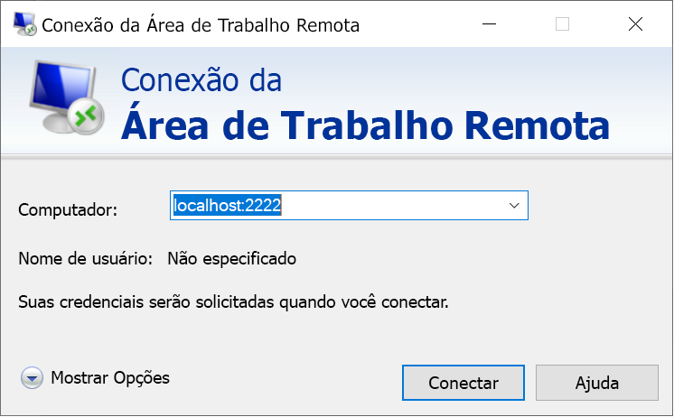

# <a name="quickstart-enable-ssh-and-rdp-over-an-iot-hub-device-stream-by-using-a-nodejs-proxy-application-preview"></a>Início Rápido: Habilitar o SSH e o RDP em fluxos de dispositivos do Hub IoT usando o aplicativo proxy do Node.js (versão prévia)

[!INCLUDE [iot-hub-quickstarts-4-selector](../../includes/iot-hub-quickstarts-4-selector.md)]

Neste guia de início rápido, você permite que o tráfego de SSH (Secure Shell) e de protocolo RDP seja enviado ao dispositivo por meio de um fluxo de dispositivos. Os fluxos de dispositivos do Hub IoT do Azure permitem que aplicativos de serviço e de dispositivo se comuniquem de maneira segura e consoante com o firewall. Este guia de início rápido descreve a execução de um aplicativo de proxy Node.js executado no lado do serviço. Durante a versão prévia pública, o SDK do Node.js dá suporte somente a fluxos de dispositivos no lado do serviço. Consequentemente, este início rápido contém instruções para executar somente o aplicativo proxy local do serviço.

## <a name="prerequisites"></a>Pré-requisitos

* A conclusão de [Habilitar o SSH e o RDP em fluxos de dispositivos do Hub IoT usando um aplicativo proxy do C](./quickstart-device-streams-proxy-c.md) ou [Habilitar SSH e protocolo RDP em fluxos de dispositivos do Hub IoT usando um aplicativo proxy do C#](./quickstart-device-streams-proxy-csharp.md).

* Uma conta do Azure com uma assinatura ativa. [Crie um gratuitamente](https://azure.microsoft.com/free/?ref=microsoft.com&utm_source=microsoft.com&utm_medium=docs&utm_campaign=visualstudio).

* [Node.js 10+](https://nodejs.org).

    Você pode verificar a versão atual do Node.js no computador de desenvolvimento usando o seguinte comando:

    ```cmd/sh
    node --version
    ```

* [Um projeto de exemplo do Node.js](https://github.com/Azure-Samples/azure-iot-samples-node/archive/streams-preview.zip).

[!INCLUDE [azure-cli-prepare-your-environment.md](../../includes/azure-cli-prepare-your-environment-no-header.md)]

Atualmente, o Hub IoT do Microsoft Azure dá suporte a fluxos de dispositivos como uma [versão prévia do recurso](https://azure.microsoft.com/support/legal/preview-supplemental-terms/).

> [!IMPORTANT]
> Atualmente, a versão prévia dos fluxos de dispositivos só é compatível com os Hubs IoT criados nas seguintes regiões:
>
> * Centro dos EUA
> * EUA Central EUAP
> * Norte da Europa
> * Sudeste Asiático

### <a name="add-azure-iot-extension"></a>Adicionar Extensão do Azure IoT

Adicione a Extensão do Azure IoT para a CLI do Azure à instância do Cloud Shell executando o comando a seguir. A Extensão de IoT adiciona comandos específicos do Hub IoT, do IoT Edge e do DPS (Serviço de Provisionamento de Dispositivos IoT) à CLI do Azure.

```azurecli-interactive
az extension add --name azure-iot
```

[!INCLUDE [iot-hub-cli-version-info](../../includes/iot-hub-cli-version-info.md)]

## <a name="create-an-iot-hub"></a>Crie um hub IoT

Se você tiver concluído o [Início Rápido: Enviar telemetria de um dispositivo para um Hub IoT](quickstart-send-telemetry-node.md) anterior, ignore esta etapa.

[!INCLUDE [iot-hub-include-create-hub](../../includes/iot-hub-include-create-hub.md)]

## <a name="register-a-device"></a>Registrar um dispositivo

Se você concluiu o [Início Rápido: enviar telemetria de um dispositivo para um hub IoT](quickstart-send-telemetry-node.md), pode ignorar esta etapa.

Um dispositivo deve ser registrado no hub IoT antes de poder se conectar. Nesta seção, você usará o Azure Cloud Shell para registrar um dispositivo simulado.

1. Para criar a identidade do dispositivo, execute o seguinte comando no Cloud Shell:

   > [!NOTE]
   > * Substitua o espaço reservado *YourIoTHubName* com o nome escolhido para o hub IoT.
   > * Para o nome do dispositivo que você está registrando, é recomendável usar *MyDevice* conforme mostrado. Se você escolher um nome diferente para seu dispositivo, use esse nome ao longo deste artigo e atualize o nome do dispositivo nos aplicativos de exemplo antes de executá-los.

    ```azurecli-interactive
    az iot hub device-identity create --hub-name {YourIoTHubName} --device-id MyDevice
    ```

1. Para permitir que o aplicativo back-end se conecte ao hub IoT e recupere as mensagens, você também precisa de uma *cadeia de conexão de serviço*. O seguinte comando recupera a cadeia de caracteres para o hub IoT:

   > [!NOTE]
   > Substitua o espaço reservado *YourIoTHubName* com o nome escolhido para o hub IoT.

    ```azurecli-interactive
    az iot hub connection-string show --policy-name service --hub-name {YourIoTHubName} --output table
    ```

   Anote a cadeia de conexão de serviço retornada para uso posterior neste início rápido. Ela se parece com o seguinte exemplo:

   `"HostName={YourIoTHubName}.azure-devices.net;SharedAccessKeyName=service;SharedAccessKey={YourSharedAccessKey}"`

## <a name="ssh-to-a-device-via-device-streams"></a>SSH para um dispositivo por fluxos de dispositivos

Nesta seção, você estabelecerá um fluxo de ponta a ponta para encapsular o tráfego SSH.

### <a name="run-the-device-local-proxy-application"></a>Executar o aplicativo de proxy no local do dispositivo

Como mencionado anteriormente, o SDK do Node.js do Hub IoT dá suporte somente a fluxos de dispositivos no lado do serviço. Para o aplicativo local do dispositivo, use um aplicativo proxy de dispositivo disponível em um dos seguintes inícios rápidos:

   * [Habilitar o SSH e o RDP em fluxos de dispositivos do Hub IoT usando um aplicativo proxy do C](./quickstart-device-streams-proxy-c.md)
   * [Habilitar o SSH e o RDP sobre fluxos de dispositivos do Hub IoT usando um aplicativo proxy do C#](./quickstart-device-streams-proxy-csharp.md) 

Antes de prosseguir para a próxima etapa, verifique se o aplicativo proxy local do dispositivo está em execução. Para obter uma visão geral da configuração, confira [Amostra de proxy local](./iot-hub-device-streams-overview.md#local-proxy-sample-for-ssh-or-rdp).

### <a name="run-the-service-local-proxy-application"></a>Executar o aplicativo de proxy no local do serviço

Este artigo descreve a configuração do SSH (usando a porta 22) e, em seguida, descreve como modificar a configuração do RDP (que usa a porta 3389). Como os fluxos de dispositivos são independentes de protocolo e de aplicativo, você pode modificar a mesma amostra para acomodar outros tipos de tráfego do aplicativo de cliente-servidor, normalmente alterando a porta de comunicação.

Com o aplicativo proxy local do dispositivo em execução, execute o aplicativo proxy local do serviço escrito em Node.js fazendo o seguinte em uma janela de terminal local:

1. Para variáveis de ambiente, forneça suas credenciais do serviço, a identificação do dispositivo de destino no qual o daemon SSH é executado e o número da porta para o proxy em execução no dispositivo.

   ```
   # In Linux
   export IOTHUB_CONNECTION_STRING="{ServiceConnectionString}"
   export STREAMING_TARGET_DEVICE="MyDevice"
   export PROXY_PORT=2222

   # In Windows
   SET IOTHUB_CONNECTION_STRING={ServiceConnectionString}
   SET STREAMING_TARGET_DEVICE=MyDevice
   SET PROXY_PORT=2222
   ```

   Altere o espaço reservado de ServiceConnectionString para corresponder à cadeia de conexão de serviço, bem como **MyDevice** para corresponder à ID do dispositivo se você tiver atribuído a ele um nome diferente.

1. Navegue até o diretório `Quickstarts/device-streams-service` na pasta do projeto descompactada. Use o seguinte código para executar o aplicativo de proxy local do serviço:

   ```
   cd azure-iot-samples-node-streams-preview/iot-hub/Quickstarts/device-streams-service

   # Install the preview service SDK, and other dependencies
   npm install azure-iothub@streams-preview
   npm install

   # Run the service-local proxy application
   node proxy.js
   ```

### <a name="ssh-to-your-device-via-device-streams"></a>SSH para o dispositivo por fluxos de dispositivos

No Linux, execute o SSH usando `ssh $USER@localhost -p 2222` em um terminal. No Windows, use seu cliente SSH favorito (por exemplo, o PuTTY).

Saída do console no local do serviço após o estabelecimento da sessão SSH (o aplicativo proxy local do serviço escuta na porta 2222):


Saída do console do aplicativo cliente SSH (o cliente SSH se comunica com o daemon SSH conectando-se à porta 22, na qual o aplicativo proxy local do serviço escuta):


### <a name="rdp-to-your-device-via-device-streams"></a>RDP para o dispositivo por fluxos de dispositivos

Agora use o aplicativo de cliente RDP e conecte-se ao proxy de serviço na porta 2222, uma porta arbitrária que você escolheu anteriormente.

> [!NOTE]
> Certifique-se de que o proxy do dispositivo foi configurado corretamente para RDP e configurado com a porta RDP 3389.



## <a name="clean-up-resources"></a>Limpar os recursos

[!INCLUDE [iot-hub-quickstarts-clean-up-resources](../../includes/iot-hub-quickstarts-clean-up-resources-device-streams.md)]

## <a name="next-steps"></a>Próximas etapas

Neste início rápido, você configurou um hub IoT, registrou um dispositivo e implantou um aplicativo proxy de serviço para habilitar o RDP e o SSH em um dispositivo IoT. O tráfego RDP e SSH será passado por um túnel por meio de um fluxo de dispositivos pelo hub IoT. Esse processo elimina a necessidade de conectividade direta com o dispositivo.

Para saber mais sobre fluxos de dispositivos, confira:

> [!div class="nextstepaction"]
> [Visão geral dos fluxos de dispositivos](./iot-hub-device-streams-overview.md)
