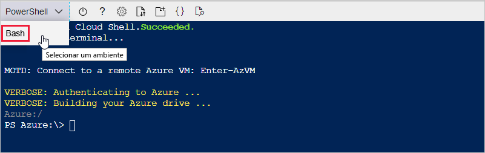
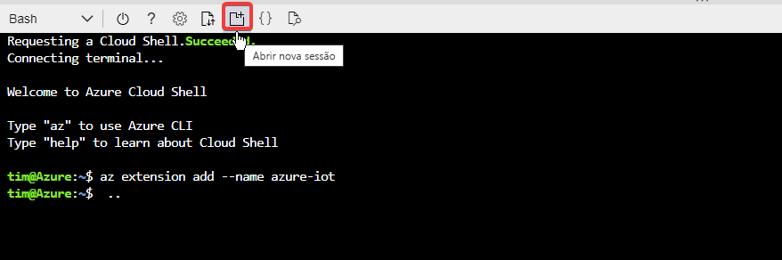
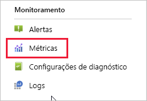
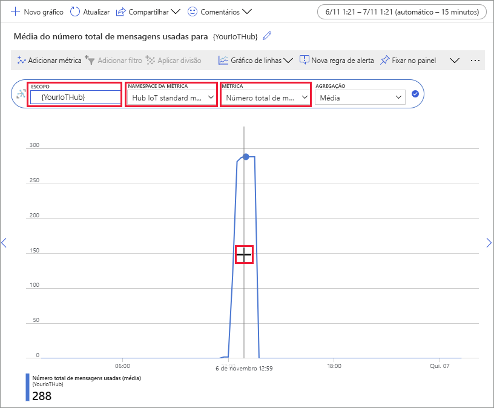

# <a name="quickstart-send-telemetry-from-a-device-to-an-iot-hub-and-monitor-it-with-the-azure-cli"></a>Início Rápido: enviar telemetria de um dispositivo para um Hub IoT e monitorá-lo com a CLI do Azure

[!INCLUDE [iot-hub-quickstarts-1-selector](../../includes/iot-hub-quickstarts-1-selector.md)]

O Hub IoT é um serviço do Azure que permite a ingestão de grandes volumes de telemetria de seus dispositivos IoT pela nuvem para processamento ou armazenamento. Neste guia de início rápido, você usa a CLI do Azure para criar um hub IoT e um dispositivo simulado, enviar telemetria do dispositivo para o hub e enviar uma mensagem da nuvem para o dispositivo. Você também usa o portal do Azure para visualizar as métricas do dispositivo. Esse é um fluxo de trabalho básico para desenvolvedores que usam a CLI para interagir com um aplicativo de Hub IoT.

## <a name="prerequisites"></a>Pré-requisitos
- Se você não tiver uma assinatura do Azure, [crie uma gratuitamente](https://azure.microsoft.com/free/?WT.mc_id=A261C142F) antes de começar.
- CLI do Azure. Você pode executar todos os comandos neste guia de início rápido usando o Azure Cloud Shell, um shell da CLI interativa que é executado em seu navegador. Se você usar o Cloud Shell, não precisará instalar nada. Se você preferir usar a CLI localmente, este guia de início rápido exigirá a CLI do Azure versão 2.0.76 ou posterior. Execute az --version para localizar a versão. Para instalar ou atualizar, confira [Instalar a CLI do Azure]( /cli/azure/install-azure-cli).

## <a name="sign-in-to-the-azure-portal"></a>Entre no Portal do Azure
Entre no Portal do Azure em https://portal.azure.com.

Independentemente de você executar a CLI localmente ou no Cloud Shell, mantenha o portal aberto no navegador.  Você o usará posteriormente neste guia de início rápido.

## <a name="launch-the-cloud-shell"></a>Iniciar o Cloud Shell
Nesta seção, você inicia uma instância do Azure Cloud Shell. Se você usar a CLI localmente, pule para a seção [Preparar duas sessões da CLI](#prepare-two-cli-sessions).

Para iniciar o Cloud Shell:

1. Clique no botão **Cloud Shell** na barra de menus no canto superior direito do portal do Azure. 

    

    > [!NOTE]
    > Se esta for a primeira vez que você usa o Cloud Shell, ele solicitará que você crie o armazenamento, que é necessário para usar o Cloud Shell.  Selecione uma assinatura para criar uma conta de armazenamento e um compartilhamento de Arquivos do Microsoft Azure. 

2. Selecione o ambiente da CLI preferencial no menu suspenso **Selecionar ambiente**. Este guia de início rápido usa o ambiente de **Bash**. Todos os comandos da CLI a seguir também funcionam no ambiente do PowerShell. 

    

## <a name="prepare-two-cli-sessions"></a>Preparar duas sessões da CLI

Nesta seção, você prepara duas sessões da CLI do Azure. Se você estiver usando o Cloud Shell, executará as duas sessões em guias separadas do navegador. Se você estiver usando um cliente CLI local, executará duas instâncias separadas da CLI. Você usará a primeira sessão como um dispositivo simulado e a segunda sessão para monitorar e enviar mensagens. Para executar um comando, selecione **Copiar** para copiar um bloco de código neste guia de início rápido, cole-o na sessão do shell e execute-o.

A CLI do Azure exige que você esteja conectado à sua conta do Azure. Toda a comunicação entre a sessão shell da CLI do Azure e o Hub IoT é autenticada e criptografada. Como resultado, este guia de início rápido não precisa da autenticação adicional que você usaria com um dispositivo real, como uma cadeia de conexão.

*  Execute o comando [az extension add](/cli/azure/extension#az_extension_add) para adicionar a Extensão do Microsoft Azure IoT para a CLI do Azure ao seu shell da CLI. A Extensão de IoT adiciona comandos específicos do Hub IoT, do IoT Edge e do DPS (Serviço de Provisionamento de Dispositivos IoT) à CLI do Azure.

   ```azurecli
   az extension add --name azure-iot
   ```
   
   Depois de instalar a extensão de IOT do Azure, você não precisará instalá-la novamente em nenhuma sessão do Cloud Shell. 

   [!INCLUDE [iot-hub-cli-version-info](../../includes/iot-hub-cli-version-info.md)]

*  Abra uma segunda sessão da CLI.  Se você estiver usando o Cloud Shell, selecione **Abrir nova sessão**. Se você estiver usando a CLI localmente, abra uma segunda instância. 

    >[!div class="mx-imgBorder"]
    >

## <a name="create-an-iot-hub"></a>Crie um Hub IoT
Nesta seção, você usa a CLI do Azure para criar um grupo de recursos e um Hub IoT.  Um grupo de recursos do Azure é um contêiner lógico no qual os recursos do Azure são implantados e gerenciados. Um Hub IoT atua como um hub central de mensagens para comunicação bidirecional entre o aplicativo IoT e os dispositivos. 

> [!TIP]
> Você tem a opção de criar um grupo de recursos do Azure, um Hub IoT e outros recursos usando o [portal do Azure](iot-hub-create-through-portal.md), o [Visual Studio Code](iot-hub-create-use-iot-toolkit.md) ou outros métodos programáticos.  

1. Execute o comando [az group create](/cli/azure/group#az_group_create) para criar um grupo de recursos. O comando a seguir cria um grupo de recursos chamado *MyResourceGroup* na localização *eastus*. 

    ```azurecli
    az group create --name MyResourceGroup --location eastus
    ```

1. Execute o comando [az iot hub create](/cli/azure/iot/hub#az_iot_hub_create) para criar um Hub IoT. Pode levar alguns minutos para criar um Hub IoT. 

    *YourIotHubName*. substitua o espaço reservado abaixo pelo nome escolhido para o hub IoT. Um nome de Hub IoT deve ser exclusivo globalmente no Azure. Esse espaço reservado é usado no restante deste guia de início rápido para representar o nome do Hub IoT.

    ```azurecli
    az iot hub create --resource-group MyResourceGroup --name {YourIoTHubName}
    ```

## <a name="create-and-monitor-a-device"></a>Criar e monitorar um dispositivo
Nesta seção, você criará um dispositivo simulado na primeira sessão da CLI. O dispositivo simulado envia a telemetria de dispositivo para o Hub IoT. Na segunda sessão da CLI, você monitora eventos, telemetria e envia uma mensagem da nuvem para o dispositivo simulado.

Para criar e iniciar um dispositivo simulado:
1. Execute o comando [az iot hub device-identity create](/cli/azure/ext/azure-iot/iot/hub/device-identity#ext-azure-iot-az-iot-hub-device-identity-create) na primeira sessão da CLI. Isso cria a identidade do dispositivo simulado. 

    *YourIotHubName*. substitua o espaço reservado abaixo pelo nome escolhido para o hub IoT. 

    *simDevice*. Você pode usar esse nome diretamente para o dispositivo simulado no restante deste guia de início rápido. Opcionalmente, use outro nome. 

    ```azurecli
    az iot hub device-identity create --device-id simDevice --hub-name {YourIoTHubName} 
    ```

1. Execute o comando [az iot device simulate](/cli/azure/ext/azure-iot/iot/device#ext-azure-iot-az-iot-device-simulate) na primeira sessão da CLI.  Isso inicia o dispositivo simulado. O dispositivo envia telemetria para o Hub IoT e recebe mensagens dele.  

    *YourIotHubName*. substitua o espaço reservado abaixo pelo nome escolhido para o hub IoT. 

    ```azurecli
    az iot device simulate -d simDevice -n {YourIoTHubName}
    ```

Para monitorar um dispositivo:
1. Na segunda sessão da CLI, execute o comando [az iot hub monitor-events](/cli/azure/ext/azure-iot/iot/hub#ext-azure-iot-az-iot-hub-monitor-events). Isso inicia o monitoramento do dispositivo simulado. A saída mostra a telemetria que o dispositivo simulado envia para o Hub IoT.

    *YourIotHubName*. substitua o espaço reservado abaixo pelo nome escolhido para o hub IoT. 

    ```azurecli
    az iot hub monitor-events --output table --hub-name {YourIoTHubName}
    ```

    

1. Depois de monitorar o dispositivo simulado na segunda sessão da CLI, pressione Ctrl+C para interromper o monitoramento. 

## <a name="use-the-cli-to-send-a-message"></a>Usar a CLI para enviar uma mensagem
Nesta seção, você usará a segunda sessão da CLI para enviar uma mensagem ao dispositivo simulado.

1. Na primeira sessão da CLI, confirme se o dispositivo simulado está em execução. Se o dispositivo foi interrompido, execute o seguinte comando para iniciá-lo:

    *YourIotHubName*. substitua o espaço reservado abaixo pelo nome escolhido para o hub IoT. 

    ```azurecli
    az iot device simulate -d simDevice -n {YourIoTHubName}
    ```

1. Na segunda sessão da CLI, execute o comando [az iot device c2d-message send](/cli/azure/ext/azure-iot/iot/device/c2d-message#ext-azure-iot-az-iot-device-c2d-message-send). Isso envia uma mensagem de nuvem para dispositivo do Hub IoT para o dispositivo simulado. A mensagem inclui uma cadeia de caracteres e dois pares chave-valor.  

    *YourIotHubName*. substitua o espaço reservado abaixo pelo nome escolhido para o hub IoT. 

    ```azurecli
    az iot device c2d-message send -d simDevice --data "Hello World" --props "key0=value0;key1=value1" -n {YourIoTHubName}
    ```
    Você tem a opção de enviar mensagens de nuvem para dispositivo usando o portal do Azure. Para fazer isso, navegue até a página de visão geral do Hub IoT, selecione **Dispositivos IoT**, selecione o dispositivo simulado e escolha **Mensagem para Dispositivo**. 

1. Na primeira sessão da CLI, confirme se o dispositivo simulado recebeu a mensagem. 

    

1. Depois de exibir a mensagem, feche a segunda sessão da CLI. Mantenha aberta a primeira sessão da CLI. Você a usará para limpar os recursos em uma etapa posterior.

## <a name="view-messaging-metrics-in-the-portal"></a>Exibir métricas de mensagens no portal
O portal do Azure permite que você gerencie todos os aspectos do Hub IoT e dos dispositivos. Em um aplicativo típico de Hub IoT que recebe a telemetria de dispositivos, convém monitorar os dispositivos ou exibir as métricas na telemetria de dispositivos. 

Para visualizar as métricas de mensagens no portal do Azure:
1. No menu de navegação à esquerda no portal, selecione **Todos os recursos**. Isso lista todos os recursos em sua assinatura, incluindo o Hub IoT que você criou. 

1. Selecione o link no Hub IoT criado. O portal exibe a página de visão geral do hub.

1. Selecione **Métricas** no painel esquerdo do Hub IoT. 

    

1. Insira o nome do Hub IoT em **Escopo**.

2. Selecione *Métricas Padrão do Hub IOT* em **Namespace de Métrica**.

3. Selecione *Número total de mensagens usadas* em **Métrica**. 

4. Passe o ponteiro do mouse sobre a área da linha do tempo na qual seu dispositivo enviou mensagens. O número total de mensagens de determinado período é exibido no canto inferior esquerdo da linha do tempo.

    

5. Opcionalmente, use a lista suspensa **Métricas** para exibir outras métricas em seu dispositivo simulado. Por exemplo, *Entregas de mensagens C2d concluídas* ou *Total de dispositivos (versão prévia)* . 

## <a name="clean-up-resources"></a>Limpar os recursos
Se você não precisar mais dos recursos do Azure criados neste guia de início rápido, poderá usar a CLI do Azure para excluí-los.

Se você continuar para o próximo artigo recomendado, mantenha os recursos já criados e reutilize-os. 

> [!IMPORTANT]
> A exclusão de um grupo de recursos é irreversível. O grupo de recursos e todos os recursos contidos nele são excluídos permanentemente. Não exclua acidentalmente o grupo de recursos ou os recursos incorretos. 

Para excluir um grupo de recursos por nome:
1. Execute o comando [az group delete](/cli/azure/group#az_group_delete). Isso removerá o grupo de recursos, o Hub IoT e o registro de dispositivo que você criou.

    ```azurecli
    az group delete --name MyResourceGroup
    ```
1. Execute o comando [az group list](/cli/azure/group#az_group_list) para confirmar se o grupo de recursos foi excluído.  

    ```azurecli
    az group list
    ```

## <a name="next-steps"></a>Próximas etapas
Neste guia de início rápido, você usou a CLI do Azure para criar um Hub IoT, criar um dispositivo simulado, enviar a telemetria, monitorar a telemetria, enviar uma mensagem da nuvem para dispositivo e limpar os recursos. Você usou o portal do Azure para visualizar as métricas de mensagens em seu dispositivo.

Se você for um desenvolvedor de dispositivos, a próxima etapa sugerida será ver o guia de início rápido de telemetria que usa o SDK de dispositivo IoT do Azure para C. Opcionalmente, confira um dos artigos do guia de início rápido de telemetria do Hub IoT do Azure disponíveis em seu idioma ou SDK preferencial.

> [!div class="nextstepaction"]
> [Início Rápido: enviar telemetria de um dispositivo para um hub IoT (C)](quickstart-send-telemetry-c.md)