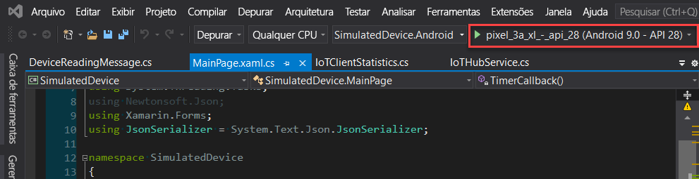
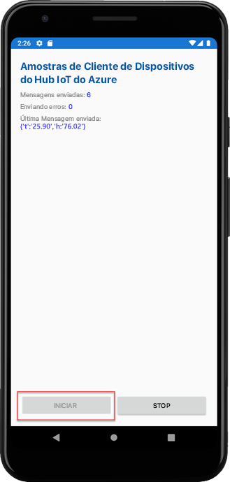

# <a name="quickstart-send-telemetry-from-a-device-to-an-iot-hub-xamarinforms"></a>Início Rápido: enviar telemetria de um dispositivo para um hub IoT (Xamarin.Forms)

[!INCLUDE [iot-hub-quickstarts-1-selector](../../includes/iot-hub-quickstarts-1-selector.md)]

O Hub IoT é um serviço do Azure que permite a ingestão de grandes volumes de telemetria de seus dispositivos IoT pela nuvem para processamento ou armazenamento. Neste artigo, você envia telemetria de um aplicativo de dispositivo simulado para o Hub IoT. Em seguida, você exibe os dados em um aplicativo de back-end.

Este artigo usa um aplicativo Xamarin.Forms previamente codificado para enviar a telemetria e um utilitário CLI para ler a telemetria do Hub IoT.

[!INCLUDE [cloud-shell-try-it.md](../../includes/cloud-shell-try-it.md)]

Se você não tiver uma assinatura do Azure, crie uma [conta gratuita](https://azure.microsoft.com/free/?WT.mc_id=A261C142F) antes de começar.


## <a name="prerequisites"></a>Pré-requisitos

- Baixe o exemplo de código dos [exemplos do Azure](https://github.com/Azure-Samples/azure-iot-samples-xamarin/archive/master.zip)

- A versão mais recente do [Visual Studio 2019](https://visualstudio.microsoft.com/) ou do [Visual Studio para Mac](https://visualstudio.microsoft.com/) com as ferramentas Xamarin.Forms instaladas. Este guia de início rápido foi testado com o Visual Studio 16.6.0.

- Verifique se a porta 8883 está aberta no firewall. A amostra de dispositivo deste início rápido usa o protocolo MQTT, que se comunica pela porta 8883. Essa porta poderá ser bloqueada em alguns ambientes de rede corporativos e educacionais. Para obter mais informações e maneiras de resolver esse problema, confira [Como se conectar ao Hub IoT (MQTT)](iot-hub-mqtt-support.md#connecting-to-iot-hub).

- Execute o comando a seguir para adicionar a Extensão do Microsoft Azure IoT para a CLI do Azure à instância do Cloud Shell. A Extensão de IoT adiciona comandos específicos do Hub IoT, do IoT Edge e do DPS (Serviço de Provisionamento de Dispositivos IoT) à CLI do Azure.

   ```azurecli-interactive
   az extension add --name azure-iot
   ```

   [!INCLUDE [iot-hub-cli-version-info](../../includes/iot-hub-cli-version-info.md)]

## <a name="create-an-iot-hub"></a>Crie um hub IoT

[!INCLUDE [iot-hub-include-create-hub](../../includes/iot-hub-include-create-hub.md)]

## <a name="register-a-device"></a>Registrar um dispositivo

Um dispositivo deve ser registrado no hub IoT antes de poder se conectar. Neste início rápido, você usa o Azure Cloud Shell para registrar um dispositivo simulado.

1. Execute o comando a seguir no Azure Cloud Shell para criar a identidade do dispositivo.

   **YourIoTHubName**: substitua o espaço reservado abaixo pelo nome escolhido para o hub IoT.

   **myXamarinDevice**: esse é o nome do dispositivo que está sendo registrado. É recomendável usar **myXamarinDevice** conforme mostrado. Se você escolher um nome diferente para seu dispositivo, você também precisará usar esse nome ao longo deste artigo e atualizar o nome de dispositivo nos aplicativos de exemplo antes de executá-los.

   ```azurecli-interactive
   az iot hub device-identity create --hub-name {YourIoTHubName} --device-id myXamarinDevice
   ```

1. Execute o seguinte comando no Azure Cloud Shell para obter a _cadeia de conexão de dispositivo_ referente ao dispositivo que você acabou de registrar:

   **YourIoTHubName**: substitua o espaço reservado abaixo pelo nome escolhido para o hub IoT.

   ```azurecli-interactive
   az iot hub device-identity show-connection-string --hub-name {YourIoTHubName} --device-id myXamarinDevice --output table
   ```

   Tome nota da cadeia de conexão do dispositivo, que se parece com:

   `HostName={YourIoTHubName}.azure-devices.net;DeviceId=myXamarinDevice;SharedAccessKey={YourSharedAccessKey}`

    Você usará esse valor posteriormente no início rápido.

## <a name="send-simulated-telemetry"></a>Enviar telemetria simulada

O aplicativo de exemplo é executado no Windows por meio de um aplicativo UWP, um dispositivo ou simulador iOS e um dispositivo ou simulador Android, que se conecta a um ponto de extremidade específico do dispositivo em seu hub IoT e envia telemetria de temperatura e umidade simuladas. 

1. Abra o workspace de exemplo no Visual Studio ou Visual Studio para Mac.
2. Expanda o projeto **SimulatedDevice**.  
3. Abra **IoTHubService.cs** para edição no Visual Studio. 
4. Pesquise a variável **_iotHubConnectionString** e atualize o valor com a cadeia de conexão do dispositivo anotado anteriormente.
5. Salve suas alterações. 
6. Execute o projeto no emulador de dispositivo ou em um dispositivo real com o botão **Compilar e executar** ou o atalho de teclas **F5** no Windows ou **command + r** no Mac. 

   

7. Quando o emulador for aberto, selecione **Iniciar** no aplicativo de exemplo.

A captura de tela a seguir mostra alguns exemplos de saída à medida que o aplicativo envia telemetria simulada para o hub IoT: 

## <a name="read-the-telemetry-from-your-hub"></a>Ler a telemetria do hub

O aplicativo de exemplo que você executou no emulador do XCode mostra dados sobre as mensagens enviadas do dispositivo. Você também pode exibir os dados por meio do hub IoT conforme vão sendo recebidos. A extensão de CLI do Hub IoT pode se conectar ao ponto de extremidade **Eventos** do lado do serviço em seu Hub IoT. A extensão recebe as mensagens do dispositivo para a nuvem, enviadas de seu dispositivo simulado. Um aplicativo de back-end do Hub IoT normalmente é executado na nuvem para receber e processar as mensagens do dispositivo para a nuvem.

Execute os seguintes comandos no Azure Cloud Shell, substituindo `YourIoTHubName` pelo nome do Hub IoT:

```azurecli-interactive
az iot hub monitor-events --device-id myXamarinDevice --hub-name {YourIoTHubName}
```

A captura de tela a seguir mostra a saída à medida que a extensão recebe a telemetria enviada pelo dispositivo simulado para o hub:

A captura de tela abaixo mostra o tipo de telemetria mostrada na janela de terminal local: 

## <a name="clean-up-resources"></a>Limpar os recursos

[!INCLUDE [iot-hub-quickstarts-clean-up-resources](../../includes/iot-hub-quickstarts-clean-up-resources.md)]

## <a name="next-steps"></a>Próximas etapas

Neste início rápido, você configurou um hub IoT, registrou um dispositivo, enviou telemetria simulada para o hub de um aplicativo Xamarin.Forms e leu a telemetria do hub. 

Para saber como controlar o dispositivo simulado em um aplicativo de back-end, continue no próximo início rápido.

> [!div class="nextstepaction"]
> [Início Rápido: Controlar um dispositivo conectado a um hub IoT](quickstart-control-device-node.md)
