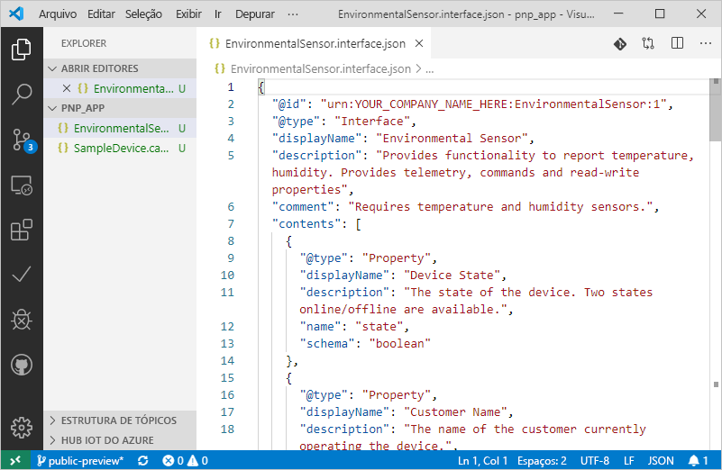
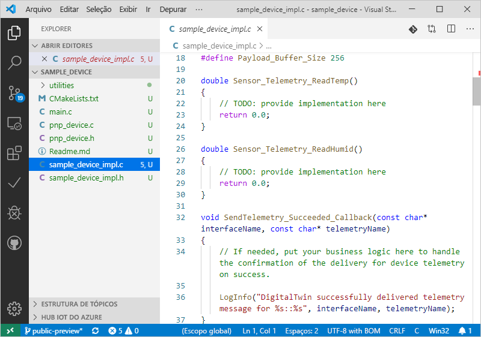

# <a name="quickstart-use-a-device-capability-model-to-create-an-iot-plug-and-play-preview-device-linux"></a>Início Rápido: Usar um modelo de funcionalidade do dispositivo para criar um dispositivo IoT Plug and Play em versão prévia (Linux)

[!INCLUDE [iot-pnp-quickstarts-1-selector.md](../../includes/iot-pnp-quickstarts-1-selector.md)]

Um DCM _(modelo de funcionalidade do dispositivo)_ descreve as funcionalidades de um dispositivo IoT Plug and Play. Um DCM geralmente é associado a um SKU de produto. As funcionalidades definidas no DCM são organizadas em interfaces reutilizáveis. Você pode gerar um código do dispositivo de esqueleto com base em um DCM. Este início rápido mostra como usar o VS Code no Ubuntu Linux para criar um dispositivo IoT Plug and Play usando um DCM.

## <a name="prerequisites"></a>Pré-requisitos

Este guia de início rápido pressupõe que você esteja usando o Ubuntu Linux com um ambiente de área de trabalho. As etapas deste tutorial foram testadas com o Ubuntu 18.04.

Para concluir este início rápido, instale o seguinte software em um computador Linux local:

* Instale o **GCC**, o **Git**, o **cmake** e todas as dependências usando o comando `apt-get`:

    ```sh
    sudo apt-get update
    sudo apt-get install -y git cmake build-essential curl libcurl4-openssl-dev libssl-dev uuid-dev
    ```

    Verifique se a versão do `cmake` é superior a **2.8.12** e se a versão do **GCC** é superior a **4.4.7**.

    ```sh
    cmake --version
    gcc --version
    ```

* [Visual Studio Code](https://code.visualstudio.com/).

### <a name="install-azure-iot-tools"></a>Instalar as Ferramentas do Azure IoT

Use as seguintes etapas para instalar o pacote de extensão [Azure IoT Tools para VS Code](https://marketplace.visualstudio.com/items?itemName=vsciot-vscode.azure-iot-tools):

1. No VS Code, selecione a guia **Extensões**.
1. Pesquise por **Azure IoT Tools**.
1. Selecione **Instalar**.

### <a name="get-the-connection-string-for-your-company-model-repository"></a>Obter a cadeia de conexão para o repositório de modelos da empresa

Encontre a _cadeia de conexão do repositório de modelos da empresa_ no portal do [Azure Certified para IoT](https://preview.catalog.azureiotsolutions.com) quando entrar com uma conta corporativa ou de estudante da Microsoft ou com a ID de Parceiro da Microsoft, caso tenha uma. Depois de entrar, selecione **Repositório da empresa** e, em seguida, **Cadeias de conexão**.

[!INCLUDE [cloud-shell-try-it.md](../../includes/cloud-shell-try-it.md)]

[!INCLUDE [iot-pnp-prepare-iot-hub.md](../../includes/iot-pnp-prepare-iot-hub.md)]

## <a name="prepare-the-development-environment"></a>Preparar o ambiente de desenvolvimento

Neste início rápido, você usa o gerenciador de biblioteca [Vcpkg](https://github.com/microsoft/vcpkg) para instalar o SDK de dispositivo C do Azure IoT em seu ambiente de desenvolvimento.

Abra um shell. Execute o comando a seguir para instalar o Vcpkg:

```bash
cd ~
git clone https://github.com/microsoft/vcpkg
cd vcpkg
./bootstrap-vcpkg.sh
./vcpkg install azure-iot-sdk-c[public-preview,use_prov_client]
```

Essa operação deve demorar alguns minutos.

## <a name="author-your-model"></a>Criar o modelo

Neste início rápido, você usará um modelo de funcionalidade do dispositivo de exemplo existente e as interfaces associadas.

1. Crie o diretório `pnp_app` na unidade local. Você usará essa pasta para os arquivos de modelo de dispositivo e o stub do código do dispositivo.

    ```bash
    cd ~
    mkdir pnp_app
    ```

1. Baixe o modelo de funcionalidade do dispositivo e os arquivos de exemplo de interface na pasta `pnp_app`.

    ```bash
    cd pnp_app
    curl -O -L https://raw.githubusercontent.com/Azure/IoTPlugandPlay/master/samples/SampleDevice.capabilitymodel.json
    curl -O -L https://raw.githubusercontent.com/Azure/IoTPlugandPlay/master/samples/EnvironmentalSensor.interface.json
    ```

1. Abra a pasta `pnp_app` com o VS Code. É possível exibir os arquivos com o IntelliSense:

    

1. Nos arquivos baixados, substitua `<YOUR_COMPANY_NAME_HERE>` nos campos `@id` e `schema` por um valor exclusivo. Use somente os caracteres a-z, A-Z, 0-9 e sublinhado. Para obter mais informações, confira [Formato do identificador do Gêmeo Digital](https://github.com/Azure/IoTPlugandPlay/tree/master/DTDL#digital-twin-identifier-format).

## <a name="generate-the-c-code-stub"></a>Gerar o stub do código C

Agora que você tem um DCM e suas interfaces associadas, é possível gerar o código do dispositivo que implementa o modelo. Para gerar o stub do código C no VS Code:

1. Com a pasta `pnp_app` aberta no VS Code, use o comando **Ctrl+Shift+P** para abrir a paleta de comandos, digite **IoT Plug and Play** e selecione **Gerar Stub do Código do Dispositivo**.

    > [!NOTE]
    > Na primeira vez que você usar o utilitário Gerador de Código do IoT Plug and Play, serão necessários alguns segundos para baixá-lo e instalá-lo automaticamente.

1. Escolha o arquivo **SampleDevice.capabilitymodel.json** a ser usado para gerar o stub do código do dispositivo.

1. Insira o nome do projeto **sample_device**. Esse será o nome do aplicativo do dispositivo.

1. Escolha **ANSI C** como a linguagem.

1. Escolha **Por meio da cadeia de conexão de dispositivo do Hub IoT** como o método de conexão.

1. Escolha **Projeto do CMake no Linux** como modelo do projeto.

1. Escolha **Via Vcpkg** como a maneira de incluir o SDK do dispositivo.

1. A nova pasta **sample_device** é criada no mesmo local do arquivo DCM, no qual são gerados os arquivos stub de código de dispositivo. O VS Code abre uma nova janela para exibi-los.
    

## <a name="build-and-run-the-code"></a>Criar e executar o código

Use o código-fonte do SDK do dispositivo para criar o stub do código do dispositivo gerado. O aplicativo criado simula um dispositivo que se conecta a um Hub IoT. O aplicativo envia a telemetria e as propriedades e recebe comandos.

1. Crie uma pasta do build do **CMake** para o aplicativo **sample_device**:

    ```bash
    cd ~/pnp_app/sample_device
    mkdir cmake
    cd cmake
    ```

1. Execute o CMake para criar o aplicativo com o SDK. O comando a seguir pressupõe que você instalou **vcpkg** em sua pasta base:

    ```bash
    cmake .. -DCMAKE_TOOLCHAIN_FILE=~/vcpkg/scripts/buildsystems/vcpkg.cmake -Duse_prov_client=ON -Dhsm_type_symm_key:BOOL=ON
    cmake --build .
    ```

1. Depois que o build for concluído com êxito, execute o aplicativo passando a cadeia de conexão do dispositivo do hub IoT como parâmetro.

    ```sh
    cd ~/pnp_app/sample_device/cmake
    ./sample_device "<YourDeviceConnectionString>"
    ```

1. O aplicativo do dispositivo iniciará o envio de dados ao Hub IoT.

    

## <a name="validate-the-code"></a>Validar o código

### <a name="publish-device-model-files-to-model-repository"></a>Publicar arquivos de modelo do dispositivo no repositório de modelos

Para validar o código do dispositivo com a CLI do **Azure**, publique os arquivos no repositório de modelos.

1. Após abrir a pasta `pnp_app` no VS Code, use o comando **Ctrl+Shift+P** para abrir a paleta de comandos, digite e selecione **IoT Plug and Play: Enviar arquivos para o Repositório de Modelos**.

1. Selecione os arquivos `SampleDevice.capabilitymodel.json` e `EnvironmentalSensor.interface.json`.

1. Insira a cadeia de conexão do repositório de modelos da empresa.

    > [!NOTE]
    > A cadeia de conexão só é necessária na primeira vez que você se conecta ao repositório.

1. Na janela de resultados e na notificação do VS Code, verifique se os arquivos foram publicados com êxito.

    > [!NOTE]
    > Se você receber erros ao publicar os arquivos de modelo do dispositivo, tente usar o comando **IoT Plug and Play: Sair do Repositório de Modelos** para sair e passar pelas etapas novamente.

### <a name="use-the-azure-iot-cli-to-validate-the-code"></a>Usar a CLI do Azure IoT para validar o código

Após iniciar o exemplo de cliente do dispositivo, você pode usar a CLI do Azure para verificar se ele está funcionando.

Use o comando a seguir para exibir a telemetria que o dispositivo de exemplo está enviando. Talvez seja necessário aguardar um ou dois minutos para que o recurso exiba alguma telemetria na saída:

```azurecli-interactive
az iot dt monitor-events --hub-name <YourIoTHubNme> --device-id <YourDeviceID>
```

Use o seguinte comando para exibir todas as propriedades enviadas pelo dispositivo:

```azurecli-interactive
az iot dt list-properties --device-id <YourDeviceID> --hub-name <YourIoTHubNme> --source private --repo-login "<YourCompanyModelRepositoryConnectionString>"
```

[!INCLUDE [iot-pnp-clean-resources.md](../../includes/iot-pnp-clean-resources.md)]

## <a name="next-steps"></a>Próximas etapas

Neste início rápido, você aprendeu a criar um dispositivo IoT Plug and Play usando um DCM.

Para saber mais sobre DCMs e como criar modelos personalizados, avance para o tutorial:

> [!div class="nextstepaction"]
> [Tutorial: Criar e testar um modelo de funcionalidade do dispositivo usando o Visual Studio Code](tutorial-pnp-visual-studio-code.md)
