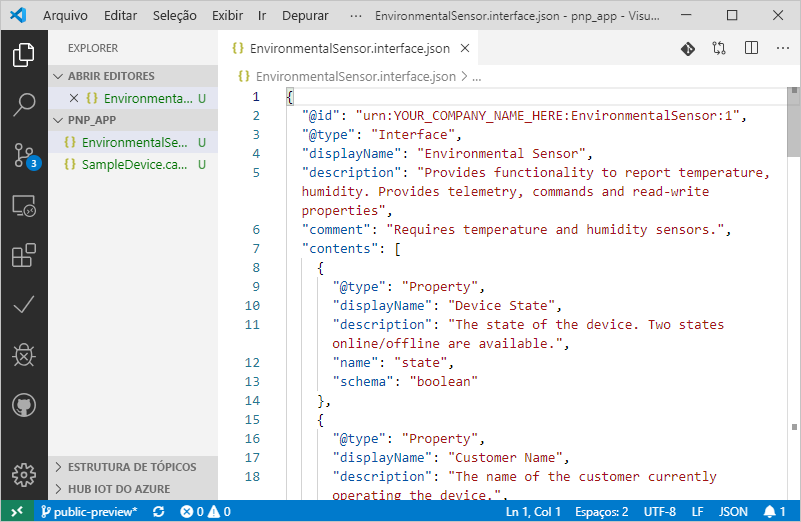
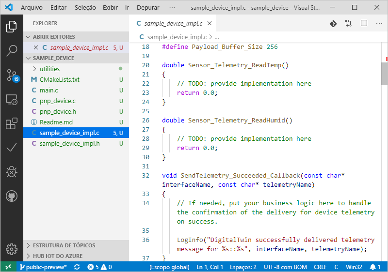

# <a name="quickstart-use-a-device-capability-model-to-create-an-iot-plug-and-play-preview-device-windows"></a>Início Rápido: usar um modelo de funcionalidade do dispositivo para criar um dispositivo IoT Plug and Play em versão prévia (Windows)

[!INCLUDE [iot-pnp-quickstarts-1-selector.md](../../includes/iot-pnp-quickstarts-1-selector.md)]

Um DCM _(modelo de funcionalidade do dispositivo)_ descreve as funcionalidades de um dispositivo IoT Plug and Play. Um DCM geralmente é associado a um SKU de produto. As funcionalidades definidas no DCM são organizadas em interfaces reutilizáveis. Você pode gerar um código do dispositivo de esqueleto com base em um DCM. Este início rápido mostra como usar o VS Code no Windows para criar um dispositivo IoT Plug and Play usando um DCM.

## <a name="prerequisites"></a>Prerequisites

Para concluir este início rápido, você precisa instalar o seguinte software no computador local:

* [Ferramentas de Build para o Visual Studio](https://visualstudio.microsoft.com/thank-you-downloading-visual-studio/?sku=BuildTools&rel=16) com **Ferramentas de build de C++** e cargas de trabalho do **componente do gerenciador de pacotes NuGet**. Ou se você já tem o [Visual Studio (Community, Professional ou Enterprise)](https://visualstudio.microsoft.com/downloads/) 2019, 2017 ou 2015 com as mesmas cargas de trabalho instaladas.
* [Git](https://git-scm.com/download/).
* [CMake](https://cmake.org/download/).
* [Visual Studio Code](https://code.visualstudio.com/).

### <a name="install-azure-iot-tools"></a>Instalar as Ferramentas do Azure IoT

Use as seguintes etapas para instalar o pacote de extensão [Azure IoT Tools para VS Code](https://marketplace.visualstudio.com/items?itemName=vsciot-vscode.azure-iot-tools):

1. No VS Code, selecione a guia **Extensões**.
1. Pesquise por **Azure IoT Tools**.
1. Selecione **Instalar**.

### <a name="install-the-azure-iot-explorer"></a>Instalar o Azure IoT Explorer

Baixe e instale a versão mais recente do **Explorador do Azure IoT** na página do [repositório](https://github.com/Azure/azure-iot-explorer/releases) da ferramenta, selecionando o arquivo .msi em "Assets" (Ativos) para obter a atualização mais recente.

### <a name="get-the-connection-string-for-your-company-model-repository"></a>Obter a cadeia de conexão para o repositório de modelos da empresa

Encontre a _cadeia de conexão do repositório de modelos da empresa_ no portal do [Azure Certified para IoT](https://preview.catalog.azureiotsolutions.com) quando entrar com uma conta corporativa ou de estudante da Microsoft ou com a ID de Parceiro da Microsoft, caso tenha uma. Depois de entrar, selecione **Repositório da empresa** e, em seguida, **Cadeias de conexão**.

[!INCLUDE [cloud-shell-try-it.md](../../includes/cloud-shell-try-it.md)]

[!INCLUDE [iot-pnp-prepare-iot-hub.md](../../includes/iot-pnp-prepare-iot-hub.md)]

Execute o seguinte comando para obter a _cadeia de conexão do hub IoT_ para o seu hub (nota para usar mais tarde):

```azurecli-interactive
az iot hub show-connection-string --hub-name <YourIoTHubName> --output table
```

## <a name="prepare-the-development-environment"></a>Preparar o ambiente de desenvolvimento

Neste início rápido, você usa o gerenciador de biblioteca [Vcpkg](https://github.com/microsoft/vcpkg) para instalar o SDK de dispositivo C do Azure IoT em seu ambiente de desenvolvimento.

1. Abra um prompt de comando. Execute o comando a seguir para instalar o Vcpkg:

    ```cmd
    git clone https://github.com/Microsoft/vcpkg.git
    cd vcpkg

    .\bootstrap-vcpkg.bat
    ```

    Em seguida, para conectar a [integração](https://github.com/microsoft/vcpkg/blob/master/docs/users/integration.md) dos usuários, execute o seguinte (observação: requer credenciais de administrador no primeiro uso):

    ```cmd
    .\vcpkg.exe integrate install
    ```

1. Instalar o Vcpkg do SDK do dispositivo do Azure IoT C:

    ```cmd
    .\vcpkg.exe install azure-iot-sdk-c[public-preview,use_prov_client]
    ```

## <a name="author-your-model"></a>Criar o modelo

Neste início rápido, você usará um modelo de funcionalidade do dispositivo de exemplo existente e as interfaces associadas.

1. Crie o diretório `pnp_app` na unidade local. Você usará essa pasta para os arquivos de modelo de dispositivo e o stub do código do dispositivo.

1. Baixe o [os arquivos de amostra de interface e do modelo de funcionalidade do dispositivo](https://github.com/Azure/IoTPlugandPlay/blob/master/samples/SampleDevice.capabilitymodel.json) e a [amostra de interface](https://github.com/Azure/IoTPlugandPlay/blob/master/samples/EnvironmentalSensor.interface.json) e salve os arquivos na pasta `pnp_app`.

    > [!TIP]
    > Para baixar um arquivo no GitHub, navegue até o arquivo, clique com o botão direito do mouse em **Bruto** e, em seguida, selecione **Salvar link como**.

1. Abra a pasta `pnp_app` com o VS Code. É possível exibir os arquivos com o IntelliSense:

    

1. Nos arquivos baixados, substitua `<YOUR_COMPANY_NAME_HERE>` nos campos `@id` e `schema` por um valor exclusivo. Use somente os caracteres a-z, A-Z, 0-9 e sublinhado. Para obter mais informações, confira [Formato do identificador do Gêmeo Digital](https://github.com/Azure/IoTPlugandPlay/tree/master/DTDL#digital-twin-identifier-format).

## <a name="generate-the-c-code-stub"></a>Gerar o stub do código C

Agora que você tem um DCM e suas interfaces associadas, é possível gerar o código do dispositivo que implementa o modelo. Para gerar o stub do código C no VS Code:

1. Com a pasta `pnp_app` aberta no VS Code, use o comando **Ctrl+Shift+P** para abrir a paleta de comandos, digite **IoT Plug and Play** e selecione **Gerar Stub do Código do Dispositivo**.

    > [!NOTE]
    > Na primeira vez que você usar a CLI do CodeGen do IoT Plug and Play, serão necessários alguns segundos para baixá-la e instalá-la automaticamente.

1. Escolha o arquivo **SampleDevice.capabilitymodel.json** a ser usado para gerar o stub do código do dispositivo.

1. Insira o nome do projeto **sample_device**. Esse será o nome do aplicativo do dispositivo.

1. Escolha **ANSI C** como a linguagem.

1. Escolha **Por meio da cadeia de conexão de dispositivo do Hub IoT** como o método de conexão.

1. Escolha **Projeto CMake no Windows** como modelo do projeto.

1. Escolha **Via Vcpkg** como a maneira de incluir o SDK do dispositivo.

1. A nova pasta **sample_device** é criada no mesmo local do arquivo DCM, no qual são gerados os arquivos stub de código de dispositivo. O VS Code abre uma nova janela para exibi-los.
    

## <a name="build-and-run-the-code"></a>Criar e executar o código

Use o código-fonte do SDK do dispositivo para criar o stub do código do dispositivo gerado. O aplicativo criado simula um dispositivo que se conecta a um Hub IoT. O aplicativo envia a telemetria e as propriedades e recebe comandos.

1. Crie o subdiretório `cmake` na pasta `sample_device` e navegue até essa pasta:

    ```cmd
    mkdir cmake
    cd cmake
    ```

1. Execute os seguintes comandos para compilar o stub de código gerado (substituindo o espaço reservado pelo diretório do seu repositório Vcpkg):

    ```cmd
    cmake .. -G "Visual Studio 16 2019" -A Win32 -Duse_prov_client=ON -Dhsm_type_symm_key:BOOL=ON -DCMAKE_TOOLCHAIN_FILE="<directory of your Vcpkg repo>\scripts\buildsystems\vcpkg.cmake"

    cmake --build .
    ```
    
    > [!NOTE]
    > Se você estiver usando o Visual Studio 2017 ou 2015, precisará especificar o gerador de CMake com base nas ferramentas de compilação em uso:
    >```cmd
    ># Either
    >cmake .. -G "Visual Studio 15 2017" -Duse_prov_client=ON -Dhsm_type_symm_key:BOOL=ON -DCMAKE_TOOLCHAIN_FILE="{directory of your Vcpkg repo}\scripts\buildsystems\vcpkg.cmake"
    ># or
    >cmake .. -G "Visual Studio 14 2015" -Duse_prov_client=ON -Dhsm_type_symm_key:BOOL=ON -DCMAKE_TOOLCHAIN_FILE="{directory of your Vcpkg repo}\scripts\buildsystems\vcpkg.cmake"
    >```

    > [!NOTE]
    > Se o CMake não conseguir localizar o compilador C++, você obterá erros de build ao executar o comando anterior. Se isso acontecer, tente executar este comando no [prompt de comando do Visual Studio](https://docs.microsoft.com/dotnet/framework/tools/developer-command-prompt-for-vs).

1. Depois que o build for concluído com êxito, execute o aplicativo passando a cadeia de conexão do dispositivo do hub IoT como parâmetro.

    ```cmd\sh
    .\Debug\sample_device.exe "<YourDeviceConnectionString>"
    ```

1. O aplicativo do dispositivo iniciará o envio de dados ao Hub IoT.

    

## <a name="validate-the-code"></a>Validar o código

### <a name="publish-device-model-files-to-model-repository"></a>Publicar arquivos de modelo do dispositivo no repositório de modelos

Para validar o código do dispositivo com o **Azure IoT Explorer**, você precisará publicar os arquivos no repositório de modelos.

1. Com a pasta `pnp_app` aberta no VS Code, use o comando **Ctrl+Shift+P** para abrir a paleta de comandos, digite e selecione **IoT Plug and Play: Enviar arquivos para o Repositório de Modelos**.

1. Selecione os arquivos `SampleDevice.capabilitymodel.json` e `EnvironmentalSensor.interface.json`.

1. Insira a cadeia de conexão do repositório de modelos da empresa.

    > [!NOTE]
    > A cadeia de conexão só é necessária na primeira vez que você se conecta ao repositório.

1. Na janela de resultados e na notificação do VS Code, verifique se os arquivos foram publicados com êxito.

    > [!NOTE]
    > Se você receber erros ao publicar os arquivos de modelo do dispositivo, tente usar o comando **IoT Plug and Play: Sair do Repositório de Modelos** para sair e passar pelas etapas novamente.

### <a name="use-the-azure-iot-explorer-to-validate-the-code"></a>Usar o Azure IoT Explorer para validar o código

[!INCLUDE [iot-pnp-iot-explorer-1.md](../../includes/iot-pnp-iot-explorer-1.md)]

4. Para adicionar o repositório de sua empresa, selecione **Configurações**, **+ Adicionar fonte de definição do módulo** e, em seguida, **Repositório da empresa**. Adicione a cadeia de conexão do repositório de modelos da empresa e selecione **Salvar e Conectar**.

1. Novamente na página de visão geral **Dispositivos**, localize a identidade do dispositivo criada anteriormente. Com o aplicativo do dispositivo ainda em execução no prompt de comando, verifique se o **Estado da conexão** do dispositivo no Azure IoT Explorer está sendo relatado como _Conectado_ (caso contrário, clique em **Atualizar** até que ele esteja). Selecione o dispositivo para exibir mais detalhes.

1. Expanda a interface com a ID **urn:<NOME_SUA_INTERFACE>:EnvironmentalSensor:1** para ver os primitivos do IoT Plug and Play, como propriedades, comandos e telemetria. O nome da interface que aparecerá é o nome que você colocou ao criar seu modelo.

[!INCLUDE [iot-pnp-iot-explorer-2.md](../../includes/iot-pnp-iot-explorer-2.md)]

[!INCLUDE [iot-pnp-clean-resources.md](../../includes/iot-pnp-clean-resources.md)]

## <a name="next-steps"></a>Próximas etapas

Neste início rápido, você aprendeu a criar um dispositivo IoT Plug and Play usando um DCM.

Para saber mais sobre DCMs e como criar modelos personalizados, avance para o tutorial:

> [!div class="nextstepaction"]
> [Tutorial: Criar e testar um modelo de funcionalidade do dispositivo usando o Visual Studio Code](tutorial-pnp-visual-studio-code.md)
