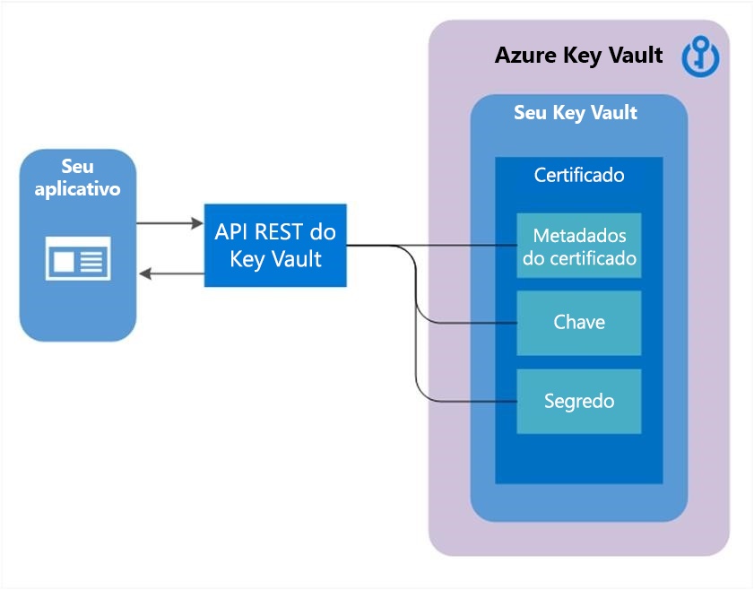

# Sobre certificados do Azure Key Vault

Os certificados do Cofre de Chaves oferecem suporte ao gerenciamento de seus certificados x509 e dos comportamentos a seguir:  

-   Permite que um proprietário de certificado crie um certificado por meio de um processo de criação de Cofre de Chaves ou pela importação de um certificado existente. Inclui certificados autoassinados e gerados por Autoridades de Certificação.
-   Permite que um proprietário de certificado do Cofre de Chaves implemente o armazenamento seguro e o gerenciamento de certificados X509 sem interagir com o material da chave privada.  
-   Permite que um proprietário de certificado crie uma política que direciona o Cofre de Chaves para gerenciar o ciclo de vida de um certificado.  
-   Permite que os proprietários de certificado forneçam informações de contato para a notificação sobre eventos de ciclo de vida de validade e renovação de certificados.  
-   Oferece suporte à renovação automática com emissores selecionados - provedores de certificado X509/autoridades de certificação parceiros do Cofre de Chaves.

>[!Note]
>Provedores/autoridades que não têm parceria também têm permissão, mas, não oferecerão suporte ao recurso de renovação automática.

## Composição de um certificado

Quando um certificado de Cofre de Chaves é criado, uma chave endereçável e o segredo também são criados com o mesmo nome. A chave de Cofre de Chaves permite operações de chave e o segredo do Cofre de Chaves permite a recuperação do valor do certificado como um segredo. Um certificado do Cofre de Chaves também contém metadados do certificado x509 público.  

O identificador e a versão de certificados é semelhante à de chaves e segredos. Uma versão específica de uma chave endereçável e segredo criados com a versão de certificado do Cofre de Chaves está disponível na resposta de certificado do Cofre de Chaves.
 

## Chave exportável ou não exportável

Quando um certificado de Key Vault é criado, ele pode ser recuperado do segredo endereçável com a chave privada no formato PFX ou PEM. A política usada para criar o certificado deve indicar que a chave é exportável. Se a política indicar não exportável, a chave privada não é uma parte do valor quando for recuperada como um segredo.  

A chave endereçável fica mais relevante com certificados KV não exportáveis. As operações da chave KV endereçável são mapeadas do campo *keyusage* da política de certificação KV usada para criar o certificado KV.  

O tipo de par de chaves para dar suporte a certificados

 - Tipos de chave com suporte: RSA, RSA-HSM, EC, EC-HSM, oct (listadas [aqui](/rest/api/keyvault/createcertificate/createcertificate#jsonwebkeytype)). A exportação só é permitida com RSA e EC. As chaves HSM seriam não exportáveis.

|Tipo de chave|Sobre|Segurança|
|--|--|--|
|**RSA**| chave RSA "protegida por software"|FIPS 140-2 Nível 1|
|**RSA-HSM**| Chave RSA "protegida por HSM" (somente SKU Premium)|HSM FIPS 140-2 Nível 2|
|**EC**| chave de Curva Elíptica "protegida por software"|FIPS 140-2 Nível 1|
|**EC-HSM**| "Chave de curva elíptica "protegida por HSM" (somente SKU Premium)|HSM FIPS 140-2 Nível 2|
|||

## Marcas e atributos de certificado

Além dos metadados do certificado, uma chave endereçável e um segredo endereçável, um certificado do Key Vault também contém marcas e atributos.  

### Atributos

Os atributos de certificado são espelhados para atributos de chave endereçável e segredo criado quando o certificado KV é criado.  

Um certificado do Cofre de Chaves tem os seguintes atributos:  

-   *habilitado*: booliano, opcional, o padrão é **true**. Pode ser especificado para indicar se os dados de certificado podem ser recuperados como segredo ou operável como uma chave. Também usado em conjunto com *nbf* e *exp* quando ocorre uma operação entre *nbf* e *exp* e só será permitido se ”habilitado” estiver definido como true. As operações fora da janela *nbf* e *exp* são proibidas automaticamente.  

Há mais atributos somente leitura que são incluídos em resposta:

-   *criado*: IndDate indica quando esta versão do certificado foi criada.  
-   *atualizado*: IndDate indica quando esta versão do certificado foi atualizada.  
-   *exp*: IntDate: contém o valor da data de expiração do certificado x509.  
-   *nbf*: IntDate: contém o valor da data do certificado x509.  

> [!Note] 
> Se um certificado do Key Vault expirar, a chave e o certificado endereçáveis ficarão inoperantes.  

### Marcas

 O dicionário de pares de valor de chave especificado pelo cliente, semelhantes às marcas em chaves e segredos.  

 > [!Note]
> As marcas podem ser lidas por um chamador se ele tiver a permissão *listar* ou *obter* para esse tipo de objeto; chaves, segredos ou certificados.

## Política do certificado

Uma política de certificado contém informações sobre como criar e gerenciar o ciclo de vida de um certificado do Key Vault. Quando um certificado com a chave privada é importado para o Cofre de Chaves, uma política padrão é criada lendo o certificado x509.  

Quando um certificado do Key Vault é criado do zero, uma política precisa ser fornecida. A política especifica como criar esta versão do certificado do Key Vault ou a versão seguinte do certificado do Key Vault. Após o estabelecimento de uma política, não é necessária operações sucessivas para criar as próximas versões. Há apenas uma instância de uma política para todas as versões de um certificado de Key Vault.  

Em um alto nível, uma política de certificação contém as seguintes informações (encontre as definições [aqui](/powershell/module/az.keyvault/set-azkeyvaultcertificatepolicy)):  

-   Propriedades do Certificado X509: Contém o nome da entidade, os nomes alternativos da entidade e outras propriedades usadas para criar uma solicitação de certificado x509.  
-   Propriedades de Chave: contém os campos de tipo de chave, tamanho da chave e exportáveis e ReuseKeyOnRenewal. Esses campos instruem o Cofre de Chaves sobre como gerar uma chave. 
     - Tipos de chave com suporte: RSA, RSA-HSM, EC, EC-HSM, oct (listadas [aqui](/rest/api/keyvault/createcertificate/createcertificate#jsonwebkeytype)) 
-   Propriedades de segredo: contém propriedades secretas como tipo de conteúdo de segredo endereçável para gerar o valor de segredo, para recuperar o certificado como um segredo.  
-   Ações de tempo de vida: contém ações de tempo de vida do certificado KV. Cada ação de tempo de vida contém:  

     - Gatilho: especificado por meio de dias antes da expiração ou tempo de vida de porcentagem de alcance  

     - Ação: especificar o tipo de ação – *emailContacts* ou *renovar automaticamente*  

-   Emissor: Parâmetros sobre o emissor do certificado a ser usado para emitir certificados x509.  
-   Atributos de política: contém os atributos associados à política  

### X509 para mapeamento de uso do Cofre de Chaves

A tabela a seguir representa o mapeamento de política de uso de chave x509 para operações de chave efetivas de uma chave criada como parte da criação de certificado do Cofre de Chaves.

|**Sinalizadores de Utilização de Chave x509**|**Operações de chave do Cofre de Chaves**|**Comportamento padrão**|
|----------|--------|--------|
|DataEncipherment|criptografar, descriptografar| N/D |
|DecipherOnly|descriptografar| N/D  |
|DigitalSignature|fazer logon, verificar| Padrão de Cofre de Chaves sem uma especificação de uso no momento da criação de certificado | 
|EncipherOnly|encrypt| N/D |
|KeyCertSign|fazer logon, verificar|N/D|
|KeyEncipherment|wrapKey, unwrapKey| Padrão de Cofre de Chaves sem uma especificação de uso no momento da criação de certificado | 
|Não repúdio|fazer logon, verificar| N/D |
|crlsign|fazer logon, verificar| N/D |

## Emissor do certificado

Um objeto de certificado do Cofre de Chaves contém uma configuração usada para se comunicar com um provedor de emissor do certificado selecionado para solicitar certificados x509.  

-   Parceiros do Key Vault com os provedores de emissor do certificado a seguir para certificados TLS/SSL

|**Nome do Provedor**|**Locais**|
|----------|--------|
|DigiCert|Suporte em todos os locais de serviço de Cofre de Chaves na nuvem pública e o Azure Government|
|GlobalSign|Suporte em todos os locais de serviço de Cofre de Chaves na nuvem pública e o Azure Government|

Antes que um emissor de certificado possa ser criado em um Cofre de Chaves, as seguintes etapas 1 e 2 de pré-requisitos devem ser concluídas com êxito.  

1. Integrado aos provedores de Autoridade de Certificação (CA)  

    -   Um administrador da organização deve integrar sua empresa (ex. Contoso) com pelo menos um provedor de autoridade de certificação.  

2. O administrador cria as credenciais do solicitante para que o Key Vault registre (e renove) certificados TLS/SSL  

    -   Fornece a configuração a ser usado para criar um objeto de emissor do provedor no cofre de chaves  

Para obter mais informações sobre como criar objetos de emissor do portal de certificados, consulte o [blog de certificados de Cofre de Chave](/archive/blogs/kv/manage-certificates-via-azure-key-vault)  

O Cofre de Chaves permite a criação de vários objetos de emissor com configuração de provedor de emissor diferente. Quando um objeto de emissor é criado, seu nome pode ser referenciado em uma ou várias políticas de certificado. Referenciar o objeto emissor instrui o Cofre de Chaves para usar a configuração conforme especificado no objeto emissor ao solicitar o certificado x509 do provedor de autoridade de certificação durante a criação e renovação do certificado.  

Objetos de emissor são criados no cofre e só podem ser usados com certificados KV no mesmo cofre.  

## Contatos de certificado

Contatos de certificado contêm informações de contato para enviar notificações disparadas por eventos de tempo de vida do certificado. As informações de contatos são compartilhadas por todos os certificados no cofre de chaves. Uma notificação é enviada a todos os contatos especificados para um evento para qualquer certificado no cofre de chaves. Para obter informações sobre como definir o contato do certificado, acesse [aqui](overview-renew-certificate.md#steps-to-set-certificate-notifications)  

## Controle de acesso de certificado

 O controle de acesso para certificados é gerenciado pelo Key Vault e é fornecido no nível de um Key Vault que atua como o contêiner desses certificados. A política de controle de acesso para certificados é diferente da política de controle de acesso para chaves e segredos no mesmo Key Vault. Os usuários podem criar um ou mais cofres para armazenar certificados, para manter a segmentação e gerenciamento de certificados apropriados do cenário.  Para obter mais informações sobre o controle de acesso do certificado, acesse [aqui](certificate-access-control.md)

## Próximas etapas

- [Sobre o Key Vault](../general/overview.md)
- [Sobre chaves, segredos e certificados](../general/about-keys-secrets-certificates.md)
- [Sobre as chaves](../keys/about-keys.md)
- [Sobre segredos](../secrets/about-secrets.md)
- [Autenticação, solicitações e respostas](../general/authentication-requests-and-responses.md)
- [Guia do Desenvolvedor do Cofre de Chaves](../general/developers-guide.md)
