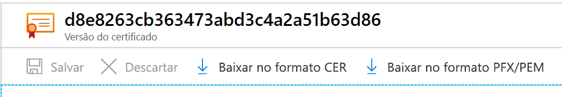

# <a name="export-certificates-from-azure-key-vault"></a>Exportar certificados do Azure Key Vault

Saiba como exportar certificados do Azure Key Vault. Você pode exportar certificados usando a CLI do Azure, o Azure PowerShell ou o portal do Azure. 

## <a name="about-azure-key-vault-certificates"></a>Sobre certificados do Azure Key Vault

O Azure Key Vault permite que você provisione, gerencie e implante certificados digitais para a sua rede. Ele também proporciona comunicações seguras para aplicativos. Consulte [Certificados do Azure Key Vault](./about-certificates.md) para obter mais informações.

### <a name="composition-of-a-certificate"></a>Composição de um certificado

Quando um certificado do Key Vault é criado, uma *chave* e um *segredo* endereçáveis são criados com o mesmo nome. A chave do Key Vault permite operações de chave. O segredo do Key Vault permite a recuperação do valor do certificado como um segredo. Um certificado do Cofre de Chaves também contém metadados do certificado x509 público. Acesse [Composição de um certificado](./about-certificates.md#composition-of-a-certificate) para obter mais informações.

### <a name="exportable-and-non-exportable-keys"></a>Chaves exportáveis e não exportáveis

Depois que um certificado do Key Vault é criado, você pode recuperá-lo por meio do segredo endereçável com a chave privada. Recupere o certificado no formato PFX ou PEM.

- **Exportável**: a política usada para criar o certificado indica que a chave é exportável.
- **Não exportável**: a política usada para criar o certificado indica que a chave é não exportável. Nesse caso, a chave privada não faz parte do valor quando é recuperada como um segredo.

Tipos de chave com suporte: RSA, RSA-HSM, EC, EC-HSM, oct (listadas [aqui](/rest/api/keyvault/createcertificate/createcertificate#jsonwebkeytype)). A exportação só é permitida com RSA e EC. As chaves HSM seriam não exportáveis.

Consulte [Sobre certificados do Azure Key Vault](./about-certificates.md#exportable-or-non-exportable-key) para obter mais informações.

## <a name="export-stored-certificates"></a>Exportar certificados armazenados

Você pode exportar certificados armazenados no Azure Key Vault usando a CLI do Azure, o Azure PowerShell ou o portal do Azure.

> [!NOTE]
> Exija apenas uma senha de certificado quando você importar o certificado no cofre de chaves. O Key Vault não salva a senha associada. Quando você exporta o certificado, a senha fica em branco.

# <a name="azure-cli"></a>[CLI do Azure](#tab/azure-cli)

Use o comando a seguir na CLI do Azure para baixar a **parte pública** de um certificado do Key Vault.

```azurecli
az keyvault certificate download --file
                                 [--encoding {DER, PEM}]
                                 [--id]
                                 [--name]
                                 [--subscription]
                                 [--vault-name]
                                 [--version]
```

Veja [exemplos e definições de parâmetro](/cli/azure/keyvault/certificate#az-keyvault-certificate-download) para obter mais informações.

Baixar como certificado significa obter a parte pública. Se você quiser a chave privada e os metadados públicos, poderá baixá-los como um segredo.

```azurecli
az keyvault secret download -–file {nameofcert.pfx}
                            [--encoding {ascii, base64, hex, utf-16be, utf-16le, utf-8}]
                            [--id]
                            [--name]
                            [--subscription]
                            [--vault-name]
                            [--version]
```

Para obter mais informações, confira [definições de parâmetro](/cli/azure/keyvault/secret#az-keyvault-secret-download).

# <a name="powershell"></a>[PowerShell](#tab/azure-powershell)

Use esse comando no Azure PowerShell para obter o certificado denominado **TestCert01** do cofre de chaves chamado **ContosoKV01**. Para baixar o certificado como um arquivo PFX, execute o comando a seguir. Esses comandos acessam a **SecretId** e salvam o conteúdo como um arquivo PFX.

```azurepowershell
$cert = Get-AzKeyVaultCertificate -VaultName "ContosoKV01" -Name "TestCert01"
$secret = Get-AzKeyVaultSecret -VaultName "ContosoKV01" -Name $cert.Name
$secretValueText = '';
$ssPtr = [System.Runtime.InteropServices.Marshal]::SecureStringToBSTR($secret.SecretValue)
try {
    $secretValueText = [System.Runtime.InteropServices.Marshal]::PtrToStringBSTR($ssPtr)
} finally {
    [System.Runtime.InteropServices.Marshal]::ZeroFreeBSTR($ssPtr)
}
$secretByte = [Convert]::FromBase64String($secretValueText)
$x509Cert = new-object System.Security.Cryptography.X509Certificates.X509Certificate2
$x509Cert.Import($secretByte, "", "Exportable,PersistKeySet")
$type = [System.Security.Cryptography.X509Certificates.X509ContentType]::Pfx
$pfxFileByte = $x509Cert.Export($type, $password)

# Write to a file
[System.IO.File]::WriteAllBytes("KeyVault.pfx", $pfxFileByte)
```

Esse comando exportará toda a cadeia de certificados com uma chave privada (ou seja, a mesma que foi importada). O certificado é protegido por senha.
Para obter mais informações sobre o comando **Get-AzKeyVaultCertificate** e os parâmetros, consulte [Get-AzKeyVaultCertificate – Exemplo 2](/powershell/module/az.keyvault/Get-AzKeyVaultCertificate).

# <a name="portal"></a>[Portal](#tab/azure-portal)

No portal do Azure, depois de criar/importar um certificado na folha **Certificado**, você receberá uma notificação de que o certificado foi criado com êxito. Selecione o certificado e a versão atual para ver a opção para baixar.

Para baixar o certificado, selecione **Baixar no formato CER** ou **Baixar no formato PFX/PEM**.



**Exportar certificados do Serviço de Aplicativo do Azure**

Os certificados do Serviço de Aplicativo do Azure são uma forma conveniente de comprar certificados SSL. Você pode atribuí-los a Aplicativos do Azure por meio do portal. Depois de importá-los, os certificados do Serviço de Aplicativo ficam localizados em **segredos**.

Para obter mais informações, consulte as etapas para [exportar certificados do Serviço de Aplicativo do Azure](https://social.technet.microsoft.com/wiki/contents/articles/37431.exporting-azure-app-service-certificates.aspx).

---

## <a name="read-more"></a>Leia mais
* [Vários tipos de arquivo de certificado e definições](/archive/blogs/kaushal/various-ssltls-certificate-file-typesextensions)
