# Integrar o Azure Key Vault ao Azure Policy

O [Azure Policy](../../governance/policy/index.yml) é uma ferramenta de governança que oferece aos usuários a capacidade de auditar e gerenciar em grande escala o respectivo ambiente do Azure. O Azure Policy permite a colocação de grades de proteção em recursos do Azure, de modo a garantir que eles estejam em conformidade com as regras da política atribuída. A ferramenta permite que os usuários realizem auditoria, imposição em tempo real e correção do ambiente do Azure. Os resultados das auditorias realizadas pela política estarão disponíveis aos usuários em um painel de conformidade que mostra o detalhamento de quais recursos e componentes estão em conformidade e quais não estão.  Para saber mais, confira [Visão geral do serviço do Azure Policy](../../governance/policy/overview.md).

Exemplo de cenários de uso:

- Você quer melhorar a postura de segurança da empresa implementando requisitos quanto aos tamanhos mínimos de chave e períodos máximos de validade dos certificados nos cofres de chaves da sua empresa, mas não sabe quais equipes vão cumpri-los e quais não vão.
- Atualmente, você não tem uma solução para executar uma auditoria na organização ou está realizando auditorias manuais do ambiente, solicitando que equipes individuais dentro da organização relatem a respectiva conformidade. Você está procurando uma maneira de automatizar essa tarefa, executar auditorias em tempo real e garantir a precisão da auditoria.
- Você quer impor as políticas de segurança da empresa e impedir que as pessoas criem certificados autoassinados, mas não tem um método automatizado de bloquear essa criação. 
- Você quer suavizar alguns requisitos para as equipes de teste, mas manter rígido controle sobre o ambiente de produção. Você precisa de uma maneira simples e automatizada de separar a imposição de seus recursos.
- Você quer ter a certeza de que pode reverter a imposição de novas políticas no caso de um problema do site ativo. Você precisa de uma solução para desativar a imposição da política com apenas um clique. 
- Você está contando com uma solução de terceiros para auditar seu ambiente e quer usar uma oferta interna da Microsoft.

## Diretrizes e tipos de efeito da política

**Auditar**: quando o efeito de uma política for definido para auditar, a política não causará alterações de falha em seu ambiente. Ela só alertará você sobre componentes, como certificados que não estão em conformidade com as definições da política em um escopo especificado, marcando-os como fora de conformidade no painel de conformidade com a política. A auditoria será padrão se nenhum efeito de política for selecionado.

**Negar**: quando o efeito de uma política for definido para negar, a política bloqueará a criação de novos componentes, como certificados, bem como novas versões de componentes existentes que não cumprem a definição da política. Os recursos existentes não compatíveis em um cofre de chaves não são afetados. Os recursos de "auditoria" continuarão funcionando.

## Definições de política "interna" disponíveis

O Key Vault criou um conjunto de políticas, que pode ser usado para gerenciar objetos de chave, de certificado e de segredo. Essas políticas são "internas", o que significa que elas não exigem que você escreva qualquer JSON personalizado para habilitá-las e que estão disponíveis no portal do Azure para sua atribuição. Você ainda pode personalizar determinados parâmetros para atender às necessidades da sua organização.

# [Políticas de certificado](#tab/certificates)

### Os certificados devem ter o período de validade máximo especificado (versão prévia)

Essa política permite que você gerencie o período máximo de validade de seus certificados armazenados no cofre de chaves. É uma boa prática de segurança limitar o período máximo de validade de seus certificados. Se uma chave privada do seu certificado for comprometida sem detecção, o uso de certificados de vida curta minimizará o período para danos contínuos e reduzirá o valor do certificado para um invasor.

### Os certificados devem usar os tipos de chave permitidos (versão prévia)

Essa política permite restringir os tipos de certificado que podem estar no seu cofre de chaves. Você pode usar essa política para verificar se as chaves privadas do certificado são RSA, ECC ou garantidas pelo HSM. Na lista a seguir, é possível escolher quais tipos de certificado são permitidos.

- RSA
- RSA – HSM
- ECC
- ECC – HSM

### Os certificados devem ter os gatilhos de ação de tempo de vida especificados (versão prévia)

Essa política permite gerenciar a ação de tempo de vida especificada para certificados que estão dentro de um determinado número de dias de sua expiração ou que atingiram uma determinada porcentagem de sua vida útil.

### Os certificados devem ser emitidos pela autoridade de certificação integrada especificada (versão prévia)

Se você usar uma autoridade de certificação integrada do Key Vault (Digicert ou GlobalSign) e quiser que os usuários usem um ou qualquer um desses provedores, você poderá usar essa política para auditar ou impor sua seleção. Essa política também pode ser usada para auditar ou negar a criação de certificados autoassinados no core de chaves.

### Os certificados devem ser emitidos pela autoridade de certificação não integrada especificada (versão prévia)

Se você usar uma autoridade de certificação interna ou uma autoridade de certificação não integrada ao cofre de chaves e quiser que os usuários usem uma autoridade de certificação de uma lista fornecida por você, será possível usar essa política para criar uma lista de permissões de autoridades de certificação por nome do emissor. Essa política também pode ser usada para auditar ou negar a criação de certificados autoassinados no core de chaves.

### Os certificados que usam a criptografia de curva elíptica devem ter nomes de curva permitidos (versão prévia)

Se você usar criptografia de curva elíptica ou certificados ECC, será possível personalizar uma lista de permissões de nomes de curva usando a lista abaixo. A opção padrão permite todos os nomes de curva a seguir.

- P-256
- P-256K
- P-384
- P-521

## Os certificados que usam a criptografia RSA gerenciam o tamanho mínimo da chave dos certificados RSA (versão prévia)

Se usar certificados RSA, você poderá escolher um tamanho mínimo de chave que seus certificados devem ter. É possível selecionar uma opção na lista abaixo.

- 2048 bits
- 3072 bits
- 4096 bits

## Gerenciar certificados que estão dentro de um número especificado de dias da validade (versão prévia)

Seu serviço pode sofrer uma interrupção se um certificado que não está sendo monitorado adequadamente não for rotacionado antes de sua expiração. Essa política é essencial para garantir que os certificados armazenados no cofre de chaves estejam sendo monitorados. É recomendável aplicar essa política várias vezes com limites de expiração diferentes, por exemplo, com limites de 180, 90, 60 e 30 dias. Essa política pode ser usada para monitorar e fazer a triagem da expiração de certificados em sua organização.

# [Políticas de chave](#tab/keys)

### As chaves não devem ficar ativas por um tempo maior do que o número especificado de dias (versão prévia)

Se você quer garantir que suas chaves não fiquem ativas por um tempo maior do que um número especificado de dias, use esta política para auditar há quanto tempo a chave está ativa.

**Se a chave tiver uma data de ativação definida**, esta política calculará o número de dias decorridos desde a **data de ativação** da chave até a data atual. Se o número de dias exceder o limite definido, a chave será marcada como sem conformidade com a política.

**Se a chave não tiver uma data de ativação definida**, esta política calculará o número de dias decorridos desde a **data de criação** da chave até a data atual. Se o número de dias exceder o limite definido, a chave será marcada como sem conformidade com a política.

### As chaves devem ser do tipo criptográfico especificado RSA ou EC (versão prévia)

Esta política permite restringir os tipos de chaves que podem estar no cofre de chaves. Você pode usar esta política para garantir que as chaves sejam RSA ou ECC ou que tenham o suporte do HSM. Na lista a seguir, é possível escolher quais tipos de certificado são permitidos.

- RSA
- RSA – HSM
- ECC
- ECC – HSM

### As chaves que usam a criptografia de curva elíptica devem ter nomes de curva permitidos (versão prévia)

Ao usar a criptografia de curva elíptica ou as chaves ECC, você pode personalizar uma lista de permissões de nomes de curva usando a lista abaixo. A opção padrão permite todos os nomes de curva a seguir.

- P-256
- P-256K
- P-384
- P-521

### As chaves devem ter datas de validade definidas (versão prévia)

Esta política audita todas as chaves nos seus cofres de chaves e sinaliza como sem conformidade as chaves que não têm uma data de validade definida. Você também pode usar esta política para bloquear a criação de chaves que não tenham uma data de validade definida.

### As chaves devem ter um número maior de dias do que o especificado antes da validade (versão prévia)

Se uma chave estiver muito próxima da validade, um atraso organizacional para fazer a rotação da chave poderá resultar em uma interrupção. A rotação das chaves deve ser feita em um número de dias especificado antes da validade para que haja tempo suficiente para reagir a uma falha. Esta política audita as chaves que estão muito próximas da data de validade e permite que você defina esse limite em dias. Você também pode usar esta política para impedir a criação de chaves que estejam muito próximas à data de validade.

### As chaves devem ter o suporte de um módulo de segurança de hardware (versão prévia)

Um HSM é um módulo de segurança de hardware que armazena chaves. Um HSM fornece uma camada física de proteção para chaves de criptografia. A chave de criptografia não pode sair de um HSM físico, o que fornece um nível maior de segurança do que uma chave de software. Algumas organizações têm requisitos de conformidade que determinam o uso de chaves do HSM. Use esta política para auditar todas as chaves armazenadas no cofre de chaves que não tenham o suporte do HSM. Você também pode usá-la para bloquear a criação de chaves que não tenham suporte do HSM. Esta política será aplicada a todos os tipos de chave, RSA e ECC.

### As chaves que usam a criptografia RSA devem ter o tamanho mínimo de chave especificado (versão prévia)

O uso de chaves RSA com tamanhos de chave menores não é uma prática de design segura. Talvez você esteja sujeito a padrões de auditoria e de certificação que determinem o uso de um tamanho mínimo de chave. A política a seguir permite que você defina um requisito de tamanho mínimo de chave no cofre de chaves. Você pode auditar as chaves que não atendem a esse requisito mínimo. Esta política também pode ser usada para bloquear a criação de chaves que não atendam ao requisito de tamanho mínimo de chave.

### As chaves devem ter o período de validade máximo especificado (versão prévia)

Gerencie seus requisitos de conformidade organizacional especificando o período máximo em dias de validade de uma chave no cofre de chaves. As chaves com uma validade maior que o limite definido serão marcadas como sem conformidade. Você também pode usar esta política para bloquear a criação de chaves que tenham uma data de validade definida por um tempo maior do que o período de validade máximo especificado.

# [Políticas de segredo](#tab/secrets)

### Os segredos não devem ficar ativos por um tempo maior do que o número especificado de dias (versão prévia)

Se você quer garantir que seus segredos não fiquem ativos por um tempo maior do que um número especificado de dias, use esta política para auditar há quanto tempo o segredo está ativo.

**Se o segredo tiver uma data de ativação definida**, esta política calculará o número de dias decorridos desde a **data de ativação** do segredo até a data atual. Se o número de dias exceder o limite definido, o segredo será marcado como sem conformidade com a política.

**Se o segredo não tiver uma data de ativação definida**, esta política calculará o número de dias decorridos desde a **data de criação** do segredo até a data atual. Se o número de dias exceder o limite definido, o segredo será marcado como sem conformidade com a política.

### Os segredos devem ter o tipo de conteúdo definido (versão prévia)

Qualquer texto sem formatação ou arquivo codificado pode ser armazenado como um segredo do cofre de chaves. No entanto, sua organização pode definir diferentes políticas de rotação e restrições em senhas, cadeias de conexão ou certificados armazenados como chaves. Uma marca de tipo de conteúdo pode ajudar o usuário a saber o que está armazenado em um objeto de segredo sem ler o valor do segredo. Você pode usar esta política para auditar segredos que não tenham uma marca de tipo de conteúdo definida. Você também pode usá-la para impedir que sejam criados segredos que não tenham uma marca de tipo de conteúdo definida.

### Os segredos devem ter a data de validade definida (versão prévia)

Esta política audita todos os segredos no cofre de chaves e sinaliza como sem conformidade os segredos que não têm uma data de validade definida. Você também pode usar esta política para bloquear a criação de segredos que não tenham uma data de validade definida.

### Os segredos devem ter um número maior de dias do que o especificado antes da validade (versão prévia)

Se um segredo estiver muito próximo da validade, um atraso organizacional para fazer a rotação do segredo poderá resultar em uma interrupção. A rotação dos segredos deve ser feita em um número de dias especificado antes da validade para que haja tempo suficiente para reagir a uma falha. Esta política audita os segredos que estão muito próximos da data de validade e permite que você defina esse limite em dias. Você também pode usar esta política para impedir a criação de segredos que estejam muito próximos à data de validade.

### Os segredos devem ter o período de validade máximo especificado (versão prévia)

Gerencie seus requisitos de conformidade organizacional especificando o período máximo em dias de validade de um segredo no cofre de chaves. Os segredos com uma validade maior que o limite definido serão marcadas como sem conformidade. Você também pode usar esta política para bloquear a criação de segredos que tenham uma data de validade definida por um tempo maior do que o período de validade máximo especificado.

---

## Cenário de Exemplo

Você gerencia um cofre de chaves usado por várias equipes; o cofre contém 100 certificados e você quer ter certeza de que nenhum desses certificados será válido por mais de 2 anos.

1. Você atribui a política **Os certificados devem ter o período de validade máximo especificado**, especifica que o período máximo de validade de um certificado é de 24 meses e define o efeito da política como "Auditar". 
1. Você exibe o [relatório de conformidade no portal do Azure](#view-compliance-results) e descobre que 20 certificados estão fora de conformidade e são válidos por mais de 2 anos, e que os certificados restantes estão em conformidade. 
1. Você entra em contato com os proprietários desses certificados e comunica o novo requisito de segurança de que os certificados não podem ser válidos por mais de 2 anos. Algumas equipes respondem e 15 dos certificados foram renovados com um período de validade máximo de 2 anos ou menos. Outras equipes não respondem e você ainda tem 5 certificados fora de conformidade em seu cofre de chaves.
1. Você altera o efeito da política que atribuiu como "negar". Os 5 certificados fora de conformidade não são revogados e continuam funcionando. No entanto, eles não podem ser renovados com um período de validade superior a 2 anos. 

## Habilitação e gerenciamento de uma política do Key Vault por meio do portal do Azure

### Selecionar uma definição de política

1. Faça logon no Portal do Azure. 
1. Procure por "Política" na barra de pesquisa e selecione **Política**.

    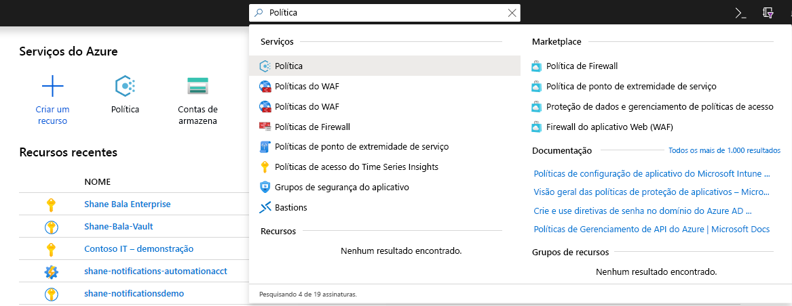

1. Na janela Política, selecione **Definições**.

    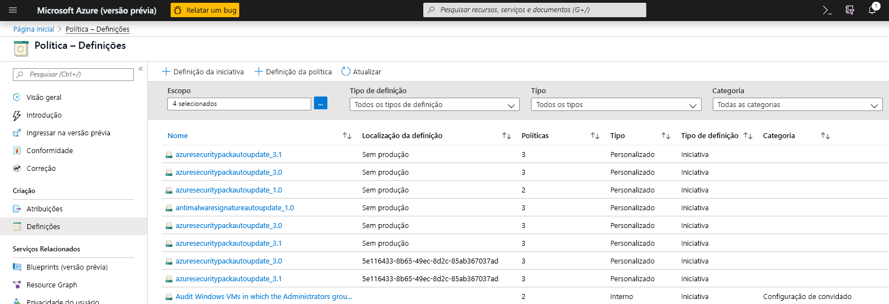

1. No filtro Categoria, desmarque **Selecionar Tudo** e selecione **Key Vault**. 

    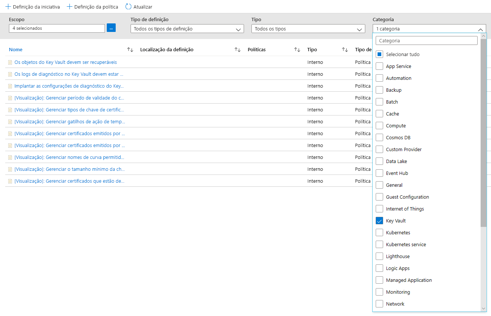

1. Agora deve ser possível ver todas as políticas disponíveis para Visualização Pública do Azure Key Vault. Certifique-se de que leu e entendeu a seção de diretrizes de política acima e selecione uma política que queira atribuir a um escopo.  

    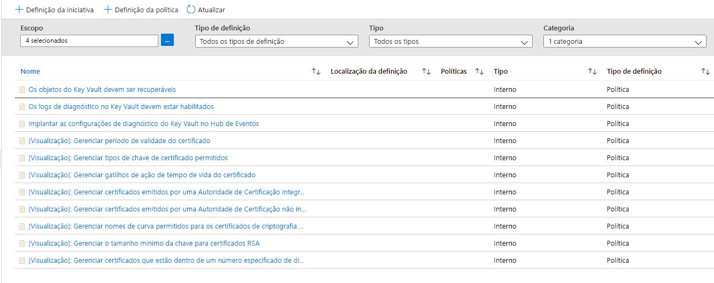

### Atribuir uma política a um escopo 

1. Selecione uma política que queira aplicar. Neste exemplo, a política **Gerenciar o período de validade do certificado** é mostrada. Clique no botão de atribuição no canto superior esquerdo.

    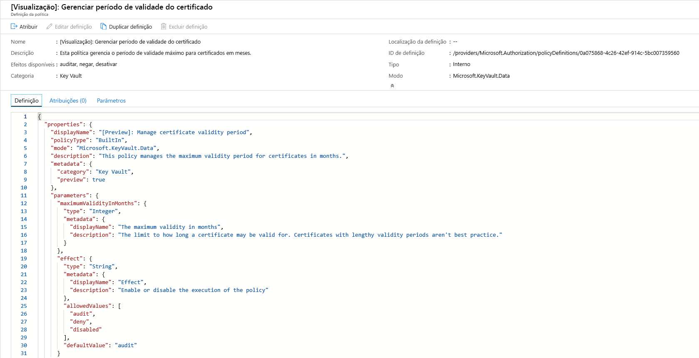
  
1. Selecione a assinatura na qual deseja que a política seja aplicada. Você pode optar por restringir o escopo a um único grupo de recursos em uma assinatura. Se quiser aplicar a política a toda a assinatura e excluir alguns grupos de recursos, você também poderá configurar uma lista de exclusões. Defina o seletor de imposição de política para **Habilitado** se quiser que o efeito da política (auditar ou negar) ocorra ou para **Desabilitado** para desativar o efeito (auditar ou negar). 

    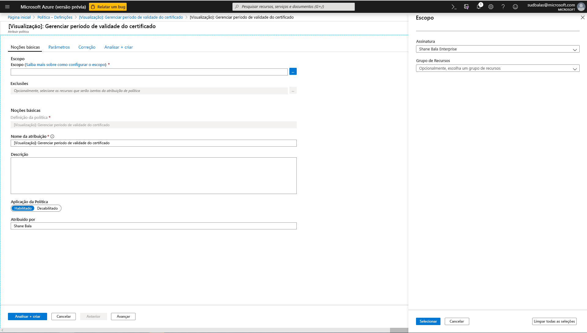

1. Clique na guia de parâmetros na parte superior da tela para especificar o período máximo de validade em meses que você deseja. Selecione **auditar** ou **negar** para o efeito da política seguindo as diretrizes nas seções acima. Em seguida, selecione o botão revisar + criar. 

    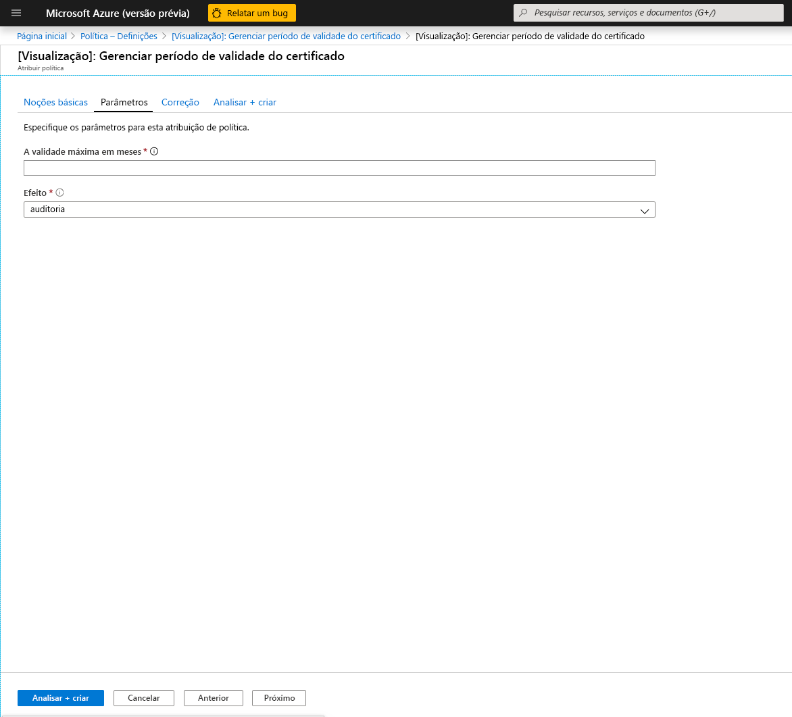

### Exibir resultados da conformidade

1. Volte para a folha Política e selecione a guia Conformidade. Clique na atribuição de política para a qual deseja exibir os resultados da conformidade.

    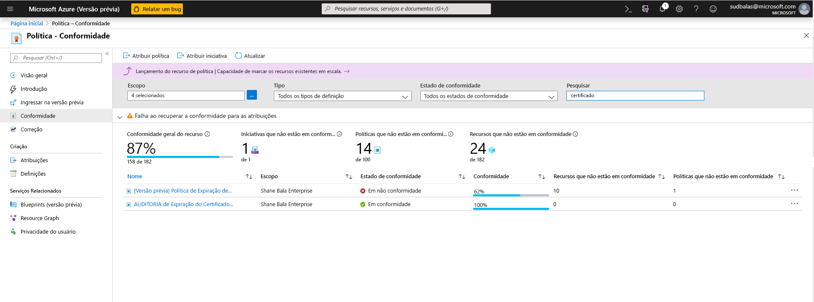

1. Nessa página, você pode filtrar os resultados por cofres em conformidade ou fora de conformidade. Aqui, você pode ver uma lista de cofres de chaves fora de conformidade no escopo da atribuição de política. Um cofre será considerado fora de conformidade se algum dos componentes (certificados) no cofre estiver fora de conformidade. É possível selecionar um cofre individual para exibir os componentes individuais fora de conformidade (certificados). 

    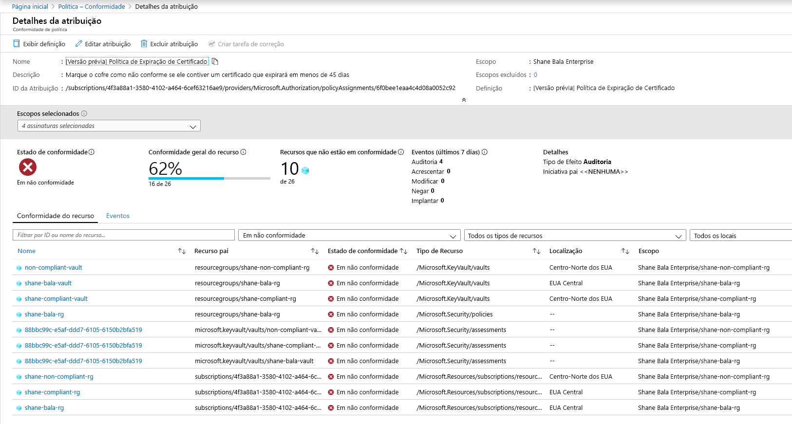

1. Exiba o nome dos componentes em um cofre que está fora de conformidade

    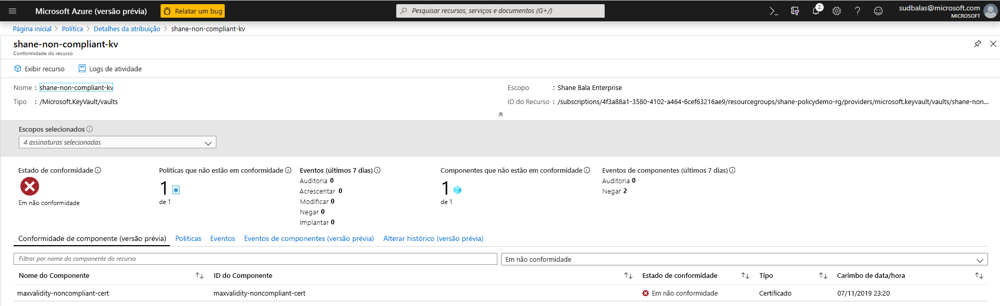

1. Se precisar verificar se os usuários estão sendo impedidos de criar recursos no cofre de chaves, você poderá clicar na guia **Eventos de Componente (versão prévia)** para exibir um resumo das operações de certificado negadas com o solicitante e os carimbos de data/hora das solicitações. 

    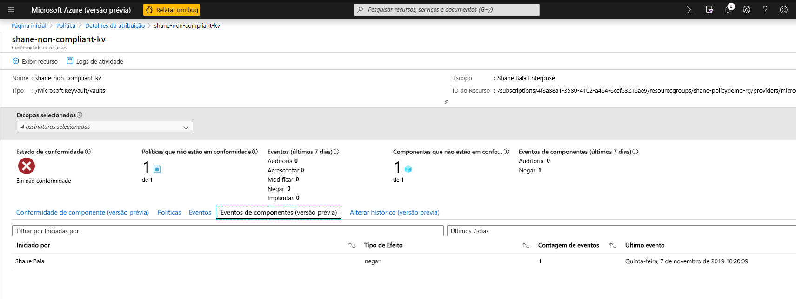

## Limitações do recurso

A atribuição de uma política com um efeito "negar" pode levar de 30 minutos (caso médio) a 1 hora (pior caso) para entrar em vigor e começar a negar a criação de recursos fora de conformidade. A avaliação da política de componentes existentes em um cofre pode levar de 1 hora (caso médio) a 2 horas (pior caso) antes que os resultados da conformidade possam ser vistos na interface do usuário do portal. Se os resultados da conformidade aparecerem como "Não Iniciados", pode ser por um destes motivos:
- A avaliação da política ainda não foi concluída. A latência da avaliação inicial pode levar até 2 horas no pior cenário. 
- Não há cofres de chaves no escopo da atribuição de política.
- Não há cofres de chaves com certificados no escopo da atribuição de política.

> [!NOTE]
> Os [modos de Provedor de Recursos](../../governance/policy/concepts/definition-structure.md#resource-provider-modes) do Azure Policy, como os do Azure Key Vault, fornecem informações sobre a conformidade na página [Conformidade do Componente](../../governance/policy/how-to/get-compliance-data.md#component-compliance).

## Próximas etapas

- Saiba mais sobre o [serviço do Azure Policy](../../governance/policy/overview.md)
- Confira exemplos do Key Vault: [Definições de políticas internas do Key Vault](../../governance/policy/samples/built-in-policies.md#key-vault)
