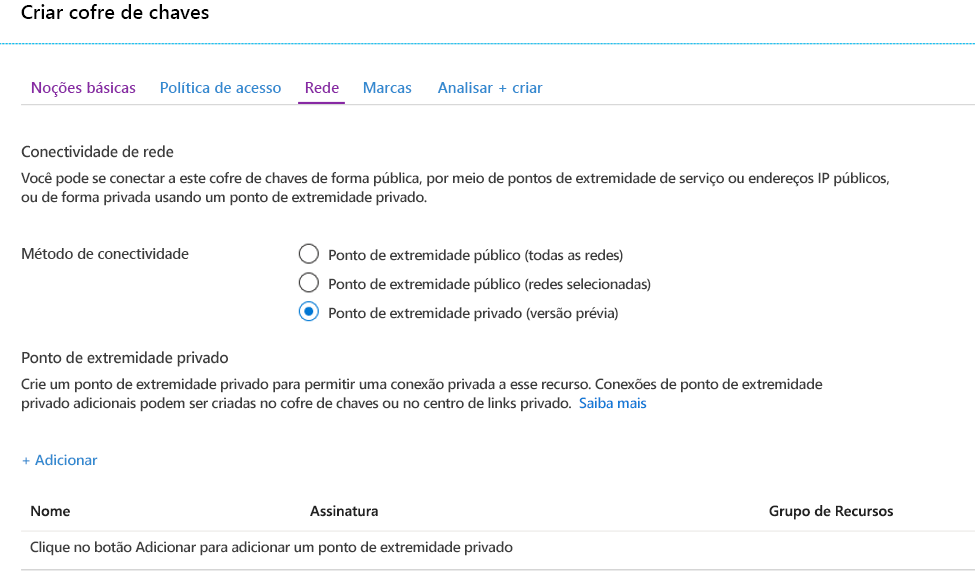
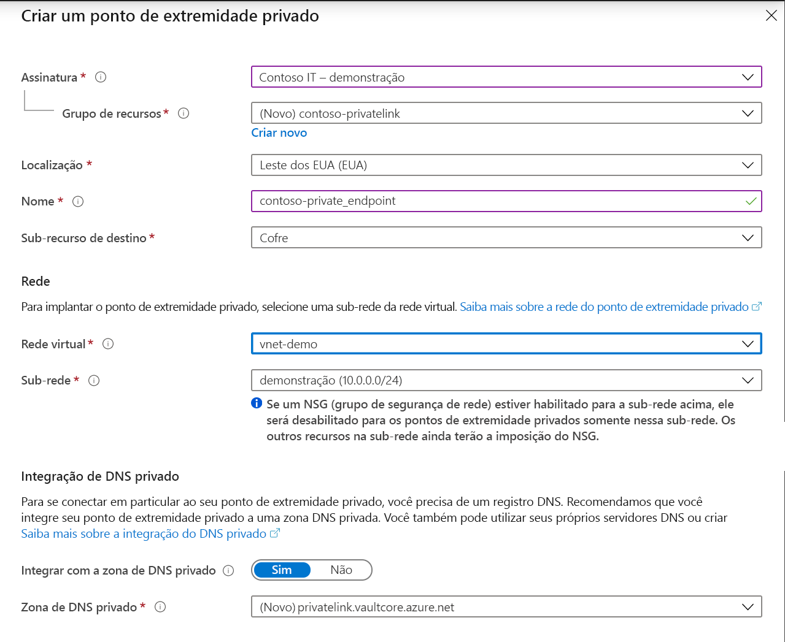
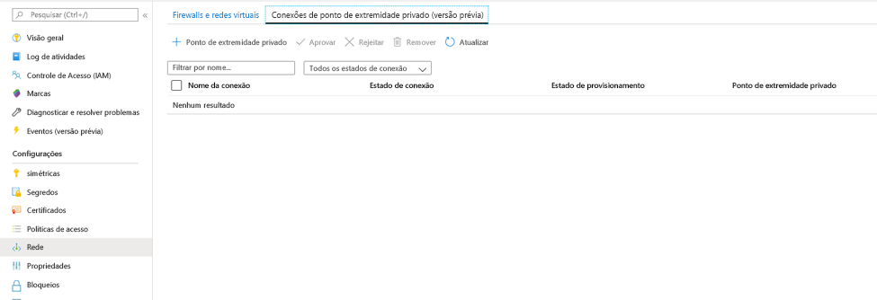
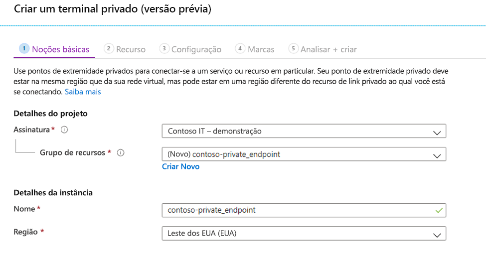
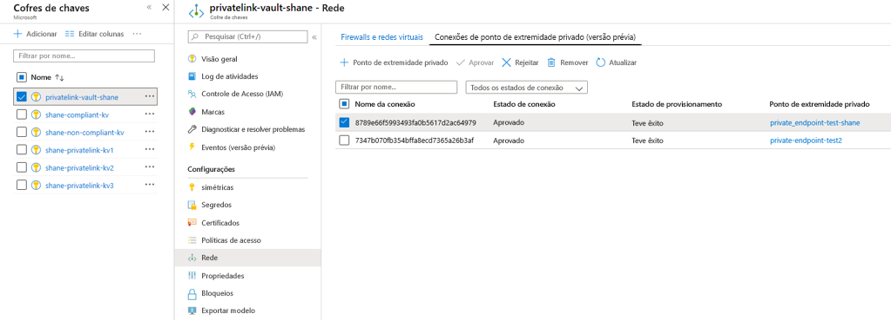

# <a name="integrate-key-vault-with-azure-private-link"></a>Integrar o Key Vault ao Link Privado do Azure

O Serviço de Link Privado do Azure permite acessar os Serviços do Azure (por exemplo, o Azure Key Vault, o Armazenamento do Azure e o Azure Cosmos DB) e serviços de parceiros/clientes hospedados no Azure em um Ponto de Extremidade Privado em sua rede virtual.

Um Ponto de Extremidade Privado do Azure é um adaptador de rede que conecta você de maneira privada e segura a um serviço com tecnologia do Link Privado do Azure. O ponto de extremidade privado usa um endereço IP privado de sua VNet, colocando efetivamente em sua VNet. Todo o tráfego para o serviço pode ser roteado por meio do ponto de extremidade privado; assim, nenhum gateway, nenhum dispositivo NAT, nenhuma conexão ExpressRoute ou VPN e nenhum endereço IP público é necessário. O tráfego entre a rede virtual e o serviço percorre a rede de backbone da Microsoft, eliminando a exposição da Internet pública. Você pode se conectar a uma instância de um recurso do Azure, fornecendo o nível mais alto de granularidade no controle de acesso.

Para obter mais informações, confira [O que é o Link Privado do Azure?](../../private-link/private-link-overview.md)

## <a name="prerequisites"></a>Pré-requisitos

Para integrar um cofre de chaves com o Link Privado do Azure, você precisará do seguinte:

- Um cofre de chaves.
- Uma rede virtual do Azure.
- Uma sub-rede na rede virtual.
- Permissões de proprietário ou colaborador para o cofre de chaves e a rede virtual.

Seu ponto de extremidade privado e a rede virtual devem estar na mesma região. Quando você selecionar uma região para o ponto de extremidade privado usando o portal, ele filtrará automaticamente apenas as redes virtuais que estiverem nessa região. Seu cofre de chaves pode estar em uma região diferente.

Seu ponto de extremidade privado usa um endereço IP privado em sua rede virtual.

# <a name="azure-portal"></a>[Azure portal](#tab/portal)

## <a name="establish-a-private-link-connection-to-key-vault-using-the-azure-portal"></a>Estabelecer uma conexão de link privado com o Key Vault usando o portal do Azure 

Primeiro, crie uma rede virtual seguindo as etapas em [Criar uma rede virtual usando o portal do Azure](../../virtual-network/quick-create-portal.md)

Você pode criar um cofre de chaves ou estabelecer uma conexão de link privado com um cofre de chaves existente.

### <a name="create-a-new-key-vault-and-establish-a-private-link-connection"></a>Criar um cofre de chaves e estabelecer uma conexão de link privado

É possível criar um cofre de chaves com o [portal do Azure](../general/quick-create-portal.md), a [CLI do Azure](../general/quick-create-cli.md) ou o [Azure PowerShell](../general/quick-create-powershell.md).

Após configurar os conceitos básicos do cofre de chaves, selecione a guia Rede e siga estas etapas:

1. Selecione o botão de opção do Ponto de Extremidade Privado na guia Rede.
1. Clique no botão “+ Adicionar” para adicionar um ponto de extremidade privado.

    
 
1. No campo “Localização” da Folha do Ponto de Extremidade Privado, selecione a região na qual sua rede virtual está localizada. 
1. No campo “Nome”, crie um nome descritivo que permitirá identificar esse ponto de extremidade privado. 
1. Selecione a rede virtual e a sub-rede na qual você deseja que esse ponto de extremidade privado seja criado no menu suspenso. 
1. Deixe a opção "integrar-se ao DNS de zona privada" inalterada.  
1. Selecione "Ok".

    
 
Agora você poderá ver o ponto de extremidade privado configurado. Agora você tem a opção de excluir e editar esse ponto de extremidade privado. Selecione o botão “Examinar + Criar” e crie o cofre de chaves. Levará entre 5 e 10 minutos para a implantação ser concluída. 

### <a name="establish-a-private-link-connection-to-an-existing-key-vault"></a>Estabelecer uma conexão de link privado com o cofre de chaves existente

Se você já tem um cofre de chaves, pode criar uma conexão de link privado seguindo estas etapas:

1. Entre no portal do Azure. 
1. Na barra de pesquisa, digite “cofres de chaves”
1. Selecione o cofre de chaves na lista à qual você deseja adicionar um ponto de extremidade privado.
1. Selecione a guia “Rede” em Configurações
1. Selecione a guia Conexões de ponto de extremidade privado na parte superior da página
1. Selecione o botão “+ Ponto de Extremidade Privado” na parte superior da página.

    
    

Você pode optar por criar um ponto de extremidade privado para qualquer recurso do Azure ao usar esta folha. Você pode usar os menus suspensos para selecionar um tipo de recurso e selecionar um recurso em seu diretório ou pode se conectar a qualquer recurso do Azure usando uma ID do recurso. Deixe a opção "integrar-se ao DNS de zona privada" inalterada.  


Quando você cria um ponto de extremidade privado, a conexão deve ser aprovada. Se o recurso para o qual você está criando um ponto de extremidade privado estiver em seu diretório, você poderá aprovar a solicitação de conexão desde que tenha permissões suficientes; se você estiver se conectando a um recurso do Azure em outro diretório, deverá aguardar até que o proprietário desse recurso aprove sua solicitação de conexão.

Há quatro estados de provisionamento:

| Ação de executar do serviço | Estado de ponto de extremidade privado do consumidor do serviço | Descrição |
|--|--|--|
| Nenhum | Pendente | A conexão é criada manualmente e está pendente de aprovação do proprietário do recurso do Link Privado. |
| Aprovar | Aprovado | A conexão foi aprovada automaticamente ou manualmente e está pronta para ser usada. |
| Rejeitar | Rejeitado | A conexão foi rejeitada pelo proprietário do recurso do link privado. |
| Remover | Desconectado | A conexão foi removida pelo proprietário do recurso do link privado, o ponto de extremidade privado se torna informativo e deve ser excluído para limpeza. |

### <a name="how-to-manage-a-private-endpoint-connection-to-key-vault-using-the-azure-portal"></a>Como gerenciar uma conexão de ponto de extremidade privado com o Key Vault usando o portal do Azure 

1. Faça logon no Portal do Azure.
1. Na barra de pesquisa, digite “cofres de chaves”
1. Selecione o cofre de chaves que você deseja gerenciar.
1. Selecione a guia “Rede”.
1. Se houver conexões pendentes, você verá uma lista de conexão com “Pendente” no estado de provisionamento. 
1. Selecione o ponto de extremidade privado que você deseja aprovar
1. Selecione o botão aprovar.
1. Se houver conexões de ponto de extremidade privado que você deseja rejeitar, seja uma solicitação pendente ou uma conexão existente, selecione a conexão e clique no botão “Rejeitar”.

    

# <a name="azure-cli"></a>[CLI do Azure](#tab/cli)

## <a name="establish-a-private-link-connection-to-key-vault-using-cli-initial-setup"></a>Estabelecer uma conexão de link privado com o Key Vault usando a CLI (Configuração Inicial)

```azurecli
az login                                                         # Login to Azure CLI
az account set --subscription {SUBSCRIPTION ID}                  # Select your Azure Subscription
az group create -n {RESOURCE GROUP} -l {REGION}                  # Create a new Resource Group
az provider register -n Microsoft.KeyVault                       # Register KeyVault as a provider
az keyvault create -n {VAULT NAME} -g {RG} -l {REGION}           # Create a Key Vault
az keyvault update -n {VAULT NAME} -g {RG} --default-action deny # Turn on Key Vault Firewall
az network vnet create -g {RG} -n {vNet NAME} -location {REGION} # Create a Virtual Network

    # Create a Subnet
az network vnet subnet create -g {RG} --vnet-name {vNet NAME} --name {subnet NAME} --address-prefixes {addressPrefix}

    # Disable Virtual Network Policies
az network vnet subnet update --name {subnet NAME} --resource-group {RG} --vnet-name {vNet NAME} --disable-private-endpoint-network-policies true

    # Create a Private DNS Zone
az network private-dns zone create --resource-group {RG} --name privatelink.vaultcore.azure.net

    # Link the Private DNS Zone to the Virtual Network
az network private-dns link vnet create --resource-group {RG} --virtual-network {vNet NAME} --zone-name privatelink.vaultcore.azure.net --name {dnsZoneLinkName} --registration-enabled true

```

### <a name="create-a-private-endpoint-automatically-approve"></a>Criar um Ponto de Extremidade Privado (Aprovar Automaticamente) 
```azurecli
az network private-endpoint create --resource-group {RG} --vnet-name {vNet NAME} --subnet {subnet NAME} --name {Private Endpoint Name}  --private-connection-resource-id "/subscriptions/{AZURE SUBSCRIPTION ID}/resourceGroups/{RG}/providers/Microsoft.KeyVault/vaults/{KEY VAULT NAME}" --group-ids vault --connection-name {Private Link Connection Name} --location {AZURE REGION}
```

### <a name="create-a-private-endpoint-manually-request-approval"></a>Criar um Ponto de Extremidade Privado (Solicitar Aprovação Manualmente) 
```azurecli
az network private-endpoint create --resource-group {RG} --vnet-name {vNet NAME} --subnet {subnet NAME} --name {Private Endpoint Name}  --private-connection-resource-id "/subscriptions/{AZURE SUBSCRIPTION ID}/resourceGroups/{RG}/providers/Microsoft.KeyVault/vaults/{KEY VAULT NAME}" --group-ids vault --connection-name {Private Link Connection Name} --location {AZURE REGION} --manual-request
```

### <a name="manage-private-link-connections"></a>Gerenciar conexões do Link Privado

```azurecli
# Show Connection Status
az network private-endpoint show --resource-group {RG} --name {Private Endpoint Name}

# Approve a Private Link Connection Request
az keyvault private-endpoint-connection approve --approval-description {"OPTIONAL DESCRIPTION"} --resource-group {RG} --vault-name {KEY VAULT NAME} –name {PRIVATE LINK CONNECTION NAME}

# Deny a Private Link Connection Request
az keyvault private-endpoint-connection reject --rejection-description {"OPTIONAL DESCRIPTION"} --resource-group {RG} --vault-name {KEY VAULT NAME} –name {PRIVATE LINK CONNECTION NAME}

# Delete a Private Link Connection Request
az keyvault private-endpoint-connection delete --resource-group {RG} --vault-name {KEY VAULT NAME} --name {PRIVATE LINK CONNECTION NAME}
```

### <a name="add-private-dns-records"></a>Adicionar registros de DNS privado
```azurecli
# Determine the Private Endpoint IP address
az network private-endpoint show -g {RG} -n {PE NAME}      # look for the property networkInterfaces then id; the value must be placed on {PE NIC} below.
az network nic show --ids {PE NIC}                         # look for the property ipConfigurations then privateIpAddress; the value must be placed on {NIC IP} below.

# https://docs.microsoft.com/en-us/azure/dns/private-dns-getstarted-cli#create-an-additional-dns-record
az network private-dns zone list -g {RG}
az network private-dns record-set a add-record -g {RG} -z "privatelink.vaultcore.azure.net" -n {KEY VAULT NAME} -a {NIC IP}
az network private-dns record-set list -g {RG} -z "privatelink.vaultcore.azure.net"

# From home/public network, you wil get a public IP. If inside a vnet with private zone, nslookup will resolve to the private ip.
nslookup {KEY VAULT NAME}.vault.azure.net
nslookup {KEY VAULT NAME}.privatelink.vaultcore.azure.net
```

---

## <a name="validate-that-the-private-link-connection-works"></a>Validar se a conexão de link privado funciona

Você deve validar se os recursos dentro da mesma sub-rede do recurso de ponto de extremidade privado estão se conectando ao cofre de chaves por um endereço IP privado e se eles têm a integração de zona DNS privada correta.

Primeiro, crie uma máquina virtual seguindo as etapas em [Criar uma máquina virtual do Windows no portal do Azure](../../virtual-machines/windows/quick-create-portal.md)

Na guia “Rede”:

1. especifique a Rede virtual e a Sub-rede. Você pode criar uma rede virtual ou selecionar uma existente. Se você estiver selecionando uma existente, verifique se a região é correspondente.
1. Especifique um recurso de IP Público.
1. No "grupo de segurança de rede da NIC", selecione "Nenhum".
1. No “Balanceamento de carga”, selecione “Não”.

Abra a linha de comando e execute o seguinte comando:

```console
nslookup <your-key-vault-name>.vault.azure.net
```

Se você executar o comando de pesquisa para resolver o endereço IP de um cofre de chaves por meio de um ponto de extremidade público, verá um resultado com esta aparência:

```console
c:\ >nslookup <your-key-vault-name>.vault.azure.net

Non-authoritative answer:
Name:    
Address:  (public IP address)
Aliases:  <your-key-vault-name>.vault.azure.net
```

Se você executar o comando de pesquisa para resolver o endereço IP de um cofre de chaves por meio de um ponto de extremidade privado, verá um resultado com esta aparência:

```console
c:\ >nslookup your_vault_name.vault.azure.net

Non-authoritative answer:
Name:    
Address:  10.1.0.5 (private IP address)
Aliases:  <your-key-vault-name>.vault.azure.net
          <your-key-vault-name>.privatelink.vaultcore.azure.net
```

## <a name="troubleshooting-guide"></a>Guia de solução de problemas

* Verifique se o ponto de extremidade privado está no estado aprovado. 
    1. É possível verificar e corrigir isso no portal do Azure. Abra o recurso Key Vault e clique na opção Rede. 
    2. Em seguida, selecione a guia Conexões de ponto de extremidade privado. 
    3. Verifique se o estado da conexão é Aprovado e se o estado do provisionamento é Êxito. 
    4. Você também pode navegar até o recurso do ponto de extremidade privado, examinar as mesmas propriedades e verificar novamente se a rede virtual corresponde à que está usando.

* Verifique se você tem um recurso de Zona DNS Privada. 
    1. Você precisa ter um recurso de Zona DNS Privada com o nome exato: privatelink.vaultcore.azure.net. 
    2. Para saber como configurá-lo, confira o link a seguir. [Zonas DNS Privadas](../../dns/private-dns-privatednszone.md)
    
* Confirme se a Zona DNS Privada não está vinculada à Rede Virtual. Se o endereço IP público ainda está sendo retornado, talvez seja esse o problema. 
    1. Se a Zona DNS Privada não estiver vinculada à rede virtual, a consulta DNS proveniente da rede virtual retornará o endereço IP público do cofre de chaves. 
    2. Navegue até o recurso Zona DNS Privada no portal do Azure e clique na opção Links de rede virtual. 
    4. A rede virtual que executará chamadas para o cofre de chaves deve estar listada. 
    5. Se não estiver, adicione-a. 
    6. Para ver as etapas detalhadas, confira o documento a seguir [Vincular Rede Virtual a Zona DNS Privada](../../dns/private-dns-getstarted-portal.md#link-the-virtual-network)

* Verifique se não há um registro A ausente para o cofre de chaves na Zona DNS Privada. 
    1. Navegue até a página da Zona DNS Privada. 
    2. Clique em Visão geral e verifique se há um registro A com o nome simples do cofre de chaves (ou seja, fabrikam). Não especifique nenhum sufixo.
    3. Verifique a ortografia e crie ou corrija o registro A. Use um TTL de 3600 (1 hora). 
    4. Não deixe de especificar o endereço IP privado correto. 
    
* Verifique se o registro A tem o endereço IP correto. 
    1. Confirme o endereço IP abrindo o recurso Ponto de Extremidade Privado no portal do Azure.
    2. Navegue até o recurso Microsoft.Network/privateEndpoints no portal do Azure (e não até o recurso Key Vault)
    3. Na página de visão geral, procure por Adaptador de rede e clique nesse link. 
    4. O link mostrará a Visão geral do recurso NIC, que contém o Endereço IP Privado da propriedade. 
    5. Verifique se esse é o endereço IP correto especificado no registro A.

## <a name="limitations-and-design-considerations"></a>Limitações e considerações de design

> [!NOTE]
> O número de cofres de chaves com pontos de extremidade privados habilitados por assinatura é um limite ajustável. Esse limite mostrado abaixo é o limite padrão. Se você quiser solicitar um aumento de limite para o serviço, envie um email para akv-privatelink@microsoft.com. Aprovaremos essas solicitações dependendo do caso.

**Preço**: Para obter informações sobre preço, confira [Preço do Link Privado do Azure](https://azure.microsoft.com/pricing/details/private-link/).

**Limitações**:  O ponto de extremidade privado para o Azure Key Vault só está disponível nas regiões públicas do Azure.

**Número máximo de Pontos de Extremidade Privados por Key Vault**: 64.

**Número padrão de Key Vaults com Pontos de Extremidade Privados por Assinatura**: 400.

Para saber mais, confira [Serviço de Link Privado do Azure: Limitações](../../private-link/private-link-service-overview.md#limitations)

## <a name="next-steps"></a>Próximas etapas

- Saiba mais sobre o [Link Privado do Azure](../../private-link/private-link-service-overview.md)
- Saiba mais sobre o [Azure Key Vault](overview.md)
