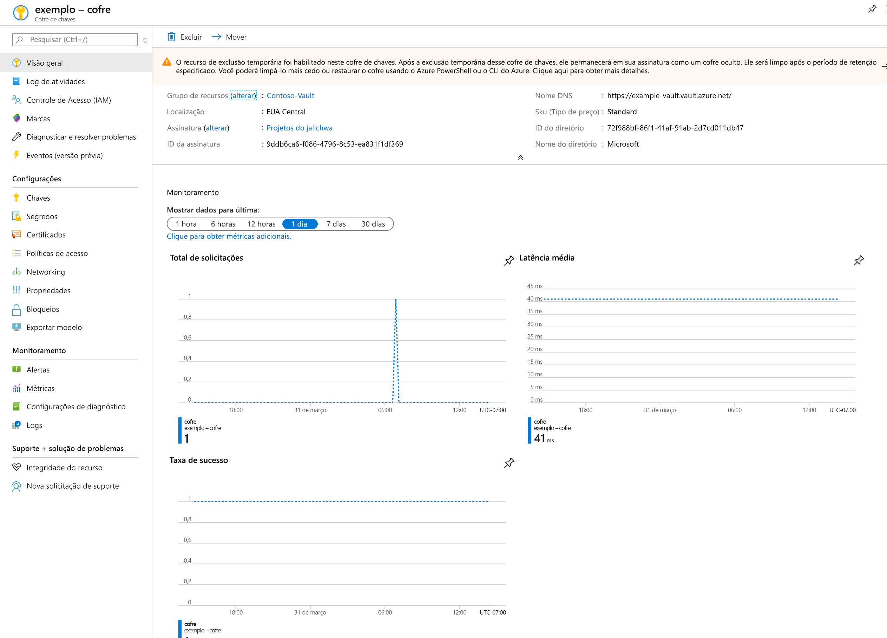
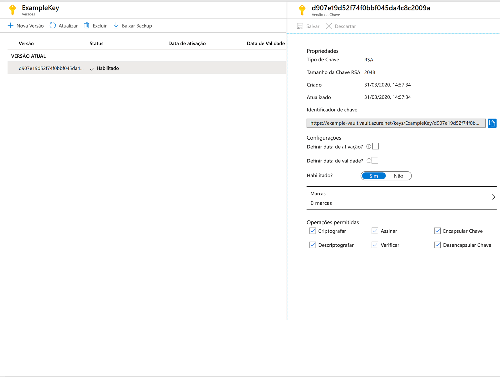

# Início Rápido: Definir e recuperar uma chave do Azure Key Vault usando o portal do Azure

O Azure Key Vault é um serviço de nuvem que funciona como um repositório seguro de segredos. Você pode armazenar chaves, senhas, certificados e outros segredos com segurança. Os cofres de chaves do Azure podem ser criados e gerenciados por meio do portal do Azure. Neste início rápido, você criará um cofre de chaves e o usará para armazenar uma chave. Para saber mais sobre o Key Vault, analise a [Visão geral](../general/overview.md).

Se você não tiver uma assinatura do Azure, crie uma [conta gratuita](https://azure.microsoft.com/free/?WT.mc_id=A261C142F) antes de começar.

## Entrar no Azure

Entre no Portal do Azure em https://portal.azure.com.

## Criar um cofre

1. No menu do portal do Azure ou na página **Início**, selecione **Criar um recurso**.
2. Digite **Key Vault** na caixa Pesquisar.
3. Na lista de resultados, escolha **Key Vault**.
4. Na seção Key Vault, escolha **Criar**.
5. A seção **Criar cofre de chaves** fornece as seguintes informações:
    - **Name**: um nome exclusivo é necessário. Para este início rápido, usaremos **Example-Vault**. 
    - **Assinatura**: Escolha uma assinatura.
    - Em **Grupo de Recursos**, escolha **Criar novo** e digite um nome para o grupo de recursos.
    - No menu suspenso **Local**, escolha um local.
    - Deixe as outras opções em seus padrões.
6. Depois de fornecer as informações acima, selecione **Criar**.

Anote as duas propriedades listadas abaixo:

* **Nome do cofre**: no exemplo, ele é **Example-Vault**. Você usará esse nome nas outras etapas.
* **URI do cofre**: no exemplo, é https://example-vault.vault.azure.net/. Aplicativos que usam seu cofre via API REST devem usar esse URI.

Nesse ponto, sua conta do Azure é a única autorizada a executar operações nesse novo cofre.

## Adicionar uma chave ao Key Vault

Para adicionar uma chave ao cofre, basta executar algumas etapas adicionais. Nesse caso, adicionamos uma chave que pode ser usada por um aplicativo. A chave é chamada **ExampleKey**.

1. Na página de propriedades do Key Vault, selecione **Chaves**.
2. Clique em **Gerar/Importar**.
3. Na tela **Criar uma chave**, escolha os seguintes valores:
    - **Opções**: Generate.
    - **Name**: ExampleKey.
    - Deixe os outros valores com seus padrões. Clique em **Criar**.

Depois de receber a mensagem indicando que a chave foi criada com êxito, clique nela na lista. Você pode ver algumas das propriedades. Se você clicar na versão atual, poderá ver o valor especificado na etapa anterior.

## Limpar os recursos

Outros tutoriais e inícios rápidos do Key Vault complementam este início rápido. Se você planeja continuar a trabalhar com os tutoriais e inícios rápidos subsequentes, deixe esses recursos onde estão.
Quando não for mais necessário, exclua o grupo de recursos, que excluirá o Key Vault e os recursos relacionados. Para excluir o grupo de recursos pelo portal:

1. Insira o nome do grupo de recursos na caixa de pesquisa na parte superior do portal. Quando você vir o grupo de recursos usado neste início rápido nos resultados da pesquisa, selecione-o.
2. Selecione **Excluir grupo de recursos**.
3. Na caixa **DIGITE O NOME DO GRUPO DE RECURSOS:** , digite o nome do grupo de recursos e selecione **Excluir**.

## Próximas etapas

Neste início rápido, você criou um Key Vault e armazenou uma chave nele. Para saber mais sobre o Key Vault e como integrá-lo a seus aplicativos, confira os artigos abaixo.

- Leia uma [Visão geral do Azure Key Vault](../general/overview.md)
- Confira o [Guia do desenvolvedor do Azure Key Vault](../general/developers-guide.md)
- Examine a [Visão geral de segurança do Key Vault](../general/security-overview.md)