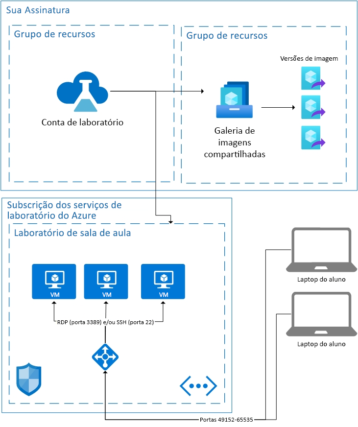

# Fundamentos de Arquitetura no Azure Lab Services

O Azure Lab Services é uma solução SaaS (software como serviço), o que significa que os recursos necessários para o Lab Services são tratados para você. O artigo abordará os recursos fundamentais usados pelo Lab Services e a arquitetura básica de um laboratório.  

O Azure Lab Services fornece algumas áreas que permitem que você use seus recursos em conjunto com o Lab Services.  Para obter mais informações sobre como usar VMs em sua rede, veja como [emparelhar uma rede virtual](how-to-connect-peer-virtual-network.md).  Para reutilizar imagens de uma Galeria de Imagens Compartilhadas, veja como [anexar uma Galeria de Imagens Compartilhadas](how-to-attach-detach-shared-image-gallery.md).

Abaixo está a arquitetura básica de um laboratório de sala de aula.  A conta de laboratório é hospedada em sua assinatura. As VMs dos alunos, juntamente com os recursos necessários para dar suporte às VMs, são hospedadas em uma assinatura de propriedade do Lab Services. Vamos falar sobre o que está nas assinaturas do Lab Services mais detalhadamente.

## Recursos Hospedados

Os recursos necessários para executar um laboratório de sala de aula são hospedados em uma das assinaturas do Azure gerenciadas pela Microsoft.  Os recursos incluem uma máquina virtual de modelo para o instrutor, a máquina virtual para cada aluno e itens relacionados à rede, como um balanceador de carga, uma rede virtual e um grupo de segurança de rede.  Essas assinaturas são monitoradas quanto a atividades suspeitas.  É importante observar que esse monitoramento é feito externamente às máquinas virtuais por meio da extensão de VM ou do monitoramento do padrão de rede.  Se [desligar ao desconectar](how-to-enable-shutdown-disconnect.md) estiver habilitado, uma extensão de diagnóstico será habilitada na máquina virtual. A extensão permite que o Lab Services seja informado do evento de desconexão da sessão do protocolo RDP.

## Rede Virtual

Cada laboratório é isolado pela própria rede virtual.  Se o laboratório tiver uma [rede virtual emparelhada](how-to-connect-peer-virtual-network.md), cada laboratório será isolado pela própria sub-rede.  Os alunos se conectam à máquina virtual deles por meio de um balanceador de carga.  Nenhuma máquina virtual de aluno tem um endereço IP público; eles têm apenas um endereço IP privado.  A cadeia de conexão do aluno será o endereço IP público do balanceador de carga e uma porta aleatória entre 49152 e 65535.  As regras de entrada do balanceador de carga encaminham a conexão, dependendo do sistema operacional, para a porta 22 (SSH) ou a porta 3389 (RDP) da máquina virtual apropriada. Um NSG impede o tráfego de fora em outras portas.

## Controle de acesso para máquinas virtuais

O Lab Services lida com a capacidade do aluno de executar ações como iniciar e parar nas máquinas virtuais dele.  Ele também controla o acesso às informações de conexão de VM do aluno.

O Lab Services também lida com o registro de alunos no serviço. No momento, há duas configurações de acesso diferentes: restrito e não restrito. Para obter mais informações, confira o artigo [gerenciar usuários do laboratório](how-to-configure-student-usage.md#send-invitations-to-users). Acesso restrito significa que o Lab Services verifica se os alunos são adicionados como usuário antes de permitir o acesso. Não restrito significa que qualquer usuário pode se registrar desde que tenha o link de registro e que haja capacidade no laboratório. Não restrito pode ser útil para eventos hackathon.

As VMs de aluno hospedadas no laboratório de sala de aula têm um nome de usuário e senha definidos pelo criador do laboratório.  Como alternativa, o criador do laboratório pode permitir que os alunos registrados escolham a própria senha na primeira entrada.  

## Próximas etapas

Para saber mais sobre os recursos disponíveis no Lab Services, confira [Conceitos do Azure Lab Services](classroom-labs-concepts.md) e [Visão geral do Azure Lab Services](classroom-labs-overview.md).
