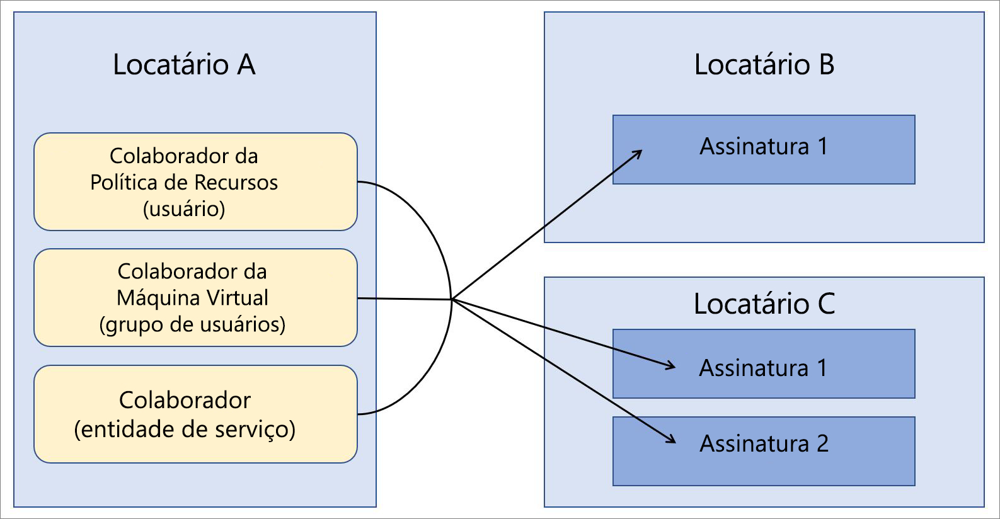

# Azure Lighthouse em cenários empresariais

Um cenário comum para o [Azure Lighthouse](../overview.md) é quando um provedor de serviços gerencia recursos em locatários Azure Active Directory (Azure AD) que pertencem aos clientes. Os recursos do Azure Lighthouse também podem ser usados para simplificar o gerenciamento entre locatários em uma empresa que usa vários locatários do Azure AD.

## Locatários únicos versus múltiplos

Para a maioria das organizações, o gerenciamento é mais fácil com um único locatário do Azure AD. Ter todos os recursos em um locatário permite a centralização de tarefas de gerenciamento por usuários, grupos de usuários ou entidades de serviço designados dentro desse locatário. É recomendável usar um locatário para sua organização sempre que possível.

Algumas organizações podem precisar usar vários locatários do Azure AD. Isso pode ser uma situação temporária, como quando as aquisições ocorreram e uma estratégia de consolidação de locatário de longo prazo ainda não foi definida. Em outras ocasiões, as organizações podem precisar manter vários locatários em uma base contínua devido a subsidiárias totalmente independentes, requisitos geográficos ou legais ou outras considerações.

Nos casos em que uma arquitetura multilocatário é necessária, o Azure Lighthouse pode ajudar a centralizar e otimizar as operações de gerenciamento. Usando o [Gerenciamento de recursos delegado do Azure](azure-delegated-resource-management.md), os usuários em um locatário de gerenciamento podem executar [funções de gerenciamento entre locatários](cross-tenant-management-experience.md) de maneira centralizada e escalonável.

## Arquitetura de gerenciamento de locatários

Para usar o Azure Lighthouse em uma empresa, você precisará determinar qual locatário incluirá os usuários que executam operações de gerenciamento nos outros locatários. Em outras palavras, será necessário designar um locatário como o locatário de gerenciamento para os outros locatários.

Por exemplo, digamos que sua organização tenha um único locatário que chamarei *de locatário a*. Em seguida, sua organização adquire o *locatário B* e o *locatário C*, e você tem motivos comerciais que exigem que você os mantenha como locatários separados. No entanto, você gostaria de usar as mesmas definições de política, práticas de backup e processos de segurança para todas elas, com tarefas de gerenciamento executadas pelo mesmo conjunto de usuários.

Como o locatário A já inclui os usuários em sua organização que realizaram essas tarefas para o locatário A, você pode integrar assinaturas no locatário B e no locatário C, o que permite que os mesmos usuários no locatário a executem essas tarefas em todos os locatários.

## Considerações sobre segurança e acesso

Na maioria dos cenários empresariais, você desejará delegar uma assinatura completa ao Azure Lighthouse. Você também pode optar por delegar apenas grupos de recursos específicos em uma assinatura.

De qualquer forma, certifique-se de [seguir o princípio de privilégios mínimos ao definir quais usuários terão acesso aos recursos delegados](recommended-security-practices.md#assign-permissions-to-groups-using-the-principle-of-least-privilege). Fazer isso ajuda a verificar se os usuários só têm as permissões necessárias para executar as tarefas necessárias e reduz a chance de erros inadvertidos.

O Azure Lighthouse fornece apenas links lógicos entre um locatário de gerenciamento e locatários gerenciados, em vez de mover dados ou recursos fisicamente. Além disso, o acesso sempre vai em apenas uma direção, do locatário gerenciador para os locatários gerenciados.  Os usuários e grupos no locatário gerenciador devem continuar usando a autenticação multifator ao executar operações de gerenciamento em recursos de locatários gerenciados.

As empresas com proteções de governança e conformidade internas e externas podem usar os [Logs de atividade do Azure](../../azure-monitor/essentials/platform-logs-overview.md) para atender aos seus requisitos de transparência. Quando os locatários empresariais tiverem estabelecido o gerenciamento e as relações de locatário gerenciadas, os usuários em cada locatário poderão exibir a atividade registrada para ver as ações tomadas pelos usuários no locatário de gerenciamento.

## Considerações sobre integração

As assinaturas (ou grupos de recursos em uma assinatura) podem ser integradas ao Azure Lighthouse implantando modelos de Azure Resource Manager ou por meio de ofertas de serviços gerenciados publicados no Azure Marketplace.

Como os usuários empresariais normalmente terão acesso direto aos locatários da empresa, e não há necessidade de comercializar ou promover uma oferta de gerenciamento, geralmente é mais rápido e mais simples implantar modelos de Azure Resource Manager. Embora as [diretrizes de integração](../how-to/onboard-customer.md) se refiram a provedores de serviços e clientes, as empresas podem usar os mesmos processos para integrar seus locatários.

Se preferir, os locatários em uma empresa poderão ser integrados [publicando uma oferta de Serviços Gerenciados no Azure Marketplace](../how-to/publish-managed-services-offers.md). Para verificar se a oferta só está disponível para os locatários adequados, certifique-se de que seus planos estão marcados como privados. Com um plano particular, você fornece as IDs de assinatura para cada locatário que planeja carregar e ninguém mais poderá obter sua oferta.

## Observações sobre terminologia

Para o gerenciamento entre locatários dentro da empresa, as referências a provedores de serviço na documentação do Azure Lighthouse podem ser compreendidas para aplicar ao locatário de gerenciamento em uma empresa, ou seja, o locatário que inclui os usuários que gerenciarão recursos em outros locatários por meio do Azure Lighthouse. Da mesma forma, todas as referências a clientes podem ser compreendidas para se aplicar aos locatários que estão delegando recursos a serem gerenciados por meio de usuários no locatário de gerenciamento.

Por exemplo, no exemplo descrito acima, o Locatário A pode ser pensado como um locatário de provedor de serviços (o locatário gerenciador) e o Locatário B e o Locatário C podem ser pensados como os locatários do cliente.

Continuando com esse exemplo, o locatário de um usuário com as permissões apropriadas pode [Exibir e gerenciar recursos delegados](../how-to/view-manage-customers.md) na página **meus clientes** do portal do Azure. Da mesma forma, os usuários dos Locatários B e C com as permissões adequadas podem [exibir e gerenciar os recursos que foram delegados](../how-to/view-manage-service-providers.md) ao Locatário A na página **Provedores de serviço** do portal do Azure.

## Próximas etapas

- Saiba mais sobre as [experiências de gerenciamento entre locatários](cross-tenant-management-experience.md).
- Saiba mais sobre o [Gerenciamento de recursos delegados do Azure](azure-delegated-resource-management.md).
