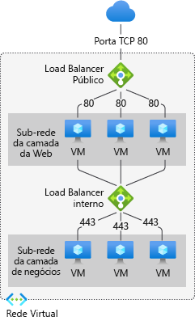
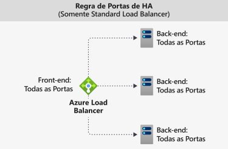

# Componentes do Azure Load Balancer

O Azure Load Balancer inclui alguns componentes principais. Esses componentes podem ser configurados na sua assinatura por um dos seguintes meios:

* Portal do Azure
* CLI do Azure
* Azure PowerShell
* Modelos do Resource Manager

## Configuração do IP front-end 

O endereço IP de seu Azure Load Balancer. Trata-se do ponto de contato para os clientes. Esses endereços IP podem ser:

- **Endereço IP público**
- **Endereço IP privado**

A natureza do endereço IP determina o **tipo** do balanceador de carga criado. A seleção de endereço IP privado cria um balanceador de carga interno. A seleção de endereço IP público cria um balanceador de carga público.

|  | Balanceador de carga público  | Balanceador de carga interno |
| ---------- | ---------- | ---------- |
| **Configuração do IP front-end**| Endereço IP público | Endereço IP privado|
| **Descrição** | O balanceador de carga público mapeia o IP público e a porta do tráfego de entrada para o IP privado e a porta da VM. O balanceador de carga mapeia o tráfego ao contrário para o tráfego de resposta da VM. Você pode distribuir tipos específicos de tráfego entre vários serviços ou VMs aplicando regras de balanceamento de carga. Por exemplo, você pode difundir a carga de tráfego de solicitação da web em vários servidores web.| Um balanceador de carga interno distribui o tráfego para recursos que estão dentro de uma rede virtual. O Azure restringe o acesso aos endereços IP de front-end de uma rede virtual com balanceamento de carga. Os endereços IP de front-end e as redes virtuais nunca são expostos diretamente a um ponto de extremidade da Internet. Os aplicativos de linha de negócios interno são executados no Azure e acessados de dentro do Azure ou de recursos locais. |
| **SKUs compatíveis** | Básico, Standard | Básico, Standard |

O balanceador de carga pode ter vários IPs de front-end. Saiba mais sobre [vários front-ends](load-balancer-multivip-overview.md).

## Pool de back-end

O grupo de máquinas virtuais ou instâncias em um conjunto de dimensionamento de máquinas virtuais que está atendendo à solicitação de entrada. Para dimensionar de maneira econômica para atender a grandes volumes de tráfego de entrada, as diretrizes de computação geralmente recomendam adicionar mais instâncias ao pool de back-end.

O Load Balancer reconfigura-se instantaneamente por meio da reconfiguração automática quando você escala ou reduz as instâncias verticalmente. Adicionar ou remover VMs do pool de back-end reconfigura o balanceador de carga sem operações adicionais. O escopo do pool de back-end é qualquer máquina virtual na rede virtual.

Ao considerar como projetar seu pool de back-end, projete o menor número de recursos do pool de back-end individuais para otimizar a duração de operações de gerenciamento. Não há nenhuma diferença no desempenho do plano de dados ou escala.

## Investigações de integridade

Uma investigação de integridade é usada para determinar o status de integridade das instâncias no pool de back-end. Durante a criação do balanceador de carga, configure uma investigação de integridade para uso do balanceador de carga.  Essa investigação de integridade determinará se uma instância está íntegra e pode receber o tráfego.

Você pode definir o limite não íntegro para suas investigações de integridade. Quando uma investigação não responde, o balanceador de carga interrompe o envio de novas conexões para as instâncias não íntegras. Uma falha de investigação não afeta as conexões existentes. A conexão continua até o aplicativo:

- encerrar o fluxo
- o tempo limite de ociosidade ser atingido
- a VM ser desligada

O balanceador de carga fornece diferentes tipos de investigação de integridade para os pontos de extremidade: TCP, HTTP e HTTPS. [Saiba mais sobre as investigações de Integridade do Load Balancer](load-balancer-custom-probe-overview.md).

O balanceador de carga básico não é compatível com investigações HTTPS. O balanceador de carga básico fecha todas as conexões TCP (incluindo as conexões estabelecidas).

## Regras de balanceamento de carga

Uma regra do balanceador de carga é usada para definir como o tráfego de entrada é distribuído para **todas** as instâncias dentro do pool de back-end. Uma regra de balanceamento de carga mapeia uma configuração especificada de porta e IP de front-end para várias portas e endereços IP de back-end.

Por exemplo, use uma regra de balanceamento de carga para a porta 80 a fim de rotear o tráfego do IP de front-end para a porta 80 das instâncias de back-end.

:::image type="content" source="./media/load-balancer-components/lbrules.png" alt-text="Diagrama de referência de regra do balanceador de carga" border="false":::

*Figura: regras de balanceamento de carga*

## Portas de Alta Disponibilidade

Uma regra do balanceador de carga configurada com **'protocolo – todos e porta – 0'** . 

Essa regra permite que uma só regra faça o balanceamento de carga de todos os fluxos TCP e UDP recebidos em todas as portas de um Standard Load Balancer interno. 

A decisão de balanceamento de carga é feita por fluxo. Essa ação se baseia na seguinte conexão de cinco tuplas: 

1. endereço IP de origem
2. porta de origem
3. endereço IP de destino
4. porta de destino
5. protocolo

As regras de balanceamento de carga de portas de HA o ajudam com cenários críticos, como alta disponibilidade e escala para NVAs (soluções de virtualização de rede) dentro de redes virtuais. O recurso pode ser útil quando um grande número de portas precisa do balanceamento de carga.

  

*Figura: regras de portas HA*

Saiba mais sobre as [portas HA](load-balancer-ha-ports-overview.md).

## Regras NAT de entrada

Uma regra NAT de entrada encaminha o tráfego de entrada enviado para a combinação de porta e endereço IP de front-end. O tráfego é enviado para uma máquina virtual ou uma instância **específica** no pool de back-end. O encaminhamento de porta é realizado pela mesma distribuição baseada em hash que o balanceamento de carga.

:::image type="content" source="./media/load-balancer-components/inboundnatrules.png" alt-text="Diagrama de referência de regra NAT de entrada" border="false":::

*Figura: Regras NAT de entrada*

As regras NAT de entrada no contexto dos Conjuntos de Dimensionamento de Máquinas Virtuais são pools NAT de entrada. Saiba mais sobre os [componentes do Load Balancer e o conjunto de dimensionamento de máquinas virtuais](../virtual-machine-scale-sets/virtual-machine-scale-sets-networking.md#azure-virtual-machine-scale-sets-with-azure-load-balancer).

## Regras de saída

uma regra de saída configura a NAT (conversão de endereços de rede) de saída para todas as máquinas virtuais identificadas pelo pool de back-end. Essa regra permite que as instâncias do back-end se comuniquem (saída) com a Internet ou com outros pontos de extremidade.

Saiba mais sobre [conexões de saída e regras](load-balancer-outbound-connections.md).

O balanceador de carga básico não é compatível com regras de saída.

:::image type="content" source="./media/load-balancer-components/outbound-rules.png" alt-text="Diagrama de referência de regra de saída" border="false":::

*Figura: regras de saída*

## Limitações

- Saiba mais sobre os [limites](../azure-resource-manager/management/azure-subscription-service-limits.md) do balanceador de carga 
- O balanceador de carga fornece balanceamento de carga e encaminhamento de porta para protocolos TCP e UDP específicos. As regras de balanceamento de carga e as regras NAT de entrada são compatíveis com TCP e UDP, mas não com outros protocolos IP, incluindo ICMP.
- O fluxo de saída de uma VM de back-end para um front-end de um Load Balancer interno falhará.
- Uma regra de balanceador de carga não pode abranger duas redes virtuais.  Os front-ends e as instâncias de back-end deles devem estar localizados na mesma rede virtual.  
- Não há suporte para o encaminhamento de fragmentos de IP nas regras de balanceamento de carga. A fragmentação de IP de pacotes UDP e TCP não é permitida em regras de balanceamento de carga. As regras de balanceamento de carga das portas de HA podem ser usadas para encaminhar fragmentos IP existentes. Para saber mais, confira [Visão geral das portas de alta disponibilidade](load-balancer-ha-ports-overview.md).

## Próximas etapas

- Confira como [Criar um Standard Load Balancer](quickstart-load-balancer-standard-public-portal.md) para começar a usar um balanceador de carga.
- Saiba mais sobre o [Azure Load Balancer](load-balancer-overview.md).
- Saiba mais sobre [Endereço IP público](../virtual-network/virtual-network-public-ip-address.md)
- Saiba mais sobre [Endereço IP privado](../virtual-network/private-ip-addresses.md)
- Saiba mais sobre como usar o [Standard Load Balancer e Zonas de Disponibilidade](load-balancer-standard-availability-zones.md).
- Saiba mais sobre o [Diagnóstico do Standard Load Balancer](load-balancer-standard-diagnostics.md).
- Saiba mais sobre a [Redefinição de TCP quando ocioso](load-balancer-tcp-reset.md).
- Saiba mais sobre o [Standard Load Balancer com as regras de balanceamento de carga das Portas de Alta Disponibilidade](load-balancer-ha-ports-overview.md).
- Saiba mais sobre [Grupos de Segurança de Rede](../virtual-network/network-security-groups-overview.md).
- Saiba mais sobre os [Limites do balanceador de carga](../azure-resource-manager/management/azure-subscription-service-limits.md#load-balancer).
- Aprenda a usar [Encaminhamento de porta](./tutorial-load-balancer-port-forwarding-portal.md).