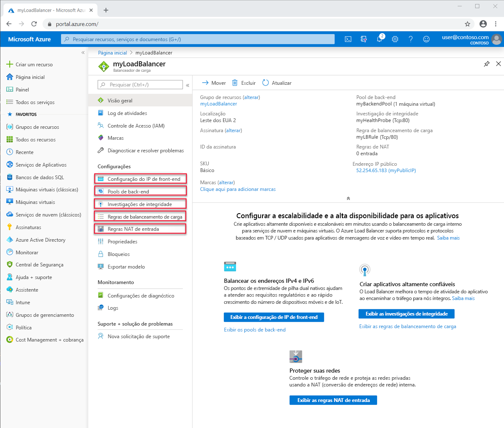
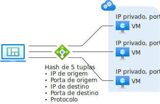
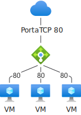

# Componentes e limitações do Load Balancer
O Azure Load Balancer contém vários componentes importantes para sua operação.  Esses componentes podem ser configurados em sua assinatura por meio do portal do Azure, da CLI do Azure ou do Azure PowerShell.  

## Componentes do Load Balancer

* **Configuração do IP de front-end**: o endereço IP do Load Balancer. Trata-se do ponto de contato para os clientes. Esses endereços podem ser: 

    - **[Endereço IP público](https://docs.microsoft.com/azure/virtual-network/virtual-network-public-ip-address)**
    - **[Endereço IP privado](https://docs.microsoft.com/azure/virtual-network/virtual-network-ip-addresses-overview-arm#private-ip-addresses)**

* **Pool de back-end**: o grupo de máquinas virtuais ou instâncias no Conjunto de Dimensionamento de Máquinas Virtuais que atenderá à solicitação de entrada. Para dimensionar de maneira econômica para atender a grandes volumes de tráfego de entrada, as diretrizes de computação geralmente recomendam adicionar mais instâncias ao pool de back-end. O Load Balancer reconfigura-se instantaneamente por meio da reconfiguração automática quando você dimensiona as instâncias para cima ou para baixo. Adicionar ou remover VMs do pool de back-end reconfigura o Load Balancer sem operações adicionais. O escopo do pool de back-end é qualquer máquina virtual na rede virtual. Um pool de back-end pode ter até 1000 instâncias de back-end ou configurações de IP.
Os Load Balancers Básicos têm escopo limitado (conjunto de disponibilidade) e só podem ser aumentados até 300 configurações de IP. Para saber mais sobre limites, confira [Limites do Load Balancer](https://docs.microsoft.com/azure/azure-resource-manager/management/azure-subscription-service-limits#load-balancer). Ao considerar como projetar seu pool de back-end, você pode projetar o menor número de recursos do pool de back-end individuais para otimizar ainda mais a duração de operações de gerenciamento. Não há nenhuma diferença no desempenho do plano de dados ou escala.
* **Investigações de integridade**: uma **[investigação de integridade](https://docs.microsoft.com/azure/load-balancer/load-balancer-custom-probe-overview)** é usada para determinar a integridade das instâncias no pool de back-end. Você pode definir o limite não íntegro para suas investigações de integridade. Quando uma investigação não responde, o Load Balancer interrompe o envio de novas conexões para as instâncias não íntegras. Uma falha de investigação não afeta as conexões existentes. 
    
    A conexão continua até o aplicativo: 
    - encerrar o fluxo
    - o tempo limite de ociosidade ser atingido
    - a VM ser desligada

    O Load Balancer fornece diferentes tipos de investigação de integridade para os pontos de extremidade:
    - TCP
    - HTTP
    - HTTPS (investigação HTTP com wrapper do protocolo TLS)
     
     O Load Balancer Básico não é compatível com investigações HTTPS. Além disso, o Load Balancer Básico encerrará todas as conexões TCP (incluindo conexões estabelecidas). 
    Para saber mais, confira [Tipos de investigação](load-balancer-custom-probe-overview.md#types).

* **Regras de balanceamento de carga**: as regras de balanceamento de carga informam ao Load Balancer o que precisa ser feito e quando. 
* **Regras NAT de entrada**: Uma regra NAT de entrada encaminha o tráfego de uma porta específica de um endereço IP de front-end específico para uma porta específica de uma instância de back-end específica dentro da rede virtual. O **[encaminhamento de porta](https://docs.microsoft.com/azure/load-balancer/tutorial-load-balancer-port-forwarding-portal)** é realizado pela mesma distribuição baseada em hash que o balanceamento de carga. Cenários comuns dessa funcionalidade são sessões de protocolo RDP ou SSH (Secure Shell) para instâncias de VM individuais em uma Rede Virtual do Microsoft Azure. É possível mapear vários pontos de extremidade internos para portas no mesmo endereço IP de front-end. Você pode usar os endereços IP de front-end para administrar remotamente suas VMs sem um jumpbox adicional.
* **Regras de saída**: uma **[regra de saída](https://docs.microsoft.com/azure/load-balancer/load-balancer-outbound-rules-overview)** configura a NAT (conversão de endereços de rede) de saída para todas as máquinas virtuais identificadas pelo pool de back-end do Standard Load Balancer a serem convertidas no front-end.

  O Load Balancer Básico não é compatível com Regras de Saída.

  
* **Protocolos de transporte**: O Load Balancer não é compatível com ICMP; os pings do ICMP para um balanceador de carga voltado para o público atingirão o tempo limite. Para executar ping do balanceador de carga voltado para o público, use Ping por TCP

## Conceitos do Load Balancer

O Azure Load Balancer fornece os seguintes recursos fundamentais para aplicativos de TCP e UDP:

* **Algoritmo de balanceamento de carga**: Com o Azure Load Balancer, é possível criar uma regra de balanceamento de carga para distribuir o tráfego que chega em um front-end para instâncias do pool de back-end. O Load Balancer usa um algoritmo de hash para a distribuição de fluxos de entrada (não bytes) e reescreve os cabeçalhos dos fluxos em instâncias do pool de back-end. Um servidor fica disponível para receber novos fluxos quando a investigação de integridade indica que o ponto de extremidade de back-end é íntegro.
Por padrão, o Load Balancer usa um hash de 5 tuplas. 

   O hash inclui: 

   - **Endereço IP de origem**
   - **Porta de origem**
   - **Endereço IP de destino**
   - **Porta de destino**
   - **Número do protocolo IP para mapear os fluxos para servidores disponíveis** 

Você pode criar afinidade com um endereço IP de origem usando um hash de 2 ou 3 tuplas para uma determinada regra. Todos os pacotes do mesmo fluxo de pacote chegam na mesma instância por trás do front-end com balanceamento de carga. Quando o cliente inicia um novo fluxo do mesmo IP de origem, a porta de origem é alterada. Dessa forma, o hash de 5 tuplas podem fazer com que o tráfego vá para um ponto de extremidade de back-end diferente.
Para saber mais, confira [Configurar o modo de distribuição para o Azure Load Balancer](./load-balancer-distribution-mode.md). 

A imagem a seguir mostra a distribuição baseada em hash:

  

  *Figura: distribuição baseada em hash*

* **Independência e transparência de aplicativo**: O Load Balancer não interage diretamente com o TCP ou UDP, nem com a camada de aplicativo. Qualquer cenário de aplicativo TCP ou UDP pode ser compatível. O Load Balancer não encerra nem origina fluxos, não interage com o conteúdo do fluxo nem fornece qualquer função de gateway de camada de aplicativo. Os handshakes de protocolo sempre ocorrem diretamente entre o cliente e a instância do pool de back-end. Uma resposta para um fluxo de entrada sempre é uma resposta de uma máquina virtual. Quando o fluxo chega na máquina virtual, o endereço IP de origem original também é preservado.
  * Cada ponto de extremidade é respondido somente por uma VM. Por exemplo, um handshake TCP sempre ocorre entre o cliente e a VM de back-end selecionada. Uma resposta a uma solicitação feita a um front-end é uma resposta gerada por uma VM de back-end. Ao validar com êxito a conectividade com um front-end, você está validando a conectividade de ponta a ponta com pelo menos uma máquina virtual de back-end.
  * O conteúdo do aplicativo é transparente para o Load Balancer. Qualquer aplicativo UDP ou TCP pode ser compatível.
  * Como Load Balancer não interage com o conteúdo de TCP e fornece o descarregamento de TLS, você pode criar cenários criptografados de ponta a ponta. O uso do Load Balancer apresenta uma grande expansão para aplicativos TLS encerrando a conexão TLS na VM em si. Por exemplo, a capacidade de chaveamento de sua sessão TLS é limitada apenas pelo tipo e pelo número de VMs adicionadas ao pool de back-end.

* **Conexões de saída**: Todos os fluxos de saída de endereços IP privados dentro da sua rede virtual para os endereços IP públicos na Internet podem ser convertidos para um endereço IP de front-end do Load Balancer. Quando um front-end público é vinculado a uma VM de back-end por meio de uma regra de balanceamento de carga, o Azure move conexões de saída para o endereço IP de front-end público. Essa configuração tem as seguintes vantagens:
  * Facilidade de upgrade e recuperação de desastre dos serviços, uma vez que o front-end pode ser mapeado dinamicamente para outra instância do serviço.
  * Gerenciamento mais fácil da ACL (lista de controle de acesso). As ACLs expressas como IPs de front-end não são alteradas à medida que os serviços são escalados verticalmente para cima ou para baixo, ou quando são reimplantados. Mover conexões de saída para um número menor de endereços IP do que computadores reduz a carga de implementar listas seguras de destinatários.

  O Standard Load Balancer utiliza um [algoritmo de SNAT robusto, escalonável e previsível](load-balancer-outbound-connections.md#snat). Estes são os principais princípios a serem lembrados ao trabalhar com o Load Balancer Standard:

    - as regras de balanceamento de carga inferem em como a SNAT é programada. As regras de balanceamento de carga são específicas de protocolo. O SNAT é específico do protocolo e a configuração deve refletir isso em vez de criar um efeito colateral.

    - **Vários front-ends** Quando vários front-ends estiverem disponíveis, todos os front-ends serão usados e cada front-end multiplicará o número de portas SNAT disponíveis. Se você quiser mais portas SNAT porque você está esperando ou já está tendo uma alta demanda para conexões de saída, também pode adicionar o inventário de porta SNAT incremental ao configurar front-ends adicionais, regras e pools de back-end para os mesmos recursos de máquina virtual.

    - **Controle qual front-end é usado para saída** Você poderá escolher e controlar se não desejar que um front-end específico seja usado para conexões de saída. Se desejar restringir conexões de saída para serem originadas somente de um endereço IP de front-end específico, opcionalmente, será possível desabilitar a saída SNAT na regra que expressa o mapeamento de saída.

    - **Controle a conectividade de saída** os cenários de saída são explícitos e a conectividade de saída não existe até que seja especificado. O Standard Load Balancer existe dentro do contexto da rede virtual.  Uma rede virtual é uma rede isolada, privada.  A menos que exista uma associação a um endereço de IP público, a conectividade pública não é permitida.  Você pode acessar os [Pontos de extremidade de Serviço de Rede Virtual](../virtual-network/virtual-network-service-endpoints-overview.md) porque estão dentro e localmente em sua rede virtual.  Se você deseja estabelecer conectividade de saída para um destino fora da sua rede virtual, você tem duas opções:
        - atribuir um endereço de IP público do SKU Standard como um endereço de IP Público de Nível de Instância para o recurso de máquina virtual ou
        - colocar o recurso de máquina virtual no pool de back-end de um Load Balancer Standard.

        Ambos permitirão a conectividade de saída da rede virtual para fora da rede virtual. 

        Se você _somente_ tiver um Standard Load Balancer interno associado ao pool de back-end em que o recurso de máquina virtual está localizado, sua máquina virtual só poderá acessar recursos de rede virtual e [Pontos de Extremidade de Serviço de Rede Virtual](../virtual-network/virtual-network-service-endpoints-overview.md).  Você pode seguir as etapas descritas no parágrafo anterior para criar a conectividade de saída.

        Conectividade de saída de um recurso de máquina virtual não associada aos SKUs Standard permanecem como antes.

        Revisão [de discussão detalhada de Conexões de Saída](load-balancer-outbound-connections.md).

* **Zonas de Disponibilidade**: O Load Balancer Standard oferece suporte a recursos adicionais em regiões em que as Zonas de Disponibilidade estão disponíveis. Esses recursos são incrementais aos fornecimentos do Load Balancer Standard.  As configurações de Zonas de Disponibilidade estão disponíveis para ambos os tipos, o Standard Load Balancer público e o interno.
 Um front-end com redundância de zona sobrevive a falha da zona e é fornecido por uma infraestrutura dedicada em todas as zonas simultaneamente. 
Além disso, você pode garantir um front-end para uma zona específica. Um front-end zonal compartilha o destino com a zona respectiva e é fornecido apenas por uma infraestrutura dedicada em uma única zona.
O balanceamento de carga entre zonas está disponível para o pool de back-end e qualquer recurso de máquina virtual em uma rede virtual pode fazer parte de um pool de back-end.
O Load Balancer Básico não é compatível com zonas.
Examine a [discussão detalhada das habilidades relacionadas às Zonas de Disponibilidade](load-balancer-standard-availability-zones.md) e a [Visão Geral de Zonas de Disponibilidade](../availability-zones/az-overview.md) para saber mais.

* **Portas de HA**: É possível configurar as regras de balanceamento de carga para dimensionar seu aplicativo e ser altamente confiável. Ao usar uma regra de balanceamento de carga de portas de alta disponibilidade, o Standard Load Balancer fornecerá de acordo com o balanceamento de carga de fluxo em cada porta efêmera de um endereço IP de front-end do Standard Load Balancer.  O recurso é útil para outros cenários em que é impraticável ou indesejável especificar portas individuais. Uma regra de balanceamento de carga de portas de alta disponibilidade permite que você cria cenários ativo-passivo ou ativo-ativo n+1 para Dispositivos Virtuais de Rede e qualquer aplicativo que requer grandes intervalos de portas de entrada.  Uma investigação íntegra pode ser usada para determinar quais back-ends devem receber novos fluxos.  Você pode usar um Grupo de Segurança de Rede para emular um cenário de intervalo de porta. O Load Balancer Básico não é compatível com Portas de HA.
Examine a [discussão detalhada de Portas de HA](load-balancer-ha-ports-overview.md)
>[!IMPORTANT]
> Se você estiver planejando usar um Dispositivo de Rede Virtual, entre em contato com seu fornecedor para obter orientação se o produto foi testado com portas de alta disponibilidade e siga suas diretrizes específicas para implementação. 

* **Vários front-ends**: Balanceador de Carga dá suporte a várias regras com vários front-ends.  Load Balancer Standard expande para cenários de saída.  Os cenários de saída são essencialmente o inverso de uma regra de balanceamento de carga de entrada.  A regra de balanceamento de carga de entrada também cria um associado para conexões de saída. O Standard Load Balancer usa todos os front-ends associados a um recurso de máquina virtual por meio de uma regra de balanceamento de carga.  Além disso, um parâmetro sobre a regra de balanceamento de carga permite que você suprima uma regra desse tipo para fins de conectividade de saída, o que permite a seleção de front-ends específicos, incluindo nenhum.

Para comparação, o Load Balancer Basic seleciona um único front-end aleatório e não é possível controlar qual foi selecionado.
## Tipos de Load Balancer

### Azure Load Balancer Público

O Load Balancer público mapeia o endereço IP público e a porta do tráfego de entrada para o endereço IP privado e a porta da VM. O Load Balancer mapeia o tráfego ao contrário para o tráfego de resposta da VM. Você pode distribuir tipos específicos de tráfego entre vários serviços ou VMs aplicando regras de balanceamento de carga. Por exemplo, você pode difundir a carga de tráfego de solicitação da web em vários servidores web.

>[!NOTE]
>É possível implementar apenas um Load Balancer público e um Load Balancer interno por conjunto de disponibilidade.

A figura a seguir mostra um ponto de extremidade com balanceamento de carga para tráfego da Web que é compartilhado entre três VMs para a porta TCP 80 pública. Essas três VMs estão em um conjunto com balanceamento de carga.

  

*Figura: Como balancear o tráfego da Web usando um balanceador de carga público*

Os clientes da Internet enviam solicitações da página da Web para o endereço IP público de um aplicativo Web na porta TCP 80. O Azure Load Balancer distribui as solicitações entre as três VMs no conjunto com balanceamento de carga. Para obter mais informações sobre os algoritmos do balanceador de carga, confira os [Conceitos de Load Balancer](concepts-limitations.md#load-balancer-concepts).

O Azure Load Balancer distribui o tráfego igualmente entre várias instâncias da VM por padrão. Você também pode configurar a afinidade de sessão. Para saber mais, confira [Configurar o modo de distribuição para o Azure Load Balancer](load-balancer-distribution-mode.md).

### Azure Load Balancer Interno

Um Load Balancer interno direciona o tráfego apenas para recursos que estão em uma rede virtual ou que usam uma VPN para acessar a infraestrutura do Azure, diferente de um Load Balancer público. A infraestrutura do Azure restringe o acesso aos endereços IP de front-end de uma rede virtual que têm balanceamento de carga. Os endereços IP de front-end e as redes virtuais nunca são expostos diretamente a um ponto de extremidade da Internet. Os aplicativos de linha de negócios interno são executados no Azure e acessados de dentro do Azure ou de recursos locais.

Um Load Balancer interno habilita os seguintes tipos de balanceamento de carga:

* **Dentro de uma rede virtual**: balanceamento de carga de VMs na rede virtual para um conjunto de VMs dentro da mesma rede virtual.
* **Para uma rede virtual entre locais**: balanceamento de carga de computadores locais para um conjunto de VMs dentro da mesma rede virtual.
* **Para aplicativos de várias camadas**: balanceamento de carga para aplicativos de várias camadas voltados para a Internet em que as camadas de back-end não são voltadas para a Internet. As camadas de back-end requerem balanceamento de carga de tráfego da camada para a Internet. Veja a próxima figura.
* **Para aplicativos de linha de negócios**: Balanceamento de carga para aplicativos de linha de negócios hospedados no Azure sem hardware ou software do balanceador de carga adicional. Esse cenário inclui servidores locais que estão no conjunto de computadores cujo tráfego tem balanceamento de carga.

  

*Figura: Balanceando aplicativos de várias camadas usando o Load Balancer interno e público*

##  Comparação de SKU do Azure Load Balancer

O Load Balancer dá suporte a SKUs Basic e Standard. Há diferenças de SKU na escala, nos recursos e no preço do cenário. Qualquer cenário possível com o Basic Load Balancer pode ser criado com o Standard Load Balancer. As APIs para ambos os SKUs são semelhantes e invocadas pela especificação de um SKU. A API para dar suporte a SKUs do Load Balancer e ao IP público está disponível começando pela API `2017-08-01`. Ambos os SKUs compartilham a mesma API geral e estrutura.

A configuração do cenário completo pode ser um pouco diferente dependendo do SKU. A documentação do Load Balancer indica quando um artigo se aplica somente a um SKU específico. Veja a tabela a seguir para comparar e entender as diferenças. Para saber mais, confira [Visão geral do Standard Load Balancer](load-balancer-standard-overview.md).

>[!NOTE]
> A Microsoft recomenda o Standard Load Balancer.
VMs autônomas, conjuntos de disponibilidade e conjuntos de dimensionamento de máquina virtual podem estar conectados apenas a um SKU, nunca a ambos. Os SKUs do Load Balancer e do endereço IP público devem ser correspondentes quando você usá-los com endereços IP públicos. Os SKUs do Load Balancer e do IP público não são mutáveis.

[!INCLUDE [comparison table](../../includes/load-balancer-comparison-table.md)]

Para saber mais, confira [Limites do balanceador de carga](https://docs.microsoft.com/azure/azure-resource-manager/management/azure-subscription-service-limits#load-balancer). Para obter detalhes sobre o Load Balancer Standard, confira [visão geral](load-balancer-standard-overview.md), [preços](https://aka.ms/lbpricing) e [SLA](https://aka.ms/lbsla).

## Limitações

- Os SKUs não são mutáveis. Você não pode alterar a SKU de um recurso existente.
- Um recurso de máquina virtual padrão, recurso de conjunto de disponibilidade ou recurso de conjunto de dimensionamento da máquina virtal podem referenciar um SKU, nunca ambos.
- Uma regra de Balanceador de Carga não pode abranger duas redes virtuais.  Front-ends e suas instâncias de back-end relacionadas devem estar localizados na mesma rede virtual.  
- [Mover operações de assinatura](../azure-resource-manager/management/move-resource-group-and-subscription.md) não é compatível com recursos de IP público e Standard LB.
- Funções de Trabalho da Web sem uma VNet e outros serviços da plataforma Microsoft podem ser acessadas de instâncias atrás de apenas um Standard Load Balancer interno. Não confie nisso como o respectivo serviço em si ou a plataforma subjacente a pode ser alterada sem aviso prévio. Você sempre deve supor que precisa criar [conectividade de saída](load-balancer-outbound-connections.md) explicitamente se desejado ao usar um Standard Load Balancer interno apenas.

- O Load Balancer fornece balanceamento de carga e encaminhamento de porta para protocolos TCP e UDP específicos. As regras de balanceamento de carga e as regras NAT de entrada são compatíveis com TCP e UDP, mas não com outros protocolos IP, incluindo ICMP.

  O Load Balancer não encerra, não responde nem interage com o conteúdo de um fluxo UDP ou TCP. Ele não é um proxy. A validação bem-sucedida da conectividade com um front-end deve ocorrer lado a lado com o mesmo protocolo usado em um balanceamento de carga ou em uma regra NAT de entrada. Pelo menos uma de suas máquinas virtuais deve gerar uma resposta para que um cliente veja uma resposta de um front-end.

  Não receber uma resposta do front-end do Load Balancer indica que nenhuma máquina virtual foi capaz de responder. Nada pode interagir com um front-end do Load Balancer sem que uma máquina virtual possa responder. Esse princípio também se aplica a conexões de saída em que o SNAT de representação de porta é compatível apenas com TCP e UDP. Todos os outros protocolos IP, incluindo ICMP, falham. Atribua um endereço IP público no nível da instância para atenuar esse problema. Para saber mais, confira [Reconhecimento de SNAT e PAT](load-balancer-outbound-connections.md#snat).

- Os Load Balancers internos não movem conexões originadas pela saída para o front-end de um Load Balancer interno porque ambos estão no espaço de endereços IP privado. Os Load Balancers fornecem [conexões de saída](load-balancer-outbound-connections.md) de endereços IP privados dentro da rede virtual para os endereços IP públicos. Para Load Balancers internos, essa abordagem evita possível esgotamento da porta SNAT em um espaço de endereços IP interno único, onde a movimentação não é obrigatória.

  O efeito colateral é que, se um fluxo de saída de uma VM no pool de back-end tentar estabelecer um fluxo para o front-end do Load Balancer interno em seu pool _e_ for mapeado de volta para si mesmo, os dois lados do fluxo não serão correspondentes. Como eles não correspondem, o fluxo falha. O fluxo será bem-sucedido se não for mapeado de volta para a mesma VM no pool de back-end que criou o fluxo para o front-end.

  Quando o fluxo é mapeado de volta para si mesmo, o fluxo de saída parece ser originado da VM para o front-end e o fluxo de entrada correspondente parece ser originado da VM para si mesmo. Do ponto de vista do sistema operacional convidado, as partes de entrada e de saída do mesmo fluxo não são correspondentes dentro da máquina virtual. A pilha TCP não reconhece essas metades do mesmo fluxo como parte do mesmo fluxo. A origem e o destino não correspondem. Quando o fluxo é mapeado para qualquer outra VM no pool de back-end, as metades do fluxo são correspondentes e a VM pode responder ao fluxo.

  O sintoma desse cenário é que a conexão intermitente se esgota quando o fluxo retorna para o mesmo back-end que originou o fluxo. Soluções alternativas comuns incluem a inserção de uma camada proxy por trás do Load Balancer interno e o uso de regras de estilo DSR (Retorno de Servidor Direto). Para saber mais, confira [Vários front-ends para o Azure Load Balancer](load-balancer-multivip-overview.md).

  É possível combinar um Load Balancer interno com qualquer proxy de terceiros ou usar o [Gateway de Aplicativo](../application-gateway/application-gateway-introduction.md) interno para cenários de proxy com HTTP/HTTPS. Embora você possa usar um Load Balancer público para atenuar esse problema, o cenário resultante estará propenso ao [esgotamento de SNAT](load-balancer-outbound-connections.md#snat). Evite essa segunda abordagem, a menos que seja cuidadosamente gerenciada.

- Em geral, o encaminhamento de fragmentos de IP não é permitido nas regras de balanceamento de carga. A fragmentação de IP de pacotes UDP e TCP não é permitida em regras de balanceamento de carga. As regras de balanceamento de carga das portas de alta disponibilidade podem ser usadas para encaminhar fragmentos IP existentes. Para saber mais, confira [Visão geral das portas de alta disponibilidade](load-balancer-ha-ports-overview.md).

## Próximas etapas

- Confira [Criar um Standard Load Balancer público](quickstart-load-balancer-standard-public-portal.md) para começar a usar um Load Balancer: crie VMs com uma extensão de IIS personalizada instalada e faça o balanceamento de carga do aplicativo Web entre as VMs.
- Saiba mais sobre o [Azure Load Balancer](load-balancer-overview.md).
- Saiba mais sobre usar o [Standard Load Balancer e Zonas de Disponibilidade](load-balancer-standard-availability-zones.md).
- Saiba mais sobre [Investigações de Integridade](load-balancer-custom-probe-overview.md).
- Saiba mais sobre o [Diagnóstico do Load Balancer Standard](load-balancer-standard-diagnostics.md).
- Saiba mais sobre como usar o [Azure Load Balancer para conexões de saída](load-balancer-outbound-connections.md).
- Saiba mais sobre as [Regras de saída](load-balancer-outbound-rules-overview.md).
- Saiba mais sobre a [Redefinição de TCP quando ocioso](load-balancer-tcp-reset.md).
- Saiba mais sobre [o Standard Load Balancer com as regras de balanceamento das Portas de Alta Disponibilidade](load-balancer-ha-ports-overview.md).
- Saiba mais sobre como usar o [Azure Load Balancer com vários Front-ends](load-balancer-multivip-overview.md).
- Saiba mais sobre [Grupos de Segurança de Rede](../virtual-network/security-overview.md).
