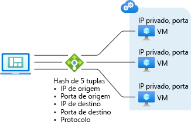

# Algoritmo do Azure Load Balancer

O balanceador de carga fornece várias funcionalidades para os aplicativos UDP e TCP.

## Algoritmo de balanceamento de carga

Você pode criar uma regra de balanceamento de carga para distribuir o tráfego do front-end para um pool de back-end. O Azure Load Balancer usa um algoritmo de hash para distribuição de fluxos de entrada (não bytes). O balanceador de carga reescreve os cabeçalhos de fluxos para instâncias de pool de back-end. Um servidor fica disponível para receber novos fluxos quando a investigação de integridade indica que o ponto de extremidade de back-end é íntegro.

Por padrão, o balanceador de carga usa um hash de cinco tuplas.

O hash inclui:

- **Endereço IP de origem**
- **Porta de origem**
- **Endereço IP de destino**
- **Porta de destino**
- **Número do protocolo IP para mapear os fluxos para servidores disponíveis**

A afinidade com um endereço IP de origem é criada usando um hash de duas ou três tuplas. Pacotes do mesmo fluxo chegam na mesma instância por trás do front-end com balanceamento de carga.

A porta de origem é alterada quando um cliente inicia um novo fluxo do mesmo IP de origem. Dessa forma, o hash de cinco tuplas podem fazer com que o tráfego vá para um ponto de extremidade de back-end diferente.
Para saber mais, confira [Configurar o modo de distribuição para o Azure Load Balancer](./load-balancer-distribution-mode.md).

A imagem a seguir mostra a distribuição baseada em hash:

*Figura: distribuição baseada em hash*

## Independência e transparência de aplicativo

O balanceador de carga não interage diretamente com o TCP ou UDP, nem com a camada de aplicativo. Qualquer cenário de aplicativo TCP ou UDP pode ser compatível. O balanceador de carga não fecha nem origina fluxos e nem interage com o conteúdo do fluxo. O balanceador de carga não fornece a funcionalidade de gateway de camada de aplicativo. Os handshakes de protocolo sempre ocorrem diretamente entre o cliente e a instância do pool de back-end. Uma resposta para um fluxo de entrada sempre é uma resposta de uma máquina virtual. Quando o fluxo chega na máquina virtual, o endereço IP de origem original também é preservado.

- Cada ponto de extremidade é respondido por uma VM. Por exemplo, um handshake TCP ocorre entre o cliente e a VM de back-end selecionada. Uma resposta a uma solicitação feita a um front-end é uma resposta gerada por uma VM de back-end. Ao validar com êxito a conectividade com um front-end, você está validando a conectividade total com pelo menos uma máquina virtual de back-end.
- O conteúdo do aplicativo é transparente para o balanceador de carga. Qualquer aplicativo UDP ou TCP pode ser compatível.
- Como o balanceador de carga não interage com o conteúdo de TCP e fornece o descarregamento de TLS, você pode criar cenários criptografados abrangentes. O uso do balanceador de carga apresenta uma grande expansão para aplicativos TLS encerrando a conexão TLS na VM em si. Por exemplo, a capacidade de chaveamento de sua sessão TLS é limitada apenas pelo tipo e pelo número de VMs adicionadas ao pool de back-end.

## Próximas etapas

- Saiba mais sobre os [componentes](components.md) que compõem o Azure Load Balancer.
- Confira [Criar um Standard Load Balancer público](quickstart-load-balancer-standard-public-portal.md) para começar a usar um Load Balancer: crie VMs com uma extensão de IIS personalizada instalada e faça o balanceamento de carga do aplicativo Web entre as VMs.
- Aprenda sobre [Conexões de saída do Azure Load Balancer](load-balancer-outbound-connections.md).
- Saiba mais sobre o [Azure Load Balancer](load-balancer-overview.md).
- Saiba mais sobre [Investigações de Integridade](load-balancer-custom-probe-overview.md).
- Saiba mais sobre o [Diagnóstico do Load Balancer Standard](load-balancer-standard-diagnostics.md).
- Saiba mais sobre [Grupos de Segurança de Rede](../virtual-network/network-security-groups-overview.md).