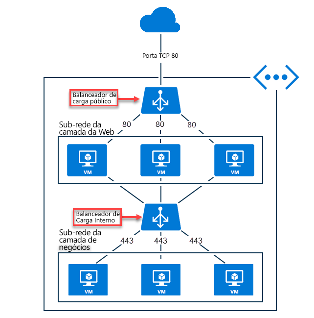

# O que é o Azure Load Balancer?

*Balanceamento de carga* refere-se à distribuição uniforme de carga ou tráfego de rede de entrada para um grupo de recursos ou servidores de back-end. O Azure oferece uma [variedade de opções de balanceamento de carga](https://docs.microsoft.com/azure/architecture/guide/technology-choices/load-balancing-overview) que você pode escolher conforme suas necessidades. Este documento aborda o Azure Load Balancer.

O Azure Load Balancer opera na camada quatro do modelo OSI (Interconexão de Sistemas Abertos). É o ponto de contato único para clientes. O Load Balancer distribui novos fluxos de entrada que chegam nas instâncias de pool de front-end a back-end do Load Balancer. Esses fluxos ocorrem de acordo com as investigações de integridade e regras de balanceamento de carga especificadas. As instâncias do pool de back-end podem ser Máquinas Virtuais ou instâncias do Azure em um conjunto de dimensionamento de máquinas virtuais.

Um **[balanceador de carga público](./concepts-limitations.md#publicloadbalancer)** pode fornecer conexões de saída para VMs (máquinas virtuais) dentro de sua rede virtual. Essas conexões são realizadas por meio da tradução dos endereços IP privados para endereços IP públicos. Os balanceadores de carga públicos são usados para balancear a carga do tráfego de Internet para suas VMs.

Um **[balanceador de carga interno (ou privado)](./concepts-limitations.md#internalloadbalancer)** é usado quando IPs privados são necessários apenas no front-end. Os balanceadores de carga internos são usados para balancear a carga do tráfego dentro de uma rede virtual. Um front-end do balanceador de carga pode ser acessado de uma rede local em um cenário híbrido.

  

*Figura: Balanceando aplicativos de várias camadas usando o Load Balancer interno e público*

Para obter mais informações sobre os componentes individuais do Load Balancer, confira [Componentes e limitações do Azure Load Balancer](./concepts-limitations.md)

>[!NOTE]
> A Microsoft recomenda o [Standard Load Balancer](./load-balancer-standard-overview.md).
VMs autônomas, conjuntos de disponibilidade e conjuntos de dimensionamento de máquina virtual podem estar conectados apenas a um SKU, nunca a ambos. Os SKUs do Load Balancer e do endereço IP público devem ser correspondentes quando você usá-los com endereços IP públicos. Os SKUs do Load Balancer e do IP público não são mutáveis.

## Por que usar o Azure Load Balancer?
Com o Azure Load Balancer, você pode dimensionar seus aplicativos e criar serviços com alta disponibilidade. O Load Balancer dá suporte a cenários de entrada e saída. O Load Balancer fornece baixa latência e alta taxa de transferência e pode ser escalado verticalmente em milhões de fluxos para aplicativos TCP e UDP.

Os principais cenários em que você pode usar o Azure Load Balancer incluem:

- Balancear carga do tráfego **[interno](https://docs.microsoft.com/azure/load-balancer/tutorial-load-balancer-standard-manage-portal)** e **[externo](https://docs.microsoft.com/azure/load-balancer/tutorial-load-balancer-standard-internal-portal)** para máquinas virtuais do Azure.

- Aumentar a disponibilidade distribuindo recursos **[dentro](https://docs.microsoft.com/azure/load-balancer/tutorial-load-balancer-standard-public-zonal-portal)** e **[entre](https://docs.microsoft.com/azure/load-balancer/tutorial-load-balancer-standard-public-zone-redundant-portal)** zonas.

- Configurar a **[conectividade de saída ](https://docs.microsoft.com/azure/load-balancer/load-balancer-outbound-connections)** para máquinas virtuais do Azure.

- Usar **[investigações de integridade](https://docs.microsoft.com/azure/load-balancer/load-balancer-custom-probe-overview)** para monitorar recursos com balanceamento de carga.

- Empregar o **[encaminhamento de porta](https://docs.microsoft.com/azure/load-balancer/tutorial-load-balancer-port-forwarding-portal)** para acessar máquinas virtuais em uma rede virtual por uma porta e endereço IP público.

- Habilitar o suporte para o **[balanceamento de carga](https://docs.microsoft.com/azure/virtual-network/virtual-network-ipv4-ipv6-dual-stack-standard-load-balancer-powershell)** do **[IPv6](https://docs.microsoft.com/azure/virtual-network/ipv6-overview)** .

- Aproveitar as **[métricas e diagnósticos](https://docs.microsoft.com/azure/load-balancer/load-balancer-standard-diagnostics)** do Azure Load Balancer com o **[Azure Monitor](https://docs.microsoft.com/azure/azure-monitor/overview)** .

- Balancear carga de serviços em **[várias portas, vários endereços IP ou ambos](https://docs.microsoft.com/azure/load-balancer/load-balancer-multivip-overview)** .

- Mover recursos **[internos](https://docs.microsoft.com/azure/load-balancer/move-across-regions-internal-load-balancer-portal)** e **[externos](https://docs.microsoft.com/azure/load-balancer/move-across-regions-external-load-balancer-portal)** do Load Balancer entre regiões do Azure.

- Balancear carga do fluxo TCP e UDP em todas as portas simultaneamente usando **[portas de HA](https://docs.microsoft.com/azure/load-balancer/load-balancer-ha-ports-overview)** .

## Preços

O uso do Standard Load Balancer é cobrado.

* Número de regras de saída e balanceamento de carga configuradas. As regras NAT de entrada não são contadas no número total de regras.
* A quantidade de dados processados na entrada e na saída não depende das regras.

Para obter informações sobre o preço do Standard Load Balancer, confira [Preço do Load Balancer](https://azure.microsoft.com/pricing/details/load-balancer/).

O Azure Load Balancer Basic é oferecido gratuitamente.

## Contrato de Nível de Serviço

Para obter informações sobre o SLA do Standard Load Balancer, confira [SLA do Load Balancer](https://aka.ms/lbsla).

## Próximas etapas

Confira [Criar um Standard Load Balancer público](quickstart-load-balancer-standard-public-portal.md) para começar a usar um Load Balancer.

Para obter mais informações sobre as limitações e componentes do Azure Load Balancer, confira [Componentes e limitações do Azure Load Balancer](./concepts-limitations.md)
