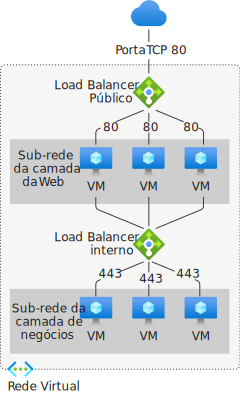

# O que é o Azure Load Balancer?

*Balanceamento de carga* refere-se à distribuição uniforme de carga ou tráfego de rede de entrada para um grupo de recursos ou servidores de back-end. 

O Azure Load Balancer opera na camada 4 do modelo de referência OSI. É o ponto de contato único para clientes. O Load Balancer distribui fluxos de entrada que chegam às instâncias do pool de front-end a back-end do balanceador de carga. Esses fluxos ocorrem de acordo com as investigações de integridade e regras de balanceamento de carga especificadas. As instâncias do pool de back-end podem ser Máquinas Virtuais ou instâncias do Azure em um conjunto de dimensionamento de máquinas virtuais.

Um **[balanceador de carga público](./components.md#frontend-ip-configurations)** pode fornecer conexões de saída para VMs (máquinas virtuais) dentro de sua rede virtual. Essas conexões são realizadas por meio da tradução dos endereços IP privados para endereços IP públicos. Os balanceadores de carga públicos são usados para balancear a carga do tráfego de Internet para suas VMs.

Um **[balanceador de carga interno (ou privado)](./components.md#frontend-ip-configurations)** é usado quando IPs privados são necessários apenas no front-end. Os balanceadores de carga internos são usados para balancear a carga do tráfego dentro de uma rede virtual. Um front-end do balanceador de carga pode ser acessado de uma rede local em um cenário híbrido.

  

*Figura: Balanceando aplicativos de várias camadas usando o Load Balancer interno e público*

Para obter mais informações sobre os componentes individuais do balanceador de carga, confira [Componentes do Azure Load Balancer](./components.md).

>[!NOTE]
> O Azure fornece um conjunto de soluções de balanceamento de carga totalmente gerenciadas para seus cenários. 
> * Se você quiser realizar um roteamento global baseado em DNS e **não** tiver os requisitos para encerramento de protocolo TLS ("descarregamento de SSL") ou para processamento de camada de aplicativo por solicitação HTTP/HTTPS, examine [Gerenciador de Tráfego](../traffic-manager/traffic-manager-overview.md). 
> * Se você quiser balancear a carga entre os servidores em uma região na camada de aplicativo, examine o [Gateway de Aplicativo](../application-gateway/overview.md).
> * Se você precisar otimizar o roteamento global do seu tráfego da Web e otimizar o desempenho e a confiabilidade do usuário final de nível superior por meio de um failover global rápido, confira [Front Door](../frontdoor/front-door-overview.md).
> 
> Os cenários de ponta a ponta podem se beneficiar da combinação dessas soluções, conforme necessário.
> Para obter uma comparação das opções de balanceamento de carga do Azure, confira [Visão geral das opções de balanceamento de carga no Azure](/azure/architecture/guide/technology-choices/load-balancing-overview).

## Por que usar o Azure Load Balancer?
Com o Azure Load Balancer, você pode dimensionar seus aplicativos e criar serviços com alta disponibilidade. O Load Balancer dá suporte a cenários de entrada e saída. O Load Balancer fornece baixa latência e alta taxa de transferência e pode ser escalado verticalmente em milhões de fluxos para aplicativos TCP e UDP.

Os principais cenários em que você pode usar o Azure Standard Load Balancer incluem:

- Balancear carga do tráfego **[interno](./quickstart-load-balancer-standard-internal-portal.md)** e **[externo](./quickstart-load-balancer-standard-public-portal.md)** para máquinas virtuais do Azure.

- Aumentar a disponibilidade distribuindo recursos **[dentro](./tutorial-load-balancer-standard-public-zonal-portal.md)** e **[entre](./tutorial-load-balancer-standard-public-zone-redundant-portal.md)** zonas.

- Configurar a **[conectividade de saída](./load-balancer-outbound-connections.md)** para máquinas virtuais do Azure.

- Usar **[investigações de integridade](./load-balancer-custom-probe-overview.md)** para monitorar recursos com balanceamento de carga.

- Empregar o **[encaminhamento de porta](./tutorial-load-balancer-port-forwarding-portal.md)** para acessar máquinas virtuais em uma rede virtual por uma porta e endereço IP público.

- Habilitar o suporte para o **[balanceamento de carga](../virtual-network/virtual-network-ipv4-ipv6-dual-stack-standard-load-balancer-powershell.md)** do **[IPv6](../virtual-network/ipv6-overview.md)** .

- O Standard Load Balancer fornece métricas multidimensionais por meio do [Azure Monitor](../azure-monitor/overview.md).  Essas métricas podem ser filtradas, agrupadas e divididas para uma determinada dimensão.  Elas fornecem informações atuais e históricas de desempenho e integridade do seu serviço. Os [Insights para Azure Load Balancer](./load-balancer-insights.md) oferecem um painel pré-configurado com visualizações úteis para essas métricas.  Também há suporte para a Integridade de Recursos. Examine **[Diagnóstico do Standard Load Balancer](load-balancer-standard-diagnostics.md)** para obter mais detalhes.

- Balancear carga de serviços em **[várias portas, vários endereços IP ou ambos](./load-balancer-multivip-overview.md)** .

- Mover recursos **[internos](./move-across-regions-internal-load-balancer-portal.md)** e **[externos](./move-across-regions-external-load-balancer-portal.md)** do Load Balancer entre regiões do Azure.

- Balancear carga do fluxo TCP e UDP em todas as portas simultaneamente usando **[portas de HA](./load-balancer-ha-ports-overview.md)** .

### Segurança por padrão

* O Standard Load Balancer se baseia no modelo de segurança de rede de confiança zero.

* O Standard Load Balancer é seguro por padrão e faz parte de sua rede virtual. A rede virtual é uma rede privada e isolada.  

* Os Standard Load Balancers e os endereços IP padrão são fechados para conexões de entrada, a menos que sejam abertos por Grupos de Segurança de Rede. Os NSGs são usados para permitir explicitamente o tráfego permitido.  Se você não tiver um NSG em uma sub-rede ou adaptador de rede do seu recurso de máquina virtual, o tráfego não terá permissão para acessar o recurso. Para saber mais sobre os NSGs e como aplicá-los no seu cenário, confira [Grupos de segurança de rede](../virtual-network/network-security-groups-overview.md).

* Por padrão, o Load Balancer Básico está aberto para a Internet. 

* O Load Balancer não armazena dados do cliente.

## Preço e SLA

Para obter informações sobre o preço do Standard Load Balancer, confira [Preço do Load Balancer](https://azure.microsoft.com/pricing/details/load-balancer/).
O Load Balancer Básico é oferecido gratuitamente.
Confira [SLA para Load Balancer](https://aka.ms/lbsla). O Load Balancer Básico não tem SLA.

## Novidades

Assine o RSS feed e veja as atualizações mais recentes dos recursos do Azure Load Balancer na página [Atualizações do Azure](https://azure.microsoft.com/updates/?category=networking&query=load%20balancer).

## Próximas etapas

Confira como [Criar um Standard Load Balancer](quickstart-load-balancer-standard-public-portal.md) para começar a usar um balanceador de carga.

Para obter mais informações sobre as limitações e componentes do Azure Load Balancer, confira [Componentes do Azure Load Balancer](./components.md) e [Conceitos do Azure Load Balancer](./concepts.md)