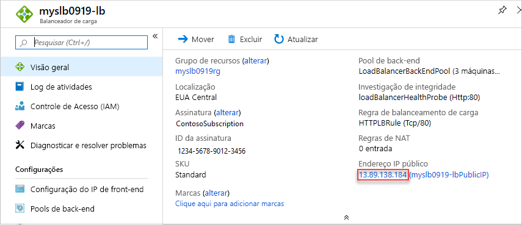

# <a name="quickstart-create-a-public-load-balancer-to-load-balance-vms-by-using-an-arm-template"></a>Início Rápido: Criar um balanceador de carga público para balancear a carga de VMs usando um modelo do ARM

O balanceamento de carga fornece um nível mais alto de disponibilidade e escala com a distribuição das solicitações recebidas entre várias VMs (máquinas virtuais). 

Este guia de início rápido mostra como implantar o Standard Load Balancer para balancear a carga de máquinas virtuais.

O uso de um modelo do Resource Manager apresenta menos etapas comparado a outros métodos de implantação.

[!INCLUDE [About Azure Resource Manager](../../includes/resource-manager-quickstart-introduction.md)]

Se seu ambiente atender aos pré-requisitos e você estiver familiarizado com o uso de modelos ARM, selecione o botão **Implantar no Azure**. O modelo será aberto no portal do Azure.

[](https://portal.azure.com/#create/Microsoft.Template/uri/https%3A%2F%2Fraw.githubusercontent.com%2FAzure%2Fazure-quickstart-templates%2Fmaster%2F101-load-balancer-standard-create%2Fazuredeploy.json)

## <a name="prerequisites"></a>Pré-requisitos

Se você não tiver uma assinatura do Azure, crie uma [conta gratuita](https://azure.microsoft.com/free/?WT.mc_id=A261C142F) antes de começar.

## <a name="review-the-template"></a>Examinar o modelo

O modelo usado neste início rápido é proveniente dos [Modelos de Início Rápido do Azure](https://azure.microsoft.com/resources/templates/101-load-balancer-standard-create/).

Os SKUs do balanceador de carga e do IP público precisam coincidir. Ao criar um Standard Load Balancer, você também precisa criar um endereço IP público padrão configurado como o front-end do Standard Load Balancer. Se você quiser criar um balanceador de carga básico, use [este modelo](https://azure.microsoft.com/resources/templates/201-2-vms-loadbalancer-natrules/). A Microsoft recomenda usar o SKU padrão para cargas de trabalho de produção.

:::code language="json" source="~/quickstart-templates/101-load-balancer-standard-create/azuredeploy.json":::

Vários recursos do Azure foram definidos no modelo:

- [**Microsoft.Network/loadBalancers**](/azure/templates/microsoft.network/loadbalancers)
- [**Microsoft.Network/publicIPAddresses**](/azure/templates/microsoft.network/publicipaddresses): para o balanceador de carga, bastion host e para cada uma das três máquinas virtuais.
- [**Microsoft.Network/bastionHosts**](/azure/templates/microsoft.network/bastionhosts)
- [**Microsoft.Network/networkSecurityGroups**](/azure/templates/microsoft.network/networksecuritygroups)
- [**Microsoft.Network/virtualNetworks**](/azure/templates/microsoft.network/virtualnetworks)
- [**Microsoft.Compute/virutalMachines**](/azure/templates/microsoft.compute/virtualmachines) (3).
- [**Microsoft.Network/networkInterfaces**](/azure/templates/microsoft.network/networkinterfaces) (3).
- [**Microsoft.Compute/virtualMachine/extensions**](/azure/templates/microsoft.compute/virtualmachines/extensions) (3): use para configurar o IIS (Serviços de Informações da Internet) e as páginas da Web.

Para encontrar mais modelos relacionados ao Azure Load Balancer, confira [Modelos de Início Rápido do Azure](https://azure.microsoft.com/resources/templates/?resourceType=Microsoft.Network&pageNumber=1&sort=Popular).

## <a name="deploy-the-template"></a>Implantar o modelo

1. Clique em **Experimentar** no bloco de código a seguir para abrir o Azure Cloud Shell e então acompanhe as instruções para entrar no Azure.

   ```azurepowershell-interactive
   $projectName = Read-Host -Prompt "Enter a project name with 12 or less letters or numbers that is used to generate Azure resource names"
   $location = Read-Host -Prompt "Enter the location (i.e. centralus)"
   $adminUserName = Read-Host -Prompt "Enter the virtual machine administrator account name"
   $adminPassword = Read-Host -Prompt "Enter the virtual machine administrator password" -AsSecureString

   $resourceGroupName = "${projectName}rg"
   $templateUri = "https://raw.githubusercontent.com/Azure/azure-quickstart-templates/master/101-load-balancer-standard-create/azuredeploy.json"

   New-AzResourceGroup -Name $resourceGroupName -Location $location
   New-AzResourceGroupDeployment -ResourceGroupName $resourceGroupName -TemplateUri $templateUri -projectName $projectName -location $location -adminUsername $adminUsername -adminPassword $adminPassword

   Write-Host "Press [ENTER] to continue."
   ```

   Aguarde até ver o prompt do console.

1. Selecione **Copiar** no bloco de códigos anterior para copiar o script do PowerShell.

1. Clique com o botão direito do mouse no painel do console do shell e selecione **Colar**.

1. Insira os valores.

   A implantação do modelo cria três zonas de disponibilidade. As zonas de disponibilidade têm suporte apenas em [determinadas regiões](../availability-zones/az-overview.md). Use uma das regiões com suporte. Se você não tiver certeza, insira **centralus**.

   O nome do grupo de recursos é o nome do projeto com o acréscimo de **rg**. Você precisará do nome do grupo de recursos na seção a seguir.

A implantação do modelo leva cerca de 10 minutos. Quando tiver concluído, a saída deverá ser semelhante a:


O Azure PowerShell é usado para implantar o modelo. Use também o portal do Azure, a CLI do Azure e a API REST. Para saber mais sobre outros métodos de implantação, confira [Implantar modelos](../azure-resource-manager/templates/deploy-portal.md).

## <a name="review-deployed-resources"></a>Examinar os recursos implantados

1. Entre no [portal do Azure](https://portal.azure.com).

1. Escolha **Grupos de recursos** no painel esquerdo.

1. Selecione o grupo de recursos criado na seção anterior. O nome do grupo de recursos padrão é o nome do projeto com o acréscimo de **rg**.

1. Escolha o balanceador de carga. O nome padrão é o nome do projeto com o acréscimo de **-lb**.

1. Copie apenas a parte do endereço IP do endereço IP público e cole-a na barra de endereço do seu navegador.

   

    O navegador exibe a página padrão do servidor da Web dos Serviços de Informações da Internet (IIS).

   

Para ver o balanceador de carga distribuir o tráfego entre todas as três VMs, você poderá forçar a atualização de seu navegador da Web no computador cliente.

## <a name="clean-up-resources"></a>Limpar os recursos

Quando você não precisar mais deles, exclua os seguintes: 

* Resource group
* Balanceador de carga
* Recursos relacionados

Acesse o portal do Azure, selecione o grupo de recursos que contém o balanceador de carga e, em seguida, selecione **Excluir o grupo de recursos**.

## <a name="next-steps"></a>Próximas etapas

Neste início rápido, você:

* Criou uma rede virtual para o balanceador de carga e as máquinas virtuais.
* Criou um host do Azure Bastion para gerenciamento.
* Criou um Standard Load Balancer e anexou VMs a ele.
* Configurou a investigação de integridade e a regra de tráfego do balanceador de carga.
* Testou o balanceador de carga.

Para saber mais, continue com os tutoriais do Azure Load Balancer.

> [!div class="nextstepaction"]
> [Tutoriais do Azure Load Balancer](tutorial-load-balancer-standard-public-zone-redundant-portal.md)
