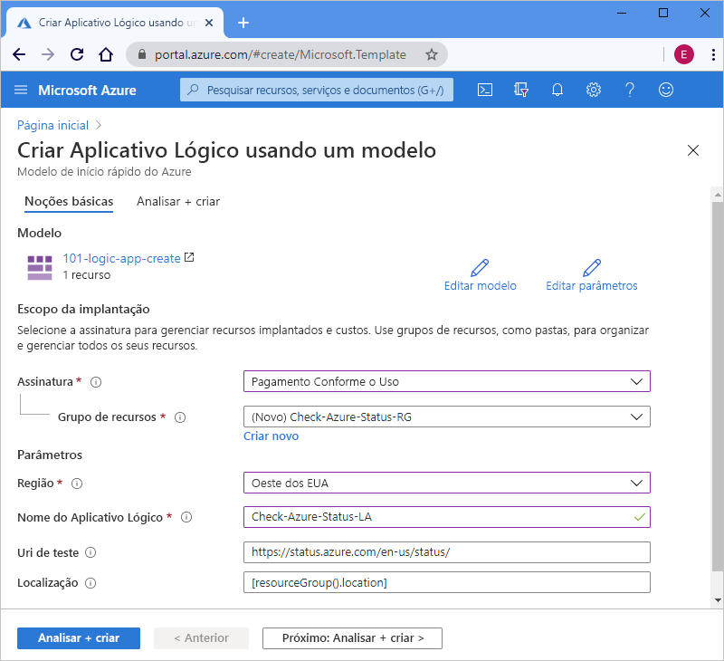

# <a name="quickstart-create-and-deploy-a-logic-app-workflow-by-using-an-arm-template"></a>Início Rápido: Criar e implantar um fluxo de trabalho de aplicativo lógico usando um modelo do Resource Manager

Os [Aplicativos Lógicos do Azure](../logic-apps/logic-apps-overview.md) são um serviço de nuvem que ajuda você a criar e executar fluxos de trabalho automatizados que integram dados, aplicativos, serviços baseados em nuvem e sistemas locais selecionando uma opção de [centenas de conectores](/connectors/connector-reference/connector-reference-logicapps-connectors). Este guia de início rápido tem como foco o processo de implantação de um modelo do Azure Resource Manager para criação de um aplicativo lógico básico que verifica o status do Azure de acordo com um agendamento por hora. 

[!INCLUDE [About Azure Resource Manager](../../includes/resource-manager-quickstart-introduction.md)]

Se seu ambiente atender aos pré-requisitos e você estiver familiarizado com o uso de modelos ARM, selecione o botão **Implantar no Azure**. O modelo será aberto no portal do Azure.

[](https://portal.azure.com/#create/Microsoft.Template/uri/https%3a%2f%2fraw.githubusercontent.com%2fAzure%2fazure-quickstart-templates%2fmaster%2f101-logic-app-create%2fazuredeploy.json)

## <a name="prerequisites"></a>Pré-requisitos

Caso você não tenha uma assinatura do Azure, crie uma [conta gratuita do Azure](https://azure.microsoft.com/free/?WT.mc_id=A261C142F) antes de começar.

## <a name="review-the-template"></a>Examinar o modelo

Este guia de início rápido usa o modelo [**Criar um aplicativo lógico**](https://azure.microsoft.com/resources/templates/101-logic-app-create/), que pode ser encontrado na [Galeria de Modelos de Início Rápido do Azure](https://azure.microsoft.com/resources/templates), mas que é muito longo para ser mostrado aqui. Em vez disso, examine o ["arquivo azuredeploy.json"](https://github.com/Azure/azure-quickstart-templates/blob/master/101-logic-app-create/azuredeploy.json) do modelo de início rápido na galeria de modelos.

O modelo de início rápido cria um fluxo de trabalho de aplicativo lógico que usa o gatilho de recorrência, definido para ser executado a cada hora, e uma [ação *interna*](../connectors/built-in.md) HTTP, que chama uma URL que retorna o status para o Azure. Uma ação interna é nativa da plataforma Aplicativos Lógicos do Azure.

Esse modelo cria o seguinte recurso do Azure:

* [**Microsoft.Logic/workflows**](/azure/templates/microsoft.logic/workflows), que cria o fluxo de trabalho para um aplicativo lógico.

Para encontrar mais modelos de início rápido para os Aplicativos Lógicos do Azure, examine os modelos [Microsoft.Logic](https://azure.microsoft.com/resources/templates/?resourceType=Microsoft.Logic) na galeria.

<a name="deploy-template"></a>

## <a name="deploy-the-template"></a>Implantar o modelo

Siga a opção que deseja usar para implantar o modelo de início rápido:

| Opção | Descrição |
|--------|-------------|
| [Azure portal](../logic-apps/quickstart-create-deploy-azure-resource-manager-template.md?tabs=azure-portal#deploy-template) | Se o seu ambiente do Azure atender aos pré-requisitos e você estiver familiarizado com o uso de modelos do Resource Manager, estas etapas ajudarão você a entrar diretamente no Azure e abrir o modelo de início rápido no portal do Azure. Para obter mais informações, confira [Implantar recursos com modelos do Resource Manager e o portal do Azure](../azure-resource-manager/templates/deploy-portal.md). |
| [CLI do Azure](../logic-apps/quickstart-create-deploy-azure-resource-manager-template.md?tabs=azure-cli#deploy-template) | A CLI do Azure (interface de linha de comando do Azure) é um conjunto de comandos para criação e gerenciamento de recursos do Azure. Para executar esses comandos, você precisará ter a CLI do Azure versão 2.6 ou posterior. Para verificar sua versão da CLI, digite `az --version`. Para saber mais, consulte esses tópicos: <p><p>- [O que é a CLI do Azure](/cli/azure/what-is-azure-cli) <br>- [Introdução à CLI do Azure](/cli/azure/get-started-with-azure-cli) |
| [PowerShell do Azure](../logic-apps/quickstart-create-deploy-azure-resource-manager-template.md?tabs=azure-powershell#deploy-template) | O Azure PowerShell fornece um conjunto de cmdlets que usam o modelo do Azure Resource Manager para gerenciar seus recursos do Azure. Para saber mais, consulte esses tópicos: <p><p>- [Visão geral do Azure PowerShell](/powershell/azure/azurerm/overview) <br>- [Apresentação do módulo Az do Azure PowerShell](/powershell/azure/new-azureps-module-az) <br>- [Introdução ao Azure PowerShell](/powershell/azure/get-started-azureps) |
| [API REST de Gerenciamento de Recursos do Azure](../logic-apps/quickstart-create-deploy-azure-resource-manager-template.md?tabs=rest-api#deploy-template) | O Azure fornece APIs REST (Transferência de Estado Representacional), que são pontos de extremidade de serviço que dão suporte a operações HTTP (métodos) usadas para criar, recuperar, atualizar ou excluir o acesso aos recursos de serviço. Para obter mais informações, confira [Introdução à API REST do Azure](/rest/api/azure/). |
|||

<a name="deploy-azure-portal"></a>

#### <a name="portal"></a>[Portal](#tab/azure-portal)

1. Selecione a seguinte imagem para entrar com a sua conta do Azure e abra o modelo de início rápido no portal do Azure:

   [](https://portal.azure.com/#create/Microsoft.Template/uri/https%3a%2f%2fraw.githubusercontent.com%2fAzure%2fazure-quickstart-templates%2fmaster%2f101-logic-app-create%2fazuredeploy.json)

1. No portal, na página **Criar um aplicativo lógico usando um modelo**, insira ou selecione estes valores:

   | Propriedade | Valor | Descrição |
   |----------|-------|-------------|
   | **Assinatura** | <*Azure-subscription-name*> | O nome da assinatura do Azure a ser usado |
   | **Grupo de recursos** | <*Azure-resource-group-name*> | O nome de um grupo de recursos novo ou existente do Azure. Este exemplo usa o `Check-Azure-Status-RG`. |
   | **Região** | <*Azure-region*> | A região do datacenter do Azure que usará o aplicativo lógico. Este exemplo usa o `West US`. |
   | **Nome do Aplicativo Lógico** | <*logic-app-name*> | O nome a ser usado para o aplicativo lógico. Este exemplo usa o `Check-Azure-Status-LA`. |
   | **URI de teste** | <*test-URI*> | O URI do serviço a ser chamado de acordo com um agendamento específico. Este exemplo usa `https://status.azure.com/en-us/status/`, que é a página de status do Azure. |
   | **Localidade** |  <*Azure-region-for-all-resources*> | A região do Azure a ser usada para todos os recursos, se for diferente do valor padrão. Este exemplo usa o valor padrão, `[resourceGroup().location]`, que é a localização do grupo de recursos. |
   ||||

   Veja a aparência da página com os valores usados neste exemplo:

   

1. Quando terminar, selecione **Review + create**.

1. Prossiga para as etapas em [Examinar os recursos implantados](#review-deployed-resources).

#### <a name="cli"></a>[CLI](#tab/azure-cli)

```azurecli-interactive
read -p "Enter a project name name to use for generating resource names:" projectName &&
read -p "Enter the location, such as 'westus':" location &&
templateUri="https://raw.githubusercontent.com/Azure/azure-quickstart-templates/master/101-logic-app-create/azuredeploy.json" &&
resourceGroupName="${projectName}rg" &&
az group create --name $resourceGroupName --location "$location" &&
az deployment group create --resource-group $resourceGroupName --template-uri  $templateUri &&
echo "Press [ENTER] to continue ..." &&
read
```

Para saber mais, consulte esses tópicos:

* [CLI do Azure: az deployment group](/cli/azure/deployment/group)
* [Implantar recursos com modelos do Resource Manager e a CLI do Azure](../azure-resource-manager/templates/deploy-cli.md)

#### <a name="powershell"></a>[PowerShell](#tab/azure-powershell)

```azurepowershell-interactive
$projectName = Read-Host -Prompt "Enter a project name to use for generating resource names"
$location = Read-Host -Prompt "Enter the location, such as 'westus'"
$templateUri = "https://raw.githubusercontent.com/Azure/azure-quickstart-templates/master/101-logic-app-create/azuredeploy.json"

$resourceGroupName = "${projectName}rg"

New-AzResourceGroup -Name $resourceGroupName -Location "$location"
New-AzResourceGroupDeployment -ResourceGroupName $resourceGroupName -TemplateUri $templateUri

Read-Host -Prompt "Press [ENTER] to continue ..."
```

Para saber mais, consulte esses tópicos:

* [Azure PowerShell: New-AzResourceGroup](/powershell/module/az.resources/new-azresourcegroup)
* [Azure PowerShell: New-AzResourceGroupDeployment](/powershell/module/az.resources/new-azresourcegroupdeployment)
* [Implantar recursos com modelos do Resource Manager e o Azure PowerShell](../azure-resource-manager/templates/deploy-powershell.md)

#### <a name="rest-api"></a>[REST API](#tab/rest-api)

1. Caso não deseje usar um grupo de recursos existente do Azure, crie um grupo de recursos seguindo esta sintaxe para a solicitação enviada à API REST do Gerenciamento de Recursos:

   ```http
   PUT https://management.azure.com/subscriptions/{subscriptionId}/resourcegroups/{resourceGroupName}?api-version=2019-10-01
   ```

   | Valor | Descrição |
   |-------|-------------|
   | `subscriptionId`| O GUID da assinatura do Azure que você deseja usar |
   | `resourceGroupName` | O nome do grupo de recursos do Azure a ser criado. Este exemplo usa o `Check-Azure-Status-RG`. |
   |||

   Por exemplo:

   ```http
   PUT https://management.azure.com/subscriptions/xxxxXXXXxxxxXXXXX/resourcegroups/Check-Azure-Status-RG?api-version=2019-10-01
   ```

   Para saber mais, consulte esses tópicos:

   * [Referência da API REST do Azure – Como chamar as APIs REST do Azure](/rest/api/azure/)
   * [API REST de Gerenciamento de Recursos: grupo de recursos – Criar ou atualizar](/rest/api/resources/resourcegroups/createorupdate).

1. Para implantar o modelo de início rápido no grupo de recursos, siga esta sintaxe para a solicitação enviada à API REST do Gerenciamento de Recursos:

   ```http
   PUT https://management.azure.com/subscriptions/{subscriptionId}/resourcegroups/{resourceGroupName}/providers/Microsoft.Resources/deployments/{deploymentName}?api-version=2019-10-01
   ```

   | Valor | Descrição |
   |-------|-------------|
   | `subscriptionId`| O GUID da assinatura do Azure que você deseja usar |
   | `resourceGroupName` | O nome do grupo de recursos do Azure a ser usado. Este exemplo usa o `Check-Azure-Status-RG`. |
   | `deploymentName` | O nome a ser usado para a implantação. Este exemplo usa o `Check-Azure-Status-LA`. |
   |||

   Por exemplo:

   ```http
   PUT https://management.azure.com/subscriptions/xxxxXXXXxxxxXXXXX/resourcegroups/Check-Azure-Status-RG/providers/Microsoft.Resources/deployments/Check-Azure-Status-LA?api-version=2019-10-01
   ```

   Para obter mais informações, confira [API REST de Gerenciamento de Recursos: implantações – Criar ou atualizar](/rest/api/resources/deployments/createorupdate).

1. Para fornecer os valores a serem usados para a implantação, como a região do Azure e os links para o modelo de início rápido e o [arquivo de parâmetro](../azure-resource-manager/templates/template-parameters.md), que contém os valores para uso do modelo de início rápido na implantação, siga esta sintaxe do corpo da solicitação enviada à API REST de Gerenciamento de Recursos:

   ```json
   {
      "location": "{Azure-region}",
      "properties": {
         "templateLink": {
            "uri": "{quickstart-template-URL}",
            "contentVersion": "1.0.0.0"
         },
         "parametersLink": {
            "uri": "{quickstart-template-parameter-file-URL}",
            "contentVersion": "1.0.0.0"
         },
         "mode": "Incremental"
      }
   }
   ```

   | Propriedade | Valor | Descrição |
   |----------|-------|-------------|
   | `location`| <*Azure-region*> | A região do Azure a ser usada para implantação. Este exemplo usa o `West US`. |
   | `templateLink` : `uri` | <*quickstart-template-URL*> | A localização da URL para o modelo de início rápido a ser usada para implantação: <p><p>`https://raw.githubusercontent.com/Azure/azure-quickstart-templates/master/101-logic-app-create/azuredeploy.json`. |
   | `parametersLink` : `uri` | <*quickstart-template-parameter-file-URL*> | A localização da URL para o arquivo de parâmetro do modelo de início rápido a ser usada para implantação: <p><p>`https://raw.githubusercontent.com/Azure/azure-quickstart-templates/master/101-logic-app-create/azuredeploy.parameters.json` <p><p>Para obter mais informações sobre o arquivo de parâmetro do Resource Manager, confira estes tópicos: <p><p>- [Criar um arquivo de parâmetro do Resource Manager](../azure-resource-manager/templates/parameter-files.md) <br>- [Tutorial: Usar arquivos de parâmetro para implantar seu modelo do Resource Manager](../azure-resource-manager/templates/template-tutorial-use-parameter-file.md) |
   | `mode` | <*deployment-mode*> | Execute uma atualização incremental ou uma atualização completa. Este exemplo usa `Incremental`, que é o valor padrão. Para obter mais informações, confira [Modos de implantação do Azure Resource Manager](../azure-resource-manager/templates/deployment-modes.md). |
   |||

   Por exemplo:

   ```json
   {
      "location": "West US",
      "properties": {
         "templateLink": {
            "uri": "https://raw.githubusercontent.com/Azure/azure-quickstart-templates/master/101-logic-app-create/azuredeploy.json",
            "contentVersion": "1.0.0.0"
         },
         "parametersLink": {
            "uri": "https://raw.githubusercontent.com/Azure/azure-quickstart-templates/master/101-logic-app-create/azuredeploy.parameters.json",
            "contentVersion": "1.0.0.0"
         },
         "mode": "Incremental"
      }
   }
   ```

Para saber mais, consulte esses tópicos:

* [API REST de Gerenciamento de Recursos](/rest/api/resources/)
* [Implantar recursos com modelos do Resource Manager e a API REST do Resource Manager](../azure-resource-manager/templates/deploy-rest.md)

---

<a name="review-deployed-resources"></a>

## <a name="review-deployed-resources"></a>Examinar os recursos implantados

Para ver o aplicativo lógico, use o portal do Azure, execute um script criado com a CLI do Azure ou o Azure PowerShell ou use a API REST do Aplicativo Lógico.

### <a name="portal"></a>[Portal](#tab/azure-portal)

1. Na caixa de pesquisa do portal do Azure, insira o nome do aplicativo lógico, que é `Check-Azure-Status-LA` neste exemplo. Na lista de resultados, selecione seu aplicativo lógico.

1. No portal do Azure, encontre e selecione seu aplicativo lógico, que é `Check-Azure-Status-RG` neste exemplo.

1. Quando o Designer de Aplicativo Lógico for aberto, examine o aplicativo lógico criado pelo modelo de início rápido.

1. Para testar o aplicativo lógico, na barra de ferramentas do designer, selecione **Executar**.

### <a name="cli"></a>[CLI](#tab/azure-cli)

```azurecli-interactive
echo "Enter your logic app name:" &&
read logicAppName &&
az logic workflow show --name $logicAppName &&
echo "Press [ENTER] to continue ..."
```

Para obter mais informações, confira [CLI do Azure: az logic workflow show](/cli/azure/ext/logic/logic/workflow#ext-logic-az-logic-workflow-show).

### <a name="powershell"></a>[PowerShell](#tab/azure-powershell)

```azurepowershell-interactive
$logicAppName = Read-Host -Prompt "Enter your logic app name"
Get-AzLogicApp -Name $logicAppName
Write-Host "Press [ENTER] to continue..."
```

Para obter mais informações, confira [Azure PowerShell: Get-AzLogicApp](/powershell/module/az.logicapp/get-azlogicapp).

### <a name="rest-api"></a>[REST API](#tab/rest-api)

```http
GET https://management.azure.com/subscriptions/{subscriptionId}/resourceGroups/{resourceGroupName}/providers/Microsoft.Logic/workflows/{workflowName}?api-version=2016-06-01
```

| Valor | Descrição |
|-------|-------------|
| `subscriptionId`| O GUID da assinatura do Azure em que você implantou o modelo de início rápido. |
| `resourceGroupName` | O nome do grupo de recursos do Azure em que você implantou o modelo de início rápido. Este exemplo usa o `Check-Azure-Status-RG`. |
| `workflowName` | O nome do aplicativo lógico implantado. Este exemplo usa o `Check-Azure-Status-LA`. |
|||

Por exemplo:

```http
GET https://management.azure.com/subscriptions/xxxxXXXXxxxxXXXXX/resourceGroups/Check-Azure-Status-RG/providers/Microsoft.Logic/workflows/Check-Azure-Status-LA?api-version=2016-06-01
```

Para obter mais informações, confira [API REST de Aplicativos Lógicos: fluxos de trabalho – Obter](/rest/api/logic/workflows/get).

---

## <a name="clean-up-resources"></a>Limpar os recursos

Se você pretende continuar trabalhando com os tutoriais e os guias de início rápido seguintes, o ideal é manter esses recursos. Quando você não precisar mais do aplicativo lógico, exclua o grupo de recursos usando o portal do Azure, a CLI do Azure, o Azure PowerShell ou a API REST de Gerenciamento de Recursos.

### <a name="portal"></a>[Portal](#tab/azure-portal)

1. No portal do Azure, encontre e selecione o grupo de recursos que deseja excluir, que é `Check-Azure-Status-RG` neste exemplo.

1. No menu do grupo de recursos, escolha **Visão geral**, se essa opção ainda não estiver selecionada. Na página de visão geral, selecione **Excluir grupo de recursos**.

1. Para confirmar a ação, insira o nome do grupo de recursos.

Para obter mais informações, confira [Excluir grupo de recursos](../azure-resource-manager/management/delete-resource-group.md?tabs=azure-portal#delete-resource-group).

### <a name="cli"></a>[CLI](#tab/azure-cli)

```azurecli-interactive
echo "Enter your resource group name:" &&
read resourceGroupName &&
az group delete --name $resourceGroupName &&
echo "Press [ENTER] to continue ..."
```

Para obter mais informações, confira [CLI do Azure: az group delete](/cli/azure/group#az_group_delete).

### <a name="powershell"></a>[PowerShell](#tab/azure-powershell)

```azurepowershell-interactive
$resourceGroupName = Read-Host -Prompt "Enter the resource group name"
Remove-AzResourceGroup -Name $resourceGroupName
Write-Host "Press [ENTER] to continue..."
```

Para obter mais informações, confira [Azure PowerShell: Remove-AzResourceGroup](/powershell/module/azurerm.resources/remove-azurermresourcegroup).

### <a name="rest-api"></a>[REST API](#tab/rest-api)

```http
DELETE https://management.azure.com/subscriptions/{subscriptionId}/resourcegroups/{resourceGroupName}?api-version=2019-10-01
```

| Valor | Descrição |
|-------|-------------|
| `subscriptionId`| O GUID da assinatura do Azure em que você implantou o modelo de início rápido. |
| `resourceGroupName` | O nome do grupo de recursos do Azure em que você implantou o modelo de início rápido. Este exemplo usa o `Check-Azure-Status-RG`. |
|||

Por exemplo:

```http
GET https://management.azure.com/subscriptions/xxxxXXXXxxxxXXXXX/resourceGroups/Check-Azure-Status-RG?api-version=2019-10-01
```

Para obter mais informações, confira [API REST de Gerenciamento de Recursos: grupos de recursos – Excluir](/rest/api/resources/resourcegroups/delete).

---

## <a name="next-steps"></a>Próximas etapas

> [!div class="nextstepaction"]
> [Tutorial: Criar e implantar seu primeiro modelo do Resource Manager](../azure-resource-manager/templates/template-tutorial-create-first-template.md)
