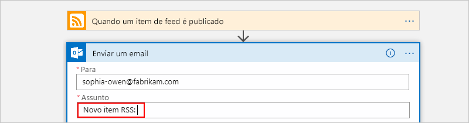
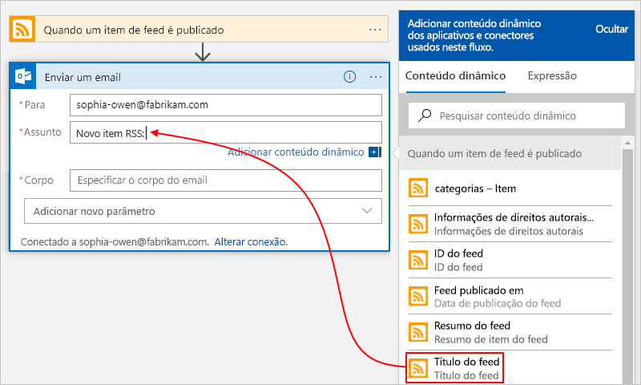
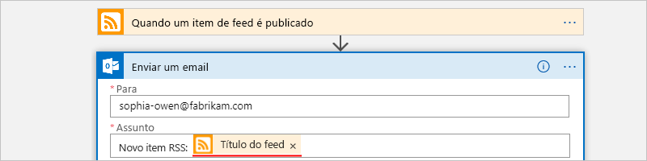
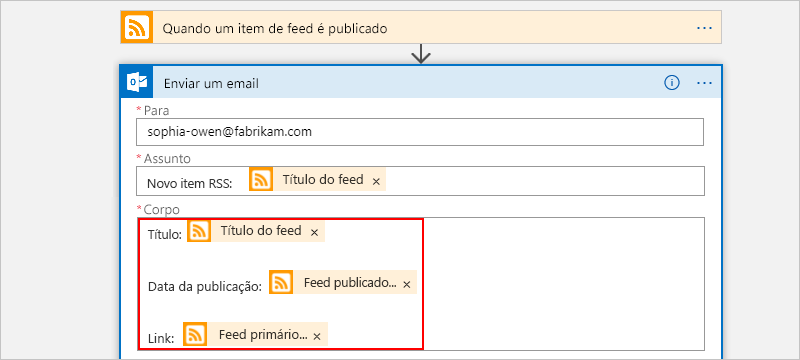

# Início Rápido: Criar seu primeiro fluxo de trabalho usando os Aplicativos Lógicos do Azure – portal do Azure

Este início rápido apresenta os conceitos gerais básicos por trás de como criar seu primeiro fluxo de trabalho usando os [Aplicativos Lógicos do Azure](../logic-apps/logic-apps-overview.md), como criar um aplicativo lógico em branco, adicionar um gatilho e uma ação e testar o aplicativo lógico. Neste início rápido, você cria um aplicativo lógico que verifica regularmente o RSS feed para novos itens. Se existirem novos itens, o aplicativo lógico envia um email para cada item. Quando terminar, o aplicativo lógico ficará parecido com este fluxo de trabalho em alto nível:

Para este cenário, você precisa de uma conta de email de qualquer serviço de email compatível com os Aplicativos Lógicos do Azure, como o Office 365 Outlook, Outlook.com ou Gmail. Para outros serviços de email com suporte, [verifique a lista de conectores aqui](https://docs.microsoft.com/connectors/). Neste exemplo, o aplicativo lógico usa uma conta do Outlook do Office 365. Se você usar um serviço de email diferente, as etapas gerais serão as mesmas, mas a interface do usuário poderá ser um pouco diferente.

Caso você não tenha uma assinatura do Azure, [crie uma conta gratuita do Azure](https://azure.microsoft.com/free/).

## Entre no Portal do Azure

Entre no [portal do Azure](https://portal.azure.com) com suas credenciais da conta do Azure.

## Criar seu aplicativo lógico

1. Na página inicial do Azure, na caixa de pesquisa, encontre e selecione **Aplicativos Lógicos**.

   

1. Na página **Aplicativos Lógicos**, selecione **Adicionar**.

   

1. No painel **Aplicativo Lógico**, forneça os detalhes sobre seu aplicativo lógico, conforme mostrado abaixo. Quando terminar, selecione **Criar**.

   

   | Propriedade | Valor | DESCRIÇÃO |
   |----------|-------|-------------|
   | **Nome** | <*logic-app-name*> | O nome do aplicativo lógico, que pode conter apenas letras, números, hifens (`-`), sublinhados (`_`), parênteses(`(`, `)`) e pontos (`.`). Este exemplo usa "My-First-Logic-App". |
   | **Assinatura** | <*Azure-subscription-name*> | Seu nome da assinatura do Azure |
   | **Grupo de recursos** | <*Azure-resource-group-name*> | O nome do [grupo de recursos do Azure](../azure-resource-manager/resource-group-overview.md) usado para organizar os recursos relacionados. Este exemplo usa "My-First-LA-RG". |
   | **Localidade** | <*Azure-region*> | A região em que as informações de seu aplicativo lógico serão armazenadas. Este exemplo usa "Leste dos EUA". |
   | **Log Analytics** | Desativar | Mantenha a configuração **Desligado** para o log de diagnósticos. |
   ||||

1. Depois que o Azure implanta seu aplicativo, na barra de ferramentas do Azure, selecione **Notificações** > **Ir para o recurso** para seu aplicativo lógico implantado.

   

   Ou você pode encontrar e selecionar seu aplicativo lógico digitando o nome na caixa de pesquisa.

   O Designer de Aplicativos Lógicos é exibido e mostra uma página com um vídeo de introdução e os gatilhos normalmente usados. Em **Modelos**, selecione **Aplicativo lógico em branco**.

   

Em seguida, adicione um [gatilho](../logic-apps/logic-apps-overview.md#logic-app-concepts) que é acionado quando um novo item de RSS feed aparece. Cada aplicativo lógico deve começar com um gatilho, que é disparado quando um evento específico ocorre ou quando uma condição específica é atendida. Cada vez que o gatilho é acionado, o mecanismo de Aplicativos Lógicos do Azure cria uma instância de aplicativo lógico que inicia e executa o fluxo de trabalho.

## Adicionar o gatilho do RSS

1. No **Designer do Aplicativo Lógico**, na caixa de pesquisa, selecione **Tudo**.

1. Na caixa de pesquisa, digite `rss` para encontrar o conector RSS. Na lista de gatilhos, selecione o gatilho **Quando um item do feed é publicado**.

   

1. Forneça essas informações para o gatilho como mostrado e descrito aqui:

   

   | Propriedade | Valor | DESCRIÇÃO |
   |----------|-------|-------------|
   | **A URL do RSS feed** | `http://feeds.reuters.com/reuters/topNews` | O link do RSS feed do site que você deseja monitorar |
   | **Intervalo** | 1 | O número de intervalos de espera entre as verificações |
   | **Frequência** | Minuto | A unidade de tempo para cada intervalo entre verificações  |
   ||||

   Juntos, o intervalo e a frequência definem o agendamento para o gatilho do aplicativo lógico. Este aplicativo lógico verifica o feed a cada minuto.

1. Por enquanto, para recolher os detalhes do gatilho, clique na barra de título do gatilho.

   

1. Salve seu aplicativo lógico. Selecione **Salvar** na barra de ferramentas do designer.

Seu aplicativo lógico agora está ativo, mas ele não faz nada além de verificar o RSS feed. Portanto, adicione uma ação que responde quando o gatilho é acionado.

## Selecione a ação "enviar email"

Agora, adicione uma [ação](../logic-apps/logic-apps-overview.md#logic-app-concepts) que envia email quando um novo item é exibido no RSS feed.

1. No gatilho **Quando um item do feed é publicado**, selecione **Nova etapa**.

   

1. Em **Escolha uma ação** e na caixa de pesquisa, selecione **Todas**.

1. Em cada caixa de pesquisa, insira `send an email` para encontrar conectores que ofereçam esta ação. Na lista de ações, selecione a ação "enviar um email" para o serviço de email que você deseja usar. Este exemplo usa o conector do Office 365 Outlook, que tem a ação **Enviar um email**.

   

   Para filtrar a lista de ações para um aplicativo específico ou um serviço, você pode selecionar esse aplicativo ou serviço primeiro:

   * Para as contas corporativas ou de estudante do Azure, selecione o Outlook do Office 365.
   * Para contas pessoais da Microsoft, selecione Outlook.com.

1. Se o conector de email selecionado solicitar a autenticação da sua identidade, conclua essa etapa agora para criar uma conexão entre o aplicativo lógico e o serviço de email.

   > [!NOTE]
   > Neste exemplo específico, autentique manualmente sua identidade. No entanto, os conectores que exigem a autenticação diferem em relação aos tipos de autenticação com os quais são compatíveis. Você também tem opções para configurar a forma como deseja lidar com a autenticação. Por exemplo, quando você usa os modelos do Azure Resource Manager para implantação, é possível parametrizar e proteger as entradas que você queira alterar com frequência ou com facilidade, como informações de conexão. Para saber mais, consulte esses tópicos:
   >
   > * [Parâmetros de modelo para implantação](../logic-apps/logic-apps-azure-resource-manager-templates-overview.md#template-parameters)
   > * [Autorizar conexões do OAuth](../logic-apps/logic-apps-deploy-azure-resource-manager-templates.md#authorize-oauth-connections)
   > * [Autenticar o acesso com identidades gerenciadas](../logic-apps/create-managed-service-identity.md)
   > * [Autenticar as conexões para a implantação de aplicativo lógico](../logic-apps/logic-apps-azure-resource-manager-templates-overview.md#authenticate-connections)

1. Na ação **Enviar um email**, especifique os dados que você deseja incluir no email.

   1. Na caixa **Para**, insira o endereço de email do destinatário. Para fins de teste, você pode usar seu endereço de email.

      Por enquanto, ignore a lista **Adicionar conteúdo dinâmico** que forem exibidas. Quando você clica em algumas caixas de edição, essa lista é exibida e mostra os parâmetros disponíveis de etapa anterior que você pode incluir em seu fluxo de trabalho como entradas.

   1. Na caixa **Assunto**, digite este texto com um espaço em branco à direita: `New RSS item: `

      

   1. Na lista **Adicionar conteúdo dinâmico**, selecione **Título do feed** para incluir o título do item do RSS.

      

      Quando você tiver acabado, o assunto do email deve ser semelhante ao exemplo a seguir:

      

      Se um loop "For each" for exibida no designer, então você selecionou um token para uma matriz, por exemplo, o token **categories-Item**. Para esses tipos de token, o designer adiciona automaticamente esse loop em torno da ação que faz referência a esse token. Dessa forma, seu aplicativo lógico executará a mesma ação em cada item da matriz. Para remover o loop, selecione as **elipses** ( **...** ) na barra de título do loop e, em seguida, selecione **Excluir**.

   1. Na caixa **Corpo**, insira o texto e selecione esses tokens para o corpo do email. Para adicionar linhas em branco em uma caixa de edição, pressione Shift + Enter.

      

      | Propriedade | DESCRIÇÃO |
      |----------|-------------|
      | **Título do feed** | O título do item |
      | **Feed publicado em** | A data e a hora de publicação do item |
      | **Link principal do feed** | A URL para o item |
      |||

1. Salve seu aplicativo lógico.

Em seguida, teste o seu aplicativo lógico.

## Executar seu aplicativo lógico

Para executar manualmente o aplicativo lógico, selecione **Executar** na barra de ferramentas do designer. Ou então, aguarde até que seu aplicativo lógico verifique o feed RSS com base em seu agendamento especificado (cada minuto). Se o RSS feed possuir novos itens, o seu aplicativo lógico enviará um email para cada novo item. Caso contrário, o aplicativo lógico aguarda até o próximo intervalo antes de verificar novamente. Se você não receber nenhum email, verifique a sua pasta de Lixo eletrônico.

Por exemplo, aqui está um email de exemplo enviado por esse aplicativo lógico.

Tecnicamente, quando o gatilho verifica o RSS feed e localiza novos itens, o gatilho é acionado e o mecanismo de Aplicativos Lógicos do Azure cria uma instância do seu fluxo de trabalho de aplicativo lógico que executa as ações no fluxo de trabalho. Se o gatilho não localizar novos itens, ele não é acionado e "ignora" instanciando o fluxo de trabalho.

Parabéns, você compilou e executou seu primeiro aplicativo lógico com o portal do Azure.

## Limpar recursos

Quando você não precisar mais deste exemplo, exclua o grupo de recursos que contém o aplicativo lógico e os recursos relacionados.

1. No menu principal do Azure, selecione **Grupos de recursos** e selecione o grupo de recursos do seu aplicativo lógico. No painel **Visão geral**, selecione **Excluir grupo de recursos**.

   

1. Quando o painel de confirmação for exibido, insira o nome do grupo de recursos e selecione **Excluir**.

   

> [!NOTE]
> Ao excluir um aplicativo lógico, nenhuma nova execução será instanciada. Todas as execuções em andamento e pendentes serão canceladas. Se você tiver milhares de execuções, o cancelamento poderá demorar um tempo significativo até ser concluído.

## Próximas etapas

Neste guia de início rápido, você criou seu primeiro aplicativo lógico que procura atualizações RSS com base em um agendamento específico (cada minuto) e executa uma ação (envia email) quando há atualizações. Para saber mais, continue com este tutorial que cria fluxos de trabalho mais avançados baseadas em agendamento:

> [!div class="nextstepaction"]
> [Verificar o tráfego com um aplicativo lógico baseado em agendamento](../logic-apps/tutorial-build-schedule-recurring-logic-app-workflow.md)
